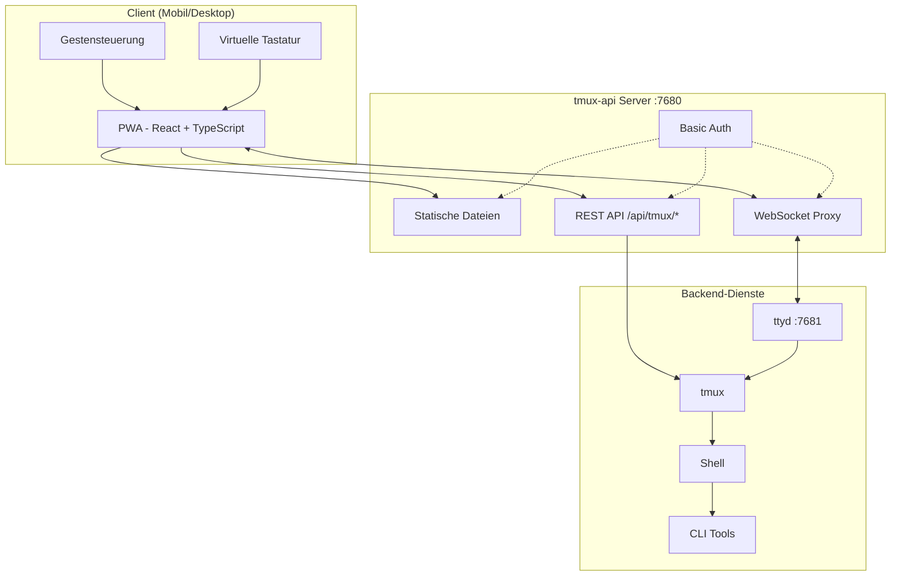
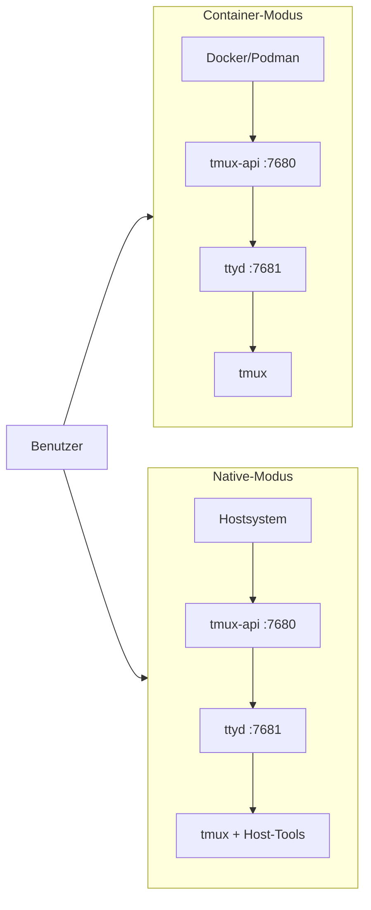

<p align="center">
  
</p>

<p align="center">
  <a href="https://github.com/lamngockhuong/termote/releases"></a>
  <a href="https://github.com/lamngockhuong/termote/actions/workflows/ci.yml"></a>
  <a href="https://github.com/lamngockhuong/termote/blob/main/LICENSE"></a>
  <a href="https://ghcr.io/lamngockhuong/termote"></a>
  <a href="https://hub.docker.com/r/lamngockhuong/termote"></a>
</p>

<p align="center">
  
  
  
  
</p>

<p align="center">
  <a href="https://launch.j2team.dev/products/termote?utm_source=badge-launched&utm_medium=badge&utm_campaign=badge-termote" target="_blank" rel="noopener noreferrer"></a>
  &nbsp;
  <a href="https://unikorn.vn/p/termote?ref=embed-termote" target="_blank"></a>
</p>

CLI-Tools (Claude Code, GitHub Copilot, jedes Terminal) per PWA von Mobilgeräten/Desktop fernsteuern.

> **Termote** = Terminal + Remote
>
> 🇬🇧 [English](README.md) | 🇻🇳 [Tiếng Việt](README.vi.md) | 🇨🇳 [简体中文](README.zh-CN.md) | 🇯🇵 [日本語](README.ja.md) | 🇰🇷 [한국어](README.ko.md) | 🇪🇸 [Español](README.es.md) | 🇧🇷 [Português (BR)](README.pt-BR.md) | 🇫🇷 [Français](README.fr.md) | 🇷🇺 [Русский](README.ru.md) | 🇮🇩 [Bahasa Indonesia](README.id.md)

## Funktionen

- **Session-Wechsel**: Mehrere tmux-Sessions mit Erstellen/Bearbeiten/Löschen
- **Session-Tabs**: Horizontale Tab-Leiste zum schnellen Fensterwechsel
- **Mobilfreundlich**: Virtuelle Tastatur-Toolbar (Tab/Ctrl/Shift/Pfeiltasten, erweiterbar)
- **Gestenunterstützung**: Wischen für Ctrl+C, Tab, Verlaufsnavigation
- **Befehlsverlauf**: Zuvor gesendete Befehle mit Suche abrufen
- **Schnellaktionen**: Schwebendes Menü für häufige Operationen (clear, cancel, exit)
- **Verbindungsanzeige**: Echtzeit-Serverstatus mit automatischer Trennungserkennung
- **Update-Prüfung**: Automatische Benachrichtigung über neue Versionen von GitHub Releases
- **PWA**: Auf dem Homescreen installierbar, offline-fähig
- **Persistente Sessions**: tmux hält Sessions am Leben
- **Einklappbare Seitenleiste**: Desktop-Oberfläche mit ein-/ausschaltbarer Session-Seitenleiste
- **Vollbildmodus**: Immersives Terminal-Erlebnis
- **Konfigurationsspeicherung**: Automatische Speicherung der Installationseinstellungen mit AES-256-verschlüsseltem Passwort

## Screenshots

<p align="center">
  
  &nbsp;&nbsp;
  
</p>

## Architektur



## Schnellstart

> 📖 **Neu bei Termote?** Schau dir die [Erste-Schritte-Anleitung](docs/getting-started.md) für eine vollständige Anleitung mit Beispielen an.

```bash
./scripts/termote.sh                   # Interaktives Menü
./scripts/termote.sh install container # Container-Modus (docker/podman)
./scripts/termote.sh install native    # Native-Modus (Host-Tools)
./scripts/termote.sh link              # Globalen Befehl 'termote' erstellen
make test                              # Tests ausführen
```

> Nach `link` kann `termote` überall verwendet werden: `termote health`, `termote install native --lan`
>
> **Tipp**: Installiere [gum](https://github.com/charmbracelet/gum) für verbesserte interaktive Menüs (optional, Bash-Fallback verfügbar)

## Installation

### Einzeiler (empfohlen)

**macOS/Linux:**

```bash
# Herunterladen und vor der Installation fragen (Standard: Native-Modus)
curl -fsSL https://raw.githubusercontent.com/lamngockhuong/termote/main/scripts/get.sh | bash

# Automatisch ohne Nachfrage installieren
curl -fsSL .../get.sh | bash -s -- --yes

# Nur herunterladen (nicht installieren)
curl -fsSL .../get.sh | bash -s -- --download-only

# Automatisch mit gespeicherter Konfiguration aktualisieren
curl -fsSL .../get.sh | bash -s -- --update

# Bestimmte Version installieren
curl -fsSL .../get.sh | bash -s -- --version 0.0.4

# Mit explizitem Modus und Optionen
curl -fsSL .../get.sh | bash -s -- --yes --container --lan
curl -fsSL .../get.sh | bash -s -- --yes --native --tailscale myhost

# Neues Passwort erzwingen (gespeicherte Konfiguration ignorieren)
curl -fsSL .../get.sh | bash -s -- --yes --container --fresh
```

**Windows (PowerShell):**

> **Hinweis:** Falls die Skriptausführung auf Ihrem System deaktiviert ist, führen Sie zuerst Folgendes aus:
>
> ```powershell
> Set-ExecutionPolicy -Scope CurrentUser -ExecutionPolicy RemoteSigned
> ```

```powershell
# Herunterladen und vor der Installation fragen (Standard: Native-Modus)
irm https://raw.githubusercontent.com/lamngockhuong/termote/main/scripts/get.ps1 | iex

# Automatisch ohne Nachfrage installieren
$env:TERMOTE_AUTO_YES = "true"; irm .../get.ps1 | iex

# Mit explizitem Modus
$env:TERMOTE_MODE = "container"; irm .../get.ps1 | iex

# Automatisch mit gespeicherter Konfiguration aktualisieren
$env:TERMOTE_UPDATE = "true"; irm .../get.ps1 | iex
```

### Docker

```bash
# Alles-in-einem (Zugangsdaten werden automatisch generiert, Logs prüfen: docker logs termote)
docker run -d --name termote -p 7680:7680 ghcr.io/lamngockhuong/termote:latest

# Mit benutzerdefinierten Zugangsdaten
docker run -d --name termote -p 7680:7680 \
  -e TERMOTE_USER=admin -e TERMOTE_PASS=secret \
  ghcr.io/lamngockhuong/termote:latest

# Ohne Authentifizierung (nur für lokale Entwicklung)
docker run -d --name termote -p 7680:7680 \
  -e NO_AUTH=true \
  ghcr.io/lamngockhuong/termote:latest

# Mit Volume für Persistenz
docker run -d --name termote -p 7680:7680 \
  -v termote-data:/home/termote \
  ghcr.io/lamngockhuong/termote:latest

# Benutzerdefiniertes Workspace-Verzeichnis einbinden
docker run -d --name termote -p 7680:7680 \
  -v ~/projects:/workspace \
  ghcr.io/lamngockhuong/termote:latest

# Mit Tailscale HTTPS (erfordert Tailscale auf dem Host)
docker run -d --name termote -p 7680:7680 \
  -e TERMOTE_USER=admin -e TERMOTE_PASS=secret \
  ghcr.io/lamngockhuong/termote:latest
sudo tailscale serve --bg --https=443 http://127.0.0.1:7680
# Zugriff unter: https://your-hostname.tailnet-name.ts.net
```

### Vom Release

```bash
# Neuestes Release herunterladen
VERSION=$(curl -s https://api.github.com/repos/lamngockhuong/termote/releases/latest | grep tag_name | cut -d '"' -f4)
wget https://github.com/lamngockhuong/termote/releases/download/${VERSION}/termote-${VERSION}.tar.gz
tar xzf termote-${VERSION}.tar.gz
cd termote-${VERSION#v}

# Installieren (interaktives Menü oder mit Modus)
./scripts/termote.sh install
./scripts/termote.sh install container
```

### Vom Quellcode

```bash
git clone https://github.com/lamngockhuong/termote.git
cd termote
./scripts/termote.sh install container
```

> **Hinweis**: `termote.sh` ist das einheitliche CLI mit Unterstützung für `install` (baut aus Quellcode, verwendet vorgefertigte Artefakte wenn verfügbar), `uninstall` und `health`.

## Bereitstellungsmodi



| Modus         | Beschreibung    | Anwendungsfall                           | Plattform    |
| ------------- | --------------- | ---------------------------------------- | ------------ |
| `--container` | Container-Modus | Einfache Bereitstellung, isolierte Umgebung | macOS, Linux |
| `--native`    | Alles nativ     | Zugriff auf Host-Tools (claude, gh)      | macOS, Linux |

### Optionen

| Flag                        | Beschreibung                                              |
| --------------------------- | --------------------------------------------------------- |
| `--lan`                     | Im LAN freigeben (Standard: nur localhost)                |
| `--tailscale <host[:port]>` | Tailscale HTTPS aktivieren                                |
| `--no-auth`                 | Basis-Authentifizierung deaktivieren                      |
| `--port <port>`             | Host-Port (Standard: 7680, Windows: 7690)                 |
| `--fresh`                   | Neues Passwort erzwingen (gespeicherte Konfig. ignorieren) |
| `--update`                  | Automatisch mit gespeicherter Konfig. aktualisieren       |
| `--version <ver>`           | Bestimmte Version installieren (mit oder ohne `v`)        |

| Umgebungsvariable | Beschreibung                                             |
| ----------------- | -------------------------------------------------------- |
| `WORKSPACE`       | Host-Verzeichnis zum Einbinden (Standard: `./workspace`) |
| `TERMOTE_USER`    | Benutzername für Authentifizierung (Standard: automatisch generiert) |
| `TERMOTE_PASS`    | Passwort für Authentifizierung (Standard: automatisch generiert) |
| `NO_AUTH`         | Auf `true` setzen, um Authentifizierung zu deaktivieren  |

### Container-Modus (empfohlen für Einfachheit)

Skripte erkennen automatisch `podman` oder `docker` -- beide funktionieren identisch.

```bash
./scripts/termote.sh install container             # localhost mit Basic Auth
./scripts/termote.sh install container --no-auth   # localhost ohne Auth
./scripts/termote.sh install container --lan       # LAN-Zugriff
# Zugriff: http://localhost:7680

# Benutzerdefiniertes Workspace-Verzeichnis (wird als /workspace im Container eingebunden)
WORKSPACE=~/projects ./scripts/termote.sh install container
WORKSPACE=/path/to/code make install-container
```

> **Sicherheitshinweis**: Vermeiden Sie es, `$HOME` direkt einzubinden -- sensible Verzeichnisse wie `.ssh`, `.gnupg` wären im Container zugänglich. Binden Sie stattdessen spezifische Projektverzeichnisse ein.

### Native (empfohlen für Host-Binary-Zugriff)

Verwenden, wenn Zugriff auf Host-Binaries benötigt wird (claude, git, usw.):

```bash
# Linux
sudo apt install ttyd tmux
# Oder: sudo snap install ttyd
./scripts/termote.sh install native

# macOS
brew install ttyd tmux go
./scripts/termote.sh install native
# Zugriff: http://localhost:7680
```

### Mit Tailscale HTTPS (alle Modi)

Verwendet `tailscale serve` für automatisches HTTPS (keine manuelle Zertifikatsverwaltung):

```bash
# Nur Tailscale (Standard-Port 443)
./scripts/termote.sh install container --tailscale myhost.ts.net

# Benutzerdefinierter Port
./scripts/termote.sh install native --tailscale myhost.ts.net:8765

# Tailscale + LAN-Zugriff
./scripts/termote.sh install container --tailscale myhost.ts.net --lan

# Zugriff: https://myhost.ts.net (oder :8765 für benutzerdefinierten Port)
```

### Deinstallation

```bash
./scripts/termote.sh uninstall container   # Container-Modus
./scripts/termote.sh uninstall native      # Native-Modus
./scripts/termote.sh uninstall all         # Alles
```

### Aktualisierung

```bash
# Option 1: Automatisch mit gespeicherter Konfiguration aktualisieren
curl -fsSL .../get.sh | bash -s -- --update

# Option 2: Einzeiler erneut ausführen (vergleicht Versionen, fragt vor Installation)
curl -fsSL .../get.sh | bash

# Option 3: Manuell aktualisieren
./scripts/termote.sh uninstall [container|native]
git pull origin main                    # Falls vom Quellcode installiert
./scripts/termote.sh install [container|native] [--lan] [--tailscale ...]
```

## Plattformunterstützung

| Plattform | Container          | Native             | CLI-Skript  |
| --------- | ------------------ | ------------------ | ----------- |
| Linux     | ✓                  | ✓                  | termote.sh  |
| macOS     | ✓                  | ✓                  | termote.sh  |
| Windows   | ⚠️ (experimentell)  | ⚠️ (experimentell)  | termote.ps1 |

> **⚠️ Windows-Unterstützung (Experimentell)**: Die Windows-Unterstützung befindet sich derzeit in einem frühen Stadium und erfordert weitere Tests. Der Container-Modus erfordert Docker Desktop, der Native-Modus erfordert psmux. Bitte melden Sie Probleme auf GitHub.

### Windows Native-Modus

Der Windows Native-Modus verwendet [psmux](https://github.com/psmux/psmux) (tmux-kompatibler Terminal-Multiplexer für Windows):

```powershell
# psmux installieren
winget install psmux

# Termote ausführen
.\scripts\termote.ps1 install native
.\scripts\termote.ps1 install container  # Oder Container-Modus mit Docker Desktop
```

## Mobile Nutzung

| Aktion            | Geste               |
| ----------------- | -------------------- |
| Abbrechen/Unterbrechen | Nach links wischen (Ctrl+C) |
| Tab-Vervollständigung | Nach rechts wischen  |
| Verlauf hoch      | Nach oben wischen    |
| Verlauf runter    | Nach unten wischen   |
| Einfügen          | Lange drücken        |
| Schriftgröße      | Zusammen-/Auseinanderziehen |

Die virtuelle Toolbar bietet: Tab, Esc, Ctrl, Shift, Pfeiltasten und gängige Tastenkombinationen. Unterstützt Ctrl+Shift-Kombinationen (Einfügen, Kopieren). Wechsel zwischen minimal und erweitert für zusätzliche Tasten (Home, End, Delete, usw.).

## Projektstruktur

```
termote/
├── Makefile                # Build-/Test-/Deploy-Befehle
├── Dockerfile              # Docker-Modus (tmux-api + ttyd)
├── docker-compose.yml
├── entrypoint.sh           # Docker-Entrypoint
├── docs/                   # Dokumentation
│   └── images/screenshots/ # App-Screenshots
├── pwa/                    # React PWA
│   └── src/
│       ├── components/
│       ├── contexts/
│       ├── hooks/
│       ├── types/
│       └── utils/
├── tmux-api/               # Go-Server
│   ├── main.go             # Einstiegspunkt
│   ├── serve.go            # Server (PWA, Proxy, Auth)
│   └── tmux.go             # tmux API-Handler
├── scripts/
│   ├── termote.sh          # Unix CLI (install/uninstall/health)
│   ├── termote.ps1         # Windows PowerShell CLI
│   ├── get.sh              # Unix Online-Installer (curl | bash)
│   └── get.ps1             # Windows Online-Installer (irm | iex)
├── tests/                  # Testsuite
│   ├── test-termote.sh
│   ├── test-termote.ps1    # Windows-Tests
│   ├── test-get.sh
│   └── test-entrypoints.sh
└── website/                # Astro Starlight Docs-Seite
    └── src/content/docs/   # MDX-Dokumentation
```

## Entwicklung

```bash
make build          # PWA und tmux-api bauen
make test           # Alle Tests ausführen
make health         # Service-Health prüfen
make clean          # Container stoppen

# E2E-Tests (erfordert laufenden Server)
./scripts/termote.sh install container  # Zuerst Server starten
cd pwa && pnpm test:e2e       # Playwright-Tests ausführen
cd pwa && pnpm test:e2e:ui    # Mit UI-Debugger ausführen
```

**Manuelles Testen:** Siehe [Selbsttest-Checkliste](docs/self-test-checklist.md)

## Fehlerbehebung

### Session bleibt nicht erhalten

- tmux prüfen: `tmux ls`
- Sicherstellen, dass ttyd das Flag `-A` verwendet (attach-or-create)

### WebSocket-Fehler

- tmux-api-Logs prüfen: `docker logs termote`
- Sicherstellen, dass ttyd auf Port 7681 läuft

### Probleme mit der mobilen Tastatur

- Sicherstellen, dass das Viewport-Meta-Tag vorhanden ist
- Auf einem echten Gerät testen, nicht im Emulator

### Native-Modus: Prozesse starten nicht

```bash
ps aux | grep ttyd         # Prüfen, ob ttyd läuft
ps aux | grep tmux-api     # Prüfen, ob tmux-api läuft
lsof -i :7680              # Sicherstellen, dass der Port belegt ist
```

## Sicherheitshinweise

- **Standard: nur localhost** - nicht im LAN erreichbar, es sei denn das Flag `--lan` wird verwendet
- **Basic Auth standardmäßig aktiviert** - `--no-auth` verwenden, um für lokale Entwicklung zu deaktivieren
- **Integrierter Brute-Force-Schutz** - Rate-Limiting (5 Versuche/Min. pro IP)
- HTTPS (Tailscale) für Produktion verwenden
- Auf vertrauenswürdige Netzwerke/VPN beschränken

## Lizenz

MIT
