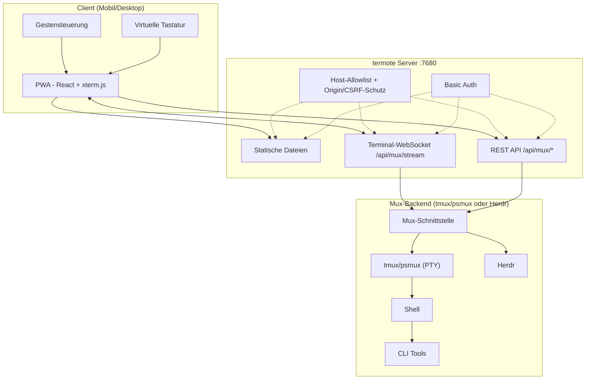
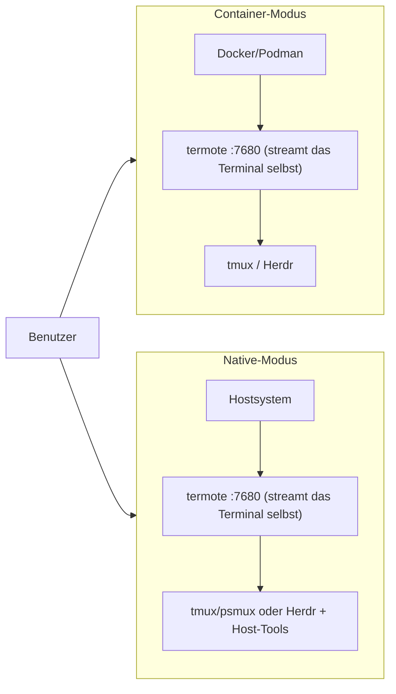

<p align="center">
  
</p>

<p align="center">
  <a href="https://github.com/lamngockhuong/termote/releases"></a>
  <a href="https://github.com/lamngockhuong/termote/actions/workflows/ci.yml"></a>
  <a href="https://github.com/lamngockhuong/termote/blob/main/LICENSE"></a>
  <a href="https://ghcr.io/lamngockhuong/termote"></a>
  <a href="https://hub.docker.com/r/lamngockhuong/termote"></a>
</p>

<p align="center">
  
  
  
  
</p>

<p align="center">
  <a href="https://launch.j2team.dev/products/termote?utm_source=badge-launched&utm_medium=badge&utm_campaign=badge-termote" target="_blank" rel="noopener noreferrer"></a>
  &nbsp;
  <a href="https://unikorn.vn/p/termote?ref=embed-termote" target="_blank"></a>
</p>

CLI-Tools (Claude Code, GitHub Copilot, jedes Terminal) per PWA von Mobilgeräten/Desktop fernsteuern.

> [!NOTE]
> Termote 1.0 aktualisiert keine 0.x-Installation. 0.x wie in der
> [archivierten 0.x-Dokumentation](https://termote.ohnice.app/0.x/) beschrieben
> deinstallieren und dann 1.0 mit den Befehlen aus dem [Schnellstart](#schnellstart) installieren.

> **Termote** = Terminal + Remote
>
> 🇬🇧 [English](README.md) | 🇻🇳 [Tiếng Việt](README.vi.md) | 🇨🇳 [简体中文](README.zh-CN.md) | 🇯🇵 [日本語](README.ja.md) | 🇰🇷 [한국어](README.ko.md) | 🇪🇸 [Español](README.es.md) | 🇧🇷 [Português (BR)](README.pt-BR.md) | 🇫🇷 [Français](README.fr.md) | 🇷🇺 [Русский](README.ru.md) | 🇮🇩 [Bahasa Indonesia](README.id.md)

## Funktionen

- **Session-Wechsel**: Mehrere tmux-Sessions mit Erstellen/Bearbeiten/Löschen
- **Session-Tabs**: Horizontale Tab-Leiste zum schnellen Fensterwechsel
- **Herdr-Backend** (nativ oder im Container): Herdr-Workspaces statt tmux steuern, mit Statusabzeichen des Coding-Agents in jedem Pane — siehe [Native Installation](https://termote.ohnice.app/installation/native/)
- **Chat-Ansicht**: Ein Pane, in dem Claude Code (oder mit `--no-daemon` gestartetes Codex) läuft, als Chat lesen und beantworten, mit Vorschlägen für Slash-Befehle und Antworten auf Dialoge — siehe [Agent Chat](https://termote.ohnice.app/usage/agent-chat/)
- **Files- und Changes-Ansicht**: Das Verzeichnis eines Panes und seine Git-Änderungen durchsuchen, mit Markdown-Vorschau — siehe [Files and Changes](https://termote.ohnice.app/usage/files-changes/)
- **Bildanhänge**: Ein Bild vom Handy an das Terminal oder an eine Nachricht in der Chat-Ansicht senden, damit der Agent es über seinen Pfad lesen kann
- **Herdr-Plugin**: Das fokussierte Herdr-Pane in Termote öffnen, seinen Link als QR-Code fürs Handy anzeigen, den Server starten oder stoppen, ohne Herdr zu verlassen — siehe [Herdr Plugin](https://termote.ohnice.app/usage/herdr-plugin/)
- **Mobilfreundlich**: Virtuelle Tastatur-Toolbar (Tab/Ctrl/Shift/Pfeiltasten, erweiterbar)
- **Gestenunterstützung**: Wischen für Ctrl+C, Tab, Scrollen
- **Befehlsverlauf**: Zuvor gesendete Befehle mit Suche abrufen
- **Schnellaktionen**: Eine ⚡-Taste in der mobilen Leiste öffnet ein Sheet mit häufigen Operationen (clear, cancel, exit)
- **Oberflächenstile**: Neutral, Terminal oder Native, in den Einstellungen gewählt, unabhängig vom hellen/dunklen Theme
- **Verbindungsanzeige**: Echtzeit-Serverstatus mit automatischer Trennungserkennung
- **Update-Prüfung**: Automatische Benachrichtigung über neue Versionen von GitHub Releases
- **PWA**: Auf dem Homescreen installierbar, offline-fähig
- **Persistente Sessions**: tmux hält Sessions am Leben
- **Einklappbare Seitenleiste**: Desktop-Oberfläche mit ein-/ausschaltbarer Session-Seitenleiste
- **Vollbildmodus**: Immersives Terminal-Erlebnis
- **Läuft als Dienst**: `termote start` registriert einen Benutzerdienst (systemd, launchd, geplante Aufgabe), der bei der Anmeldung startet
- **Konfigurationsspeicherung**: `termote start` speichert seine Optionen, das Passwort wird verschlüsselt abgelegt

## Screenshots

<p align="center">
  
  &nbsp;&nbsp;
  
</p>

<p align="center">
  
</p>

<p align="center">
  
</p>

## Architektur


```mermaid
flowchart TB
    subgraph Client["Client (Mobil/Desktop)"]
        PWA["PWA - React + xterm.js"]
        Gestures["Gestensteuerung"]
        Keyboard["Virtuelle Tastatur"]
    end

    subgraph Server["termote Server :7680"]
        Static["Statische Dateien"]
        Stream["Terminal-WebSocket /api/mux/stream"]
        API["REST API /api/mux/*"]
        Guard["Host-Allowlist + Origin/CSRF-Schutz"]
        Auth["Basic Auth"]
    end

    subgraph Backend["Mux-Backend (tmux/psmux oder Herdr)"]
        Mux["Mux-Schnittstelle"]
        tmux["tmux/psmux (PTY)"]
        herdr["Herdr"]
        Shell["Shell"]
        Tools["CLI Tools"]
    end

    Gestures --> PWA
    Keyboard --> PWA
    PWA --> Static
    PWA <--> Stream
    PWA --> API
    Guard -.-> Static & Stream & API
    Auth -.-> Static & Stream & API
    Stream --> Mux
    API --> Mux
    Mux --> tmux & herdr
    tmux --> Shell --> Tools
```

termote streamt das Terminal selbst (PTY unter Unix, ConPTY unter Windows) an xterm.js in der PWA; einen separaten Terminalprozess, an den weitergeleitet werden müsste, gibt es nicht mehr. Das vollständige Schutzmodell für Anfragen beschreibt [`docs/system-architecture.md`](docs/system-architecture.md).

## Schnellstart

> 📖 **Neu bei Termote?** Schau dir die [Erste-Schritte-Anleitung](docs/getting-started.md) für eine vollständige Anleitung mit Beispielen an.

**Linux / macOS:**

```bash
curl -fsSL https://termote.ohnice.app/install.sh | sh
termote start
```

**Windows (PowerShell):**

```powershell
irm https://termote.ohnice.app/install.ps1 | iex
termote start
```

Der Installer braucht nur `curl`, `tar` und `sha256sum`/`shasum` (unter Windows PowerShell), weder sudo noch Administratorrechte. Er prüft die Prüfsumme des Archivs, installiert den Befehl `termote` und startet nichts. `termote start` speichert die Optionen, erzeugt beim ersten Mal ein Passwort (einmal ausgegeben; `termote show-password` zeigt es erneut an), registriert den Dienst und startet ihn. Danach `http://localhost:7680` öffnen (Windows: `http://localhost:7690`).

Vorher muss ein Terminal-Backend installiert sein: tmux (`sudo apt install tmux`, `brew install tmux`), unter Windows psmux (`winget install psmux`) oder [Herdr](https://termote.ohnice.app/installation/native/). Der erste `start` erkennt, welches verwendet wird.

### Häufige Optionen

```bash
termote start --lan                  # Listen on the LAN, not only this machine
termote start --tailscale myhost.ts.net  # Publish over Tailscale HTTPS
termote start --mux herdr            # Drive Herdr workspaces instead of tmux
termote start --no-auth              # Disable basic auth (local use only)
```

Die Optionen werden gespeichert: Ein nicht angegebenes Flag behält seinen gespeicherten Wert, und ein boolesches Flag wird mit `=false` ausgeschaltet (`termote start --lan=false`). Die Flags sind auf jedem Betriebssystem gleich, auch in PowerShell.

### Befehle für den Alltag

```bash
termote status                       # What the running server reports
termote stop                         # Stop (it starts again at the next login)
termote restart                      # Restart with the saved options
termote logs follow                  # Tail the logs
termote show-password                # Print the saved admin password
termote update                       # Update to the latest release
termote uninstall                    # Remove the service, the command and the install
```

`update` wechselt zur neuen Version, startet den Dienst neu und wechselt zurück, falls die neue Version nicht hochkommt. `uninstall` behält die Konfiguration (`~/.config/termote`) und die Logs (`~/.local/state/termote`) und gibt beide Pfade aus.

## Installation

### Version festlegen

```bash
curl -fsSL https://termote.ohnice.app/install.sh | TERMOTE_VERSION=1.0.0 sh
termote update --version 1.0.0
```

```powershell
$env:TERMOTE_VERSION='1.0.0'; irm https://termote.ohnice.app/install.ps1 | iex
```

Ohne `TERMOTE_VERSION` nimmt der Installer das neueste stabile 1.x-Release und lässt eine vorhandene Installation unverändert. Mit der Variable wird diese Version neben der aktuellen installiert und zur aktiven Version; so lässt sich auch eine defekte Installation reparieren.

### Container-Modus

```bash
termote container up                          # Run the published image (podman or docker)
termote container up --workspace ~/projects   # Mount a directory at /workspace
termote container status
termote container logs -f
termote container down
```

`container up` startet `ghcr.io/lamngockhuong/termote` in der Version des installierten `termote`, mit podman (bevorzugt) oder docker, auf Port 7680, wobei `~/termote-workspace` unter `/workspace` eingebunden wird. Es akzeptiert `--port`, `--lan`, `--tailscale`, `--no-auth`, `--allow-host`, `--user` und `--fresh`; diese werden getrennt von den Optionen von `start` gespeichert, Benutzername und Passwort teilt es mit dem nativen Server. Docker startet den Container nach einem Neustart wieder; rootless Podman hat dafür keinen Daemon, deshalb dort als Quadlet-Unit ausführen.

> **Sicherheitshinweis**: `$HOME` nicht direkt einbinden — sensible Verzeichnisse wie `.ssh`, `.gnupg` wären im Container zugänglich. Stattdessen gezielt Projektverzeichnisse einbinden.

### Docker ohne die CLI

```bash
# Generates a password, printed in: docker logs termote
docker run -d --name termote -p 7680:7680 \
  -v ~/projects:/workspace \
  ghcr.io/lamngockhuong/termote:latest

# With your own credentials
docker run -d --name termote -p 7680:7680 \
  -e TERMOTE_USER=admin -e TERMOTE_PASS=secret \
  ghcr.io/lamngockhuong/termote:latest
```

| Umgebungsvariable | Beschreibung                                             |
| ----------------- | -------------------------------------------------------- |
| `TERMOTE_USER`    | Benutzername für Basic Auth (Standard: `admin`)          |
| `TERMOTE_PASS`    | Passwort für Basic Auth (Standard: automatisch erzeugt)  |
| `NO_AUTH`         | Auf `true` setzen, um die Authentifizierung abzuschalten |

### Aus dem Quellcode bauen

```bash
git clone https://github.com/lamngockhuong/termote.git
cd termote
make build
./scripts/termote.sh start
```

`make build` baut die PWA und bettet sie in `server/termote` ein; dafür werden Go, Node.js und pnpm benötigt. `scripts/termote.sh` (Windows: `scripts\termote.ps1`) führt nur einen Checkout aus: Es baut das Entwicklungs-Binary neu, wenn eine Quelle neuer ist, und startet es mit denselben Argumenten. `termote update` verweigert die Ausführung in einem Checkout; dort `git pull && make build` verwenden.

### Upgrade von 0.x

Ein Upgrade von 0.x gibt es nicht: 1.0 wird an einem neuen Ort installiert und liest die 0.x-Konfiguration nicht. 0.x wie in der [archivierten 0.x-Dokumentation](https://termote.ohnice.app/0.x/) beschrieben deinstallieren und dann 1.0 mit den obigen Befehlen installieren.

## Bereitstellungsmodi


```mermaid
flowchart LR
    subgraph Container["Container-Modus"]
        direction TB
        C1["Docker/Podman"] --> C2["termote :7680 (streamt das Terminal selbst)"] --> C3["tmux / Herdr"]
    end

    subgraph Native["Native-Modus"]
        direction TB
        N1["Hostsystem"] --> N2["termote :7680 (streamt das Terminal selbst)"] --> N3["tmux/psmux oder Herdr + Host-Tools"]
    end

    User["Benutzer"] --> Container & Native
```

| Modus     | Befehl                 | Anwendungsfall                      | Plattform             |
| --------- | ---------------------- | ----------------------------------- | --------------------- |
| Nativ     | `termote start`        | Zugriff auf Host-Tools (claude, gh) | macOS, Linux, Windows |
| Container | `termote container up` | Isolierte Umgebung                  | macOS, Linux, Windows |

Der native Server läuft als Benutzerdienst: unter Linux als systemd-User-Unit (als abgelöster Prozess, wo es kein systemd für Benutzer gibt, etwa WSL2 ohne systemd), unter macOS als launchd-Agent, unter Windows als geplante Aufgabe bei der Anmeldung.

### Optionen von `start`

| Flag                        | Beschreibung                                                                                                   |
| --------------------------- | -------------------------------------------------------------------------------------------------------------- |
| `--port <port>`             | Port (Standard: 7680, Windows: 7690)                                                                           |
| `--lan[=false]`             | Auf allen Schnittstellen lauschen (Standard: nur localhost)                                                    |
| `--tailscale <host[:port]>` | Über Tailscale HTTPS veröffentlichen (Standardport 443)                                                        |
| `--no-tailscale`            | Veröffentlichung über Tailscale beenden                                                                        |
| `--no-auth[=false]`         | Basis-Authentifizierung deaktivieren                                                                           |
| `--mux <tmux\|herdr>`       | Terminal-Backend (Standard: herdr, wenn es läuft, sonst tmux)                                                  |
| `--allow-host <name>`       | Zusätzlichen Wert für den Host-Header erlauben (mehrfach angebbar; keine Wildcards, siehe Sicherheitshinweise) |
| `--remove-host <name>`      | Einen erlaubten Host-Namen entfernen (mehrfach angebbar)                                                       |
| `--allow-herdr-no-auth`     | Zusammen mit `--mux herdr --no-auth` erforderlich                                                              |
| `--user <name>`             | Login-Benutzername (Standard: `admin`; mit dem Container geteilt)                                              |
| `--fresh`                   | Neues Passwort setzen                                                                                          |

### Mit Tailscale HTTPS

Nutzt `tailscale serve` für automatisches HTTPS (keine manuelle Zertifikatsverwaltung):

```bash
termote start --tailscale myhost.ts.net                # Default port 443
termote start --tailscale myhost.ts.net:8765           # Custom port
termote container up --tailscale myhost.ts.net         # Container mode
sudo tailscale set --operator=$USER                    # Linux, once: let termote run tailscale serve
```

Die Zuordnung wird bei jedem Start des Servers angewendet. `stop`, `start --no-tailscale` und `uninstall` entfernen nur die eigene Zuordnung von Termote.

## Plattformunterstützung

| Plattform | Container | Native | Installer     |
| --------- | --------- | ------ | ------------- |
| Linux     | ✓         | ✓      | `install.sh`  |
| macOS     | ✓         | ✓      | `install.sh`  |
| Windows   | ✓         | ✓      | `install.ps1` |

> **Windows-Unterstützung**: Der Container-Modus erfordert Docker Desktop oder Podman Desktop, der Native-Modus erfordert [psmux](https://github.com/psmux/psmux) (tmux-kompatibler Terminal-Multiplexer für Windows), installiert mit `winget install psmux`, oder einen laufenden [Herdr](https://herdr.dev/#install)-Server. Der Windows-Dienst wurde noch nicht auf einem echten Rechner geprüft; bitte melden Sie Probleme auf GitHub.

## Mobile Nutzung

| Aktion                 | Geste                       |
| ---------------------- | --------------------------- |
| Abbrechen/Unterbrechen | Nach links wischen (Ctrl+C) |
| Tab-Vervollständigung  | Nach rechts wischen         |
| Nach unten scrollen    | Nach oben wischen           |
| Nach oben scrollen     | Nach unten wischen          |
| Einfügen               | Lange drücken               |
| Schriftgröße           | Zusammen-/Auseinanderziehen |

Die virtuelle Toolbar bietet: Tab, Esc, Ctrl, Shift, Pfeiltasten und gängige Tastenkombinationen. Unterstützt Ctrl+Shift-Kombinationen (Einfügen, Kopieren). Wechsel zwischen minimal und erweitert für zusätzliche Tasten (Home, End, Delete, usw.).

## Projektstruktur

```
termote/
├── Makefile                # Build/test/run commands
├── Dockerfile              # Container image (termote + tmux + herdr)
├── docker-compose.yml      # Development from a checkout only
├── entrypoint.sh           # Container entrypoint
├── docs/                   # Documentation
│   └── images/screenshots/ # App screenshots
├── pwa/                    # React PWA
│   └── src/
│       ├── components/
│       ├── contexts/
│       ├── hooks/
│       ├── types/
│       └── utils/
├── server/                 # Go server + CLI (single binary)
│   ├── main.go             # Entry point (no args = menu, `serve` = server, else CLI)
│   ├── serve.go            # Server (PWA, auth, guards)
│   ├── mux.go              # Mux interface + /api/mux/* routes
│   ├── mux_tmux.go         # tmux/psmux backend
│   ├── mux_herdr.go        # Herdr backend
│   ├── stream.go           # Terminal WebSocket (xterm.js stream)
│   ├── cli*.go             # start/stop/update/container/logs/menu subcommands
│   └── webui/              # PWA embedded in the binary (filled by make build)
├── scripts/
│   ├── install.sh          # Unix online installer (curl | sh)
│   ├── install.ps1         # Windows online installer (irm | iex)
│   ├── termote.sh          # Unix shim: builds and runs a checkout
│   └── termote.ps1         # Windows PowerShell shim: builds and runs a checkout
├── tests/                  # Test suite
│   ├── test-termote.sh     # Unix shim tests
│   ├── test-termote.ps1    # Windows shim tests
│   ├── test-install.sh     # Unix installer tests
│   ├── test-install.ps1    # Windows installer tests
│   └── test-entrypoints.sh # Container entrypoint tests
└── website/                # Astro Starlight docs site
    └── src/content/docs/   # MDX documentation
```

## Entwicklung

```bash
make build          # Build the PWA and embed it in server/termote
make test           # Run all tests
make health         # Check service health
make clean          # Stop containers

# E2E tests (requires running server)
./scripts/termote.sh start           # Start server first
pnpm --filter termote test:e2e       # Run Playwright tests
pnpm --filter termote test:e2e:ui    # Run with UI debugger
```

**Manuelles Testen:** Siehe [Selbsttest-Checkliste](docs/self-test-checklist.md)

## Fehlerbehebung

### Session bleibt nicht erhalten

- tmux prüfen: `tmux ls`
- termote verbindet sich über `tmux new-session -A` (attach-or-create)

### WebSocket-Fehler

- termote-Logs prüfen: `termote container logs` (Container) oder `termote logs server` (nativ)
- Der Terminal-WebSocket ist `/api/mux/stream` und wird von termote selbst bereitgestellt – einen separaten Terminalprozess zum Prüfen gibt es nicht

### Probleme mit der mobilen Tastatur

- Sicherstellen, dass das Viewport-Meta-Tag vorhanden ist
- Auf einem echten Gerät testen, nicht im Emulator

### Native-Modus: Server startet nicht

```bash
termote status             # What the running server reports
termote logs server        # Or: termote logs follow
lsof -i :7680              # Check what holds the port
termote start --fresh      # If the saved password can no longer be read
```

## Sicherheitshinweise

- **Standard: nur localhost** - nicht im LAN erreichbar, es sei denn das Flag `--lan` wird verwendet
- **Basic Auth standardmäßig aktiviert** - `--no-auth` verwenden, um für lokale Entwicklung zu deaktivieren; das Passwort erzeugt der erste `termote start` und speichert es verschlüsselt
- **Host-Allowlist** - Anfragen mit unbekanntem `Host`-Header werden abgelehnt (Schutz vor DNS-Rebinding); vertrauenswürdige Namen mit `--allow-host` hinzufügen, eine Wildcard zum Abschalten der Prüfung gibt es nicht
- **Origin/CSRF-Schutz** - zustandsändernde `/api/mux/*`-Anfragen und der WebSocket `/api/mux/stream` lehnen Cross-Site-Werte in `Sec-Fetch-Site`/`Origin` ab und verlangen ein einmal verwendbares Stream-Token vom selben Ursprung
- **Integrierter Brute-Force-Schutz** - Rate-Limiting (5 Fehlversuche/Min. pro IP, 20/Min. pro IPv6-/64)
- **Herdr-Backend** - legt alle Herdr-Workspaces des Hosts offen, daher wird `--mux herdr --no-auth` abgelehnt, sofern nicht zusätzlich `--allow-herdr-no-auth` angegeben ist
- **Keine Geheimnisse in Dienstdateien** - die systemd-Unit, der launchd-Agent und die geplante Aufgabe enthalten nie das Passwort
- HTTPS (Tailscale) für Produktion verwenden
- Auf vertrauenswürdige Netzwerke/VPN beschränken

## Andere Projekte

| Projekt                                                     | Beschreibung                                                                                                                         |
| ----------------------------------------------------------- | ------------------------------------------------------------------------------------------------------------------------------------ |
| [GitHub Flex](https://github.com/lamngockhuong/github-flex) | Cross-Browser-Erweiterung (Chrome & Firefox), die die GitHub-Oberfläche mit Produktivitätsfunktionen erweitert                       |
| [TabRest](https://github.com/lamngockhuong/tabrest)         | Chrome-Erweiterung, die inaktive Tabs automatisch entlädt, um Speicher freizugeben                                                   |
| [Specpin](https://github.com/lamngockhuong/specpin)         | Heftet lebende, Git-versionierte Business-Spezifikationen an die Elemente deiner laufenden Web-UI (Browser-Erweiterung + Go-Sidecar) |

## Lizenz

MIT
