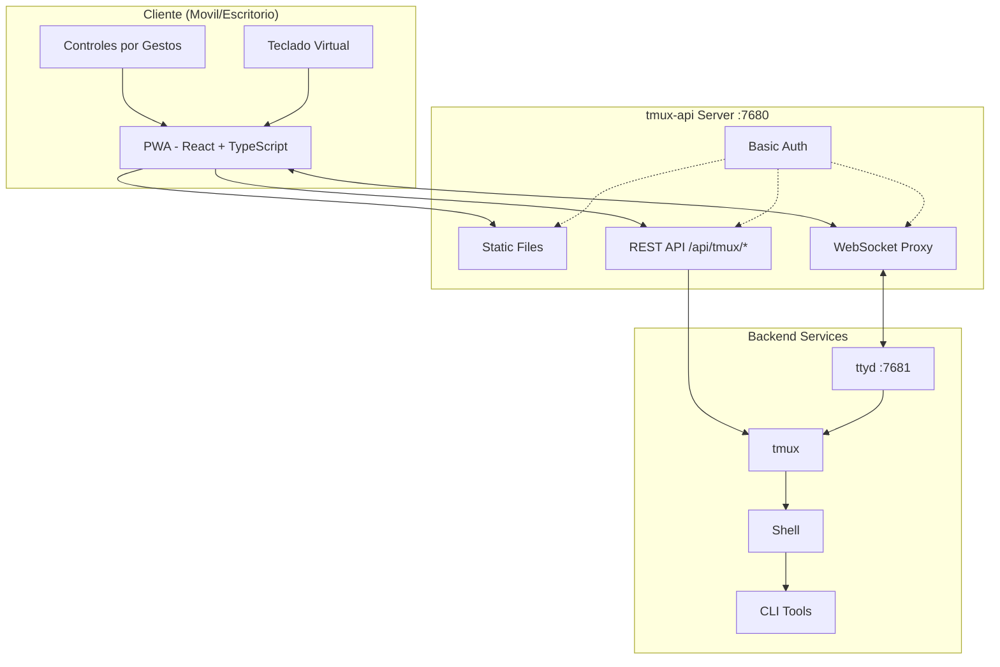
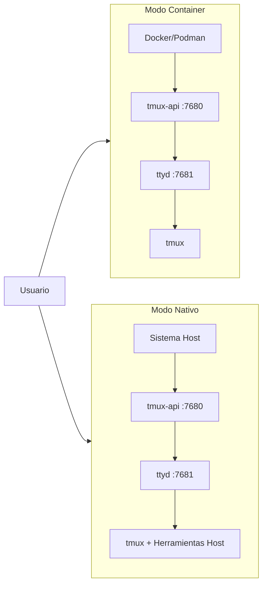

<p align="center">
  
</p>

<p align="center">
  <a href="https://github.com/lamngockhuong/termote/releases"></a>
  <a href="https://github.com/lamngockhuong/termote/actions/workflows/ci.yml"></a>
  <a href="https://github.com/lamngockhuong/termote/blob/main/LICENSE"></a>
  <a href="https://ghcr.io/lamngockhuong/termote"></a>
  <a href="https://hub.docker.com/r/lamngockhuong/termote"></a>
</p>

<p align="center">
  
  
  
  
</p>

<p align="center">
  <a href="https://launch.j2team.dev/products/termote?utm_source=badge-launched&utm_medium=badge&utm_campaign=badge-termote" target="_blank" rel="noopener noreferrer"></a>
  &nbsp;
  <a href="https://unikorn.vn/p/termote?ref=embed-termote" target="_blank"></a>
</p>

Controla remotamente herramientas CLI (Claude Code, GitHub Copilot, cualquier terminal) desde movil/escritorio via PWA.

> **Termote** = Terminal + Remote
>
> 🇬🇧 [English](README.md) | 🇻🇳 [Tiếng Việt](README.vi.md) | 🇨🇳 [简体中文](README.zh-CN.md) | 🇯🇵 [日本語](README.ja.md) | 🇰🇷 [한국어](README.ko.md) | 🇧🇷 [Português (BR)](README.pt-BR.md) | 🇫🇷 [Français](README.fr.md) | 🇩🇪 [Deutsch](README.de.md) | 🇷🇺 [Русский](README.ru.md) | 🇮🇩 [Bahasa Indonesia](README.id.md)

## Caracteristicas

- **Cambio de sesiones**: Multiples sesiones tmux con crear/editar/eliminar
- **Pestanas de sesiones**: Barra de pestanas horizontal para cambiar rapidamente entre ventanas
- **Optimizado para movil**: Teclado virtual (Tab/Ctrl/Shift/flechas, expandible)
- **Soporte de gestos**: Deslizar para Ctrl+C, Tab, navegacion de historial
- **Historial de comandos**: Recuperar comandos enviados previamente con busqueda
- **Acciones rapidas**: Menu flotante para operaciones comunes (clear, cancel, exit)
- **Indicador de conexion**: Estado del servidor en tiempo real con deteccion automatica de desconexion
- **Verificador de actualizaciones**: Notificacion automatica de nuevas versiones desde GitHub releases
- **PWA**: Instalable en la pantalla de inicio, funciona sin conexion
- **Sesiones persistentes**: tmux mantiene las sesiones activas
- **Barra lateral plegable**: Interfaz de escritorio con barra lateral de sesiones activable
- **Modo pantalla completa**: Experiencia de terminal inmersiva
- **Persistencia de configuracion**: Guardado automatico de ajustes de instalacion con contrasena cifrada AES-256

## Capturas de Pantalla

<p align="center">
  
  &nbsp;&nbsp;
  
</p>

## Arquitectura



## Inicio Rapido

> 📖 **Nuevo en Termote?** Consulta la [Guia de Inicio](docs/getting-started.md) para un recorrido completo con ejemplos.

```bash
./scripts/termote.sh                   # Menu interactivo
./scripts/termote.sh install container # Modo container (docker/podman)
./scripts/termote.sh install native    # Modo nativo (herramientas del host)
./scripts/termote.sh link              # Crear comando global 'termote'
make test                              # Ejecutar tests
```

> Despues de `link`, usa `termote` desde cualquier lugar: `termote health`, `termote install native --lan`
>
> **Consejo**: Instala [gum](https://github.com/charmbracelet/gum) para menus interactivos mejorados (opcional, fallback bash disponible)

## Instalacion

### Una sola linea (recomendado)

**macOS/Linux:**

```bash
# Descargar y preguntar antes de instalar (modo nativo por defecto)
curl -fsSL https://raw.githubusercontent.com/lamngockhuong/termote/main/scripts/get.sh | bash

# Instalar automaticamente sin preguntar
curl -fsSL .../get.sh | bash -s -- --yes

# Solo descargar (sin instalar)
curl -fsSL .../get.sh | bash -s -- --download-only

# Actualizar automaticamente con configuracion guardada
curl -fsSL .../get.sh | bash -s -- --update

# Instalar version especifica
curl -fsSL .../get.sh | bash -s -- --version 0.0.4

# Con modo y opciones explicitas
curl -fsSL .../get.sh | bash -s -- --yes --container --lan
curl -fsSL .../get.sh | bash -s -- --yes --native --tailscale myhost

# Forzar nueva contrasena (ignorar configuracion guardada)
curl -fsSL .../get.sh | bash -s -- --yes --container --fresh
```

**Windows (PowerShell):**

> **Nota:** Si la ejecucion de scripts esta deshabilitada en tu sistema, ejecuta esto primero:
>
> ```powershell
> Set-ExecutionPolicy -Scope CurrentUser -ExecutionPolicy RemoteSigned
> ```

```powershell
# Descargar y preguntar antes de instalar (modo nativo por defecto)
irm https://raw.githubusercontent.com/lamngockhuong/termote/main/scripts/get.ps1 | iex

# Instalar automaticamente sin preguntar
$env:TERMOTE_AUTO_YES = "true"; irm .../get.ps1 | iex

# Con modo explicito
$env:TERMOTE_MODE = "container"; irm .../get.ps1 | iex

# Actualizar automaticamente con configuracion guardada
$env:TERMOTE_UPDATE = "true"; irm .../get.ps1 | iex
```

### Docker

```bash
# Todo en uno (genera credenciales automaticamente, ver logs: docker logs termote)
docker run -d --name termote -p 7680:7680 ghcr.io/lamngockhuong/termote:latest

# Con credenciales personalizadas
docker run -d --name termote -p 7680:7680 \
  -e TERMOTE_USER=admin -e TERMOTE_PASS=secret \
  ghcr.io/lamngockhuong/termote:latest

# Sin autenticacion (solo desarrollo local)
docker run -d --name termote -p 7680:7680 \
  -e NO_AUTH=true \
  ghcr.io/lamngockhuong/termote:latest

# Con volumen para persistencia
docker run -d --name termote -p 7680:7680 \
  -v termote-data:/home/termote \
  ghcr.io/lamngockhuong/termote:latest

# Montar directorio de workspace personalizado
docker run -d --name termote -p 7680:7680 \
  -v ~/projects:/workspace \
  ghcr.io/lamngockhuong/termote:latest

# Con Tailscale HTTPS (requiere Tailscale en el host)
docker run -d --name termote -p 7680:7680 \
  -e TERMOTE_USER=admin -e TERMOTE_PASS=secret \
  ghcr.io/lamngockhuong/termote:latest
sudo tailscale serve --bg --https=443 http://127.0.0.1:7680
# Acceder en: https://your-hostname.tailnet-name.ts.net
```

### Desde Release

```bash
# Descargar ultima release
VERSION=$(curl -s https://api.github.com/repos/lamngockhuong/termote/releases/latest | grep tag_name | cut -d '"' -f4)
wget https://github.com/lamngockhuong/termote/releases/download/${VERSION}/termote-${VERSION}.tar.gz
tar xzf termote-${VERSION}.tar.gz
cd termote-${VERSION#v}

# Instalar (menu interactivo o con modo)
./scripts/termote.sh install
./scripts/termote.sh install container
```

### Desde Codigo Fuente

```bash
git clone https://github.com/lamngockhuong/termote.git
cd termote
./scripts/termote.sh install container
```

> **Nota**: `termote.sh` es el CLI unificado que soporta `install` (compila desde codigo fuente, usa artefactos pre-compilados cuando estan disponibles), `uninstall` y `health`.

## Modos de Despliegue



| Modo          | Descripcion      | Caso de Uso                           | Plataforma   |
| ------------- | ---------------- | ------------------------------------- | ------------ |
| `--container` | Modo container   | Despliegue simple, entorno aislado    | macOS, Linux |
| `--native`    | Todo nativo      | Acceso a herramientas host (claude, gh) | macOS, Linux |

### Opciones

| Flag                        | Descripcion                                          |
| --------------------------- | ---------------------------------------------------- |
| `--lan`                     | Exponer a LAN (por defecto: solo localhost)          |
| `--tailscale <host[:port]>` | Habilitar Tailscale HTTPS                            |
| `--no-auth`                 | Deshabilitar autenticacion basica                    |
| `--port <port>`             | Puerto del host (por defecto: 7680, Windows: 7690)   |
| `--fresh`                   | Forzar nueva contrasena (ignorar config guardada)    |
| `--update`                  | Actualizar automaticamente con config guardada       |
| `--version <ver>`           | Instalar version especifica (con o sin `v`)          |

| Variable de Entorno | Descripcion                                            |
| -------------------- | ------------------------------------------------------ |
| `WORKSPACE`          | Directorio del host para montar (por defecto: `./workspace`) |
| `TERMOTE_USER`       | Usuario de autenticacion (por defecto: auto-generado)  |
| `TERMOTE_PASS`       | Contrasena de autenticacion (por defecto: auto-generada) |
| `NO_AUTH`            | Establecer `true` para deshabilitar autenticacion      |

### Modo Container (recomendado por simplicidad)

Los scripts detectan automaticamente `podman` o `docker` -- ambos funcionan de forma identica.

```bash
./scripts/termote.sh install container             # localhost con basic auth
./scripts/termote.sh install container --no-auth   # localhost sin auth
./scripts/termote.sh install container --lan       # Accesible por LAN
# Acceder: http://localhost:7680

# Directorio de workspace personalizado (montado en /workspace en el container)
WORKSPACE=~/projects ./scripts/termote.sh install container
WORKSPACE=/path/to/code make install-container
```

> **Nota de seguridad**: Evita montar `$HOME` directamente -- los directorios sensibles como `.ssh`, `.gnupg` seran accesibles en el container. Monta directorios de proyecto especificos en su lugar.

### Nativo (recomendado para acceso a binarios del host)

Usar cuando necesites acceso a binarios del host (claude, git, etc.):

```bash
# Linux
sudo apt install ttyd tmux
# O: sudo snap install ttyd
./scripts/termote.sh install native

# macOS
brew install ttyd tmux go
./scripts/termote.sh install native
# Acceder: http://localhost:7680
```

### Con Tailscale HTTPS (todos los modos)

Usa `tailscale serve` para HTTPS automatico (sin gestion manual de certificados):

```bash
# Solo Tailscale (puerto por defecto 443)
./scripts/termote.sh install container --tailscale myhost.ts.net

# Puerto personalizado
./scripts/termote.sh install native --tailscale myhost.ts.net:8765

# Tailscale + accesible por LAN
./scripts/termote.sh install container --tailscale myhost.ts.net --lan

# Acceder: https://myhost.ts.net (o :8765 para puerto personalizado)
```

### Desinstalar

```bash
./scripts/termote.sh uninstall container   # Modo container
./scripts/termote.sh uninstall native      # Modo nativo
./scripts/termote.sh uninstall all         # Todo
```

### Actualizar

```bash
# Opcion 1: Actualizar automaticamente con config guardada
curl -fsSL .../get.sh | bash -s -- --update

# Opcion 2: Ejecutar el one-liner de nuevo (compara versiones, pregunta antes de instalar)
curl -fsSL .../get.sh | bash

# Opcion 3: Actualizacion manual
./scripts/termote.sh uninstall [container|native]
git pull origin main                    # Si se instalo desde codigo fuente
./scripts/termote.sh install [container|native] [--lan] [--tailscale ...]
```

## Soporte de Plataformas

| Plataforma | Container        | Nativo           | CLI Script  |
| ---------- | ---------------- | ---------------- | ----------- |
| Linux      | ✓                | ✓                | termote.sh  |
| macOS      | ✓                | ✓                | termote.sh  |
| Windows    | ⚠️ (experimental) | ⚠️ (experimental) | termote.ps1 |

> **⚠️ Soporte de Windows (Experimental)**: El soporte de Windows esta actualmente en etapas tempranas y necesita mas pruebas. El modo container requiere Docker Desktop, el modo nativo requiere psmux. Por favor reporta problemas en GitHub.

### Modo Nativo de Windows

El modo nativo de Windows usa [psmux](https://github.com/psmux/psmux) (multiplexor de terminal compatible con tmux para Windows):

```powershell
# Instalar psmux
winget install psmux

# Ejecutar Termote
.\scripts\termote.ps1 install native
.\scripts\termote.ps1 install container  # O modo container con Docker Desktop
```

## Uso en Movil

| Accion             | Gesto               |
| ------------------ | -------------------- |
| Cancelar/interrumpir | Deslizar izquierda (Ctrl+C) |
| Tab completion     | Deslizar derecha     |
| Historial arriba   | Deslizar arriba      |
| Historial abajo    | Deslizar abajo       |
| Pegar              | Mantener presionado  |
| Tamano de fuente   | Pellizcar            |

La barra de herramientas virtual proporciona: Tab, Esc, Ctrl, Shift, teclas de flechas y combinaciones de teclas comunes. Soporta combinaciones Ctrl+Shift (pegar, copiar). Alterna entre modo minimal y expandido para teclas adicionales (Home, End, Delete, etc.).

## Estructura del Proyecto

```
termote/
├── Makefile                # Comandos de build/test/deploy
├── Dockerfile              # Modo Docker (tmux-api + ttyd)
├── docker-compose.yml
├── entrypoint.sh           # Docker entrypoint
├── docs/                   # Documentacion
│   └── images/screenshots/ # Capturas de pantalla de la app
├── pwa/                    # React PWA
│   └── src/
│       ├── components/
│       ├── contexts/
│       ├── hooks/
│       ├── types/
│       └── utils/
├── tmux-api/               # Go server
│   ├── main.go             # Punto de entrada
│   ├── serve.go            # Servidor (PWA, proxy, auth)
│   └── tmux.go             # Manejadores de la API tmux
├── scripts/
│   ├── termote.sh          # Unix CLI (install/uninstall/health)
│   ├── termote.ps1         # Windows PowerShell CLI
│   ├── get.sh              # Instalador online Unix (curl | bash)
│   └── get.ps1             # Instalador online Windows (irm | iex)
├── tests/                  # Suite de tests
│   ├── test-termote.sh
│   ├── test-termote.ps1    # Tests de Windows
│   ├── test-get.sh
│   └── test-entrypoints.sh
└── website/                # Sitio de docs Astro Starlight
    └── src/content/docs/   # Documentacion MDX
```

## Desarrollo

```bash
make build          # Compilar PWA y tmux-api
make test           # Ejecutar todos los tests
make health         # Verificar estado de los servicios
make clean          # Detener containers

# E2E tests (requiere servidor en ejecucion)
./scripts/termote.sh install container  # Iniciar servidor primero
cd pwa && pnpm test:e2e       # Ejecutar tests de Playwright
cd pwa && pnpm test:e2e:ui    # Ejecutar con UI debugger
```

**Pruebas Manuales:** Ver [Lista de Verificacion](docs/self-test-checklist.md)

## Solucion de Problemas

### La sesion no persiste

- Verificar tmux: `tmux ls`
- Verificar que ttyd usa el flag `-A` (attach-or-create)

### Errores de WebSocket

- Verificar logs de tmux-api: `docker logs termote`
- Verificar que ttyd esta ejecutandose en el puerto 7681

### Problemas con el teclado en movil

- Asegurar que la meta tag de viewport esta presente
- Probar en un dispositivo real, no en un emulador

### Modo nativo: los procesos no inician

```bash
ps aux | grep ttyd         # Verificar si ttyd esta ejecutandose
ps aux | grep tmux-api     # Verificar si tmux-api esta ejecutandose
lsof -i :7680              # Verificar que el puerto esta en uso
```

## Notas de Seguridad

- **Por defecto: solo localhost** - no se expone a LAN a menos que se use el flag `--lan`
- **Autenticacion basica habilitada por defecto** - usa `--no-auth` para deshabilitar en desarrollo local
- **Proteccion contra fuerza bruta integrada** - limitacion de tasa (5 intentos/min por IP)
- Usar HTTPS (Tailscale) para produccion
- Restringir a redes de confianza/VPN

## Otros Proyectos

| Proyecto | Descripcion |
|----------|-------------|
| [GitHub Flex](https://github.com/lamngockhuong/github-flex) | Extension multi-navegador (Chrome y Firefox) que mejora la interfaz de GitHub con funciones de productividad |
| [TabRest](https://github.com/lamngockhuong/tabrest) | Extension de Chrome que descarga automaticamente las pestañas inactivas para liberar memoria |

## Licencia

MIT
