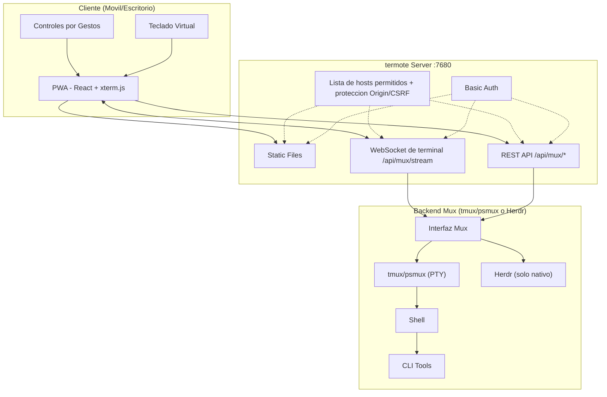
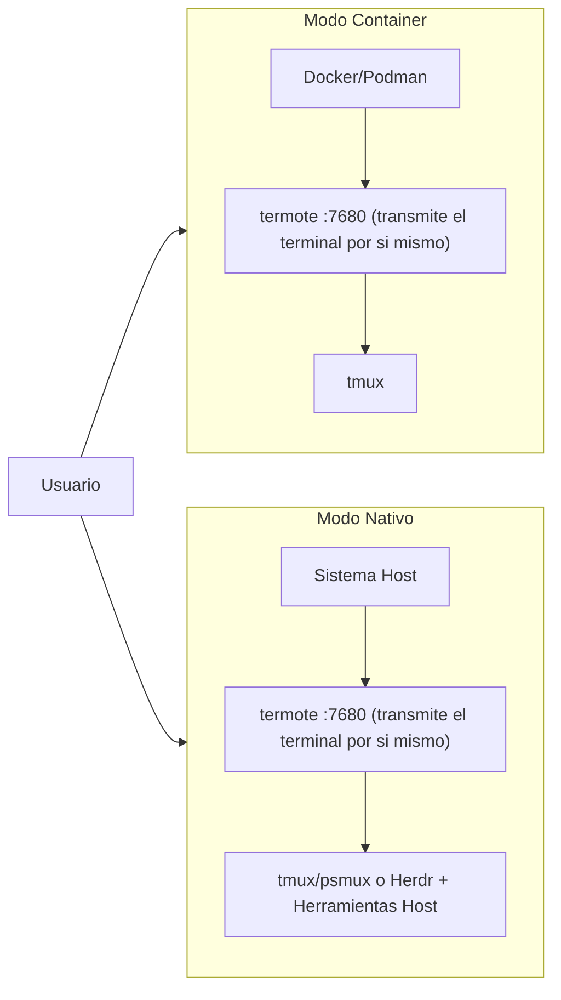

<p align="center">
  
</p>

<p align="center">
  <a href="https://github.com/lamngockhuong/termote/releases"></a>
  <a href="https://github.com/lamngockhuong/termote/actions/workflows/ci.yml"></a>
  <a href="https://github.com/lamngockhuong/termote/blob/main/LICENSE"></a>
  <a href="https://ghcr.io/lamngockhuong/termote"></a>
  <a href="https://hub.docker.com/r/lamngockhuong/termote"></a>
</p>

<p align="center">
  
  
  
  
</p>

<p align="center">
  <a href="https://launch.j2team.dev/products/termote?utm_source=badge-launched&utm_medium=badge&utm_campaign=badge-termote" target="_blank" rel="noopener noreferrer"></a>
  &nbsp;
  <a href="https://unikorn.vn/p/termote?ref=embed-termote" target="_blank"></a>
</p>

Controla remotamente herramientas CLI (Claude Code, GitHub Copilot, cualquier terminal) desde movil/escritorio via PWA.

> [!NOTE]
> Termote 1.0 no actualiza una instalacion 0.x. Desinstala 0.x como se describe en la
> [documentacion archivada de 0.x](https://termote.ohnice.app/0.x/) y luego instala 1.0
> con los comandos de [Inicio Rapido](#inicio-rapido).

> **Termote** = Terminal + Remote
>
> 🇬🇧 [English](README.md) | 🇻🇳 [Tiếng Việt](README.vi.md) | 🇨🇳 [简体中文](README.zh-CN.md) | 🇯🇵 [日本語](README.ja.md) | 🇰🇷 [한국어](README.ko.md) | 🇧🇷 [Português (BR)](README.pt-BR.md) | 🇫🇷 [Français](README.fr.md) | 🇩🇪 [Deutsch](README.de.md) | 🇷🇺 [Русский](README.ru.md) | 🇮🇩 [Bahasa Indonesia](README.id.md)

## Caracteristicas

- **Cambio de sesiones**: Multiples sesiones tmux con crear/editar/eliminar
- **Pestanas de sesiones**: Barra de pestanas horizontal para cambiar rapidamente entre ventanas
- **Backend Herdr** (solo nativo): controla workspaces de Herdr en lugar de tmux, con insignias de estado del agente de codigo en cada panel — ver [Instalacion nativa](https://termote.ohnice.app/installation/native/)
- **Optimizado para movil**: Teclado virtual (Tab/Ctrl/Shift/flechas, expandible)
- **Soporte de gestos**: Deslizar para Ctrl+C, Tab, desplazamiento
- **Historial de comandos**: Recuperar comandos enviados previamente con busqueda
- **Acciones rapidas**: Menu flotante para operaciones comunes (clear, cancel, exit)
- **Indicador de conexion**: Estado del servidor en tiempo real con deteccion automatica de desconexion
- **Verificador de actualizaciones**: Notificacion automatica de nuevas versiones desde GitHub releases
- **PWA**: Instalable en la pantalla de inicio, funciona sin conexion
- **Sesiones persistentes**: tmux mantiene las sesiones activas
- **Barra lateral plegable**: Interfaz de escritorio con barra lateral de sesiones activable
- **Modo pantalla completa**: Experiencia de terminal inmersiva
- **Se ejecuta como servicio**: `termote start` registra un servicio de usuario (systemd, launchd, tarea programada) que arranca al iniciar sesion
- **Persistencia de configuracion**: `termote start` guarda sus opciones, con la contrasena almacenada cifrada

## Capturas de Pantalla

<p align="center">
  
  &nbsp;&nbsp;
  
</p>

## Arquitectura


```mermaid
flowchart TB
    subgraph Client["Cliente (Movil/Escritorio)"]
        PWA["PWA - React + xterm.js"]
        Gestures["Controles por Gestos"]
        Keyboard["Teclado Virtual"]
    end

    subgraph Server["termote Server :7680"]
        Static["Static Files"]
        Stream["WebSocket de terminal /api/mux/stream"]
        API["REST API /api/mux/*"]
        Guard["Lista de hosts permitidos + proteccion Origin/CSRF"]
        Auth["Basic Auth"]
    end

    subgraph Backend["Backend Mux (tmux/psmux o Herdr)"]
        Mux["Interfaz Mux"]
        tmux["tmux/psmux (PTY)"]
        herdr["Herdr (solo nativo)"]
        Shell["Shell"]
        Tools["CLI Tools"]
    end

    Gestures --> PWA
    Keyboard --> PWA
    PWA --> Static
    PWA <--> Stream
    PWA --> API
    Guard -.-> Static & Stream & API
    Auth -.-> Static & Stream & API
    Stream --> Mux
    API --> Mux
    Mux --> tmux & herdr
    tmux --> Shell --> Tools
```

termote transmite el terminal por si mismo (PTY en Unix, ConPTY en Windows) a xterm.js dentro de la PWA; ya no hay un proceso de terminal aparte al que hacer proxy. El modelo completo de proteccion de peticiones esta en [`docs/system-architecture.md`](docs/system-architecture.md).

## Inicio Rapido

> 📖 **Nuevo en Termote?** Consulta la [Guia de Inicio](docs/getting-started.md) para un recorrido completo con ejemplos.

**Linux / macOS:**

```bash
curl -fsSL https://termote.ohnice.app/install.sh | sh
termote start
```

**Windows (PowerShell):**

```powershell
irm https://termote.ohnice.app/install.ps1 | iex
termote start
```

El instalador solo necesita `curl`, `tar` y `sha256sum`/`shasum` (PowerShell en Windows), sin sudo ni permisos de administrador. Verifica el checksum del archivo, instala el comando `termote` y no inicia nada. `termote start` guarda las opciones, crea una contrasena la primera vez (se muestra una sola vez; `termote show-password` la vuelve a mostrar), registra el servicio y lo inicia. Abre `http://localhost:7680` (Windows: `http://localhost:7690`).

Antes hay que instalar un backend de terminal: tmux (`sudo apt install tmux`, `brew install tmux`), psmux en Windows (`winget install psmux`) o [Herdr](https://termote.ohnice.app/installation/native/). El primer `start` detecta cual usar.

### Opciones comunes

```bash
termote start --lan                  # Listen on the LAN, not only this machine
termote start --tailscale myhost.ts.net  # Publish over Tailscale HTTPS
termote start --mux herdr            # Drive Herdr workspaces instead of tmux
termote start --no-auth              # Disable basic auth (local use only)
```

Las opciones se guardan: un flag que no se indica conserva su valor guardado, y un booleano se desactiva con `=false` (`termote start --lan=false`). Los flags son los mismos en todos los sistemas, PowerShell incluido.

### Comandos habituales

```bash
termote status                       # What the running server reports
termote stop                         # Stop (it starts again at the next login)
termote restart                      # Restart with the saved options
termote logs follow                  # Tail the logs
termote show-password                # Print the saved admin password
termote update                       # Update to the latest release
termote uninstall                    # Remove the service, the command and the install
```

`update` cambia a la nueva version, reinicia el servicio y vuelve a la anterior si la nueva no arranca. `uninstall` conserva la configuracion (`~/.config/termote`) y los logs (`~/.local/state/termote`) y muestra ambas rutas.

## Instalacion

### Fijar una version

```bash
curl -fsSL https://termote.ohnice.app/install.sh | TERMOTE_VERSION=1.0.0 sh
termote update --version 1.0.0
```

```powershell
$env:TERMOTE_VERSION='1.0.0'; irm https://termote.ohnice.app/install.ps1 | iex
```

Sin `TERMOTE_VERSION`, el instalador toma la release estable 1.x mas reciente y no toca una instalacion existente. Con ella, esa version se instala junto a la actual y pasa a ser la version activa, lo que tambien repara una instalacion rota.

### Modo container

```bash
termote container up                          # Run the published image (podman or docker)
termote container up --workspace ~/projects   # Mount a directory at /workspace
termote container status
termote container logs -f
termote container down
```

`container up` ejecuta `ghcr.io/lamngockhuong/termote` en la version del `termote` instalado, con podman (preferido) o docker, en el puerto 7680 y con `~/termote-workspace` montado en `/workspace`. Acepta `--port`, `--lan`, `--tailscale`, `--no-auth`, `--allow-host` y `--fresh`, que se guardan aparte de las opciones de `start`; la contrasena se comparte con el servidor nativo. Docker reinicia el container tras un reinicio del sistema; Podman sin root no tiene un daemon que lo haga, asi que ejecutalo como unidad Quadlet.

> **Nota de seguridad**: Evita montar `$HOME` directamente — directorios sensibles como `.ssh`, `.gnupg` serian accesibles en el container. Monta directorios de proyecto especificos.

### Docker sin la CLI

```bash
# Generates a password, printed in: docker logs termote
docker run -d --name termote -p 7680:7680 \
  -v ~/projects:/workspace \
  ghcr.io/lamngockhuong/termote:latest

# With your own credentials
docker run -d --name termote -p 7680:7680 \
  -e TERMOTE_USER=admin -e TERMOTE_PASS=secret \
  ghcr.io/lamngockhuong/termote:latest
```

| Variable de Entorno | Descripcion                                                     |
| ------------------- | --------------------------------------------------------------- |
| `TERMOTE_USER`      | Usuario de autenticacion basica (por defecto: `admin`)          |
| `TERMOTE_PASS`      | Contrasena de autenticacion basica (por defecto: auto-generada) |
| `NO_AUTH`           | Establecer a `true` para deshabilitar la autenticacion          |

### Compilar desde el codigo fuente

```bash
git clone https://github.com/lamngockhuong/termote.git
cd termote
make build
./scripts/termote.sh start
```

`make build` compila la PWA y la incrusta en `server/termote`; necesita Go, Node.js y pnpm. `scripts/termote.sh` (Windows: `scripts\termote.ps1`) solo ejecuta un checkout: recompila el binario de desarrollo cuando alguna fuente es mas reciente y luego lo ejecuta con los mismos argumentos. `termote update` se niega a ejecutarse en un checkout; usa `git pull && make build`.

### Actualizar desde 0.x

No hay actualizacion desde 0.x: 1.0 se instala en otro lugar y no lee la configuracion de 0.x. Desinstala 0.x como se describe en la [documentacion archivada de 0.x](https://termote.ohnice.app/0.x/) y luego instala 1.0 con los comandos anteriores.

## Modos de Despliegue


```mermaid
flowchart LR
    subgraph Container["Modo Container"]
        direction TB
        C1["Docker/Podman"] --> C2["termote :7680 (transmite el terminal por si mismo)"] --> C3["tmux"]
    end

    subgraph Native["Modo Nativo"]
        direction TB
        N1["Sistema Host"] --> N2["termote :7680 (transmite el terminal por si mismo)"] --> N3["tmux/psmux o Herdr + Herramientas Host"]
    end

    User["Usuario"] --> Container & Native
```

| Modo      | Comando                | Caso de Uso                                                              | Plataforma            |
| --------- | ---------------------- | ------------------------------------------------------------------------ | --------------------- |
| Nativo    | `termote start`        | Acceso a herramientas host (claude, gh); necesario para el backend Herdr | macOS, Linux, Windows |
| Container | `termote container up` | Entorno aislado                                                          | macOS, Linux, Windows |

El servidor nativo se ejecuta como servicio de usuario: una unidad de usuario de systemd en Linux (un proceso separado donde no hay systemd de usuario, como WSL2 sin systemd), un agente de launchd en macOS y una tarea programada al iniciar sesion en Windows.

### Opciones de `start`

| Flag                        | Descripcion                                                                                        |
| --------------------------- | -------------------------------------------------------------------------------------------------- |
| `--port <port>`             | Puerto (por defecto: 7680, Windows: 7690)                                                          |
| `--lan[=false]`             | Escuchar en todas las interfaces (por defecto: solo localhost)                                     |
| `--tailscale <host[:port]>` | Publicar por Tailscale HTTPS (puerto por defecto 443)                                              |
| `--no-tailscale`            | Dejar de publicar por Tailscale                                                                    |
| `--no-auth[=false]`         | Deshabilitar autenticacion basica                                                                  |
| `--mux <tmux\|herdr>`       | Backend de terminal (por defecto: herdr si esta en ejecucion, si no tmux)                          |
| `--allow-host <name>`       | Permitir un valor adicional de la cabecera Host (repetible; sin comodines, ver notas de seguridad) |
| `--remove-host <name>`      | Quitar un nombre de Host permitido (repetible)                                                     |
| `--allow-herdr-no-auth`     | Obligatorio junto con `--mux herdr --no-auth`                                                      |
| `--fresh`                   | Establecer una nueva contrasena                                                                    |

### Con Tailscale HTTPS

Usa `tailscale serve` para HTTPS automatico (sin gestion manual de certificados):

```bash
termote start --tailscale myhost.ts.net                # Default port 443
termote start --tailscale myhost.ts.net:8765           # Custom port
termote container up --tailscale myhost.ts.net         # Container mode
sudo tailscale set --operator=$USER                    # Linux, once: let termote run tailscale serve
```

La asignacion se aplica cada vez que arranca el servidor. `stop`, `start --no-tailscale` y `uninstall` solo eliminan la asignacion propia de Termote.

## Soporte de Plataformas

| Plataforma | Container | Nativo | Instalador    |
| ---------- | --------- | ------ | ------------- |
| Linux      | ✓         | ✓      | `install.sh`  |
| macOS      | ✓         | ✓      | `install.sh`  |
| Windows    | ✓         | ✓      | `install.ps1` |

> **Soporte de Windows**: El modo container requiere Docker Desktop o Podman Desktop; el modo nativo requiere [psmux](https://github.com/psmux/psmux) (multiplexor de terminal compatible con tmux para Windows), que se instala con `winget install psmux`, o un servidor [Herdr](https://herdr.dev/#install) en ejecucion. El servicio de Windows aun no se ha verificado en una maquina real; por favor reporta cualquier problema en GitHub.

## Uso en Movil

| Accion               | Gesto                       |
| -------------------- | --------------------------- |
| Cancelar/interrumpir | Deslizar izquierda (Ctrl+C) |
| Tab completion       | Deslizar derecha            |
| Desplazar abajo      | Deslizar arriba             |
| Desplazar arriba     | Deslizar abajo              |
| Pegar                | Mantener presionado         |
| Tamano de fuente     | Pellizcar                   |

La barra de herramientas virtual proporciona: Tab, Esc, Ctrl, Shift, teclas de flechas y combinaciones de teclas comunes. Soporta combinaciones Ctrl+Shift (pegar, copiar). Alterna entre modo minimal y expandido para teclas adicionales (Home, End, Delete, etc.).

## Estructura del Proyecto

```
termote/
├── Makefile                # Build/test/run commands
├── Dockerfile              # Container image (termote + tmux)
├── docker-compose.yml      # Development from a checkout only
├── entrypoint.sh           # Container entrypoint
├── docs/                   # Documentation
│   └── images/screenshots/ # App screenshots
├── pwa/                    # React PWA
│   └── src/
│       ├── components/
│       ├── contexts/
│       ├── hooks/
│       ├── types/
│       └── utils/
├── server/                 # Go server + CLI (single binary)
│   ├── main.go             # Entry point (no args = menu, `serve` = server, else CLI)
│   ├── serve.go            # Server (PWA, auth, guards)
│   ├── mux.go              # Mux interface + /api/mux/* routes
│   ├── mux_tmux.go         # tmux/psmux backend
│   ├── mux_herdr.go        # Herdr backend (native only)
│   ├── stream.go           # Terminal WebSocket (xterm.js stream)
│   ├── cli*.go             # start/stop/update/container/logs/menu subcommands
│   └── webui/              # PWA embedded in the binary (filled by make build)
├── scripts/
│   ├── install.sh          # Unix online installer (curl | sh)
│   ├── install.ps1         # Windows online installer (irm | iex)
│   ├── termote.sh          # Unix shim: builds and runs a checkout
│   └── termote.ps1         # Windows PowerShell shim: builds and runs a checkout
├── tests/                  # Test suite
│   ├── test-termote.sh     # Unix shim tests
│   ├── test-termote.ps1    # Windows shim tests
│   ├── test-install.sh     # Unix installer tests
│   ├── test-install.ps1    # Windows installer tests
│   └── test-entrypoints.sh # Container entrypoint tests
└── website/                # Astro Starlight docs site
    └── src/content/docs/   # MDX documentation
```

## Desarrollo

```bash
make build          # Build the PWA and embed it in server/termote
make test           # Run all tests
make health         # Check service health
make clean          # Stop containers

# E2E tests (requires running server)
./scripts/termote.sh start           # Start server first
pnpm --filter termote test:e2e       # Run Playwright tests
pnpm --filter termote test:e2e:ui    # Run with UI debugger
```

**Pruebas Manuales:** Ver [Lista de Verificacion](docs/self-test-checklist.md)

## Solucion de Problemas

### La sesion no persiste

- Verificar tmux: `tmux ls`
- termote se conecta con `tmux new-session -A` (attach-or-create)

### Errores de WebSocket

- Verificar logs de termote: `termote container logs` (container) o `termote logs server` (nativo)
- El WebSocket del terminal es `/api/mux/stream` y lo sirve el propio termote; no hay un proceso de terminal aparte que revisar

### Problemas con el teclado en movil

- Asegurar que la meta tag de viewport esta presente
- Probar en un dispositivo real, no en un emulador

### Modo nativo: el servidor no inicia

```bash
termote status             # What the running server reports
termote logs server        # Or: termote logs follow
lsof -i :7680              # Check what holds the port
termote start --fresh      # If the saved password can no longer be read
```

## Notas de Seguridad

- **Por defecto: solo localhost** - no se expone a LAN a menos que se use el flag `--lan`
- **Autenticacion basica habilitada por defecto** - usa `--no-auth` para deshabilitar en desarrollo local; la contrasena la crea el primer `termote start` y se guarda cifrada
- **Lista de hosts permitidos** - se rechazan las peticiones con una cabecera `Host` desconocida (proteccion contra DNS rebinding); agrega nombres de confianza con `--allow-host`, no existe comodin para desactivar la comprobacion
- **Protecciones Origin/CSRF** - las peticiones `/api/mux/*` que cambian estado y el WebSocket `/api/mux/stream` rechazan `Sec-Fetch-Site`/`Origin` de otros sitios y exigen un token de stream de un solo uso y del mismo origen
- **Proteccion contra fuerza bruta integrada** - limitacion de tasa (5 intentos/min por IP)
- **Backend Herdr** - expone todos los workspaces de Herdr del host, por eso `--mux herdr --no-auth` se rechaza salvo que tambien se pase `--allow-herdr-no-auth`
- **Sin secretos en los archivos de servicio** - la unidad de systemd, el agente de launchd y la tarea programada nunca contienen la contrasena
- Usar HTTPS (Tailscale) para produccion
- Restringir a redes de confianza/VPN

## Otros Proyectos

| Proyecto                                                    | Descripcion                                                                                                                                         |
| ----------------------------------------------------------- | --------------------------------------------------------------------------------------------------------------------------------------------------- |
| [GitHub Flex](https://github.com/lamngockhuong/github-flex) | Extension multi-navegador (Chrome y Firefox) que mejora la interfaz de GitHub con funciones de productividad                                        |
| [TabRest](https://github.com/lamngockhuong/tabrest)         | Extension de Chrome que descarga automaticamente las pestañas inactivas para liberar memoria                                                        |
| [Specpin](https://github.com/lamngockhuong/specpin)         | Fija especificaciones de negocio vivas y versionadas con Git en los elementos de tu interfaz web en ejecucion (extension de navegador + sidecar Go) |

## Licencia

MIT
