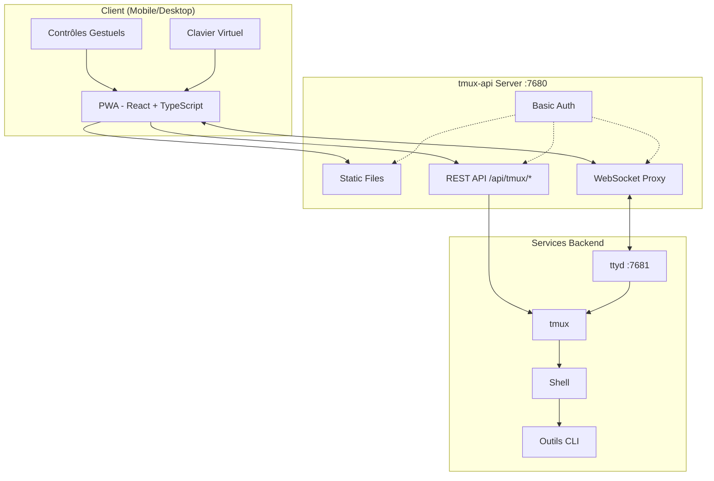
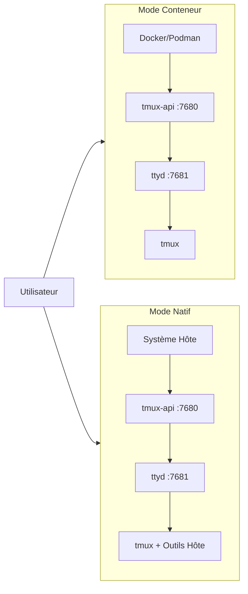

<p align="center">
  
</p>

<p align="center">
  <a href="https://github.com/lamngockhuong/termote/releases"></a>
  <a href="https://github.com/lamngockhuong/termote/actions/workflows/ci.yml"></a>
  <a href="https://github.com/lamngockhuong/termote/blob/main/LICENSE"></a>
  <a href="https://ghcr.io/lamngockhuong/termote"></a>
  <a href="https://hub.docker.com/r/lamngockhuong/termote"></a>
</p>

<p align="center">
  
  
  
  
</p>

<p align="center">
  <a href="https://launch.j2team.dev/products/termote?utm_source=badge-launched&utm_medium=badge&utm_campaign=badge-termote" target="_blank" rel="noopener noreferrer"></a>
  &nbsp;
  <a href="https://unikorn.vn/p/termote?ref=embed-termote" target="_blank"></a>
</p>

Contrôlez à distance des outils CLI (Claude Code, GitHub Copilot, n'importe quel terminal) depuis mobile/desktop via PWA.

> **Termote** = Terminal + Remote
>
> 🇬🇧 [English](README.md) | 🇻🇳 [Tiếng Việt](README.vi.md) | 🇨🇳 [简体中文](README.zh-CN.md) | 🇯🇵 [日本語](README.ja.md) | 🇰🇷 [한국어](README.ko.md) | 🇪🇸 [Español](README.es.md) | 🇧🇷 [Português (BR)](README.pt-BR.md) | 🇩🇪 [Deutsch](README.de.md) | 🇷🇺 [Русский](README.ru.md) | 🇮🇩 [Bahasa Indonesia](README.id.md)

## Fonctionnalités

- **Changement de session** : Plusieurs sessions tmux avec création/modification/suppression
- **Onglets de session** : Barre d'onglets horizontale pour basculer rapidement entre les fenêtres
- **Adapté au mobile** : Barre d'outils clavier virtuel (Tab/Ctrl/Shift/flèches, extensible)
- **Support des gestes** : Balayage pour Ctrl+C, Tab, navigation dans l'historique
- **Historique des commandes** : Rappel des commandes envoyées avec recherche
- **Actions rapides** : Menu flottant pour les opérations courantes (clear, cancel, exit)
- **Indicateur de connexion** : Statut du serveur en temps réel avec détection automatique de déconnexion
- **Vérification des mises à jour** : Notification automatique de nouvelle version depuis les releases GitHub
- **PWA** : Installable sur l'écran d'accueil, utilisable hors ligne
- **Sessions persistantes** : tmux maintient les sessions actives
- **Barre latérale repliable** : Interface desktop avec barre latérale de sessions activable
- **Mode plein écran** : Expérience terminal immersive
- **Persistance de la configuration** : Sauvegarde automatique des paramètres avec mot de passe chiffré AES-256

## Captures d'Écran

<p align="center">
  
  &nbsp;&nbsp;
  
</p>

## Architecture



## Démarrage Rapide

> 📖 **Nouveau sur Termote ?** Consultez le [Guide de Démarrage](docs/getting-started.md) pour une présentation complète avec des exemples.

```bash
./scripts/termote.sh                   # Menu interactif
./scripts/termote.sh install container # Mode conteneur (docker/podman)
./scripts/termote.sh install native    # Mode natif (outils de l'hôte)
./scripts/termote.sh link              # Créer la commande globale 'termote'
make test                              # Lancer les tests
```

> Après `link`, utilisez `termote` depuis n'importe où : `termote health`, `termote install native --lan`
>
> **Astuce** : Installez [gum](https://github.com/charmbracelet/gum) pour des menus interactifs améliorés (optionnel, fallback bash disponible)

## Installation

### Une seule ligne (recommandé)

**macOS/Linux :**

```bash
# Télécharger et demander avant d'installer (mode natif par défaut)
curl -fsSL https://raw.githubusercontent.com/lamngockhuong/termote/main/scripts/get.sh | bash

# Installation automatique sans confirmation
curl -fsSL .../get.sh | bash -s -- --yes

# Téléchargement uniquement (sans installation)
curl -fsSL .../get.sh | bash -s -- --download-only

# Mise à jour automatique avec la configuration sauvegardée
curl -fsSL .../get.sh | bash -s -- --update

# Installer une version spécifique
curl -fsSL .../get.sh | bash -s -- --version 0.0.4

# Avec mode et options explicites
curl -fsSL .../get.sh | bash -s -- --yes --container --lan
curl -fsSL .../get.sh | bash -s -- --yes --native --tailscale myhost

# Forcer un nouveau mot de passe (ignorer la configuration sauvegardée)
curl -fsSL .../get.sh | bash -s -- --yes --container --fresh
```

**Windows (PowerShell) :**

> **Remarque :** Si l'exécution de scripts est désactivée sur votre système, exécutez d'abord ceci :
>
> ```powershell
> Set-ExecutionPolicy -Scope CurrentUser -ExecutionPolicy RemoteSigned
> ```

```powershell
# Télécharger et demander avant d'installer (mode natif par défaut)
irm https://raw.githubusercontent.com/lamngockhuong/termote/main/scripts/get.ps1 | iex

# Installation automatique sans confirmation
$env:TERMOTE_AUTO_YES = "true"; irm .../get.ps1 | iex

# Avec mode explicite
$env:TERMOTE_MODE = "container"; irm .../get.ps1 | iex

# Mise à jour automatique avec la configuration sauvegardée
$env:TERMOTE_UPDATE = "true"; irm .../get.ps1 | iex
```

### Docker

```bash
# Tout-en-un (génération automatique des identifiants, voir les logs : docker logs termote)
docker run -d --name termote -p 7680:7680 ghcr.io/lamngockhuong/termote:latest

# Avec identifiants personnalisés
docker run -d --name termote -p 7680:7680 \
  -e TERMOTE_USER=admin -e TERMOTE_PASS=secret \
  ghcr.io/lamngockhuong/termote:latest

# Sans authentification (dev local uniquement)
docker run -d --name termote -p 7680:7680 \
  -e NO_AUTH=true \
  ghcr.io/lamngockhuong/termote:latest

# Avec volume pour la persistance
docker run -d --name termote -p 7680:7680 \
  -v termote-data:/home/termote \
  ghcr.io/lamngockhuong/termote:latest

# Monter un répertoire workspace personnalisé
docker run -d --name termote -p 7680:7680 \
  -v ~/projects:/workspace \
  ghcr.io/lamngockhuong/termote:latest

# Avec Tailscale HTTPS (nécessite Tailscale sur l'hôte)
docker run -d --name termote -p 7680:7680 \
  -e TERMOTE_USER=admin -e TERMOTE_PASS=secret \
  ghcr.io/lamngockhuong/termote:latest
sudo tailscale serve --bg --https=443 http://127.0.0.1:7680
# Accès : https://your-hostname.tailnet-name.ts.net
```

### Depuis une Release

```bash
# Télécharger la dernière release
VERSION=$(curl -s https://api.github.com/repos/lamngockhuong/termote/releases/latest | grep tag_name | cut -d '"' -f4)
wget https://github.com/lamngockhuong/termote/releases/download/${VERSION}/termote-${VERSION}.tar.gz
tar xzf termote-${VERSION}.tar.gz
cd termote-${VERSION#v}

# Installer (menu interactif ou avec mode)
./scripts/termote.sh install
./scripts/termote.sh install container
```

### Depuis les Sources

```bash
git clone https://github.com/lamngockhuong/termote.git
cd termote
./scripts/termote.sh install container
```

> **Remarque** : `termote.sh` est le CLI unifié prenant en charge `install` (build depuis les sources, utilise les artefacts pré-compilés si disponibles), `uninstall` et `health`.

## Modes de Déploiement



| Mode          | Description      | Cas d'utilisation                            | Plateforme   |
| ------------- | ---------------- | -------------------------------------------- | ------------ |
| `--container` | Mode conteneur   | Déploiement simple, environnement isolé      | macOS, Linux |
| `--native`    | Tout en natif    | Accès aux outils de l'hôte (claude, gh)      | macOS, Linux |

### Options

| Flag                        | Description                                                  |
| --------------------------- | ------------------------------------------------------------ |
| `--lan`                     | Exposer sur le LAN (par défaut : localhost uniquement)       |
| `--tailscale <host[:port]>` | Activer Tailscale HTTPS                                     |
| `--no-auth`                 | Désactiver l'authentification basique                        |
| `--port <port>`             | Port hôte (par défaut : 7680, Windows : 7690)               |
| `--fresh`                   | Forcer un nouveau mot de passe (ignorer la config sauvegardée) |
| `--update`                  | Mise à jour automatique avec la config sauvegardée           |
| `--version <ver>`           | Installer une version spécifique (avec ou sans `v`)          |

| Variable d'environnement | Description                                                |
| ------------------------ | ---------------------------------------------------------- |
| `WORKSPACE`              | Répertoire hôte à monter (par défaut : `./workspace`)      |
| `TERMOTE_USER`           | Nom d'utilisateur auth (par défaut : généré automatiquement) |
| `TERMOTE_PASS`           | Mot de passe auth (par défaut : généré automatiquement)    |
| `NO_AUTH`                | Définir à `true` pour désactiver l'authentification        |

### Mode Conteneur (recommandé pour la simplicité)

Les scripts détectent automatiquement `podman` ou `docker` — les deux fonctionnent de manière identique.

```bash
./scripts/termote.sh install container             # localhost avec basic auth
./scripts/termote.sh install container --no-auth   # localhost sans auth
./scripts/termote.sh install container --lan       # Accessible sur le LAN
# Accès : http://localhost:7680

# Répertoire workspace personnalisé (monté dans /workspace dans le conteneur)
WORKSPACE=~/projects ./scripts/termote.sh install container
WORKSPACE=/path/to/code make install-container
```

> **Note de sécurité** : Évitez de monter `$HOME` directement — les répertoires sensibles comme `.ssh`, `.gnupg` seront accessibles dans le conteneur. Montez des répertoires de projet spécifiques à la place.

### Natif (recommandé pour l'accès aux binaires de l'hôte)

À utiliser lorsque vous avez besoin d'accéder aux binaires de l'hôte (claude, git, etc.) :

```bash
# Linux
sudo apt install ttyd tmux
# Ou : sudo snap install ttyd
./scripts/termote.sh install native

# macOS
brew install ttyd tmux go
./scripts/termote.sh install native
# Accès : http://localhost:7680
```

### Avec Tailscale HTTPS (tous les modes)

Utilise `tailscale serve` pour le HTTPS automatique (pas de gestion manuelle des certificats) :

```bash
# Tailscale uniquement (port par défaut 443)
./scripts/termote.sh install container --tailscale myhost.ts.net

# Port personnalisé
./scripts/termote.sh install native --tailscale myhost.ts.net:8765

# Tailscale + accessible sur le LAN
./scripts/termote.sh install container --tailscale myhost.ts.net --lan

# Accès : https://myhost.ts.net (ou :8765 pour un port personnalisé)
```

### Désinstallation

```bash
./scripts/termote.sh uninstall container   # Mode conteneur
./scripts/termote.sh uninstall native      # Mode natif
./scripts/termote.sh uninstall all         # Tout
```

### Mise à Jour

```bash
# Option 1 : Mise à jour automatique avec la config sauvegardée
curl -fsSL .../get.sh | bash -s -- --update

# Option 2 : Relancer la commande one-liner (compare les versions, demande avant d'installer)
curl -fsSL .../get.sh | bash

# Option 3 : Mise à jour manuelle
./scripts/termote.sh uninstall [container|native]
git pull origin main                    # Si installé depuis les sources
./scripts/termote.sh install [container|native] [--lan] [--tailscale ...]
```

## Support des Plateformes

| Plateforme | Conteneur          | Natif              | Script CLI  |
| ---------- | ------------------ | ------------------ | ----------- |
| Linux      | ✓                  | ✓                  | termote.sh  |
| macOS      | ✓                  | ✓                  | termote.sh  |
| Windows    | ⚠️ (expérimental)   | ⚠️ (expérimental)   | termote.ps1 |

> **⚠️ Support Windows (Expérimental)** : Le support Windows est actuellement en phase initiale et nécessite davantage de tests. Le mode conteneur nécessite Docker Desktop, le mode natif nécessite psmux. Veuillez signaler les problèmes sur GitHub.

### Mode Natif Windows

Le mode natif Windows utilise [psmux](https://github.com/psmux/psmux) (multiplexeur de terminal compatible tmux pour Windows) :

```powershell
# Installer psmux
winget install psmux

# Lancer Termote
.\scripts\termote.ps1 install native
.\scripts\termote.ps1 install container  # Ou mode conteneur avec Docker Desktop
```

## Utilisation Mobile

| Action              | Geste                |
| ------------------- | -------------------- |
| Annuler/interrompre | Balayage gauche (Ctrl+C) |
| Complétion Tab      | Balayage droit       |
| Historique haut     | Balayage haut        |
| Historique bas      | Balayage bas         |
| Coller              | Appui long           |
| Taille de police    | Pincement entrée/sortie |

La barre d'outils virtuelle fournit : Tab, Esc, Ctrl, Shift, touches fléchées et combinaisons de touches courantes. Supporte les combinaisons Ctrl+Shift (coller, copier). Basculez entre le mode minimal et le mode étendu pour des touches supplémentaires (Home, End, Delete, etc.).

## Structure du Projet

```
termote/
├── Makefile                # Commandes build/test/deploy
├── Dockerfile              # Mode Docker (tmux-api + ttyd)
├── docker-compose.yml
├── entrypoint.sh           # Point d'entrée Docker
├── docs/                   # Documentation
│   └── images/screenshots/ # Captures d'écran de l'app
├── pwa/                    # React PWA
│   └── src/
│       ├── components/
│       ├── contexts/
│       ├── hooks/
│       ├── types/
│       └── utils/
├── tmux-api/               # Serveur Go
│   ├── main.go             # Point d'entrée
│   ├── serve.go            # Serveur (PWA, proxy, auth)
│   └── tmux.go             # Handlers API tmux
├── scripts/
│   ├── termote.sh          # CLI Unix (install/uninstall/health)
│   ├── termote.ps1         # CLI Windows PowerShell
│   ├── get.sh              # Installateur en ligne Unix (curl | bash)
│   └── get.ps1             # Installateur en ligne Windows (irm | iex)
├── tests/                  # Suite de tests
│   ├── test-termote.sh
│   ├── test-termote.ps1    # Tests Windows
│   ├── test-get.sh
│   └── test-entrypoints.sh
└── website/                # Site docs Astro Starlight
    └── src/content/docs/   # Documentation MDX
```

## Développement

```bash
make build          # Build PWA et tmux-api
make test           # Lancer tous les tests
make health         # Vérifier la santé des services
make clean          # Arrêter les conteneurs

# Tests E2E (nécessite un serveur en cours d'exécution)
./scripts/termote.sh install container  # Démarrer le serveur d'abord
cd pwa && pnpm test:e2e       # Lancer les tests Playwright
cd pwa && pnpm test:e2e:ui    # Lancer avec le débogueur UI
```

**Tests Manuels :** Voir [Liste de Vérification](docs/self-test-checklist.md)

## Dépannage

### La session ne persiste pas

- Vérifier tmux : `tmux ls`
- Vérifier que ttyd utilise le flag `-A` (attach-or-create)

### Erreurs WebSocket

- Vérifier les logs tmux-api : `docker logs termote`
- Vérifier que ttyd fonctionne sur le port 7681

### Problèmes de clavier mobile

- S'assurer que la balise meta viewport est présente
- Tester sur un appareil réel, pas un émulateur

### Mode natif : les processus ne démarrent pas

```bash
ps aux | grep ttyd         # Vérifier si ttyd est en cours d'exécution
ps aux | grep tmux-api     # Vérifier si tmux-api est en cours d'exécution
lsof -i :7680              # Vérifier que le port est utilisé
```

## Notes de Sécurité

- **Par défaut : localhost uniquement** - non exposé au LAN sauf si le flag `--lan` est utilisé
- **Authentification basique activée par défaut** - utilisez `--no-auth` pour désactiver en dev local
- **Protection anti-brute-force intégrée** - limitation de débit (5 tentatives/min par IP)
- Utilisez HTTPS (Tailscale) pour la production
- Restreignez aux réseaux de confiance/VPN

## Licence

MIT
