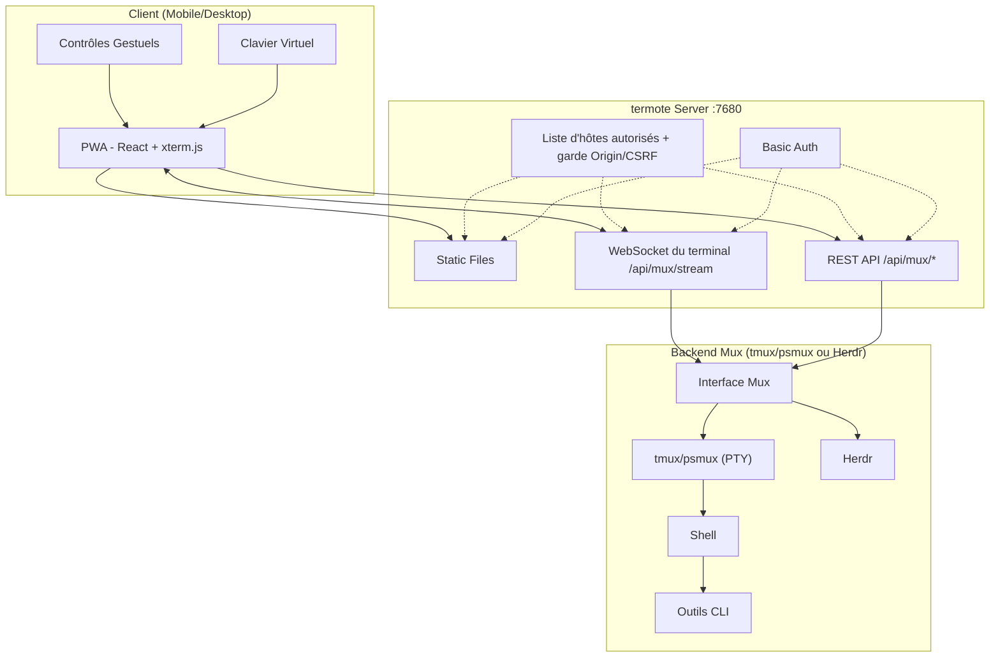
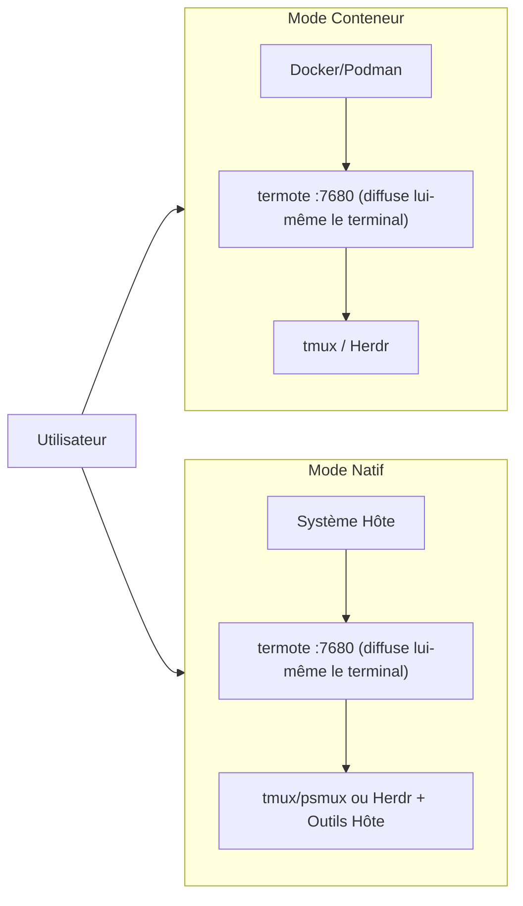

<p align="center">
  
</p>

<p align="center">
  <a href="https://github.com/lamngockhuong/termote/releases"></a>
  <a href="https://github.com/lamngockhuong/termote/actions/workflows/ci.yml"></a>
  <a href="https://github.com/lamngockhuong/termote/blob/main/LICENSE"></a>
  <a href="https://ghcr.io/lamngockhuong/termote"></a>
  <a href="https://hub.docker.com/r/lamngockhuong/termote"></a>
</p>

<p align="center">
  
  
  
  
</p>

<p align="center">
  <a href="https://launch.j2team.dev/products/termote?utm_source=badge-launched&utm_medium=badge&utm_campaign=badge-termote" target="_blank" rel="noopener noreferrer"></a>
  &nbsp;
  <a href="https://unikorn.vn/p/termote?ref=embed-termote" target="_blank"></a>
</p>

Contrôlez à distance des outils CLI (Claude Code, GitHub Copilot, n'importe quel terminal) depuis mobile/desktop via PWA.

> [!NOTE]
> Termote 1.0 ne met pas à niveau une installation 0.x. Désinstallez 0.x comme décrit dans la
> [documentation archivée de 0.x](https://termote.ohnice.app/0.x/), puis installez 1.0 avec les
> commandes du [Démarrage Rapide](#démarrage-rapide).

> **Termote** = Terminal + Remote
>
> 🇬🇧 [English](README.md) | 🇻🇳 [Tiếng Việt](README.vi.md) | 🇨🇳 [简体中文](README.zh-CN.md) | 🇯🇵 [日本語](README.ja.md) | 🇰🇷 [한국어](README.ko.md) | 🇪🇸 [Español](README.es.md) | 🇧🇷 [Português (BR)](README.pt-BR.md) | 🇩🇪 [Deutsch](README.de.md) | 🇷🇺 [Русский](README.ru.md) | 🇮🇩 [Bahasa Indonesia](README.id.md)

## Fonctionnalités

- **Changement de session** : Plusieurs sessions tmux avec création/modification/suppression
- **Onglets de session** : Barre d'onglets horizontale pour basculer rapidement entre les fenêtres
- **Backend Herdr** (natif ou dans le conteneur) : pilotez les workspaces Herdr à la place de tmux, avec un badge d'état de l'agent de code sur chaque volet — voir [Installation native](https://termote.ohnice.app/installation/native/)
- **Adapté au mobile** : Barre d'outils clavier virtuel (Tab/Ctrl/Shift/flèches, extensible)
- **Support des gestes** : Balayage pour Ctrl+C, Tab, défilement
- **Historique des commandes** : Rappel des commandes envoyées avec recherche
- **Actions rapides** : Menu flottant pour les opérations courantes (clear, cancel, exit)
- **Indicateur de connexion** : Statut du serveur en temps réel avec détection automatique de déconnexion
- **Vérification des mises à jour** : Notification automatique de nouvelle version depuis les releases GitHub
- **PWA** : Installable sur l'écran d'accueil, utilisable hors ligne
- **Sessions persistantes** : tmux maintient les sessions actives
- **Barre latérale repliable** : Interface desktop avec barre latérale de sessions activable
- **Mode plein écran** : Expérience terminal immersive
- **Fonctionne comme un service** : `termote start` enregistre un service utilisateur (systemd, launchd, tâche planifiée) qui démarre à l'ouverture de session
- **Persistance de la configuration** : `termote start` enregistre ses options, avec le mot de passe stocké chiffré

## Captures d'Écran

<p align="center">
  
  &nbsp;&nbsp;
  
</p>

## Architecture


```mermaid
flowchart TB
    subgraph Client["Client (Mobile/Desktop)"]
        PWA["PWA - React + xterm.js"]
        Gestures["Contrôles Gestuels"]
        Keyboard["Clavier Virtuel"]
    end

    subgraph Server["termote Server :7680"]
        Static["Static Files"]
        Stream["WebSocket du terminal /api/mux/stream"]
        API["REST API /api/mux/*"]
        Guard["Liste d'hôtes autorisés + garde Origin/CSRF"]
        Auth["Basic Auth"]
    end

    subgraph Backend["Backend Mux (tmux/psmux ou Herdr)"]
        Mux["Interface Mux"]
        tmux["tmux/psmux (PTY)"]
        herdr["Herdr"]
        Shell["Shell"]
        Tools["Outils CLI"]
    end

    Gestures --> PWA
    Keyboard --> PWA
    PWA --> Static
    PWA <--> Stream
    PWA --> API
    Guard -.-> Static & Stream & API
    Auth -.-> Static & Stream & API
    Stream --> Mux
    API --> Mux
    Mux --> tmux & herdr
    tmux --> Shell --> Tools
```

termote diffuse lui-même le terminal (PTY sous Unix, ConPTY sous Windows) vers xterm.js dans la PWA ; il n'y a plus de processus terminal séparé vers lequel relayer. Le modèle complet de protection des requêtes est décrit dans [`docs/system-architecture.md`](docs/system-architecture.md).

## Démarrage Rapide

> 📖 **Nouveau sur Termote ?** Consultez le [Guide de Démarrage](docs/getting-started.md) pour une présentation complète avec des exemples.

**Linux / macOS :**

```bash
curl -fsSL https://termote.ohnice.app/install.sh | sh
termote start
```

**Windows (PowerShell) :**

```powershell
irm https://termote.ohnice.app/install.ps1 | iex
termote start
```

L'installateur n'a besoin que de `curl`, `tar` et `sha256sum`/`shasum` (PowerShell sous Windows), sans sudo ni droits administrateur. Il vérifie la somme de contrôle de l'archive, installe la commande `termote` et ne démarre rien. `termote start` enregistre les options, crée un mot de passe la première fois (affiché une seule fois ; `termote show-password` le réaffiche), enregistre le service et le démarre. Ouvrez `http://localhost:7680` (Windows : `http://localhost:7690`).

Un backend de terminal doit être installé au préalable : tmux (`sudo apt install tmux`, `brew install tmux`), psmux sous Windows (`winget install psmux`) ou [Herdr](https://termote.ohnice.app/installation/native/). Le premier `start` détecte lequel utiliser.

### Options courantes

```bash
termote start --lan                  # Listen on the LAN, not only this machine
termote start --tailscale myhost.ts.net  # Publish over Tailscale HTTPS
termote start --mux herdr            # Drive Herdr workspaces instead of tmux
termote start --no-auth              # Disable basic auth (local use only)
```

Les options sont enregistrées : un flag non fourni garde sa valeur enregistrée, et un booléen se désactive avec `=false` (`termote start --lan=false`). Les flags sont les mêmes sur tous les systèmes, PowerShell compris.

### Commandes du quotidien

```bash
termote status                       # What the running server reports
termote stop                         # Stop (it starts again at the next login)
termote restart                      # Restart with the saved options
termote logs follow                  # Tail the logs
termote show-password                # Print the saved admin password
termote update                       # Update to the latest release
termote uninstall                    # Remove the service, the command and the install
```

`update` passe à la nouvelle version, redémarre le service et revient à l'ancienne si la nouvelle ne démarre pas. `uninstall` conserve la configuration (`~/.config/termote`) et les logs (`~/.local/state/termote`) et affiche les deux chemins.

## Installation

### Fixer une version

```bash
curl -fsSL https://termote.ohnice.app/install.sh | TERMOTE_VERSION=1.0.0 sh
termote update --version 1.0.0
```

```powershell
$env:TERMOTE_VERSION='1.0.0'; irm https://termote.ohnice.app/install.ps1 | iex
```

Sans `TERMOTE_VERSION`, l'installateur prend la release stable 1.x la plus récente et ne touche pas à une installation existante. Avec elle, cette version est installée à côté de la version actuelle et devient la version active, ce qui permet aussi de réparer une installation cassée.

### Mode conteneur

```bash
termote container up                          # Run the published image (podman or docker)
termote container up --workspace ~/projects   # Mount a directory at /workspace
termote container status
termote container logs -f
termote container down
```

`container up` lance `ghcr.io/lamngockhuong/termote` dans la version du `termote` installé, avec podman (préféré) ou docker, sur le port 7680, avec `~/termote-workspace` monté sur `/workspace`. Il accepte `--port`, `--lan`, `--tailscale`, `--no-auth`, `--allow-host` et `--fresh`, enregistrés séparément des options de `start` ; le mot de passe est partagé avec le serveur natif. Docker relance le conteneur après un redémarrage ; Podman rootless n'a pas de démon pour le faire, lancez-le donc comme unité Quadlet.

> **Note de sécurité** : Évitez de monter `$HOME` directement — les répertoires sensibles comme `.ssh`, `.gnupg` seraient accessibles dans le conteneur. Montez plutôt des répertoires de projet spécifiques.

### Docker sans la CLI

```bash
# Generates a password, printed in: docker logs termote
docker run -d --name termote -p 7680:7680 \
  -v ~/projects:/workspace \
  ghcr.io/lamngockhuong/termote:latest

# With your own credentials
docker run -d --name termote -p 7680:7680 \
  -e TERMOTE_USER=admin -e TERMOTE_PASS=secret \
  ghcr.io/lamngockhuong/termote:latest
```

| Variable d'Environnement | Description                                                          |
| ------------------------ | -------------------------------------------------------------------- |
| `TERMOTE_USER`           | Nom d'utilisateur de l'auth basique (par défaut : `admin`)           |
| `TERMOTE_PASS`           | Mot de passe de l'auth basique (par défaut : généré automatiquement) |
| `NO_AUTH`                | Mettre à `true` pour désactiver l'authentification                   |

### Compiler depuis les sources

```bash
git clone https://github.com/lamngockhuong/termote.git
cd termote
make build
./scripts/termote.sh start
```

`make build` compile la PWA et l'intègre dans `server/termote` ; il faut Go, Node.js et pnpm. `scripts/termote.sh` (Windows : `scripts\termote.ps1`) ne sert qu'à un checkout : il recompile le binaire de développement quand une source est plus récente, puis le lance avec les mêmes arguments. `termote update` refuse de s'exécuter dans un checkout ; utilisez `git pull && make build`.

### Mise à niveau depuis 0.x

Il n'y a pas de mise à niveau depuis 0.x : 1.0 s'installe à un autre endroit et ne lit pas la configuration de 0.x. Désinstallez 0.x comme décrit dans la [documentation archivée de 0.x](https://termote.ohnice.app/0.x/), puis installez 1.0 avec les commandes ci-dessus.

## Modes de Déploiement


```mermaid
flowchart LR
    subgraph Container["Mode Conteneur"]
        direction TB
        C1["Docker/Podman"] --> C2["termote :7680 (diffuse lui-même le terminal)"] --> C3["tmux / Herdr"]
    end

    subgraph Native["Mode Natif"]
        direction TB
        N1["Système Hôte"] --> N2["termote :7680 (diffuse lui-même le terminal)"] --> N3["tmux/psmux ou Herdr + Outils Hôte"]
    end

    User["Utilisateur"] --> Container & Native
```

| Mode      | Commande               | Cas d'utilisation                       | Plateforme            |
| --------- | ---------------------- | --------------------------------------- | --------------------- |
| Natif     | `termote start`        | Accès aux outils de l'hôte (claude, gh) | macOS, Linux, Windows |
| Conteneur | `termote container up` | Environnement isolé                     | macOS, Linux, Windows |

Le serveur natif tourne comme service utilisateur : une unité utilisateur systemd sous Linux (un processus détaché là où il n'y a pas de systemd utilisateur, comme WSL2 sans systemd), un agent launchd sous macOS, une tâche planifiée à l'ouverture de session sous Windows.

### Options de `start`

| Flag                        | Description                                                                                               |
| --------------------------- | --------------------------------------------------------------------------------------------------------- |
| `--port <port>`             | Port (par défaut : 7680, Windows : 7690)                                                                  |
| `--lan[=false]`             | Écouter sur toutes les interfaces (par défaut : localhost uniquement)                                     |
| `--tailscale <host[:port]>` | Publier via Tailscale HTTPS (port par défaut 443)                                                         |
| `--no-tailscale`            | Arrêter la publication via Tailscale                                                                      |
| `--no-auth[=false]`         | Désactiver l'authentification basique                                                                     |
| `--mux <tmux\|herdr>`       | Backend du terminal (par défaut : herdr s'il tourne, sinon tmux)                                          |
| `--allow-host <name>`       | Autoriser une valeur supplémentaire d'en-tête Host (répétable ; pas de joker, voir les notes de sécurité) |
| `--remove-host <name>`      | Retirer un nom de Host autorisé (répétable)                                                               |
| `--allow-herdr-no-auth`     | Obligatoire avec `--mux herdr --no-auth`                                                                  |
| `--fresh`                   | Définir un nouveau mot de passe                                                                           |

### Avec Tailscale HTTPS

Utilise `tailscale serve` pour le HTTPS automatique (pas de gestion manuelle des certificats) :

```bash
termote start --tailscale myhost.ts.net                # Default port 443
termote start --tailscale myhost.ts.net:8765           # Custom port
termote container up --tailscale myhost.ts.net         # Container mode
sudo tailscale set --operator=$USER                    # Linux, once: let termote run tailscale serve
```

Le mappage est appliqué à chaque démarrage du serveur. `stop`, `start --no-tailscale` et `uninstall` ne retirent que le mappage propre à Termote.

## Support des Plateformes

| Plateforme | Conteneur | Natif | Installateur  |
| ---------- | --------- | ----- | ------------- |
| Linux      | ✓         | ✓     | `install.sh`  |
| macOS      | ✓         | ✓     | `install.sh`  |
| Windows    | ✓         | ✓     | `install.ps1` |

> **Support Windows** : Le mode conteneur nécessite Docker Desktop ou Podman Desktop ; le mode natif nécessite [psmux](https://github.com/psmux/psmux) (multiplexeur de terminal compatible tmux pour Windows), installé avec `winget install psmux`, ou un serveur [Herdr](https://herdr.dev/#install) en cours d'exécution. Le service Windows n'a pas encore été vérifié sur une vraie machine ; veuillez signaler les problèmes sur GitHub.

## Utilisation Mobile

| Action               | Geste                    |
| -------------------- | ------------------------ |
| Annuler/interrompre  | Balayage gauche (Ctrl+C) |
| Complétion Tab       | Balayage droit           |
| Défiler vers le bas  | Balayage haut            |
| Défiler vers le haut | Balayage bas             |
| Coller               | Appui long               |
| Taille de police     | Pincement entrée/sortie  |

La barre d'outils virtuelle fournit : Tab, Esc, Ctrl, Shift, touches fléchées et combinaisons de touches courantes. Supporte les combinaisons Ctrl+Shift (coller, copier). Basculez entre le mode minimal et le mode étendu pour des touches supplémentaires (Home, End, Delete, etc.).

## Structure du Projet

```
termote/
├── Makefile                # Build/test/run commands
├── Dockerfile              # Container image (termote + tmux + herdr)
├── docker-compose.yml      # Development from a checkout only
├── entrypoint.sh           # Container entrypoint
├── docs/                   # Documentation
│   └── images/screenshots/ # App screenshots
├── pwa/                    # React PWA
│   └── src/
│       ├── components/
│       ├── contexts/
│       ├── hooks/
│       ├── types/
│       └── utils/
├── server/                 # Go server + CLI (single binary)
│   ├── main.go             # Entry point (no args = menu, `serve` = server, else CLI)
│   ├── serve.go            # Server (PWA, auth, guards)
│   ├── mux.go              # Mux interface + /api/mux/* routes
│   ├── mux_tmux.go         # tmux/psmux backend
│   ├── mux_herdr.go        # Herdr backend
│   ├── stream.go           # Terminal WebSocket (xterm.js stream)
│   ├── cli*.go             # start/stop/update/container/logs/menu subcommands
│   └── webui/              # PWA embedded in the binary (filled by make build)
├── scripts/
│   ├── install.sh          # Unix online installer (curl | sh)
│   ├── install.ps1         # Windows online installer (irm | iex)
│   ├── termote.sh          # Unix shim: builds and runs a checkout
│   └── termote.ps1         # Windows PowerShell shim: builds and runs a checkout
├── tests/                  # Test suite
│   ├── test-termote.sh     # Unix shim tests
│   ├── test-termote.ps1    # Windows shim tests
│   ├── test-install.sh     # Unix installer tests
│   ├── test-install.ps1    # Windows installer tests
│   └── test-entrypoints.sh # Container entrypoint tests
└── website/                # Astro Starlight docs site
    └── src/content/docs/   # MDX documentation
```

## Développement

```bash
make build          # Build the PWA and embed it in server/termote
make test           # Run all tests
make health         # Check service health
make clean          # Stop containers

# E2E tests (requires running server)
./scripts/termote.sh start           # Start server first
pnpm --filter termote test:e2e       # Run Playwright tests
pnpm --filter termote test:e2e:ui    # Run with UI debugger
```

**Tests Manuels :** Voir [Liste de Vérification](docs/self-test-checklist.md)

## Dépannage

### La session ne persiste pas

- Vérifier tmux : `tmux ls`
- termote s'attache avec `tmux new-session -A` (attach-or-create)

### Erreurs WebSocket

- Vérifier les logs de termote : `termote container logs` (conteneur) ou `termote logs server` (natif)
- Le WebSocket du terminal est `/api/mux/stream`, servi par termote lui-même : il n'y a pas de processus terminal séparé à vérifier

### Problèmes de clavier mobile

- S'assurer que la balise meta viewport est présente
- Tester sur un appareil réel, pas un émulateur

### Mode natif : le serveur ne démarre pas

```bash
termote status             # What the running server reports
termote logs server        # Or: termote logs follow
lsof -i :7680              # Check what holds the port
termote start --fresh      # If the saved password can no longer be read
```

## Notes de Sécurité

- **Par défaut : localhost uniquement** - non exposé au LAN sauf si le flag `--lan` est utilisé
- **Authentification basique activée par défaut** - utilisez `--no-auth` pour désactiver en dev local ; le mot de passe est créé par le premier `termote start` et enregistré chiffré
- **Liste d'hôtes autorisés** - les requêtes dont l'en-tête `Host` n'est pas reconnu sont rejetées (protection contre le DNS rebinding) ; ajoutez les noms de confiance avec `--allow-host`, aucun joker ne permet de désactiver la vérification
- **Gardes Origin/CSRF** - les requêtes `/api/mux/*` qui modifient l'état et le WebSocket `/api/mux/stream` rejettent les `Sec-Fetch-Site`/`Origin` intersites et exigent un jeton de flux à usage unique de même origine
- **Protection anti-brute-force intégrée** - limitation de débit (5 tentatives/min par IP)
- **Backend Herdr** - expose tous les workspaces Herdr de l'hôte, donc `--mux herdr --no-auth` est refusé sauf si `--allow-herdr-no-auth` est aussi fourni
- **Aucun secret dans les fichiers de service** - l'unité systemd, l'agent launchd et la tâche planifiée ne contiennent jamais le mot de passe
- Utilisez HTTPS (Tailscale) pour la production
- Restreignez aux réseaux de confiance/VPN

## Autres Projets

| Projet                                                      | Description                                                                                                                                                            |
| ----------------------------------------------------------- | ---------------------------------------------------------------------------------------------------------------------------------------------------------------------- |
| [GitHub Flex](https://github.com/lamngockhuong/github-flex) | Extension multi-navigateur (Chrome et Firefox) qui améliore l'interface GitHub avec des fonctionnalités de productivité                                                |
| [TabRest](https://github.com/lamngockhuong/tabrest)         | Extension Chrome qui décharge automatiquement les onglets inactifs pour libérer la mémoire                                                                             |
| [Specpin](https://github.com/lamngockhuong/specpin)         | Épingle des spécifications métier vivantes et versionnées avec Git sur les éléments de votre interface web en cours d'exécution (extension de navigateur + sidecar Go) |

## Licence

MIT
