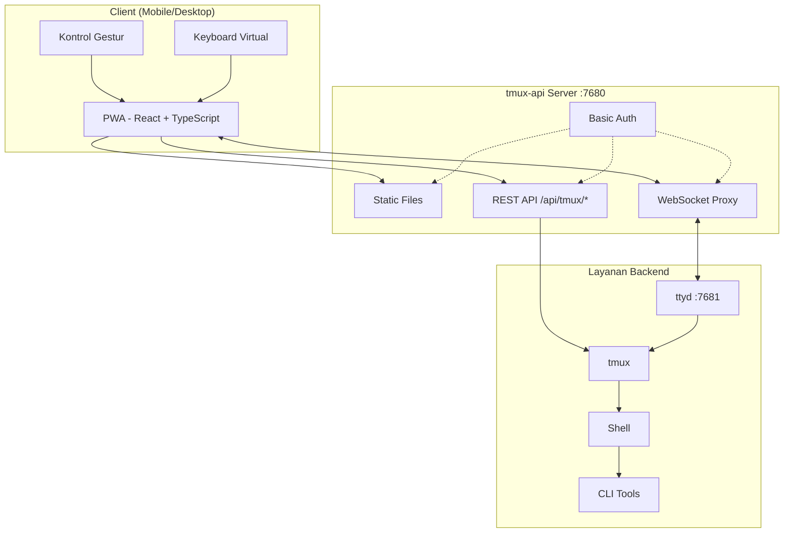
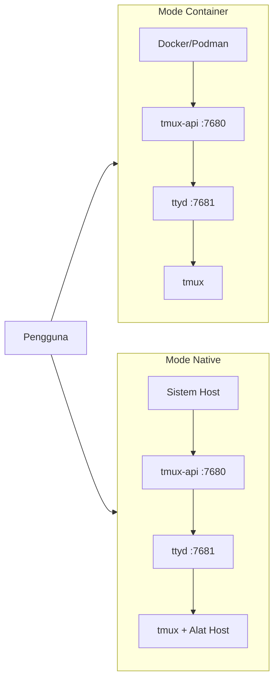

<p align="center">
  
</p>

<p align="center">
  <a href="https://github.com/lamngockhuong/termote/releases"></a>
  <a href="https://github.com/lamngockhuong/termote/actions/workflows/ci.yml"></a>
  <a href="https://github.com/lamngockhuong/termote/blob/main/LICENSE"></a>
  <a href="https://ghcr.io/lamngockhuong/termote"></a>
  <a href="https://hub.docker.com/r/lamngockhuong/termote"></a>
</p>

<p align="center">
  
  
  
  
</p>

<p align="center">
  <a href="https://launch.j2team.dev/products/termote?utm_source=badge-launched&utm_medium=badge&utm_campaign=badge-termote" target="_blank" rel="noopener noreferrer"></a>
  &nbsp;
  <a href="https://unikorn.vn/p/termote?ref=embed-termote" target="_blank"></a>
</p>

Kendalikan alat CLI (Claude Code, GitHub Copilot, terminal apa pun) dari jarak jauh melalui mobile/desktop via PWA.

> **Termote** = Terminal + Remote
>
> 🇬🇧 [English](README.md) | 🇻🇳 [Tiếng Việt](README.vi.md) | 🇨🇳 [简体中文](README.zh-CN.md) | 🇯🇵 [日本語](README.ja.md) | 🇰🇷 [한국어](README.ko.md) | 🇪🇸 [Español](README.es.md) | 🇧🇷 [Português (BR)](README.pt-BR.md) | 🇫🇷 [Français](README.fr.md) | 🇩🇪 [Deutsch](README.de.md) | 🇷🇺 [Русский](README.ru.md)

## Fitur

- **Pergantian session**: Banyak tmux sessions dengan buat/edit/hapus
- **Tab session**: Bilah tab horizontal untuk berpindah jendela dengan cepat
- **Ramah mobile**: Toolbar keyboard virtual (Tab/Ctrl/Shift/panah, dapat diperluas)
- **Dukungan gestur**: Geser untuk Ctrl+C, Tab, navigasi riwayat
- **Riwayat perintah**: Panggil ulang perintah yang pernah dikirim dengan pencarian
- **Aksi cepat**: Menu mengambang untuk operasi umum (clear, cancel, exit)
- **Indikator koneksi**: Status server real-time, deteksi otomatis koneksi terputus
- **Pemeriksa pembaruan**: Notifikasi otomatis versi baru dari GitHub releases
- **PWA**: Dapat dipasang di homescreen, tersedia offline
- **Session persisten**: tmux menjaga session tetap hidup
- **Sidebar dapat dilipat**: UI desktop dengan sidebar session yang bisa ditampilkan/disembunyikan
- **Mode layar penuh**: Pengalaman terminal secara layar penuh
- **Penyimpanan konfigurasi**: Otomatis menyimpan pengaturan instalasi dengan password terenkripsi AES-256

## Tangkapan Layar

<p align="center">
  
  &nbsp;&nbsp;
  
</p>

## Arsitektur



## Mulai Cepat

> 📖 **Baru mengenal Termote?** Lihat [Panduan Memulai](docs/getting-started.md) untuk panduan lengkap dengan contoh.

```bash
./scripts/termote.sh                   # Menu interaktif
./scripts/termote.sh install container # Mode container (docker/podman)
./scripts/termote.sh install native    # Mode native (alat host)
./scripts/termote.sh link              # Buat perintah 'termote' global
make test                              # Jalankan tes
```

> Setelah `link`, gunakan `termote` dari mana saja: `termote health`, `termote install native --lan`
>
> **Tips**: Instal [gum](https://github.com/charmbracelet/gum) untuk menu interaktif yang lebih baik (opsional, tersedia fallback bash)

## Instalasi

### Satu baris perintah (direkomendasikan)

**macOS/Linux:**

```bash
# Unduh dan tanya sebelum instal (default mode native)
curl -fsSL https://raw.githubusercontent.com/lamngockhuong/termote/main/scripts/get.sh | bash

# Instal otomatis tanpa bertanya
curl -fsSL .../get.sh | bash -s -- --yes

# Hanya unduh (tanpa instal)
curl -fsSL .../get.sh | bash -s -- --download-only

# Pembaruan otomatis dengan config tersimpan
curl -fsSL .../get.sh | bash -s -- --update

# Instal versi tertentu
curl -fsSL .../get.sh | bash -s -- --version 0.0.4

# Dengan mode dan opsi tertentu
curl -fsSL .../get.sh | bash -s -- --yes --container --lan
curl -fsSL .../get.sh | bash -s -- --yes --native --tailscale myhost

# Paksa password baru (abaikan config tersimpan)
curl -fsSL .../get.sh | bash -s -- --yes --container --fresh
```

**Windows (PowerShell):**

> **Catatan:** Jika eksekusi skrip dinonaktifkan di sistem Anda, jalankan perintah ini terlebih dahulu:
>
> ```powershell
> Set-ExecutionPolicy -Scope CurrentUser -ExecutionPolicy RemoteSigned
> ```

```powershell
# Unduh dan tanya sebelum instal (default mode native)
irm https://raw.githubusercontent.com/lamngockhuong/termote/main/scripts/get.ps1 | iex

# Instal otomatis tanpa bertanya
$env:TERMOTE_AUTO_YES = "true"; irm .../get.ps1 | iex

# Dengan mode tertentu
$env:TERMOTE_MODE = "container"; irm .../get.ps1 | iex

# Pembaruan otomatis dengan config tersimpan
$env:TERMOTE_UPDATE = "true"; irm .../get.ps1 | iex
```

### Docker

```bash
# Semua dalam satu (credentials otomatis, lihat logs: docker logs termote)
docker run -d --name termote -p 7680:7680 ghcr.io/lamngockhuong/termote:latest

# Dengan credentials khusus
docker run -d --name termote -p 7680:7680 \
  -e TERMOTE_USER=admin -e TERMOTE_PASS=secret \
  ghcr.io/lamngockhuong/termote:latest

# Tanpa autentikasi (hanya dev lokal)
docker run -d --name termote -p 7680:7680 \
  -e NO_AUTH=true \
  ghcr.io/lamngockhuong/termote:latest

# Dengan volume untuk penyimpanan
docker run -d --name termote -p 7680:7680 \
  -v termote-data:/home/termote \
  ghcr.io/lamngockhuong/termote:latest

# Mount direktori workspace khusus
docker run -d --name termote -p 7680:7680 \
  -v ~/projects:/workspace \
  ghcr.io/lamngockhuong/termote:latest

# Dengan Tailscale HTTPS (memerlukan Tailscale di host)
docker run -d --name termote -p 7680:7680 \
  -e TERMOTE_USER=admin -e TERMOTE_PASS=secret \
  ghcr.io/lamngockhuong/termote:latest
sudo tailscale serve --bg --https=443 http://127.0.0.1:7680
# Akses di: https://your-hostname.tailnet-name.ts.net
```

### Dari Release

```bash
# Unduh release terbaru
VERSION=$(curl -s https://api.github.com/repos/lamngockhuong/termote/releases/latest | grep tag_name | cut -d '"' -f4)
wget https://github.com/lamngockhuong/termote/releases/download/${VERSION}/termote-${VERSION}.tar.gz
tar xzf termote-${VERSION}.tar.gz
cd termote-${VERSION#v}

# Instal (menu interaktif atau dengan mode)
./scripts/termote.sh install
./scripts/termote.sh install container
```

### Dari Source

```bash
git clone https://github.com/lamngockhuong/termote.git
cd termote
./scripts/termote.sh install container
```

> **Catatan**: `termote.sh` adalah CLI terpadu yang mendukung `install` (build dari source, menggunakan artifacts yang tersedia jika ada), `uninstall`, dan `health`.

## Mode Deployment



| Mode          | Deskripsi      | Kasus Penggunaan                         | Platform     |
| ------------- | -------------- | ---------------------------------------- | ------------ |
| `--container` | Mode container | Deployment sederhana, lingkungan terisolasi | macOS, Linux |
| `--native`    | Semua native   | Akses alat host (claude, gh)             | macOS, Linux |

### Opsi

| Flag                        | Deskripsi                                            |
| --------------------------- | ---------------------------------------------------- |
| `--lan`                     | Buka akses LAN (default: hanya localhost)            |
| `--tailscale <host[:port]>` | Aktifkan Tailscale HTTPS                             |
| `--no-auth`                 | Nonaktifkan autentikasi dasar                        |
| `--port <port>`             | Port host (default: 7680, Windows: 7690)             |
| `--fresh`                   | Paksa prompt password baru (abaikan config tersimpan) |
| `--update`                  | Pembaruan otomatis dengan config tersimpan            |
| `--version <ver>`           | Instal versi tertentu (dengan atau tanpa `v`)        |

| Variabel Lingkungan | Deskripsi                                             |
| -------------------- | ----------------------------------------------------- |
| `WORKSPACE`          | Direktori host untuk mount (default: `./workspace`)   |
| `TERMOTE_USER`       | Username autentikasi (default: otomatis dibuat)       |
| `TERMOTE_PASS`       | Password autentikasi (default: otomatis dibuat)       |
| `NO_AUTH`            | Atur ke `true` untuk menonaktifkan autentikasi        |

### Mode Container (direkomendasikan untuk kemudahan)

Skrip otomatis mendeteksi `podman` atau `docker` -- keduanya bekerja sama.

```bash
./scripts/termote.sh install container             # localhost dengan basic auth
./scripts/termote.sh install container --no-auth   # localhost tanpa auth
./scripts/termote.sh install container --lan       # Dapat diakses via LAN
# Akses: http://localhost:7680

# Direktori workspace khusus (dimount ke /workspace di container)
WORKSPACE=~/projects ./scripts/termote.sh install container
WORKSPACE=/path/to/code make install-container
```

> **Catatan keamanan**: Hindari mount langsung `$HOME` -- direktori sensitif seperti `.ssh`, `.gnupg` akan dapat diakses di container. Mount direktori proyek tertentu saja.

### Native (direkomendasikan untuk akses binary host)

Gunakan ketika Anda memerlukan akses ke binary host (claude, git, dll.):

```bash
# Linux
sudo apt install ttyd tmux
# Atau: sudo snap install ttyd
./scripts/termote.sh install native

# macOS
brew install ttyd tmux go
./scripts/termote.sh install native
# Akses: http://localhost:7680
```

### Dengan Tailscale HTTPS (semua mode)

Menggunakan `tailscale serve` untuk HTTPS otomatis (tanpa manajemen sertifikat manual):

```bash
# Hanya Tailscale (port default 443)
./scripts/termote.sh install container --tailscale myhost.ts.net

# Port khusus
./scripts/termote.sh install native --tailscale myhost.ts.net:8765

# Tailscale + akses LAN
./scripts/termote.sh install container --tailscale myhost.ts.net --lan

# Akses: https://myhost.ts.net (atau :8765 untuk port khusus)
```

### Hapus Instalasi

```bash
./scripts/termote.sh uninstall container   # Mode container
./scripts/termote.sh uninstall native      # Mode native
./scripts/termote.sh uninstall all         # Semuanya
```

### Pembaruan

```bash
# Opsi 1: Pembaruan otomatis dengan config tersimpan
curl -fsSL .../get.sh | bash -s -- --update

# Opsi 2: Jalankan ulang one-liner (bandingkan versi, tanya sebelum instal)
curl -fsSL .../get.sh | bash

# Opsi 3: Pembaruan manual
./scripts/termote.sh uninstall [container|native]
git pull origin main                    # Jika diinstal dari source
./scripts/termote.sh install [container|native] [--lan] [--tailscale ...]
```

## Dukungan Platform

| Platform | Container          | Native             | CLI Script  |
| -------- | ------------------ | ------------------ | ----------- |
| Linux    | ✓                  | ✓                  | termote.sh  |
| macOS    | ✓                  | ✓                  | termote.sh  |
| Windows  | ⚠️ (eksperimental) | ⚠️ (eksperimental) | termote.ps1 |

> **⚠️ Dukungan Windows (Eksperimental)**: Dukungan Windows saat ini masih dalam tahap awal dan memerlukan pengujian lebih lanjut. Mode container memerlukan Docker Desktop, mode native memerlukan psmux. Silakan laporkan masalah di GitHub.

### Mode Native Windows

Mode native Windows menggunakan [psmux](https://github.com/psmux/psmux) (terminal multiplexer yang kompatibel dengan tmux untuk Windows):

```powershell
# Instal psmux
winget install psmux

# Jalankan Termote
.\scripts\termote.ps1 install native
.\scripts\termote.ps1 install container  # Atau mode container dengan Docker Desktop
```

## Penggunaan Mobile

| Aksi                | Gestur              |
| ------------------- | ------------------- |
| Batal/interupsi     | Geser kiri (Ctrl+C) |
| Tab completion      | Geser kanan         |
| Riwayat ke atas     | Geser ke atas       |
| Riwayat ke bawah    | Geser ke bawah      |
| Tempel              | Tekan lama          |
| Ukuran font         | Cubit masuk/keluar  |

Toolbar virtual menyediakan: Tab, Esc, Ctrl, Shift, tombol panah, dan kombinasi tombol umum. Mendukung kombinasi Ctrl+Shift (tempel, salin). Beralih antara mode minimal dan diperluas untuk tombol tambahan (Home, End, Delete, dll.).

## Struktur Proyek

```
termote/
├── Makefile                # Perintah build/test/deploy
├── Dockerfile              # Docker mode (tmux-api + ttyd)
├── docker-compose.yml
├── entrypoint.sh           # Docker entrypoint
├── docs/                   # Dokumentasi
│   └── images/screenshots/ # Tangkapan layar aplikasi
├── pwa/                    # React PWA
│   └── src/
│       ├── components/
│       ├── contexts/
│       ├── hooks/
│       ├── types/
│       └── utils/
├── tmux-api/               # Go server
│   ├── main.go             # Entry point
│   ├── serve.go            # Server (PWA, proxy, auth)
│   └── tmux.go             # tmux API handlers
├── scripts/
│   ├── termote.sh          # Unix CLI (install/uninstall/health)
│   ├── termote.ps1         # Windows PowerShell CLI
│   ├── get.sh              # Unix online installer (curl | bash)
│   └── get.ps1             # Windows online installer (irm | iex)
├── tests/                  # Suite tes
│   ├── test-termote.sh
│   ├── test-termote.ps1    # Tes Windows
│   ├── test-get.sh
│   └── test-entrypoints.sh
└── website/                # Situs docs Astro Starlight
    └── src/content/docs/   # Dokumentasi MDX
```

## Pengembangan

```bash
make build          # Build PWA dan tmux-api
make test           # Jalankan semua tes
make health         # Periksa health service
make clean          # Hentikan containers

# Tes E2E (memerlukan server yang berjalan)
./scripts/termote.sh install container  # Mulai server terlebih dahulu
cd pwa && pnpm test:e2e       # Jalankan tes Playwright
cd pwa && pnpm test:e2e:ui    # Jalankan dengan UI debugger
```

**Pengujian Manual:** Lihat [Daftar Periksa Self-Test](docs/self-test-checklist.md)

## Pemecahan Masalah

### Session tidak tersimpan

- Periksa tmux: `tmux ls`
- Verifikasi ttyd menggunakan flag `-A` (attach-or-create)

### Error WebSocket

- Periksa log tmux-api: `docker logs termote`
- Verifikasi ttyd berjalan di port 7681

### Masalah keyboard mobile

- Pastikan viewport meta tag tersedia
- Uji di perangkat nyata, bukan emulator

### Mode native: proses tidak berjalan

```bash
ps aux | grep ttyd         # Periksa apakah ttyd berjalan
ps aux | grep tmux-api     # Periksa apakah tmux-api berjalan
lsof -i :7680              # Verifikasi port sedang digunakan
```

## Catatan Keamanan

- **Default: hanya localhost** - tidak terbuka ke LAN kecuali menggunakan flag `--lan`
- **Basic auth aktif secara default** - gunakan `--no-auth` untuk menonaktifkan di dev lokal
- **Proteksi brute-force bawaan** - rate limiting (5 percobaan/menit per IP)
- Gunakan HTTPS (Tailscale) untuk production
- Batasi ke jaringan tepercaya/VPN

## Proyek Lainnya

| Proyek | Deskripsi |
|--------|-----------|
| [GitHub Flex](https://github.com/lamngockhuong/github-flex) | Ekstensi lintas browser (Chrome & Firefox) yang meningkatkan antarmuka GitHub dengan fitur produktivitas |
| [TabRest](https://github.com/lamngockhuong/tabrest) | Ekstensi Chrome yang secara otomatis melepaskan tab tidak aktif untuk membebaskan memori |

## Lisensi

MIT
