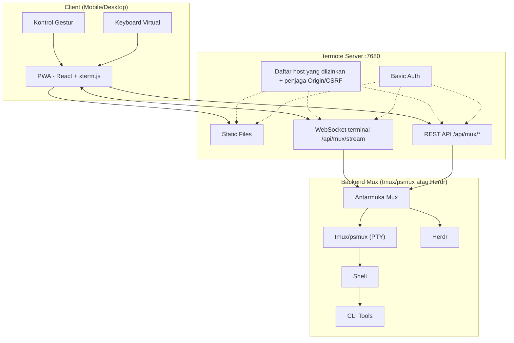
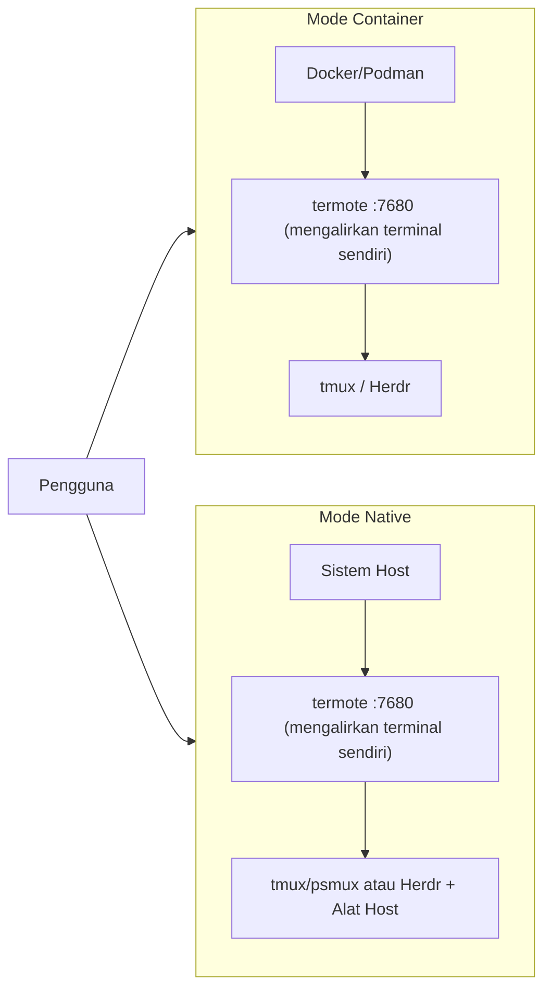

<p align="center">
  
</p>

<p align="center">
  <a href="https://github.com/lamngockhuong/termote/releases"></a>
  <a href="https://github.com/lamngockhuong/termote/actions/workflows/ci.yml"></a>
  <a href="https://github.com/lamngockhuong/termote/blob/main/LICENSE"></a>
  <a href="https://ghcr.io/lamngockhuong/termote"></a>
  <a href="https://hub.docker.com/r/lamngockhuong/termote"></a>
</p>

<p align="center">
  
  
  
  
</p>

<p align="center">
  <a href="https://launch.j2team.dev/products/termote?utm_source=badge-launched&utm_medium=badge&utm_campaign=badge-termote" target="_blank" rel="noopener noreferrer"></a>
  &nbsp;
  <a href="https://unikorn.vn/p/termote?ref=embed-termote" target="_blank"></a>
</p>

Kendalikan alat CLI (Claude Code, GitHub Copilot, terminal apa pun) dari jarak jauh melalui mobile/desktop via PWA.

> [!NOTE]
> Termote 1.0 tidak meng-upgrade instalasi 0.x. Hapus instalasi 0.x sesuai
> [dokumentasi 0.x yang diarsipkan](https://termote.ohnice.app/0.x/), lalu pasang 1.0 dengan
> perintah di [Mulai Cepat](#mulai-cepat).

> **Termote** = Terminal + Remote
>
> 🇬🇧 [English](README.md) | 🇻🇳 [Tiếng Việt](README.vi.md) | 🇨🇳 [简体中文](README.zh-CN.md) | 🇯🇵 [日本語](README.ja.md) | 🇰🇷 [한국어](README.ko.md) | 🇪🇸 [Español](README.es.md) | 🇧🇷 [Português (BR)](README.pt-BR.md) | 🇫🇷 [Français](README.fr.md) | 🇩🇪 [Deutsch](README.de.md) | 🇷🇺 [Русский](README.ru.md)

## Fitur

- **Pergantian session**: Banyak tmux sessions dengan buat/edit/hapus
- **Tab session**: Bilah tab horizontal untuk berpindah jendela dengan cepat
- **Backend Herdr** (native atau di dalam container): kendalikan workspace Herdr sebagai pengganti tmux, dengan lencana status coding agent di setiap pane — lihat [Instalasi Native](https://termote.ohnice.app/installation/native/)
- **Ramah mobile**: Toolbar keyboard virtual (Tab/Ctrl/Shift/panah, dapat diperluas)
- **Dukungan gestur**: Geser untuk Ctrl+C, Tab, menggulir
- **Riwayat perintah**: Panggil ulang perintah yang pernah dikirim dengan pencarian
- **Aksi cepat**: Menu mengambang untuk operasi umum (clear, cancel, exit)
- **Indikator koneksi**: Status server real-time, deteksi otomatis koneksi terputus
- **Pemeriksa pembaruan**: Notifikasi otomatis versi baru dari GitHub releases
- **PWA**: Dapat dipasang di homescreen, tersedia offline
- **Session persisten**: tmux menjaga session tetap hidup
- **Sidebar dapat dilipat**: UI desktop dengan sidebar session yang bisa ditampilkan/disembunyikan
- **Mode layar penuh**: Pengalaman terminal secara layar penuh
- **Berjalan sebagai service**: `termote start` mendaftarkan service pengguna (systemd, launchd, Scheduled Task) yang berjalan saat login
- **Penyimpanan konfigurasi**: `termote start` menyimpan opsinya, dengan password tersimpan terenkripsi

## Tangkapan Layar

<p align="center">
  
  &nbsp;&nbsp;
  
</p>

## Arsitektur


```mermaid
flowchart TB
    subgraph Client["Client (Mobile/Desktop)"]
        PWA["PWA - React + xterm.js"]
        Gestures["Kontrol Gestur"]
        Keyboard["Keyboard Virtual"]
    end

    subgraph Server["termote Server :7680"]
        Static["Static Files"]
        Stream["WebSocket terminal /api/mux/stream"]
        API["REST API /api/mux/*"]
        Guard["Daftar host yang diizinkan + penjaga Origin/CSRF"]
        Auth["Basic Auth"]
    end

    subgraph Backend["Backend Mux (tmux/psmux atau Herdr)"]
        Mux["Antarmuka Mux"]
        tmux["tmux/psmux (PTY)"]
        herdr["Herdr"]
        Shell["Shell"]
        Tools["CLI Tools"]
    end

    Gestures --> PWA
    Keyboard --> PWA
    PWA --> Static
    PWA <--> Stream
    PWA --> API
    Guard -.-> Static & Stream & API
    Auth -.-> Static & Stream & API
    Stream --> Mux
    API --> Mux
    Mux --> tmux & herdr
    tmux --> Shell --> Tools
```

termote mengalirkan terminal sendiri (PTY di Unix, ConPTY di Windows) ke xterm.js di PWA; tidak ada lagi proses terminal terpisah yang perlu di-proxy. Model lengkap penjagaan request ada di [`docs/system-architecture.md`](docs/system-architecture.md).

## Mulai Cepat

> 📖 **Baru mengenal Termote?** Lihat [Panduan Memulai](docs/getting-started.md) untuk panduan lengkap beserta contoh.

**Linux / macOS:**

```bash
curl -fsSL https://termote.ohnice.app/install.sh | sh
termote start
```

**Windows (PowerShell):**

```powershell
irm https://termote.ohnice.app/install.ps1 | iex
termote start
```

Installer hanya membutuhkan `curl`, `tar` dan `sha256sum`/`shasum` (PowerShell di Windows), tanpa sudo atau hak admin. Installer memverifikasi checksum arsip, memasang perintah `termote`, dan tidak menjalankan apa pun. `termote start` menyimpan opsi, membuat password saat pertama kali (ditampilkan sekali; `termote show-password` menampilkannya lagi), mendaftarkan service lalu menjalankannya. Buka `http://localhost:7680` (Windows: `http://localhost:7690`).

Backend terminal harus sudah terpasang lebih dulu: tmux (`sudo apt install tmux`, `brew install tmux`), psmux di Windows (`winget install psmux`), atau [Herdr](https://termote.ohnice.app/installation/native/). `start` yang pertama mendeteksi backend mana yang dipakai.

### Opsi umum

```bash
termote start --lan                  # Listen on the LAN, not only this machine
termote start --tailscale myhost.ts.net  # Publish over Tailscale HTTPS
termote start --mux herdr            # Drive Herdr workspaces instead of tmux
termote start --no-auth              # Disable basic auth (local use only)
```

Opsi disimpan: flag yang tidak diberikan tetap memakai nilai tersimpannya, dan opsi boolean dimatikan dengan `=false` (`termote start --lan=false`). Flag-nya sama di semua OS, termasuk PowerShell.

### Perintah sehari-hari

```bash
termote status                       # What the running server reports
termote stop                         # Stop (it starts again at the next login)
termote restart                      # Restart with the saved options
termote logs follow                  # Tail the logs
termote show-password                # Print the saved admin password
termote update                       # Update to the latest release
termote uninstall                    # Remove the service, the command and the install
```

`update` beralih ke versi baru, me-restart service, dan kembali ke versi sebelumnya jika versi baru tidak berjalan. `uninstall` tetap menyimpan konfigurasi (`~/.config/termote`) dan log (`~/.local/state/termote`) serta menampilkan kedua path tersebut.

## Instalasi

### Menetapkan versi

```bash
curl -fsSL https://termote.ohnice.app/install.sh | TERMOTE_VERSION=1.0.0 sh
termote update --version 1.0.0
```

```powershell
$env:TERMOTE_VERSION='1.0.0'; irm https://termote.ohnice.app/install.ps1 | iex
```

Tanpa `TERMOTE_VERSION`, installer mengambil rilis stabil 1.x terbaru dan tidak mengubah instalasi yang sudah ada. Dengan variabel itu, versi tersebut dipasang di samping versi saat ini dan menjadi versi aktif, sekaligus cara untuk memperbaiki instalasi yang rusak.

### Mode Container

```bash
termote container up                          # Run the published image (podman or docker)
termote container up --workspace ~/projects   # Mount a directory at /workspace
termote container status
termote container logs -f
termote container down
```

`container up` menjalankan `ghcr.io/lamngockhuong/termote` pada versi `termote` yang terpasang, dengan podman (diutamakan) atau docker, di port 7680 dengan `~/termote-workspace` di-mount ke `/workspace`. Perintah ini menerima `--port`, `--lan`, `--tailscale`, `--no-auth`, `--allow-host` dan `--fresh`, yang disimpan terpisah dari opsi `start`; password-nya sama dengan server native. Docker menjalankan ulang container setelah reboot; Podman rootless tidak punya daemon untuk itu, jadi jalankan sebagai unit Quadlet.

> **Catatan keamanan**: Hindari mount `$HOME` secara langsung — direktori sensitif seperti `.ssh`, `.gnupg` akan dapat diakses di dalam container. Mount direktori proyek tertentu saja.

### Docker tanpa CLI

```bash
# Generates a password, printed in: docker logs termote
docker run -d --name termote -p 7680:7680 \
  -v ~/projects:/workspace \
  ghcr.io/lamngockhuong/termote:latest

# With your own credentials
docker run -d --name termote -p 7680:7680 \
  -e TERMOTE_USER=admin -e TERMOTE_PASS=secret \
  ghcr.io/lamngockhuong/termote:latest
```

| Variabel Lingkungan | Deskripsi                                         |
| ------------------- | ------------------------------------------------- |
| `TERMOTE_USER`      | Username basic auth (default: `admin`)            |
| `TERMOTE_PASS`      | Password basic auth (default: dibuat otomatis)    |
| `NO_AUTH`           | Isi dengan `true` untuk menonaktifkan autentikasi |

### Build dari source

```bash
git clone https://github.com/lamngockhuong/termote.git
cd termote
make build
./scripts/termote.sh start
```

`make build` mem-build PWA dan menyematkannya ke `server/termote`; dibutuhkan Go, Node.js dan pnpm. `scripts/termote.sh` (Windows: `scripts\termote.ps1`) hanya menjalankan checkout: skrip ini mem-build ulang binary pengembangan jika ada source yang lebih baru, lalu menjalankannya dengan argumen yang sama. `termote update` menolak berjalan di dalam checkout; gunakan `git pull && make build`.

### Upgrade dari 0.x

Tidak ada upgrade dari 0.x: 1.0 terpasang di lokasi baru dan tidak membaca konfigurasi 0.x. Hapus instalasi 0.x sesuai [dokumentasi 0.x yang diarsipkan](https://termote.ohnice.app/0.x/), lalu pasang 1.0 dengan perintah di atas.

## Mode Deployment


```mermaid
flowchart LR
    subgraph Container["Mode Container"]
        direction TB
        C1["Docker/Podman"] --> C2["termote :7680 (mengalirkan terminal sendiri)"] --> C3["tmux / Herdr"]
    end

    subgraph Native["Mode Native"]
        direction TB
        N1["Sistem Host"] --> N2["termote :7680 (mengalirkan terminal sendiri)"] --> N3["tmux/psmux atau Herdr + Alat Host"]
    end

    User["Pengguna"] --> Container & Native
```

| Mode      | Perintah               | Kasus Penggunaan             | Platform              |
| --------- | ---------------------- | ---------------------------- | --------------------- |
| Native    | `termote start`        | Akses alat host (claude, gh) | macOS, Linux, Windows |
| Container | `termote container up` | Lingkungan terisolasi        | macOS, Linux, Windows |

Server native berjalan sebagai service pengguna: unit systemd user di Linux (proses terpisah jika tidak ada systemd user, misalnya WSL2 tanpa systemd), agent launchd di macOS, dan Scheduled Task saat logon di Windows.

### Opsi `start`

| Flag                        | Deskripsi                                                                                  |
| --------------------------- | ------------------------------------------------------------------------------------------ |
| `--port <port>`             | Port (default: 7680, Windows: 7690)                                                        |
| `--lan[=false]`             | Mendengarkan di semua interface (default: hanya localhost)                                 |
| `--tailscale <host[:port]>` | Publikasikan melalui Tailscale HTTPS (port default 443)                                    |
| `--no-tailscale`            | Berhenti memublikasikan melalui Tailscale                                                  |
| `--no-auth[=false]`         | Nonaktifkan basic authentication                                                           |
| `--mux <tmux\|herdr>`       | Backend terminal (default: herdr jika sedang berjalan, selain itu tmux)                    |
| `--allow-host <name>`       | Izinkan nilai header Host tambahan (dapat diulang; tanpa wildcard, lihat catatan keamanan) |
| `--remove-host <name>`      | Hapus nama Host yang diizinkan (dapat diulang)                                             |
| `--allow-herdr-no-auth`     | Wajib bersama `--mux herdr --no-auth`                                                      |
| `--fresh`                   | Buat password baru                                                                         |

### Dengan Tailscale HTTPS

Menggunakan `tailscale serve` untuk HTTPS otomatis (tanpa mengelola sertifikat secara manual):

```bash
termote start --tailscale myhost.ts.net                # Default port 443
termote start --tailscale myhost.ts.net:8765           # Custom port
termote container up --tailscale myhost.ts.net         # Container mode
sudo tailscale set --operator=$USER                    # Linux, once: let termote run tailscale serve
```

Pemetaan diterapkan setiap kali server dijalankan. `stop`, `start --no-tailscale` dan `uninstall` hanya menghapus pemetaan milik Termote sendiri.

## Dukungan Platform

| Platform | Container | Native | Installer     |
| -------- | --------- | ------ | ------------- |
| Linux    | ✓         | ✓      | `install.sh`  |
| macOS    | ✓         | ✓      | `install.sh`  |
| Windows  | ✓         | ✓      | `install.ps1` |

> **Dukungan Windows**: Mode container membutuhkan Docker Desktop atau Podman Desktop; mode native membutuhkan [psmux](https://github.com/psmux/psmux) (terminal multiplexer yang kompatibel dengan tmux untuk Windows), dipasang dengan `winget install psmux`, atau server [Herdr](https://herdr.dev/#install) yang sedang berjalan. Service di Windows belum diverifikasi di mesin sungguhan; laporkan masalah apa pun di GitHub.

## Penggunaan Mobile

| Aksi            | Gestur              |
| --------------- | ------------------- |
| Batal/interupsi | Geser kiri (Ctrl+C) |
| Tab completion  | Geser kanan         |
| Gulir ke bawah  | Geser ke atas       |
| Gulir ke atas   | Geser ke bawah      |
| Tempel          | Tekan lama          |
| Ukuran font     | Cubit masuk/keluar  |

Toolbar virtual menyediakan: Tab, Esc, Ctrl, Shift, tombol panah, dan kombinasi tombol umum. Mendukung kombinasi Ctrl+Shift (tempel, salin). Beralih antara mode minimal dan diperluas untuk tombol tambahan (Home, End, Delete, dll.).

## Struktur Proyek

```
termote/
├── Makefile                # Build/test/run commands
├── Dockerfile              # Container image (termote + tmux + herdr)
├── docker-compose.yml      # Development from a checkout only
├── entrypoint.sh           # Container entrypoint
├── docs/                   # Documentation
│   └── images/screenshots/ # App screenshots
├── pwa/                    # React PWA
│   └── src/
│       ├── components/
│       ├── contexts/
│       ├── hooks/
│       ├── types/
│       └── utils/
├── server/                 # Go server + CLI (single binary)
│   ├── main.go             # Entry point (no args = menu, `serve` = server, else CLI)
│   ├── serve.go            # Server (PWA, auth, guards)
│   ├── mux.go              # Mux interface + /api/mux/* routes
│   ├── mux_tmux.go         # tmux/psmux backend
│   ├── mux_herdr.go        # Herdr backend
│   ├── stream.go           # Terminal WebSocket (xterm.js stream)
│   ├── cli*.go             # start/stop/update/container/logs/menu subcommands
│   └── webui/              # PWA embedded in the binary (filled by make build)
├── scripts/
│   ├── install.sh          # Unix online installer (curl | sh)
│   ├── install.ps1         # Windows online installer (irm | iex)
│   ├── termote.sh          # Unix shim: builds and runs a checkout
│   └── termote.ps1         # Windows PowerShell shim: builds and runs a checkout
├── tests/                  # Test suite
│   ├── test-termote.sh     # Unix shim tests
│   ├── test-termote.ps1    # Windows shim tests
│   ├── test-install.sh     # Unix installer tests
│   ├── test-install.ps1    # Windows installer tests
│   └── test-entrypoints.sh # Container entrypoint tests
└── website/                # Astro Starlight docs site
    └── src/content/docs/   # MDX documentation
```

## Pengembangan

```bash
make build          # Build the PWA and embed it in server/termote
make test           # Run all tests
make health         # Check service health
make clean          # Stop containers

# E2E tests (requires running server)
./scripts/termote.sh start           # Start server first
pnpm --filter termote test:e2e       # Run Playwright tests
pnpm --filter termote test:e2e:ui    # Run with UI debugger
```

**Pengujian Manual:** Lihat [Self-Test Checklist](docs/self-test-checklist.md)

## Pemecahan Masalah

### Session tidak tersimpan

- Periksa tmux: `tmux ls`
- termote melakukan attach dengan `tmux new-session -A` (attach-or-create)

### Error WebSocket

- Periksa log termote: `termote container logs` (container) atau `termote logs server` (native)
- WebSocket terminal adalah `/api/mux/stream`, dilayani langsung oleh termote — tidak ada proses terminal terpisah yang perlu diperiksa

### Masalah keyboard mobile

- Pastikan meta tag viewport tersedia
- Uji di perangkat nyata, bukan emulator

### Mode native: server tidak berjalan

```bash
termote status             # What the running server reports
termote logs server        # Or: termote logs follow
lsof -i :7680              # Check what holds the port
termote start --fresh      # If the saved password can no longer be read
```

## Catatan Keamanan

- **Default: hanya localhost** - tidak diekspos ke LAN kecuali flag `--lan` digunakan
- **Basic auth aktif secara default** - gunakan `--no-auth` untuk menonaktifkannya saat pengembangan lokal; password dibuat oleh `termote start` yang pertama dan disimpan terenkripsi
- **Allowlist Host**: request dengan header `Host` yang tidak dikenal ditolak (perlindungan DNS rebinding); tambahkan nama tepercaya dengan `--allow-host`, tidak ada wildcard untuk mematikan pemeriksaan ini
- **Guard Origin/CSRF**: request `/api/mux/*` yang mengubah state dan WebSocket `/api/mux/stream` menolak `Sec-Fetch-Site`/`Origin` lintas situs dan mewajibkan stream token sekali pakai dari origin yang sama
- **Perlindungan brute-force bawaan** - pembatasan laju (5 percobaan/menit per IP)
- **Backend Herdr**: mengekspos setiap workspace Herdr di host, sehingga `--mux herdr --no-auth` ditolak kecuali `--allow-herdr-no-auth` juga diberikan
- **File service tidak menyimpan rahasia**: unit systemd, agent launchd, dan Scheduled Task tidak pernah berisi password
- Gunakan HTTPS (Tailscale) untuk produksi
- Batasi ke jaringan tepercaya/VPN

## Proyek Lainnya

| Proyek                                                      | Deskripsi                                                                                                                                    |
| ----------------------------------------------------------- | -------------------------------------------------------------------------------------------------------------------------------------------- |
| [GitHub Flex](https://github.com/lamngockhuong/github-flex) | Ekstensi lintas browser (Chrome & Firefox) yang meningkatkan antarmuka GitHub dengan fitur produktivitas                                     |
| [TabRest](https://github.com/lamngockhuong/tabrest)         | Ekstensi Chrome yang secara otomatis melepaskan tab tidak aktif untuk membebaskan memori                                                     |
| [Specpin](https://github.com/lamngockhuong/specpin)         | Menyematkan spesifikasi bisnis hidup yang diversikan dengan Git ke elemen antarmuka web yang sedang berjalan (ekstensi browser + Go sidecar) |

## Lisensi

MIT
