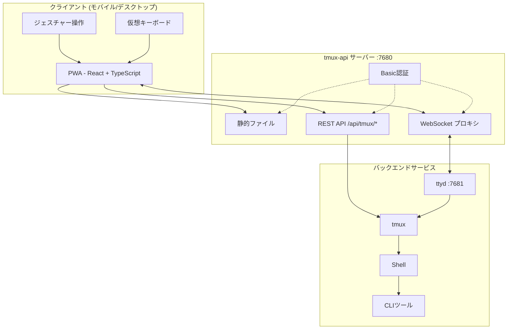
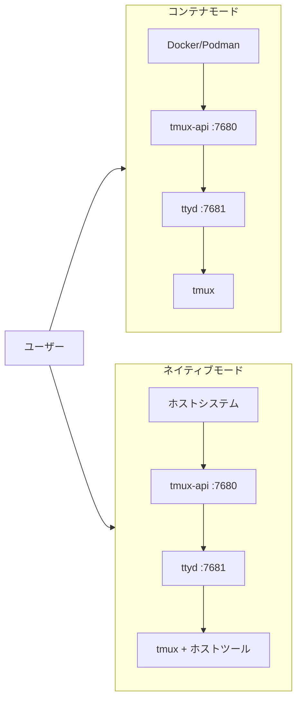

<p align="center">
  
</p>

<p align="center">
  <a href="https://github.com/lamngockhuong/termote/releases"></a>
  <a href="https://github.com/lamngockhuong/termote/actions/workflows/ci.yml"></a>
  <a href="https://github.com/lamngockhuong/termote/blob/main/LICENSE"></a>
  <a href="https://ghcr.io/lamngockhuong/termote"></a>
  <a href="https://hub.docker.com/r/lamngockhuong/termote"></a>
</p>

<p align="center">
  
  
  
  
</p>

<p align="center">
  <a href="https://launch.j2team.dev/products/termote?utm_source=badge-launched&utm_medium=badge&utm_campaign=badge-termote" target="_blank" rel="noopener noreferrer"></a>
  &nbsp;
  <a href="https://unikorn.vn/p/termote?ref=embed-termote" target="_blank"></a>
</p>

モバイル/デスクトップからPWA経由でCLIツール（Claude Code、GitHub Copilot、あらゆるターミナル）をリモート操作。

> **Termote** = Terminal + Remote
>
> 🇬🇧 [English](README.md) | 🇻🇳 [Tiếng Việt](README.vi.md) | 🇨🇳 [简体中文](README.zh-CN.md) | 🇰🇷 [한국어](README.ko.md) | 🇪🇸 [Español](README.es.md) | 🇧🇷 [Português (BR)](README.pt-BR.md) | 🇫🇷 [Français](README.fr.md) | 🇩🇪 [Deutsch](README.de.md) | 🇷🇺 [Русский](README.ru.md) | 🇮🇩 [Bahasa Indonesia](README.id.md)

## 機能

- **セッション切り替え**: 作成/編集/削除が可能な複数のtmuxセッション
- **セッションタブ**: ウィンドウをすばやく切り替えるための水平タブバー
- **モバイル対応**: 仮想キーボードツールバー（Tab/Ctrl/Shift/矢印キー、展開可能）
- **ジェスチャー操作**: スワイプでCtrl+C、Tab、履歴ナビゲーション
- **コマンド履歴**: 検索機能付きの送信済みコマンド呼び出し
- **クイックアクション**: よく使う操作（clear、cancel、exit）のフローティングメニュー
- **接続インジケーター**: リアルタイムのサーバー状態表示と切断自動検出
- **アップデートチェック**: GitHub releasesからの新バージョン自動通知
- **PWA**: ホーム画面にインストール可能、オフライン対応
- **永続セッション**: tmuxがセッションを維持
- **折りたたみ可能なサイドバー**: トグル式セッションサイドバー付きデスクトップUI
- **フルスクリーンモード**: 没入型ターミナル体験
- **設定の永続化**: AES-256暗号化パスワードによるインストール設定の自動保存

## スクリーンショット

<p align="center">
  
  &nbsp;&nbsp;
  
</p>

## アーキテクチャ



## クイックスタート

> 📖 **Termote初めてですか？** 詳しい手順と例については[はじめにガイド](docs/getting-started.md)をご覧ください。

```bash
./scripts/termote.sh                   # インタラクティブメニュー
./scripts/termote.sh install container # コンテナモード (docker/podman)
./scripts/termote.sh install native    # ネイティブモード (ホストツール)
./scripts/termote.sh link              # 'termote' グローバルコマンドを作成
make test                              # テストを実行
```

> `link`後は、どこからでも`termote`を使用可能: `termote health`, `termote install native --lan`

> **ヒント**: [gum](https://github.com/charmbracelet/gum)をインストールすると、より美しいインタラクティブメニューが利用可能（オプション、bashフォールバックあり）

## インストール

### ワンライナー（推奨）

**macOS/Linux:**

```bash
# ダウンロードしてインストール前に確認（デフォルトはnativeモード）
curl -fsSL https://raw.githubusercontent.com/lamngockhuong/termote/main/scripts/get.sh | bash

# 確認なしで自動インストール
curl -fsSL .../get.sh | bash -s -- --yes

# ダウンロードのみ（インストールなし）
curl -fsSL .../get.sh | bash -s -- --download-only

# 保存済み設定で自動アップデート
curl -fsSL .../get.sh | bash -s -- --update

# 特定バージョンをインストール
curl -fsSL .../get.sh | bash -s -- --version 0.0.4

# モードとオプションを明示的に指定
curl -fsSL .../get.sh | bash -s -- --yes --container --lan
curl -fsSL .../get.sh | bash -s -- --yes --native --tailscale myhost

# 新しいパスワードを強制（保存済み設定を無視）
curl -fsSL .../get.sh | bash -s -- --yes --container --fresh
```

**Windows (PowerShell):**

> **注意:** システムでスクリプト実行が無効な場合、先に以下を実行してください:
>
> ```powershell
> Set-ExecutionPolicy -Scope CurrentUser -ExecutionPolicy RemoteSigned
> ```

```powershell
# ダウンロードしてインストール前に確認（デフォルトはnativeモード）
irm https://raw.githubusercontent.com/lamngockhuong/termote/main/scripts/get.ps1 | iex

# 確認なしで自動インストール
$env:TERMOTE_AUTO_YES = "true"; irm .../get.ps1 | iex

# モードを明示的に指定
$env:TERMOTE_MODE = "container"; irm .../get.ps1 | iex

# 保存済み設定で自動アップデート
$env:TERMOTE_UPDATE = "true"; irm .../get.ps1 | iex
```

### Docker

```bash
# オールインワン（認証情報自動生成、ログ確認: docker logs termote）
docker run -d --name termote -p 7680:7680 ghcr.io/lamngockhuong/termote:latest

# カスタム認証情報
docker run -d --name termote -p 7680:7680 \
  -e TERMOTE_USER=admin -e TERMOTE_PASS=secret \
  ghcr.io/lamngockhuong/termote:latest

# 認証なし（ローカル開発のみ）
docker run -d --name termote -p 7680:7680 \
  -e NO_AUTH=true \
  ghcr.io/lamngockhuong/termote:latest

# 永続化用ボリューム付き
docker run -d --name termote -p 7680:7680 \
  -v termote-data:/home/termote \
  ghcr.io/lamngockhuong/termote:latest

# カスタムワークスペースディレクトリをマウント
docker run -d --name termote -p 7680:7680 \
  -v ~/projects:/workspace \
  ghcr.io/lamngockhuong/termote:latest

# Tailscale HTTPS付き（ホストにTailscaleが必要）
docker run -d --name termote -p 7680:7680 \
  -e TERMOTE_USER=admin -e TERMOTE_PASS=secret \
  ghcr.io/lamngockhuong/termote:latest
sudo tailscale serve --bg --https=443 http://127.0.0.1:7680
# アクセス: https://your-hostname.tailnet-name.ts.net
```

### リリースから

```bash
# 最新リリースをダウンロード
VERSION=$(curl -s https://api.github.com/repos/lamngockhuong/termote/releases/latest | grep tag_name | cut -d '"' -f4)
wget https://github.com/lamngockhuong/termote/releases/download/${VERSION}/termote-${VERSION}.tar.gz
tar xzf termote-${VERSION}.tar.gz
cd termote-${VERSION#v}

# インストール（インタラクティブメニューまたはモード指定）
./scripts/termote.sh install
./scripts/termote.sh install container
```

### ソースから

```bash
git clone https://github.com/lamngockhuong/termote.git
cd termote
./scripts/termote.sh install container
```

> **注**: `termote.sh`は`install`（ソースからビルド、利用可能な場合はビルド済みアーティファクトを使用）、`uninstall`、`health`コマンドをサポートする統合CLIです。

## デプロイモード



| モード        | 説明             | ユースケース                     | プラットフォーム |
| ------------- | ---------------- | ------------------------------- | ------------ |
| `--container` | コンテナモード    | シンプルなデプロイ、隔離環境      | macOS, Linux |
| `--native`    | 全てネイティブ    | ホストツールへのアクセス (claude, gh) | macOS, Linux |

### オプション

| フラグ                      | 説明                                            |
| --------------------------- | ----------------------------------------------- |
| `--lan`                     | LANに公開（デフォルト: localhostのみ）           |
| `--tailscale <host[:port]>` | Tailscale HTTPSを有効化                         |
| `--no-auth`                 | Basic認証を無効化                                |
| `--port <port>`             | ホストポート（デフォルト: 7680、Windows: 7690）   |
| `--fresh`                   | 新しいパスワードを強制（保存済み設定を無視）       |
| `--update`                  | 保存済み設定で自動アップデート                    |
| `--version <ver>`           | 特定バージョンをインストール（`v`有無どちらも可）  |

| 環境変数         | 説明                                             |
| ---------------- | ------------------------------------------------ |
| `WORKSPACE`      | マウントするホストディレクトリ（デフォルト: `./workspace`） |
| `TERMOTE_USER`   | Basic認証ユーザー名（デフォルト: 自動生成）       |
| `TERMOTE_PASS`   | Basic認証パスワード（デフォルト: 自動生成）       |
| `NO_AUTH`        | `true`に設定して認証を無効化                      |

### コンテナモード（シンプルさ重視の推奨）

スクリプトは`podman`または`docker`を自動検出 — どちらも同じように動作します。

```bash
./scripts/termote.sh install container             # localhostでbasic auth付き
./scripts/termote.sh install container --no-auth   # localhostで認証なし
./scripts/termote.sh install container --lan       # LANアクセス可能
# アクセス: http://localhost:7680

# カスタムワークスペースディレクトリ（コンテナ内の/workspaceにマウント）
WORKSPACE=~/projects ./scripts/termote.sh install container
WORKSPACE=/path/to/code make install-container
```

> **セキュリティ注意**: `$HOME`を直接マウントしないでください — `.ssh`、`.gnupg`などの機密ディレクトリがコンテナ内からアクセス可能になります。代わりに特定のプロジェクトディレクトリをマウントしてください。

### ネイティブ（ホストバイナリアクセスの推奨）

ホストバイナリ（claude、gitなど）へのアクセスが必要な場合に使用:

```bash
# Linux
sudo apt install ttyd tmux
# または: sudo snap install ttyd
./scripts/termote.sh install native

# macOS
brew install ttyd tmux go
./scripts/termote.sh install native
# アクセス: http://localhost:7680
```

### Tailscale HTTPS付き（全モード）

`tailscale serve`で自動HTTPS（手動の証明書管理不要）:

```bash
# Tailscaleのみ（デフォルトポート443）
./scripts/termote.sh install container --tailscale myhost.ts.net

# カスタムポート
./scripts/termote.sh install native --tailscale myhost.ts.net:8765

# Tailscale + LANアクセス可能
./scripts/termote.sh install container --tailscale myhost.ts.net --lan

# アクセス: https://myhost.ts.net（カスタムポートの場合は :8765）
```

### アンインストール

```bash
./scripts/termote.sh uninstall container   # コンテナモード
./scripts/termote.sh uninstall native      # ネイティブモード
./scripts/termote.sh uninstall all         # 全て
```

### アップデート

```bash
# 方法1: 保存済み設定で自動アップデート
curl -fsSL .../get.sh | bash -s -- --update

# 方法2: ワンライナーを再実行（バージョン比較、インストール前に確認）
curl -fsSL .../get.sh | bash

# 方法3: 手動アップデート
./scripts/termote.sh uninstall [container|native]
git pull origin main                    # ソースからインストールした場合
./scripts/termote.sh install [container|native] [--lan] [--tailscale ...]
```

## プラットフォームサポート

| プラットフォーム | コンテナ       | ネイティブ     | CLIスクリプト |
| --------------- | -------------- | -------------- | ----------- |
| Linux           | ✓              | ✓              | termote.sh  |
| macOS           | ✓              | ✓              | termote.sh  |
| Windows         | ⚠️ (実験的)     | ⚠️ (実験的)     | termote.ps1 |

> **⚠️ Windowsサポート（実験的）**: Windowsサポートは現在初期段階であり、さらなるテストが必要です。コンテナモードにはDocker Desktopが、ネイティブモードにはpsmuxが必要です。問題はGitHubで報告してください。

### Windows ネイティブモード

Windowsネイティブモードは[psmux](https://github.com/psmux/psmux)（Windows用tmux互換ターミナルマルチプレクサ）を使用します:

```powershell
# psmuxをインストール
winget install psmux

# Termoteを実行
.\scripts\termote.ps1 install native
.\scripts\termote.ps1 install container  # またはDocker Desktopでコンテナモード
```

## モバイルでの使い方

| 操作             | ジェスチャー        |
| ---------------- | ------------------- |
| キャンセル/中断   | 左スワイプ (Ctrl+C) |
| Tab補完          | 右スワイプ          |
| 履歴を上に        | 上スワイプ          |
| 履歴を下に        | 下スワイプ          |
| ペースト          | 長押し              |
| フォントサイズ    | ピンチイン/アウト    |

仮想ツールバーが提供するキー: Tab、Esc、Ctrl、Shift、矢印キー、よく使うキーの組み合わせ。Ctrl+Shiftの組み合わせ（ペースト、コピー）に対応。最小モードと展開モードの切り替えで追加キー（Home、End、Deleteなど）が利用可能。

## プロジェクト構成

```
termote/
├── Makefile                # ビルド/テスト/デプロイコマンド
├── Dockerfile              # Dockerモード (tmux-api + ttyd)
├── docker-compose.yml
├── entrypoint.sh           # Dockerエントリーポイント
├── docs/                   # ドキュメント
│   └── images/screenshots/ # アプリのスクリーンショット
├── pwa/                    # React PWA
│   └── src/
│       ├── components/
│       ├── contexts/
│       ├── hooks/
│       ├── types/
│       └── utils/
├── tmux-api/               # Goサーバー
│   ├── main.go             # エントリーポイント
│   ├── serve.go            # サーバー (PWA, プロキシ, 認証)
│   └── tmux.go             # tmux APIハンドラー
├── scripts/
│   ├── termote.sh          # Unix CLI (install/uninstall/health)
│   ├── termote.ps1         # Windows PowerShell CLI
│   ├── get.sh              # Unixオンラインインストーラー (curl | bash)
│   └── get.ps1             # Windowsオンラインインストーラー (irm | iex)
├── tests/                  # テストスイート
│   ├── test-termote.sh
│   ├── test-termote.ps1    # Windowsテスト
│   ├── test-get.sh
│   └── test-entrypoints.sh
└── website/                # Astro Starlightドキュメントサイト
    └── src/content/docs/   # MDXドキュメント
```

## 開発

```bash
make build          # PWAとtmux-apiをビルド
make test           # 全テストを実行
make health         # サービスのヘルスチェック
make clean          # コンテナを停止

# E2Eテスト（実行中のサーバーが必要）
./scripts/termote.sh install container  # 先にサーバーを起動
cd pwa && pnpm test:e2e       # Playwrightテストを実行
cd pwa && pnpm test:e2e:ui    # UIデバッガーで実行
```

**手動テスト:** [セルフテストチェックリスト](docs/self-test-checklist.md)を参照

## トラブルシューティング

### セッションが永続化されない

- tmuxを確認: `tmux ls`
- ttydが`-A`フラグ（attach-or-create）を使用しているか確認

### WebSocketエラー

- tmux-apiのログを確認: `docker logs termote`
- ttydがポート7681で動作しているか確認

### モバイルキーボードの問題

- viewportメタタグが存在するか確認
- エミュレーターではなく実機でテスト

### ネイティブモード: プロセスが起動しない

```bash
ps aux | grep ttyd         # ttydが実行中か確認
ps aux | grep tmux-api     # tmux-apiが実行中か確認
lsof -i :7680              # ポートが使用中か確認
```

## セキュリティに関する注意

- **デフォルト: localhostのみ** - `--lan`フラグを使用しない限りLANに公開されません
- **Basic認証はデフォルトで有効** - ローカル開発では`--no-auth`で無効化
- **ブルートフォース攻撃防止機能内蔵** - レート制限（IPあたり5回/分）
- 本番環境ではHTTPS（Tailscale）を使用
- 信頼できるネットワーク/VPNに制限

## その他のプロジェクト

| プロジェクト | 説明 |
|------------|------|
| [GitHub Flex](https://github.com/lamngockhuong/github-flex) | GitHubのインターフェースを生産性向上機能で強化するクロスブラウザ拡張機能（Chrome & Firefox） |
| [TabRest](https://github.com/lamngockhuong/tabrest) | 非アクティブなタブを自動的にアンロードしてメモリを解放するChrome拡張機能 |

## ライセンス

MIT
