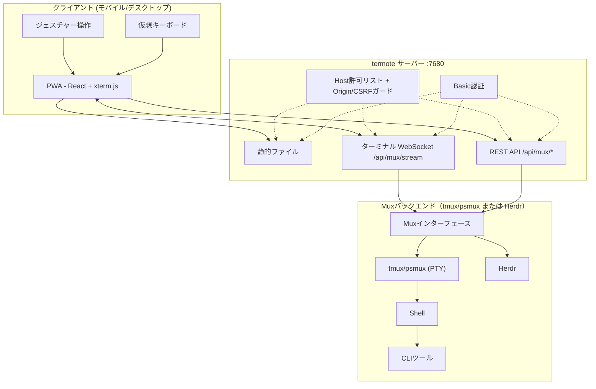
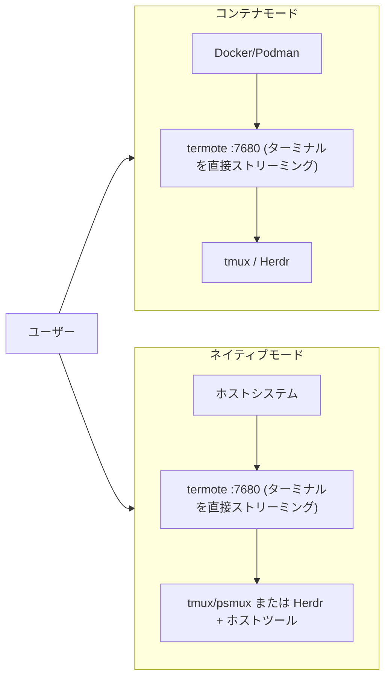

<p align="center">
  
</p>

<p align="center">
  <a href="https://github.com/lamngockhuong/termote/releases"></a>
  <a href="https://github.com/lamngockhuong/termote/actions/workflows/ci.yml"></a>
  <a href="https://github.com/lamngockhuong/termote/blob/main/LICENSE"></a>
  <a href="https://ghcr.io/lamngockhuong/termote"></a>
  <a href="https://hub.docker.com/r/lamngockhuong/termote"></a>
</p>

<p align="center">
  
  
  
  
</p>

<p align="center">
  <a href="https://launch.j2team.dev/products/termote?utm_source=badge-launched&utm_medium=badge&utm_campaign=badge-termote" target="_blank" rel="noopener noreferrer"></a>
  &nbsp;
  <a href="https://unikorn.vn/p/termote?ref=embed-termote" target="_blank"></a>
</p>

モバイル/デスクトップからPWA経由でCLIツール（Claude Code、GitHub Copilot、あらゆるターミナル）をリモート操作。

> [!NOTE]
> Termote 1.0は0.xのインストールをアップグレードしません。[アーカイブされた0.xドキュメント](https://termote.ohnice.app/0.x/)の手順で0.xをアンインストールしてから、[クイックスタート](#クイックスタート)のコマンドで1.0をインストールしてください。

> **Termote** = Terminal + Remote
>
> 🇬🇧 [English](README.md) | 🇻🇳 [Tiếng Việt](README.vi.md) | 🇨🇳 [简体中文](README.zh-CN.md) | 🇰🇷 [한국어](README.ko.md) | 🇪🇸 [Español](README.es.md) | 🇧🇷 [Português (BR)](README.pt-BR.md) | 🇫🇷 [Français](README.fr.md) | 🇩🇪 [Deutsch](README.de.md) | 🇷🇺 [Русский](README.ru.md) | 🇮🇩 [Bahasa Indonesia](README.id.md)

## 機能

- **セッション切り替え**: 作成/編集/削除が可能な複数のtmuxセッション
- **セッションタブ**: ウィンドウをすばやく切り替えるための水平タブバー
- **Herdrバックエンド**（ネイティブまたはコンテナ内）: tmuxの代わりにHerdrのワークスペースを操作し、ペインごとにコーディングエージェントの状態バッジを表示 — [ネイティブインストール](https://termote.ohnice.app/installation/native/)を参照
- **Chatビュー**: Claude Code（または`--no-daemon`で起動したCodex）を実行中のペインをチャットとして読み、返信できます。スラッシュコマンドの候補表示とダイアログへの応答に対応 — [Agent Chat](https://termote.ohnice.app/usage/agent-chat/)を参照
- **Files・Changesビュー**: ペインのディレクトリとそのgitの変更を閲覧し、Markdownをプレビュー — [Files and Changes](https://termote.ohnice.app/usage/files-changes/)を参照
- **画像の添付**: スマートフォンから画像をターミナルやChatビューのメッセージに送り、エージェントがパスから読み取れるようにします
- **Herdrプラグイン**: Herdrを離れずに、フォーカス中のHerdrペインをTermoteで開く、そのリンクをスマートフォン用のQRコードで表示する、サーバーを起動・停止する — [Herdr Plugin](https://termote.ohnice.app/usage/herdr-plugin/)を参照
- **モバイル対応**: 仮想キーボードツールバー（Tab/Ctrl/Shift/矢印キー、展開可能）
- **ジェスチャー操作**: スワイプでCtrl+C、Tab、スクロール
- **コマンド履歴**: 検索機能付きの送信済みコマンド呼び出し
- **クイックアクション**: モバイルのツールバーの ⚡ キーで、よく使う操作（clear、cancel、exit）のシートを開く
- **インターフェーススタイル**: Neutral、Terminal、Native から設定で選択。ライト/ダークのテーマとは独立
- **接続インジケーター**: リアルタイムのサーバー状態表示と切断自動検出
- **アップデートチェック**: GitHub releasesからの新バージョン自動通知
- **PWA**: ホーム画面にインストール可能、オフライン対応
- **永続セッション**: tmuxがセッションを維持
- **折りたたみ可能なサイドバー**: トグル式セッションサイドバー付きデスクトップUI
- **フルスクリーンモード**: 没入型ターミナル体験
- **サービスとして動作**: `termote start`がログイン時に起動するユーザーサービス（systemd、launchd、スケジュールタスク）を登録
- **設定の永続化**: `termote start`がオプションを保存し、パスワードは暗号化して保存

## スクリーンショット

<p align="center">
  
  &nbsp;&nbsp;
  
</p>

<p align="center">
  
</p>

<p align="center">
  
</p>

## アーキテクチャ


```mermaid
flowchart TB
    subgraph Client["クライアント (モバイル/デスクトップ)"]
        PWA["PWA - React + xterm.js"]
        Gestures["ジェスチャー操作"]
        Keyboard["仮想キーボード"]
    end

    subgraph Server["termote サーバー :7680"]
        Static["静的ファイル"]
        Stream["ターミナル WebSocket /api/mux/stream"]
        API["REST API /api/mux/*"]
        Guard["Host許可リスト + Origin/CSRFガード"]
        Auth["Basic認証"]
    end

    subgraph Backend["Muxバックエンド（tmux/psmux または Herdr）"]
        Mux["Muxインターフェース"]
        tmux["tmux/psmux (PTY)"]
        herdr["Herdr"]
        Shell["Shell"]
        Tools["CLIツール"]
    end

    Gestures --> PWA
    Keyboard --> PWA
    PWA --> Static
    PWA <--> Stream
    PWA --> API
    Guard -.-> Static & Stream & API
    Auth -.-> Static & Stream & API
    Stream --> Mux
    API --> Mux
    Mux --> tmux & herdr
    tmux --> Shell --> Tools
```

termoteはターミナル自体を（UnixではPTY、WindowsではConPTYで）PWA内のxterm.jsへストリーミングします。プロキシ先となる別のターミナルプロセスはありません。リクエストガードの全体像は[`docs/system-architecture.md`](docs/system-architecture.md)を参照してください。

## クイックスタート

> 📖 **Termote初めてですか？** 詳しい手順と例については[はじめにガイド](docs/getting-started.md)をご覧ください。

**Linux / macOS:**

```bash
curl -fsSL https://termote.ohnice.app/install.sh | sh
termote start
```

**Windows (PowerShell):**

```powershell
irm https://termote.ohnice.app/install.ps1 | iex
termote start
```

インストーラーに必要なのは`curl`、`tar`、`sha256sum`/`shasum`（WindowsではPowerShell）だけで、sudoや管理者権限は不要です。アーカイブのチェックサムを検証して`termote`コマンドをインストールしますが、何も起動しません。`termote start`はオプションを保存し、初回はパスワードを作成して（一度だけ表示され、あとで`termote show-password`で再表示できます）、サービスを登録して起動します。`http://localhost:7680`（Windowsでは`http://localhost:7690`）を開いてください。

先にターミナルバックエンドをインストールしておく必要があります: tmux（`sudo apt install tmux`、`brew install tmux`）、Windowsではpsmux（`winget install psmux`）、または[Herdr](https://termote.ohnice.app/installation/native/)。どれを使うかは最初の`start`が検出します。

### よく使うオプション

```bash
termote start --lan                  # Listen on the LAN, not only this machine
termote start --tailscale myhost.ts.net  # Publish over Tailscale HTTPS
termote start --mux herdr            # Drive Herdr workspaces instead of tmux
termote start --no-auth              # Disable basic auth (local use only)
```

オプションは保存されます。指定しなかったフラグは保存済みの値を保ち、真偽値のオプションは`=false`でオフにします（`termote start --lan=false`）。フラグはPowerShellを含むすべてのOSで共通です。

### 日常のコマンド

```bash
termote status                       # What the running server reports
termote stop                         # Stop (it starts again at the next login)
termote restart                      # Restart with the saved options
termote logs follow                  # Tail the logs
termote show-password                # Print the saved admin password
termote update                       # Update to the latest release
termote uninstall                    # Remove the service, the command and the install
```

`update`は新しいバージョンに切り替えてサービスを再起動し、新しいバージョンが起動しなければ元に戻します。`uninstall`は設定（`~/.config/termote`）とログ（`~/.local/state/termote`）を残し、両方のパスを表示します。

## インストール

### バージョンを固定する

```bash
curl -fsSL https://termote.ohnice.app/install.sh | TERMOTE_VERSION=1.0.0 sh
termote update --version 1.0.0
```

```powershell
$env:TERMOTE_VERSION='1.0.0'; irm https://termote.ohnice.app/install.ps1 | iex
```

`TERMOTE_VERSION`を指定しない場合、インストーラーは最新の安定版1.xリリースを取得し、既存のインストールには手を触れません。指定した場合はそのバージョンを現在のバージョンと並べてインストールし、有効なバージョンに切り替えます。壊れたインストールの修復にも使えます。

### コンテナモード

```bash
termote container up                          # Run the published image (podman or docker)
termote container up --workspace ~/projects   # Mount a directory at /workspace
termote container status
termote container logs -f
termote container down
```

`container up`はインストール済みの`termote`と同じバージョンの`ghcr.io/lamngockhuong/termote`をpodman（優先）またはdockerで実行し、ポート7680を使い、`~/termote-workspace`を`/workspace`にマウントします。`--port`、`--lan`、`--tailscale`、`--no-auth`、`--allow-host`、`--user`、`--fresh`を受け付け、これらは`start`のオプションとは別に保存されます。ユーザー名とパスワードはネイティブサーバーと共有されます。Dockerは再起動後にコンテナを再開しますが、rootlessのPodmanにはそれを行うデーモンがないため、Quadletユニットとして実行してください。

> **セキュリティ注意**: `$HOME`を直接マウントしないでください — `.ssh`、`.gnupg`などの機密ディレクトリがコンテナからアクセス可能になります。代わりに特定のプロジェクトディレクトリをマウントしてください。

### CLIを使わずにDockerで実行

```bash
# Generates a password, printed in: docker logs termote
docker run -d --name termote -p 7680:7680 \
  -v ~/projects:/workspace \
  ghcr.io/lamngockhuong/termote:latest

# With your own credentials
docker run -d --name termote -p 7680:7680 \
  -e TERMOTE_USER=admin -e TERMOTE_PASS=secret \
  ghcr.io/lamngockhuong/termote:latest
```

| 環境変数       | 説明                                          |
| -------------- | --------------------------------------------- |
| `TERMOTE_USER` | Basic認証のユーザー名（デフォルト: `admin`）  |
| `TERMOTE_PASS` | Basic認証のパスワード（デフォルト: 自動生成） |
| `NO_AUTH`      | `true`で認証を無効化                          |

### ソースからビルド

```bash
git clone https://github.com/lamngockhuong/termote.git
cd termote
make build
./scripts/termote.sh start
```

`make build`はPWAをビルドして`server/termote`に埋め込みます。Go、Node.js、pnpmが必要です。`scripts/termote.sh`（Windowsでは`scripts\termote.ps1`）はチェックアウトを実行するためだけのもので、ソースのほうが新しければ開発用バイナリを再ビルドし、同じ引数で実行します。`termote update`はチェックアウト内では実行を拒否するので、`git pull && make build`を使ってください。

### 0.xからのアップグレード

0.xからのアップグレードはありません。1.0は別の場所にインストールされ、0.xの設定を読み込みません。[アーカイブされた0.xドキュメント](https://termote.ohnice.app/0.x/)の手順で0.xをアンインストールしてから、上記のコマンドで1.0をインストールしてください。

## デプロイモード


```mermaid
flowchart LR
    subgraph Container["コンテナモード"]
        direction TB
        C1["Docker/Podman"] --> C2["termote :7680 (ターミナルを直接ストリーミング)"] --> C3["tmux / Herdr"]
    end

    subgraph Native["ネイティブモード"]
        direction TB
        N1["ホストシステム"] --> N2["termote :7680 (ターミナルを直接ストリーミング)"] --> N3["tmux/psmux または Herdr + ホストツール"]
    end

    User["ユーザー"] --> Container & Native
```

| モード     | コマンド               | ユースケース                           | プラットフォーム      |
| ---------- | ---------------------- | -------------------------------------- | --------------------- |
| ネイティブ | `termote start`        | ホストツール（claude、gh）へのアクセス | macOS, Linux, Windows |
| コンテナ   | `termote container up` | 隔離された環境                         | macOS, Linux, Windows |

ネイティブサーバーはユーザーサービスとして動作します: Linuxではsystemdのユーザーユニット（WSL2でsystemdがない場合など、ユーザーsystemdがなければ切り離されたプロセス）、macOSではlaunchdエージェント、Windowsではログオン時のスケジュールタスクです。

### `start`のオプション

| フラグ                      | 説明                                                                                 |
| --------------------------- | ------------------------------------------------------------------------------------ |
| `--port <port>`             | ポート（デフォルト: 7680、Windows: 7690）                                            |
| `--lan[=false]`             | すべてのインターフェースで待ち受け（デフォルト: localhostのみ）                      |
| `--tailscale <host[:port]>` | Tailscale HTTPSで公開（デフォルトポート443）                                         |
| `--no-tailscale`            | Tailscaleでの公開を停止                                                              |
| `--no-auth[=false]`         | Basic認証を無効化                                                                    |
| `--mux <tmux\|herdr>`       | ターミナルバックエンド（デフォルト: herdrが動作中ならherdr、なければtmux）           |
| `--allow-host <name>`       | 追加のHostヘッダー値を許可（複数指定可。ワイルドカードなし、セキュリティ注意を参照） |
| `--remove-host <name>`      | 許可済みのHost名を削除（複数指定可）                                                 |
| `--allow-herdr-no-auth`     | `--mux herdr --no-auth`と併用する場合に必須                                          |
| `--user <name>`             | ログインユーザー名（デフォルト: `admin`、コンテナと共有）                            |
| `--fresh`                   | 新しいパスワードを設定                                                               |

### Tailscale HTTPS付き

自動HTTPSのために`tailscale serve`を使用します（手動の証明書管理は不要）:

```bash
termote start --tailscale myhost.ts.net                # Default port 443
termote start --tailscale myhost.ts.net:8765           # Custom port
termote container up --tailscale myhost.ts.net         # Container mode
sudo tailscale set --operator=$USER                    # Linux, once: let termote run tailscale serve
```

マッピングはサーバーが起動するたびに適用されます。`stop`、`start --no-tailscale`、`uninstall`はTermote自身のマッピングだけを削除します。

## プラットフォームサポート

| プラットフォーム | コンテナ | ネイティブ | インストーラー |
| ---------------- | -------- | ---------- | -------------- |
| Linux            | ✓        | ✓          | `install.sh`   |
| macOS            | ✓        | ✓          | `install.sh`   |
| Windows          | ✓        | ✓          | `install.ps1`  |

> **Windowsサポート**: コンテナモードにはDocker DesktopまたはPodman Desktopが必要です。ネイティブモードには[psmux](https://github.com/psmux/psmux)（Windows用のtmux互換ターミナルマルチプレクサー）が必要で、`winget install psmux`でインストールします。代わりに[Herdr](https://herdr.dev/#install)のサーバーを起動しておいても使えます。Windowsのサービスはまだ実機で検証されていません。問題があればGitHubで報告してください。

## モバイルでの使い方

| 操作            | ジェスチャー        |
| --------------- | ------------------- |
| キャンセル/中断 | 左スワイプ (Ctrl+C) |
| Tab補完         | 右スワイプ          |
| 下へスクロール  | 上スワイプ          |
| 上へスクロール  | 下スワイプ          |
| ペースト        | 長押し              |
| フォントサイズ  | ピンチイン/アウト   |

仮想ツールバーが提供するキー: Tab、Esc、Ctrl、Shift、矢印キー、よく使うキーの組み合わせ。Ctrl+Shiftの組み合わせ（ペースト、コピー）に対応。最小モードと展開モードの切り替えで追加キー（Home、End、Deleteなど）が利用可能。

## プロジェクト構成

```
termote/
├── Makefile                # Build/test/run commands
├── Dockerfile              # Container image (termote + tmux + herdr)
├── docker-compose.yml      # Development from a checkout only
├── entrypoint.sh           # Container entrypoint
├── docs/                   # Documentation
│   └── images/screenshots/ # App screenshots
├── pwa/                    # React PWA
│   └── src/
│       ├── components/
│       ├── contexts/
│       ├── hooks/
│       ├── types/
│       └── utils/
├── server/                 # Go server + CLI (single binary)
│   ├── main.go             # Entry point (no args = menu, `serve` = server, else CLI)
│   ├── serve.go            # Server (PWA, auth, guards)
│   ├── mux.go              # Mux interface + /api/mux/* routes
│   ├── mux_tmux.go         # tmux/psmux backend
│   ├── mux_herdr.go        # Herdr backend
│   ├── stream.go           # Terminal WebSocket (xterm.js stream)
│   ├── cli*.go             # start/stop/update/container/logs/menu subcommands
│   └── webui/              # PWA embedded in the binary (filled by make build)
├── scripts/
│   ├── install.sh          # Unix online installer (curl | sh)
│   ├── install.ps1         # Windows online installer (irm | iex)
│   ├── termote.sh          # Unix shim: builds and runs a checkout
│   └── termote.ps1         # Windows PowerShell shim: builds and runs a checkout
├── tests/                  # Test suite
│   ├── test-termote.sh     # Unix shim tests
│   ├── test-termote.ps1    # Windows shim tests
│   ├── test-install.sh     # Unix installer tests
│   ├── test-install.ps1    # Windows installer tests
│   └── test-entrypoints.sh # Container entrypoint tests
└── website/                # Astro Starlight docs site
    └── src/content/docs/   # MDX documentation
```

## 開発

```bash
make build          # Build the PWA and embed it in server/termote
make test           # Run all tests
make health         # Check service health
make clean          # Stop containers

# E2E tests (requires running server)
./scripts/termote.sh start           # Start server first
pnpm --filter termote test:e2e       # Run Playwright tests
pnpm --filter termote test:e2e:ui    # Run with UI debugger
```

**手動テスト:** [セルフテストチェックリスト](docs/self-test-checklist.md)を参照

## トラブルシューティング

### セッションが永続化されない

- tmuxを確認: `tmux ls`
- termoteは`tmux new-session -A`（attach-or-create）でアタッチします

### WebSocketエラー

- termoteのログを確認: `termote container logs`（コンテナ）または`termote logs server`（ネイティブ）
- ターミナルのWebSocketは`/api/mux/stream`で、termote自身が提供します。別途確認すべきターミナルプロセスはありません

### モバイルキーボードの問題

- viewportメタタグが存在するか確認
- エミュレーターではなく実機でテスト

### ネイティブモード: サーバーが起動しない

```bash
termote status             # What the running server reports
termote logs server        # Or: termote logs follow
lsof -i :7680              # Check what holds the port
termote start --fresh      # If the saved password can no longer be read
```

## セキュリティに関する注意

- **デフォルト: localhostのみ** - `--lan`フラグを使用しない限りLANに公開されません
- **Basic認証はデフォルトで有効** - ローカル開発では`--no-auth`で無効化。パスワードは最初の`termote start`で作成され、暗号化して保存されます
- **Host許可リスト** - 認識できない`Host`ヘッダーのリクエストを拒否します（DNSリバインディング対策）。信頼する名前は`--allow-host`で追加でき、チェックを無効にするワイルドカードはありません
- **Origin/CSRFガード** - 状態を変更する`/api/mux/*`リクエストと`/api/mux/stream`のWebSocketは、クロスサイトの`Sec-Fetch-Site`/`Origin`を拒否し、同一オリジンで一度だけ使えるストリームトークンを要求します
- **ブルートフォース攻撃防止機能内蔵** - レート制限（IPあたり失敗5回/分、IPv6 /64あたり20回/分）
- **Herdrバックエンド** - ホスト上のすべてのHerdrワークスペースを公開するため、`--allow-herdr-no-auth`も指定しない限り`--mux herdr --no-auth`は拒否されます
- **サービスファイルに秘密情報なし** - systemdユニット、launchdエージェント、スケジュールタスクにパスワードは含まれません
- 本番環境ではHTTPS（Tailscale）を使用
- 信頼できるネットワーク/VPNに制限

## その他のプロジェクト

| プロジェクト                                                | 説明                                                                                                       |
| ----------------------------------------------------------- | ---------------------------------------------------------------------------------------------------------- |
| [GitHub Flex](https://github.com/lamngockhuong/github-flex) | GitHubのインターフェースを生産性向上機能で強化するクロスブラウザ拡張機能（Chrome & Firefox）               |
| [TabRest](https://github.com/lamngockhuong/tabrest)         | 非アクティブなタブを自動的にアンロードしてメモリを解放するChrome拡張機能                                   |
| [Specpin](https://github.com/lamngockhuong/specpin)         | 実行中のWeb UIの要素に、Gitでバージョン管理された生きた業務仕様をピン留め（ブラウザ拡張機能 + Go sidecar） |

## ライセンス

MIT
