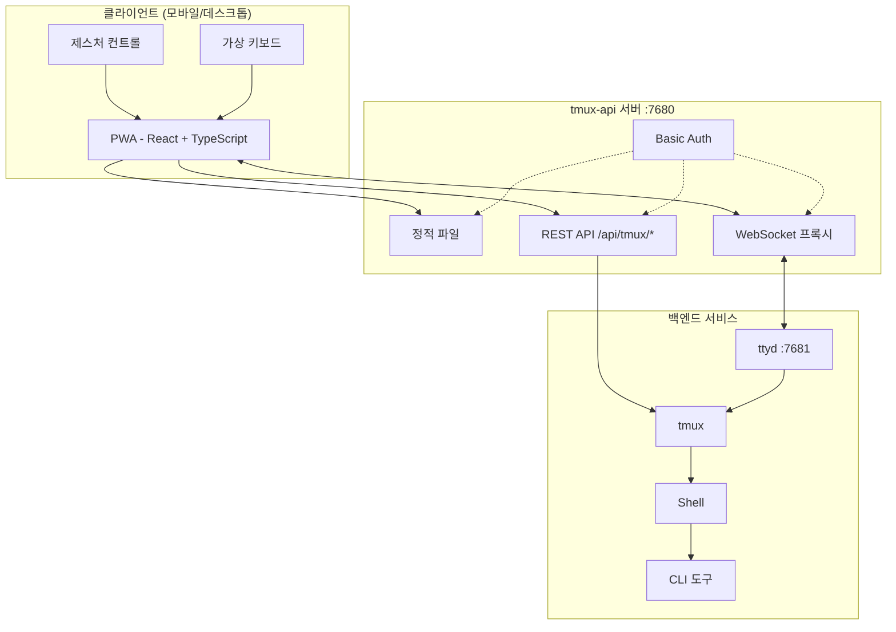
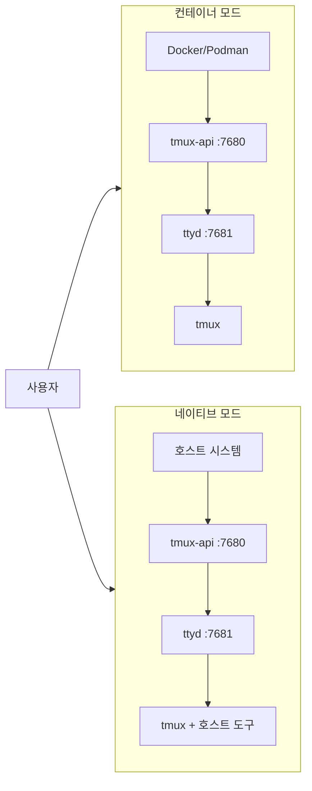

<p align="center">
  
</p>

<p align="center">
  <a href="https://github.com/lamngockhuong/termote/releases"></a>
  <a href="https://github.com/lamngockhuong/termote/actions/workflows/ci.yml"></a>
  <a href="https://github.com/lamngockhuong/termote/blob/main/LICENSE"></a>
  <a href="https://ghcr.io/lamngockhuong/termote"></a>
  <a href="https://hub.docker.com/r/lamngockhuong/termote"></a>
</p>

<p align="center">
  
  
  
  
</p>

<p align="center">
  <a href="https://launch.j2team.dev/products/termote?utm_source=badge-launched&utm_medium=badge&utm_campaign=badge-termote" target="_blank" rel="noopener noreferrer"></a>
  &nbsp;
  <a href="https://unikorn.vn/p/termote?ref=embed-termote" target="_blank"></a>
</p>

모바일/데스크톱에서 PWA를 통해 CLI 도구(Claude Code, GitHub Copilot, 모든 터미널)를 원격 제어.

> **Termote** = Terminal + Remote
>
> 🇬🇧 [English](README.md) | 🇻🇳 [Tiếng Việt](README.vi.md) | 🇨🇳 [简体中文](README.zh-CN.md) | 🇯🇵 [日本語](README.ja.md) | 🇪🇸 [Español](README.es.md) | 🇧🇷 [Português (BR)](README.pt-BR.md) | 🇫🇷 [Français](README.fr.md) | 🇩🇪 [Deutsch](README.de.md) | 🇷🇺 [Русский](README.ru.md) | 🇮🇩 [Bahasa Indonesia](README.id.md)

## 기능

- **세션 전환**: 생성/편집/삭제가 가능한 여러 tmux 세션
- **세션 탭**: 빠른 창 전환을 위한 가로 탭 바
- **모바일 친화적**: 가상 키보드 툴바 (Tab/Ctrl/Shift/방향키, 확장 가능)
- **제스처 지원**: 스와이프로 Ctrl+C, Tab, 히스토리 탐색
- **명령 히스토리**: 검색 기능으로 이전에 전송한 명령 재호출
- **빠른 작업**: 자주 쓰는 작업(clear, cancel, exit)을 위한 플로팅 메뉴
- **연결 표시기**: 실시간 서버 상태 및 연결 끊김 자동 감지
- **업데이트 확인**: GitHub releases에서 새 버전 자동 알림
- **PWA**: 홈 화면에 설치 가능, 오프라인 지원
- **영구 세션**: tmux가 세션을 유지
- **접을 수 있는 사이드바**: 토글 가능한 세션 사이드바가 있는 데스크톱 UI
- **전체 화면 모드**: 몰입형 터미널 경험
- **설정 저장**: AES-256 암호화 비밀번호로 설치 설정 자동 저장

## 스크린샷

<p align="center">
  
  &nbsp;&nbsp;
  
</p>

## 아키텍처



## 빠른 시작

> 📖 **Termote가 처음이신가요?** 예제와 함께하는 완전한 안내는 [시작 가이드](docs/getting-started.md)를 확인하세요.

```bash
./scripts/termote.sh                   # 대화형 메뉴
./scripts/termote.sh install container # 컨테이너 모드 (docker/podman)
./scripts/termote.sh install native    # 네이티브 모드 (호스트 도구)
./scripts/termote.sh link              # 'termote' 글로벌 명령 생성
make test                              # 테스트 실행
```

> `link` 이후 어디서든 `termote` 사용 가능: `termote health`, `termote install native --lan`
>
> **팁**: 향상된 대화형 메뉴를 위해 [gum](https://github.com/charmbracelet/gum) 설치 (선택 사항, bash 폴백 가능)

## 설치

### 한 줄 명령 (권장)

**macOS/Linux:**

```bash
# 다운로드 후 설치 전 확인 (기본값: native 모드)
curl -fsSL https://raw.githubusercontent.com/lamngockhuong/termote/main/scripts/get.sh | bash

# 확인 없이 자동 설치
curl -fsSL .../get.sh | bash -s -- --yes

# 다운로드만 (설치 안 함)
curl -fsSL .../get.sh | bash -s -- --download-only

# 저장된 설정으로 자동 업데이트
curl -fsSL .../get.sh | bash -s -- --update

# 특정 버전 설치
curl -fsSL .../get.sh | bash -s -- --version 0.0.4

# 모드와 옵션을 명시적으로 지정
curl -fsSL .../get.sh | bash -s -- --yes --container --lan
curl -fsSL .../get.sh | bash -s -- --yes --native --tailscale myhost

# 새 비밀번호 강제 입력 (저장된 설정 무시)
curl -fsSL .../get.sh | bash -s -- --yes --container --fresh
```

**Windows (PowerShell):**

> **참고:** 시스템에서 스크립트 실행이 비활성화된 경우, 먼저 이 명령을 실행하세요:
>
> ```powershell
> Set-ExecutionPolicy -Scope CurrentUser -ExecutionPolicy RemoteSigned
> ```

```powershell
# 다운로드 후 설치 전 확인 (기본값: native 모드)
irm https://raw.githubusercontent.com/lamngockhuong/termote/main/scripts/get.ps1 | iex

# 확인 없이 자동 설치
$env:TERMOTE_AUTO_YES = "true"; irm .../get.ps1 | iex

# 모드를 명시적으로 지정
$env:TERMOTE_MODE = "container"; irm .../get.ps1 | iex

# 저장된 설정으로 자동 업데이트
$env:TERMOTE_UPDATE = "true"; irm .../get.ps1 | iex
```

### Docker

```bash
# 올인원 (자격 증명 자동 생성, 로그 확인: docker logs termote)
docker run -d --name termote -p 7680:7680 ghcr.io/lamngockhuong/termote:latest

# 사용자 지정 자격 증명
docker run -d --name termote -p 7680:7680 \
  -e TERMOTE_USER=admin -e TERMOTE_PASS=secret \
  ghcr.io/lamngockhuong/termote:latest

# 인증 없음 (로컬 개발 전용)
docker run -d --name termote -p 7680:7680 \
  -e NO_AUTH=true \
  ghcr.io/lamngockhuong/termote:latest

# 영구 저장을 위한 볼륨 사용
docker run -d --name termote -p 7680:7680 \
  -v termote-data:/home/termote \
  ghcr.io/lamngockhuong/termote:latest

# 사용자 지정 workspace 디렉토리 마운트
docker run -d --name termote -p 7680:7680 \
  -v ~/projects:/workspace \
  ghcr.io/lamngockhuong/termote:latest

# Tailscale HTTPS 사용 (호스트에 Tailscale 필요)
docker run -d --name termote -p 7680:7680 \
  -e TERMOTE_USER=admin -e TERMOTE_PASS=secret \
  ghcr.io/lamngockhuong/termote:latest
sudo tailscale serve --bg --https=443 http://127.0.0.1:7680
# 접속: https://your-hostname.tailnet-name.ts.net
```

### Release에서 설치

```bash
# 최신 릴리스 다운로드
VERSION=$(curl -s https://api.github.com/repos/lamngockhuong/termote/releases/latest | grep tag_name | cut -d '"' -f4)
wget https://github.com/lamngockhuong/termote/releases/download/${VERSION}/termote-${VERSION}.tar.gz
tar xzf termote-${VERSION}.tar.gz
cd termote-${VERSION#v}

# 설치 (대화형 메뉴 또는 모드 지정)
./scripts/termote.sh install
./scripts/termote.sh install container
```

### 소스에서 설치

```bash
git clone https://github.com/lamngockhuong/termote.git
cd termote
./scripts/termote.sh install container
```

> **참고**: `termote.sh`는 `install` (소스에서 빌드, 가능한 경우 사전 빌드된 아티팩트 사용), `uninstall`, `health` 명령을 지원하는 통합 CLI입니다.

## 배포 모드



| 모드          | 설명            | 사용 사례                         | 플랫폼       |
| ------------- | -------------- | ------------------------------- | ------------ |
| `--container` | 컨테이너 모드    | 간단한 배포, 격리된 환경            | macOS, Linux |
| `--native`    | 전체 네이티브    | 호스트 도구 접근 (claude, gh)      | macOS, Linux |

### 옵션

| 플래그                      | 설명                                            |
| --------------------------- | ----------------------------------------------- |
| `--lan`                     | LAN에 노출 (기본값: localhost만)                  |
| `--tailscale <host[:port]>` | Tailscale HTTPS 활성화                           |
| `--no-auth`                 | 기본 인증 비활성화                                |
| `--port <port>`             | 호스트 포트 (기본값: 7680, Windows: 7690)         |
| `--fresh`                   | 새 비밀번호 강제 입력 (저장된 설정 무시)            |
| `--update`                  | 저장된 설정으로 자동 업데이트                       |
| `--version <ver>`           | 특정 버전 설치 (`v` 포함/미포함 모두 가능)          |

| 환경 변수          | 설명                                             |
| -------------------- | ------------------------------------------------ |
| `WORKSPACE`          | 마운트할 호스트 디렉토리 (기본값: `./workspace`)    |
| `TERMOTE_USER`       | Basic auth 사용자 이름 (기본값: 자동 생성)          |
| `TERMOTE_PASS`       | Basic auth 비밀번호 (기본값: 자동 생성)             |
| `NO_AUTH`            | `true`로 설정하여 인증 비활성화                     |

### 컨테이너 모드 (간편한 사용을 위해 권장)

스크립트가 `podman` 또는 `docker`를 자동 감지합니다 -- 둘 다 동일하게 작동합니다.

```bash
./scripts/termote.sh install container             # localhost + basic auth
./scripts/termote.sh install container --no-auth   # localhost + 인증 없음
./scripts/termote.sh install container --lan       # LAN 접근 가능
# 접속: http://localhost:7680

# 사용자 지정 workspace 디렉토리 (컨테이너 내 /workspace에 마운트)
WORKSPACE=~/projects ./scripts/termote.sh install container
WORKSPACE=/path/to/code make install-container
```

> **보안 참고**: `$HOME`을 직접 마운트하지 마세요 -- `.ssh`, `.gnupg` 같은 민감한 디렉토리가 컨테이너에서 접근 가능해집니다. 대신 특정 프로젝트 디렉토리를 마운트하세요.

### 네이티브 (호스트 바이너리 접근을 위해 권장)

호스트 바이너리(claude, git 등)에 접근이 필요할 때 사용:

```bash
# Linux
sudo apt install ttyd tmux
# 또는: sudo snap install ttyd
./scripts/termote.sh install native

# macOS
brew install ttyd tmux go
./scripts/termote.sh install native
# 접속: http://localhost:7680
```

### Tailscale HTTPS 사용 (모든 모드)

자동 HTTPS를 위해 `tailscale serve`를 사용합니다 (수동 인증서 관리 불필요):

```bash
# Tailscale만 (기본 포트 443)
./scripts/termote.sh install container --tailscale myhost.ts.net

# 사용자 지정 포트
./scripts/termote.sh install native --tailscale myhost.ts.net:8765

# Tailscale + LAN 접근 가능
./scripts/termote.sh install container --tailscale myhost.ts.net --lan

# 접속: https://myhost.ts.net (또는 사용자 지정 포트의 경우 :8765)
```

### 제거

```bash
./scripts/termote.sh uninstall container   # 컨테이너 모드
./scripts/termote.sh uninstall native      # 네이티브 모드
./scripts/termote.sh uninstall all         # 전체
```

### 업데이트

```bash
# 방법 1: 저장된 설정으로 자동 업데이트
curl -fsSL .../get.sh | bash -s -- --update

# 방법 2: 한 줄 명령 재실행 (버전 비교, 설치 전 확인)
curl -fsSL .../get.sh | bash

# 방법 3: 수동 업데이트
./scripts/termote.sh uninstall [container|native]
git pull origin main                    # 소스에서 설치한 경우
./scripts/termote.sh install [container|native] [--lan] [--tailscale ...]
```

## 플랫폼 지원

| 플랫폼   | 컨테이너       | 네이티브       | CLI 스크립트 |
| -------- | -------------- | -------------- | ----------- |
| Linux    | ✓              | ✓              | termote.sh  |
| macOS    | ✓              | ✓              | termote.sh  |
| Windows  | ⚠️ (실험적)     | ⚠️ (실험적)     | termote.ps1 |

> **⚠️ Windows 지원 (실험적)**: Windows 지원은 현재 초기 단계이며 추가 테스트가 필요합니다. 컨테이너 모드는 Docker Desktop이 필요하고, 네이티브 모드는 psmux가 필요합니다. GitHub에서 이슈를 보고해 주세요.

### Windows 네이티브 모드

Windows 네이티브 모드는 [psmux](https://github.com/psmux/psmux) (Windows용 tmux 호환 터미널 멀티플렉서)를 사용합니다:

```powershell
# psmux 설치
winget install psmux

# Termote 실행
.\scripts\termote.ps1 install native
.\scripts\termote.ps1 install container  # 또는 Docker Desktop으로 컨테이너 모드
```

## 모바일 사용법

| 동작           | 제스처              |
| -------------- | ------------------- |
| 취소/중단       | 왼쪽 스와이프 (Ctrl+C) |
| Tab 자동 완성   | 오른쪽 스와이프       |
| 히스토리 위로   | 위로 스와이프         |
| 히스토리 아래로 | 아래로 스와이프       |
| 붙여넣기       | 길게 누르기           |
| 글꼴 크기      | 핀치 인/아웃          |

가상 툴바 제공: Tab, Esc, Ctrl, Shift, 방향키 및 일반 키 조합. Ctrl+Shift 조합(붙여넣기, 복사) 지원. 추가 키(Home, End, Delete 등)를 위해 최소 모드와 확장 모드 간 전환 가능.

## 프로젝트 구조

```
termote/
├── Makefile                # 빌드/테스트/배포 명령
├── Dockerfile              # Docker 모드 (tmux-api + ttyd)
├── docker-compose.yml
├── entrypoint.sh           # Docker 엔트리포인트
├── docs/                   # 문서
│   └── images/screenshots/ # 앱 스크린샷
├── pwa/                    # React PWA
│   └── src/
│       ├── components/
│       ├── contexts/
│       ├── hooks/
│       ├── types/
│       └── utils/
├── tmux-api/               # Go 서버
│   ├── main.go             # 엔트리 포인트
│   ├── serve.go            # 서버 (PWA, 프록시, 인증)
│   └── tmux.go             # tmux API 핸들러
├── scripts/
│   ├── termote.sh          # Unix CLI (install/uninstall/health)
│   ├── termote.ps1         # Windows PowerShell CLI
│   ├── get.sh              # Unix 온라인 설치기 (curl | bash)
│   └── get.ps1             # Windows 온라인 설치기 (irm | iex)
├── tests/                  # 테스트 모음
│   ├── test-termote.sh
│   ├── test-termote.ps1    # Windows 테스트
│   ├── test-get.sh
│   └── test-entrypoints.sh
└── website/                # Astro Starlight 문서 사이트
    └── src/content/docs/   # MDX 문서
```

## 개발

```bash
make build          # PWA와 tmux-api 빌드
make test           # 모든 테스트 실행
make health         # 서비스 상태 확인
make clean          # 컨테이너 중지

# E2E 테스트 (실행 중인 서버 필요)
./scripts/termote.sh install container  # 먼저 서버 시작
cd pwa && pnpm test:e2e       # Playwright 테스트 실행
cd pwa && pnpm test:e2e:ui    # UI 디버거로 실행
```

**수동 테스트:** [자체 테스트 체크리스트](docs/self-test-checklist.md) 참조

## 문제 해결

### 세션이 유지되지 않음

- tmux 확인: `tmux ls`
- ttyd가 `-A` 플래그(attach-or-create)를 사용하는지 확인

### WebSocket 오류

- tmux-api 로그 확인: `docker logs termote`
- ttyd가 포트 7681에서 실행 중인지 확인

### 모바일 키보드 문제

- viewport meta 태그가 있는지 확인
- 에뮬레이터가 아닌 실제 기기에서 테스트

### 네이티브 모드: 프로세스가 시작되지 않음

```bash
ps aux | grep ttyd         # ttyd 실행 중인지 확인
ps aux | grep tmux-api     # tmux-api 실행 중인지 확인
lsof -i :7680              # 포트 사용 중인지 확인
```

## 보안 참고

- **기본값: localhost만** - `--lan` 플래그를 사용하지 않으면 LAN에 노출되지 않음
- **기본 인증 기본 활성화** - 로컬 개발 시 `--no-auth`로 비활성화
- **내장 무차별 대입 방지** - 속도 제한 (IP당 5회 시도/분)
- 프로덕션에는 HTTPS(Tailscale) 사용
- 신뢰할 수 있는 네트워크/VPN으로 제한

## 다른 프로젝트

| 프로젝트 | 설명 |
|---------|------|
| [GitHub Flex](https://github.com/lamngockhuong/github-flex) | GitHub 인터페이스를 생산성 기능으로 향상시키는 크로스 브라우저 확장 프로그램 (Chrome & Firefox) |

## 라이선스

MIT
