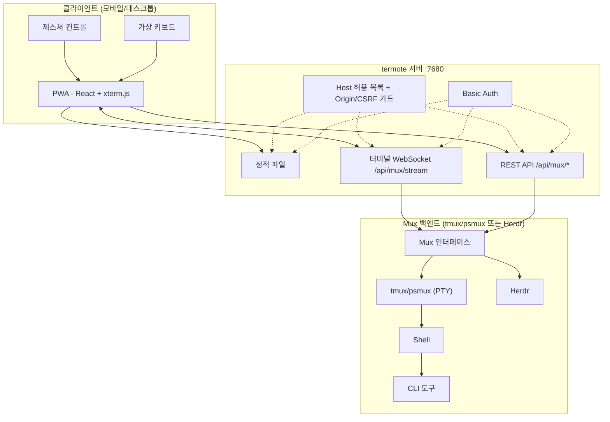
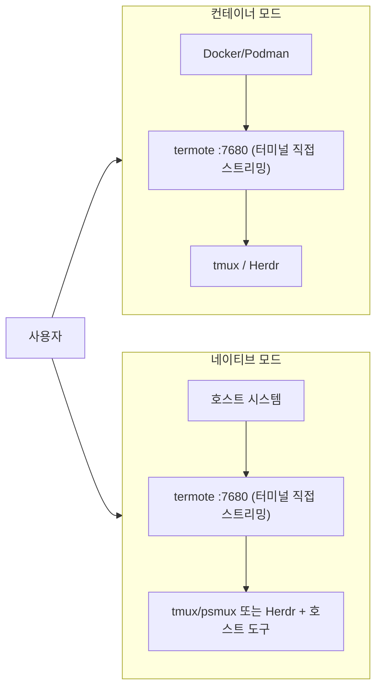

<p align="center">
  
</p>

<p align="center">
  <a href="https://github.com/lamngockhuong/termote/releases"></a>
  <a href="https://github.com/lamngockhuong/termote/actions/workflows/ci.yml"></a>
  <a href="https://github.com/lamngockhuong/termote/blob/main/LICENSE"></a>
  <a href="https://ghcr.io/lamngockhuong/termote"></a>
  <a href="https://hub.docker.com/r/lamngockhuong/termote"></a>
</p>

<p align="center">
  
  
  
  
</p>

<p align="center">
  <a href="https://launch.j2team.dev/products/termote?utm_source=badge-launched&utm_medium=badge&utm_campaign=badge-termote" target="_blank" rel="noopener noreferrer"></a>
  &nbsp;
  <a href="https://unikorn.vn/p/termote?ref=embed-termote" target="_blank"></a>
</p>

모바일/데스크톱에서 PWA를 통해 CLI 도구(Claude Code, GitHub Copilot, 모든 터미널)를 원격 제어.

> [!NOTE]
> Termote 1.0은 0.x 설치를 업그레이드하지 않습니다. [보관된 0.x 문서](https://termote.ohnice.app/0.x/)에 따라 0.x를 제거한 다음, [빠른 시작](#빠른-시작)의 명령으로 1.0을 설치하세요.

> **Termote** = Terminal + Remote
>
> 🇬🇧 [English](README.md) | 🇻🇳 [Tiếng Việt](README.vi.md) | 🇨🇳 [简体中文](README.zh-CN.md) | 🇯🇵 [日本語](README.ja.md) | 🇪🇸 [Español](README.es.md) | 🇧🇷 [Português (BR)](README.pt-BR.md) | 🇫🇷 [Français](README.fr.md) | 🇩🇪 [Deutsch](README.de.md) | 🇷🇺 [Русский](README.ru.md) | 🇮🇩 [Bahasa Indonesia](README.id.md)

## 기능

- **세션 전환**: 생성/편집/삭제가 가능한 여러 tmux 세션
- **세션 탭**: 빠른 창 전환을 위한 가로 탭 바
- **Herdr 백엔드** (네이티브 또는 컨테이너 안): tmux 대신 Herdr 워크스페이스를 제어하고, 패널마다 코딩 에이전트 상태 배지를 표시 — [네이티브 설치](https://termote.ohnice.app/installation/native/) 참고
- **Chat 뷰**: Claude Code(또는 `--no-daemon`으로 시작한 Codex)를 실행 중인 pane을 채팅처럼 읽고 답할 수 있으며, 슬래시 명령 제안과 대화상자 응답을 지원 — [Agent Chat](https://termote.ohnice.app/usage/agent-chat/) 참고
- **Files 및 Changes 뷰**: pane의 디렉터리와 git 변경 사항을 탐색하고 Markdown을 미리보기 — [Files and Changes](https://termote.ohnice.app/usage/files-changes/) 참고
- **이미지 첨부**: 휴대폰의 이미지를 터미널이나 Chat 뷰 메시지로 보내 에이전트가 경로로 읽을 수 있게 함
- **Herdr 플러그인**: Herdr를 벗어나지 않고 포커스된 Herdr pane을 Termote에서 열고, 링크를 휴대폰용 QR 코드로 표시하고, 서버를 시작하거나 중지 — [Herdr Plugin](https://termote.ohnice.app/usage/herdr-plugin/) 참고
- **모바일 친화적**: 가상 키보드 툴바 (Tab/Ctrl/Shift/방향키, 확장 가능)
- **제스처 지원**: 스와이프로 Ctrl+C, Tab, 스크롤
- **명령 히스토리**: 검색 기능으로 이전에 전송한 명령 재호출
- **빠른 작업**: 모바일 툴바 끝에 고정된 ⋯ 키가 자주 쓰는 작업(clear, cancel, exit)의 Actions 줄을 보여 줍니다
- **인터페이스 스타일**: Neutral, Terminal, Native 중 설정에서 선택하며 라이트/다크 테마와 별개입니다
- **연결 표시기**: 실시간 서버 상태 및 연결 끊김 자동 감지
- **업데이트 확인**: GitHub releases에서 새 버전 자동 알림
- **PWA**: 홈 화면에 설치 가능, 오프라인 지원
- **영구 세션**: tmux가 세션을 유지
- **접을 수 있는 사이드바**: 토글 가능한 세션 사이드바가 있는 데스크톱 UI
- **전체 화면 모드**: 몰입형 터미널 경험
- **서비스로 실행**: `termote start`가 로그인 시 시작되는 사용자 서비스(systemd, launchd, 예약된 작업)를 등록
- **설정 저장**: `termote start`가 옵션을 저장하고, 비밀번호는 암호화해 저장

## 스크린샷

<p align="center">
  
  &nbsp;&nbsp;
  
</p>

<p align="center">
  
</p>

<p align="center">
  
</p>

## 아키텍처


```mermaid
flowchart TB
    subgraph Client["클라이언트 (모바일/데스크톱)"]
        PWA["PWA - React + xterm.js"]
        Gestures["제스처 컨트롤"]
        Keyboard["가상 키보드"]
    end

    subgraph Server["termote 서버 :7680"]
        Static["정적 파일"]
        Stream["터미널 WebSocket /api/mux/stream"]
        API["REST API /api/mux/*"]
        Guard["Host 허용 목록 + Origin/CSRF 가드"]
        Auth["Basic Auth"]
    end

    subgraph Backend["Mux 백엔드 (tmux/psmux 또는 Herdr)"]
        Mux["Mux 인터페이스"]
        tmux["tmux/psmux (PTY)"]
        herdr["Herdr"]
        Shell["Shell"]
        Tools["CLI 도구"]
    end

    Gestures --> PWA
    Keyboard --> PWA
    PWA --> Static
    PWA <--> Stream
    PWA --> API
    Guard -.-> Static & Stream & API
    Auth -.-> Static & Stream & API
    Stream --> Mux
    API --> Mux
    Mux --> tmux & herdr
    tmux --> Shell --> Tools
```

termote가 터미널을 직접(Unix에서는 PTY, Windows에서는 ConPTY) PWA의 xterm.js로 스트리밍하므로, 프록시할 별도의 터미널 프로세스가 없습니다. 요청 가드 모델 전체는 [`docs/system-architecture.md`](docs/system-architecture.md)를 참고하세요.

## 빠른 시작

> 📖 **Termote가 처음이신가요?** 예제와 함께하는 완전한 안내는 [시작 가이드](docs/getting-started.md)를 확인하세요.

**Linux / macOS:**

```bash
curl -fsSL https://termote.ohnice.app/install.sh | sh
termote start
```

**Windows (PowerShell):**

```powershell
irm https://termote.ohnice.app/install.ps1 | iex
termote start
```

설치 프로그램에는 `curl`, `tar`, `sha256sum`/`shasum`(Windows에서는 PowerShell)만 필요하며 sudo나 관리자 권한은 필요 없습니다. 아카이브의 체크섬을 검증한 뒤 `termote` 명령을 설치하고, 아무것도 실행하지 않습니다. `termote start`는 옵션을 저장하고, 처음 실행할 때 비밀번호를 만들고(한 번만 표시되며 나중에 `termote show-password`로 다시 볼 수 있음), 서비스를 등록해 시작합니다. `http://localhost:7680`(Windows: `http://localhost:7690`)을 여세요.

터미널 백엔드를 먼저 설치해야 합니다: tmux(`sudo apt install tmux`, `brew install tmux`), Windows에서는 psmux(`winget install psmux`), 또는 [Herdr](https://termote.ohnice.app/installation/native/). 어떤 것을 쓸지는 첫 `start`가 감지합니다.

### 자주 쓰는 옵션

```bash
termote start --lan                  # Listen on the LAN, not only this machine
termote start --tailscale myhost.ts.net  # Publish over Tailscale HTTPS
termote start --mux herdr            # Drive Herdr workspaces instead of tmux
termote start --no-auth              # Disable basic auth (local use only)
```

옵션은 저장됩니다. 지정하지 않은 플래그는 저장된 값을 유지하고, 불리언 옵션은 `=false`로 끕니다(`termote start --lan=false`). 플래그는 PowerShell을 포함한 모든 OS에서 같습니다.

### 일상적인 명령

```bash
termote status                       # What the running server reports
termote stop                         # Stop (it starts again at the next login)
termote restart                      # Restart with the saved options
termote logs follow                  # Tail the logs
termote show-password                # Print the saved admin password
termote update                       # Update to the latest release
termote uninstall                    # Remove the service, the command and the install
```

`update`는 새 버전으로 전환하고 서비스를 재시작하며, 새 버전이 올라오지 않으면 이전 버전으로 되돌립니다. `uninstall`은 설정(`~/.config/termote`)과 로그(`~/.local/state/termote`)를 남기고 두 경로를 출력합니다.

## 설치

### 버전 고정

```bash
curl -fsSL https://termote.ohnice.app/install.sh | TERMOTE_VERSION=1.0.0 sh
termote update --version 1.0.0
```

```powershell
$env:TERMOTE_VERSION='1.0.0'; irm https://termote.ohnice.app/install.ps1 | iex
```

`TERMOTE_VERSION`이 없으면 설치 프로그램은 최신 안정 1.x 릴리스를 가져오며 기존 설치는 건드리지 않습니다. 지정하면 해당 버전을 현재 버전 옆에 설치하고 활성 버전으로 전환하므로, 망가진 설치를 복구할 때도 쓸 수 있습니다.

### 컨테이너 모드

```bash
termote container up                          # Run the published image (podman or docker)
termote container up --workspace ~/projects   # Mount a directory at /workspace
termote container status
termote container logs -f
termote container down
```

`container up`은 설치된 `termote`와 같은 버전의 `ghcr.io/lamngockhuong/termote`를 podman(우선) 또는 docker로 실행하며, 포트 7680을 쓰고 `~/termote-workspace`를 `/workspace`에 마운트합니다. `--port`, `--lan`, `--tailscale`, `--no-auth`, `--allow-host`, `--user`, `--fresh`를 받으며, 이 값들은 `start`의 옵션과 따로 저장됩니다. 사용자 이름과 비밀번호는 네이티브 서버와 공유합니다. Docker는 재부팅 후 컨테이너를 다시 시작하지만, rootless Podman에는 이를 담당할 데몬이 없으므로 Quadlet 유닛으로 실행하세요.

> **보안 참고**: `$HOME`을 직접 마운트하지 마세요 — `.ssh`, `.gnupg` 같은 민감한 디렉토리가 컨테이너에서 접근 가능해집니다. 대신 특정 프로젝트 디렉토리를 마운트하세요.

### CLI 없이 Docker로 실행

```bash
# Generates a password, printed in: docker logs termote
docker run -d --name termote -p 7680:7680 \
  -v ~/projects:/workspace \
  ghcr.io/lamngockhuong/termote:latest

# With your own credentials
docker run -d --name termote -p 7680:7680 \
  -e TERMOTE_USER=admin -e TERMOTE_PASS=secret \
  ghcr.io/lamngockhuong/termote:latest
```

| 환경 변수      | 설명                                    |
| -------------- | --------------------------------------- |
| `TERMOTE_USER` | 기본 인증 사용자 이름 (기본값: `admin`) |
| `TERMOTE_PASS` | 기본 인증 비밀번호 (기본값: 자동 생성)  |
| `NO_AUTH`      | `true`로 설정하면 인증 비활성화         |

### 소스에서 빌드

```bash
git clone https://github.com/lamngockhuong/termote.git
cd termote
make build
./scripts/termote.sh start
```

`make build`는 PWA를 빌드해 `server/termote`에 포함시키며, Go, Node.js, pnpm이 필요합니다. `scripts/termote.sh`(Windows: `scripts\termote.ps1`)는 체크아웃을 실행하는 용도로만 쓰이며, 소스가 더 새로우면 개발용 바이너리를 다시 빌드한 뒤 같은 인자로 실행합니다. `termote update`는 체크아웃 안에서는 실행을 거부하므로 `git pull && make build`를 사용하세요.

### 0.x에서 업그레이드

0.x에서 업그레이드하는 경로는 없습니다. 1.0은 다른 위치에 설치되며 0.x 설정을 읽지 않습니다. [보관된 0.x 문서](https://termote.ohnice.app/0.x/)에 따라 0.x를 제거한 다음, 위 명령으로 1.0을 설치하세요.

## 배포 모드


```mermaid
flowchart LR
    subgraph Container["컨테이너 모드"]
        direction TB
        C1["Docker/Podman"] --> C2["termote :7680 (터미널 직접 스트리밍)"] --> C3["tmux / Herdr"]
    end

    subgraph Native["네이티브 모드"]
        direction TB
        N1["호스트 시스템"] --> N2["termote :7680 (터미널 직접 스트리밍)"] --> N3["tmux/psmux 또는 Herdr + 호스트 도구"]
    end

    User["사용자"] --> Container & Native
```

| 모드     | 명령                   | 사용 사례                    | 플랫폼                |
| -------- | ---------------------- | ---------------------------- | --------------------- |
| 네이티브 | `termote start`        | 호스트 도구(claude, gh) 접근 | macOS, Linux, Windows |
| 컨테이너 | `termote container up` | 격리된 환경                  | macOS, Linux, Windows |

네이티브 서버는 사용자 서비스로 실행됩니다: Linux에서는 systemd 사용자 유닛(WSL2에서 systemd가 없는 경우처럼 사용자 systemd가 없으면 분리된 프로세스), macOS에서는 launchd 에이전트, Windows에서는 로그온 시 실행되는 예약된 작업입니다.

### `start` 옵션

| 플래그                      | 설명                                                                |
| --------------------------- | ------------------------------------------------------------------- |
| `--port <port>`             | 포트 (기본값: 7680, Windows: 7690)                                  |
| `--lan[=false]`             | 모든 인터페이스에서 수신 (기본값: localhost만)                      |
| `--tailscale <host[:port]>` | Tailscale HTTPS로 공개 (기본 포트 443)                              |
| `--no-tailscale`            | Tailscale 공개 중지                                                 |
| `--no-auth[=false]`         | 기본 인증 비활성화                                                  |
| `--mux <tmux\|herdr>`       | 터미널 백엔드 (기본값: herdr가 실행 중이면 herdr, 아니면 tmux)      |
| `--allow-host <name>`       | 추가 Host 헤더 값 허용 (반복 가능, 와일드카드 없음, 보안 참고 참조) |
| `--remove-host <name>`      | 허용된 Host 이름 제거 (반복 가능)                                   |
| `--allow-herdr-no-auth`     | `--mux herdr --no-auth`와 함께 쓸 때 필수                           |
| `--user <name>`             | 로그인 사용자 이름 (기본값: `admin`, 컨테이너와 공유)               |
| `--fresh`                   | 새 비밀번호 설정                                                    |

### Tailscale HTTPS 사용

자동 HTTPS를 위해 `tailscale serve` 사용 (수동 인증서 관리 불필요):

```bash
termote start --tailscale myhost.ts.net                # Default port 443
termote start --tailscale myhost.ts.net:8765           # Custom port
termote container up --tailscale myhost.ts.net         # Container mode
sudo tailscale set --operator=$USER                    # Linux, once: let termote run tailscale serve
```

매핑은 서버가 시작될 때마다 적용됩니다. `stop`, `start --no-tailscale`, `uninstall`은 Termote 자신의 매핑만 제거합니다.

## 플랫폼 지원

| 플랫폼  | 컨테이너 | 네이티브 | 설치 프로그램 |
| ------- | -------- | -------- | ------------- |
| Linux   | ✓        | ✓        | `install.sh`  |
| macOS   | ✓        | ✓        | `install.sh`  |
| Windows | ✓        | ✓        | `install.ps1` |

> **Windows 지원**: 컨테이너 모드에는 Docker Desktop 또는 Podman Desktop이 필요하고, 네이티브 모드에는 [psmux](https://github.com/psmux/psmux)(Windows용 tmux 호환 터미널 멀티플렉서)가 필요하며 `winget install psmux`로 설치합니다. 대신 실행 중인 [Herdr](https://herdr.dev/#install) 서버를 사용할 수도 있습니다. Windows 서비스는 아직 실제 기기에서 검증되지 않았습니다. 문제가 있으면 GitHub에 보고해 주세요.

## 모바일 사용법

| 동작          | 제스처                 |
| ------------- | ---------------------- |
| 취소/중단     | 왼쪽 스와이프 (Ctrl+C) |
| Tab 자동 완성 | 오른쪽 스와이프        |
| 아래로 스크롤 | 위로 스와이프          |
| 위로 스크롤   | 아래로 스와이프        |
| 붙여넣기      | 길게 누르기            |
| 글꼴 크기     | 핀치 인/아웃           |

가상 툴바 제공: Tab, Esc, Ctrl, Shift, 방향키 및 일반 키 조합. Ctrl+Shift 조합(붙여넣기, 복사) 지원. 추가 키(Home, End, Delete 등)를 위해 최소 모드와 확장 모드 간 전환 가능.

## 프로젝트 구조

```
termote/
├── Makefile                # Build/test/run commands
├── Dockerfile              # Container image (termote + tmux + herdr)
├── docker-compose.yml      # Development from a checkout only
├── entrypoint.sh           # Container entrypoint
├── docs/                   # Documentation
│   └── images/screenshots/ # App screenshots
├── pwa/                    # React PWA
│   └── src/
│       ├── components/
│       ├── contexts/
│       ├── hooks/
│       ├── types/
│       └── utils/
├── server/                 # Go server + CLI (single binary)
│   ├── main.go             # Entry point (no args = menu, `serve` = server, else CLI)
│   ├── serve.go            # Server (PWA, auth, guards)
│   ├── mux.go              # Mux interface + /api/mux/* routes
│   ├── mux_tmux.go         # tmux/psmux backend
│   ├── mux_herdr.go        # Herdr backend
│   ├── stream.go           # Terminal WebSocket (xterm.js stream)
│   ├── cli*.go             # start/stop/update/container/logs/menu subcommands
│   └── webui/              # PWA embedded in the binary (filled by make build)
├── scripts/
│   ├── install.sh          # Unix online installer (curl | sh)
│   ├── install.ps1         # Windows online installer (irm | iex)
│   ├── termote.sh          # Unix shim: builds and runs a checkout
│   └── termote.ps1         # Windows PowerShell shim: builds and runs a checkout
├── tests/                  # Test suite
│   ├── test-termote.sh     # Unix shim tests
│   ├── test-termote.ps1    # Windows shim tests
│   ├── test-install.sh     # Unix installer tests
│   ├── test-install.ps1    # Windows installer tests
│   └── test-entrypoints.sh # Container entrypoint tests
└── website/                # Astro Starlight docs site
    └── src/content/docs/   # MDX documentation
```

## 개발

```bash
make build          # Build the PWA and embed it in server/termote
make test           # Run all tests
make health         # Check service health
make clean          # Stop containers

# E2E tests (requires running server)
./scripts/termote.sh start           # Start server first
pnpm --filter termote test:e2e       # Run Playwright tests
pnpm --filter termote test:e2e:ui    # Run with UI debugger
```

**수동 테스트:** [셀프 테스트 체크리스트](docs/self-test-checklist.md) 참조

## 문제 해결

### 세션이 유지되지 않음

- tmux 확인: `tmux ls`
- termote는 `tmux new-session -A`(attach-or-create)로 연결

### WebSocket 오류

- termote 로그 확인: `termote container logs` (컨테이너) 또는 `termote logs server` (네이티브)
- 터미널 WebSocket은 termote가 직접 제공하는 `/api/mux/stream`이므로 따로 확인할 터미널 프로세스가 없음

### 모바일 키보드 문제

- viewport meta 태그가 있는지 확인
- 에뮬레이터가 아닌 실제 기기에서 테스트

### 네이티브 모드: 서버가 시작되지 않음

```bash
termote status             # What the running server reports
termote logs server        # Or: termote logs follow
lsof -i :7680              # Check what holds the port
termote start --fresh      # If the saved password can no longer be read
```

## 보안 참고

- **기본값: localhost만** - `--lan` 플래그를 사용하지 않으면 LAN에 노출되지 않음
- **기본 인증 기본 활성화** - 로컬 개발 시 `--no-auth`로 비활성화. 비밀번호는 첫 `termote start`에서 생성되어 암호화된 상태로 저장됨
- **Host 허용 목록** - 알 수 없는 `Host` 헤더를 가진 요청은 거부 (DNS 리바인딩 방지). 신뢰할 이름은 `--allow-host`로 추가하며, 검사를 끄는 와일드카드는 없음
- **Origin/CSRF 가드** - 상태를 바꾸는 `/api/mux/*` 요청과 `/api/mux/stream` WebSocket은 교차 사이트 `Sec-Fetch-Site`/`Origin`을 거부하고, 동일 출처의 일회용 스트림 토큰을 요구
- **내장 무차별 대입 방지** - 속도 제한 (IP당 실패 5회/분, IPv6 /64당 20회/분)
- **Herdr 백엔드** - 호스트의 모든 Herdr 워크스페이스를 노출하므로, `--allow-herdr-no-auth`를 함께 지정하지 않으면 `--mux herdr --no-auth`는 거부됨
- **서비스 파일에 비밀 정보 없음** - systemd 유닛, launchd 에이전트, 예약된 작업에는 비밀번호가 들어가지 않음
- 프로덕션에는 HTTPS(Tailscale) 사용
- 신뢰할 수 있는 네트워크/VPN으로 제한

## 다른 프로젝트

| 프로젝트                                                    | 설명                                                                                                             |
| ----------------------------------------------------------- | ---------------------------------------------------------------------------------------------------------------- |
| [GitHub Flex](https://github.com/lamngockhuong/github-flex) | GitHub 인터페이스를 생산성 기능으로 향상시키는 크로스 브라우저 확장 프로그램 (Chrome & Firefox)                  |
| [TabRest](https://github.com/lamngockhuong/tabrest)         | 비활성 탭을 자동으로 언로드하여 메모리를 확보하는 Chrome 확장 프로그램                                           |
| [Specpin](https://github.com/lamngockhuong/specpin)         | 실행 중인 웹 UI 요소에 Git으로 버전 관리되는 살아있는 비즈니스 명세를 고정 (브라우저 확장 프로그램 + Go sidecar) |

## 라이선스

MIT
