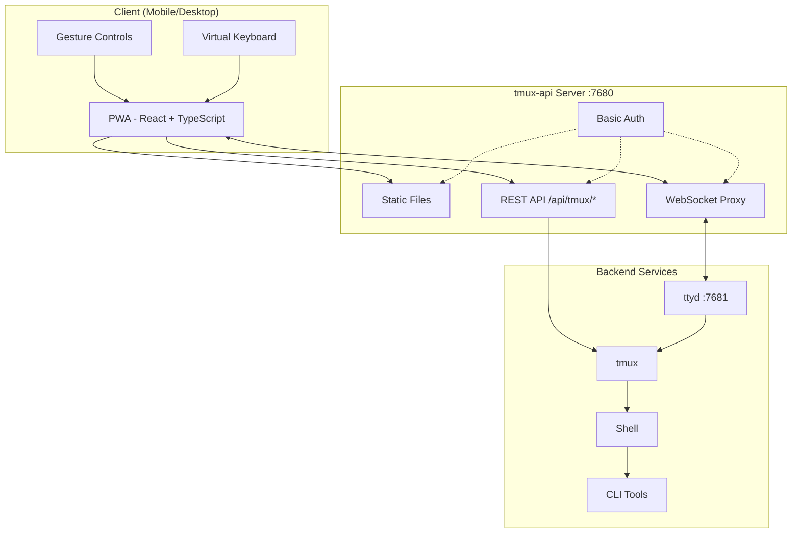
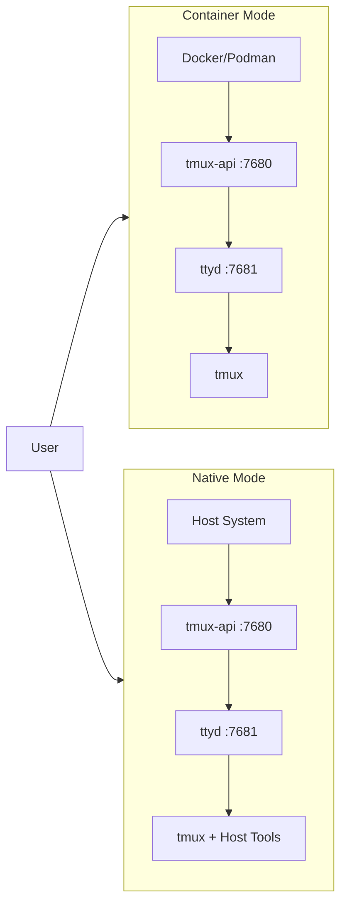

<p align="center">
  
</p>

<p align="center">
  <a href="https://github.com/lamngockhuong/termote/releases"></a>
  <a href="https://github.com/lamngockhuong/termote/actions/workflows/ci.yml"></a>
  <a href="https://github.com/lamngockhuong/termote/blob/main/LICENSE"></a>
  <a href="https://ghcr.io/lamngockhuong/termote"></a>
  <a href="https://hub.docker.com/r/lamngockhuong/termote"></a>
</p>

<p align="center">
  
  
  
  
</p>

Remote control CLI tools (Claude Code, GitHub Copilot, any terminal) from mobile/desktop via PWA.

> **Termote** = Terminal + Remote
>
> [Tiếng Việt](README.vi.md)

## Features

- **Session switching**: Multiple tmux sessions with create/edit/delete
- **Mobile-friendly**: Virtual keyboard toolbar (Tab/Ctrl/Shift/arrows, expandable)
- **Gesture support**: Swipe for Ctrl+C, Tab, history navigation
- **PWA**: Installable to homescreen, offline-capable
- **Persistent sessions**: tmux keeps sessions alive
- **Collapsible sidebar**: Desktop UI with toggleable session sidebar
- **Fullscreen mode**: Immersive terminal experience
- **Config persistence**: Auto-save installation settings with AES-256 encrypted password

## Screenshots

<p align="center">
  
  &nbsp;&nbsp;
  
</p>

## Architecture



## Quick Start

```bash
./scripts/termote.sh                   # Interactive menu
./scripts/termote.sh install container # Container mode (docker/podman)
./scripts/termote.sh install native    # Native mode (host tools)
./scripts/termote.sh link              # Create 'termote' global command
make test                              # Run tests
```

> After `link`, use `termote` from anywhere: `termote health`, `termote install native --lan`

> **Tip**: Install [gum](https://github.com/charmbracelet/gum) for enhanced interactive menus (optional, bash fallback available)

## Installation

### One-liner (recommended)

```bash
# Download and prompt before install (defaults to native mode)
curl -fsSL https://raw.githubusercontent.com/lamngockhuong/termote/main/scripts/get.sh | bash

# Auto-install without prompt
curl -fsSL .../get.sh | bash -s -- --yes

# Download only (no install)
curl -fsSL .../get.sh | bash -s -- --download-only

# Auto-update with saved config
curl -fsSL .../get.sh | bash -s -- --update

# Install specific version
curl -fsSL .../get.sh | bash -s -- --version 0.0.4

# With explicit mode and options
curl -fsSL .../get.sh | bash -s -- --yes --container --lan
curl -fsSL .../get.sh | bash -s -- --yes --native --tailscale myhost

# Force new password (ignore saved config)
curl -fsSL .../get.sh | bash -s -- --yes --container --fresh
```

### Docker

```bash
# All-in-one (auto-generates credentials, check logs: docker logs termote)
docker run -d --name termote -p 7680:7680 ghcr.io/lamngockhuong/termote:latest

# With custom credentials
docker run -d --name termote -p 7680:7680 \
  -e TERMOTE_USER=admin -e TERMOTE_PASS=secret \
  ghcr.io/lamngockhuong/termote:latest

# Without auth (local dev only)
docker run -d --name termote -p 7680:7680 \
  -e NO_AUTH=true \
  ghcr.io/lamngockhuong/termote:latest

# With volume for persistence
docker run -d --name termote -p 7680:7680 \
  -v termote-data:/home/termote \
  ghcr.io/lamngockhuong/termote:latest

# Mount custom workspace directory
docker run -d --name termote -p 7680:7680 \
  -v ~/projects:/workspace \
  ghcr.io/lamngockhuong/termote:latest

# With Tailscale HTTPS (requires Tailscale on host)
docker run -d --name termote -p 7680:7680 \
  -e TERMOTE_USER=admin -e TERMOTE_PASS=secret \
  ghcr.io/lamngockhuong/termote:latest
sudo tailscale serve --bg --https=443 http://127.0.0.1:7680
# Access at: https://your-hostname.tailnet-name.ts.net
```

### From Release

```bash
# Download latest release
VERSION=$(curl -s https://api.github.com/repos/lamngockhuong/termote/releases/latest | grep tag_name | cut -d '"' -f4)
wget https://github.com/lamngockhuong/termote/releases/download/${VERSION}/termote-${VERSION}.tar.gz
tar xzf termote-${VERSION}.tar.gz
cd termote-${VERSION#v}

# Install (interactive menu or with mode)
./scripts/termote.sh install
./scripts/termote.sh install container
```

### From Source

```bash
git clone https://github.com/lamngockhuong/termote.git
cd termote
./scripts/termote.sh install container
```

> **Note**: `termote.sh` is the unified CLI supporting `install` (builds from source, uses pre-built artifacts when available), `uninstall`, and `health` commands.

## Deployment Modes



| Mode          | Description    | Use Case                        | Platform     |
| ------------- | -------------- | ------------------------------- | ------------ |
| `--container` | Container mode | Simple deployment, isolated env | macOS, Linux |
| `--native`    | All native     | Host tool access (claude, gh)   | macOS, Linux |

### Options

| Flag                        | Description                                     |
| --------------------------- | ----------------------------------------------- |
| `--lan`                     | Expose to LAN (default: localhost only)         |
| `--tailscale <host[:port]>` | Enable Tailscale HTTPS                          |
| `--no-auth`                 | Disable basic authentication                    |
| `--port <port>`             | Host port (default: 7680)                       |
| `--fresh`                   | Force new password prompt (ignore saved config) |
| `--update`                  | Auto-update with saved config                   |
| `--version <ver>`           | Install specific version (with or without `v`)  |

| Environment Variable | Description                                      |
| -------------------- | ------------------------------------------------ |
| `WORKSPACE`          | Host directory to mount (default: `./workspace`) |
| `TERMOTE_USER`       | Basic auth username (default: auto-generated)    |
| `TERMOTE_PASS`       | Basic auth password (default: auto-generated)    |
| `NO_AUTH`            | Set to `true` to disable authentication          |

### Container Mode (recommended for simplicity)

Scripts auto-detect `podman` or `docker` — both work identically.

```bash
./scripts/termote.sh install container             # localhost with basic auth
./scripts/termote.sh install container --no-auth   # localhost without auth
./scripts/termote.sh install container --lan       # LAN accessible
# Access: http://localhost:7680

# Custom workspace directory (mounted to /workspace in container)
WORKSPACE=~/projects ./scripts/termote.sh install container
WORKSPACE=/path/to/code make install-container
```

> **Security note**: Avoid mounting `$HOME` directly — sensitive directories like `.ssh`, `.gnupg` will be accessible in container. Mount specific project directories instead.

### Native (recommended for host binary access)

Use when you need access to host binaries (claude, git, etc):

```bash
# Linux
sudo apt install ttyd tmux
# Or: sudo snap install ttyd
./scripts/termote.sh install native

# macOS
brew install ttyd tmux go
./scripts/termote.sh install native
# Access: http://localhost:7680
```

### With Tailscale HTTPS (all modes)

Uses `tailscale serve` for automatic HTTPS (no manual cert management):

```bash
# Tailscale only (default port 443)
./scripts/termote.sh install container --tailscale myhost.ts.net

# Custom port
./scripts/termote.sh install native --tailscale myhost.ts.net:8765

# Tailscale + LAN accessible
./scripts/termote.sh install container --tailscale myhost.ts.net --lan

# Access: https://myhost.ts.net (or :8765 for custom port)
```

### Uninstall

```bash
./scripts/termote.sh uninstall container   # Container mode
./scripts/termote.sh uninstall native      # Native mode
./scripts/termote.sh uninstall all         # Everything
```

### Updating

```bash
# Option 1: Auto-update with saved config
curl -fsSL .../get.sh | bash -s -- --update

# Option 2: Re-run one-liner (compares versions, prompts before install)
curl -fsSL .../get.sh | bash

# Option 3: Manual update
./scripts/termote.sh uninstall [container|native]
git pull origin main                    # If installed from source
./scripts/termote.sh install [container|native] [--lan] [--tailscale ...]
```

## Platform Support

| Platform | Container | Native |
| -------- | --------- | ------ |
| Linux    | ✓         | ✓      |
| macOS    | ✓         | ✓      |
| Windows  | ✓ (WSL2)  | -      |

## Mobile Usage

| Action           | Gesture             |
| ---------------- | ------------------- |
| Cancel/interrupt | Swipe left (Ctrl+C) |
| Tab completion   | Swipe right         |
| History up       | Swipe up            |
| History down     | Swipe down          |
| Paste            | Long press          |
| Font size        | Pinch in/out        |

Virtual toolbar provides: Tab, Esc, Ctrl, Shift, Arrow keys, and common key combos. Supports Ctrl+Shift combinations (paste, copy). Toggle between minimal and expanded mode for additional keys (Home, End, Delete, etc.).

## Project Structure

```
termote/
├── Makefile                # Build/test/deploy commands
├── Dockerfile              # Docker mode (tmux-api + ttyd)
├── docker-compose.yml
├── entrypoint.sh           # Docker entrypoint
├── docs/                   # Documentation
│   └── images/screenshots/ # App screenshots
├── pwa/                    # React PWA
│   └── src/
│       ├── components/
│       ├── contexts/
│       ├── hooks/
│       ├── types/
│       └── utils/
├── tmux-api/               # Go server
│   ├── main.go             # Entry point
│   ├── serve.go            # Server (PWA, proxy, auth)
│   └── tmux.go             # tmux API handlers
├── scripts/
│   ├── termote.sh          # Unified CLI (install/uninstall/health)
│   └── get.sh              # Online installer (curl | bash)
├── tests/                  # Test suite
│   ├── test-termote.sh
│   ├── test-get.sh
│   └── test-entrypoints.sh
└── website/                # Astro Starlight docs site
    └── src/content/docs/   # MDX documentation
```

## Development

```bash
make build          # Build PWA and tmux-api
make test           # Run all tests
make health         # Check service health
make clean          # Stop containers

# E2E tests (requires running server)
./scripts/termote.sh install container  # Start server first
cd pwa && pnpm test:e2e       # Run Playwright tests
cd pwa && pnpm test:e2e:ui    # Run with UI debugger
```

**Manual Testing:** See [Self-Test Checklist](docs/self-test-checklist.md)

## Troubleshooting

### Session not persisting

- Check tmux: `tmux ls`
- Verify ttyd uses `-A` flag (attach-or-create)

### WebSocket errors

- Check tmux-api logs: `docker logs termote`
- Verify ttyd is running on port 7681

### Mobile keyboard issues

- Ensure viewport meta tag is present
- Test on real device, not emulator

### Native mode: processes not starting

```bash
ps aux | grep ttyd         # Check if ttyd is running
ps aux | grep tmux-api     # Check if tmux-api is running
lsof -i :7680              # Verify port is in use
```

## Security Notes

- **Default: localhost only** - not exposed to LAN unless `--lan` flag used
- **Basic auth enabled by default** - use `--no-auth` to disable for local dev
- **Built-in brute-force protection** - rate limiting (5 attempts/min per IP)
- Use HTTPS (Tailscale) for production
- Restrict to trusted networks/VPN

## License

MIT
