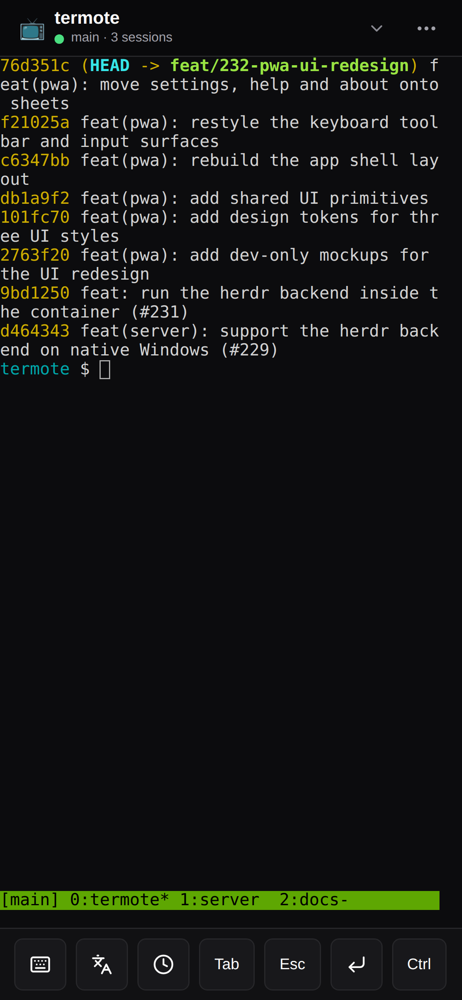
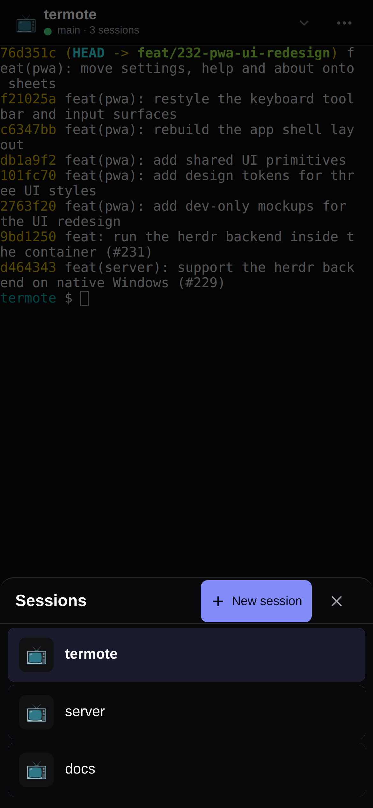
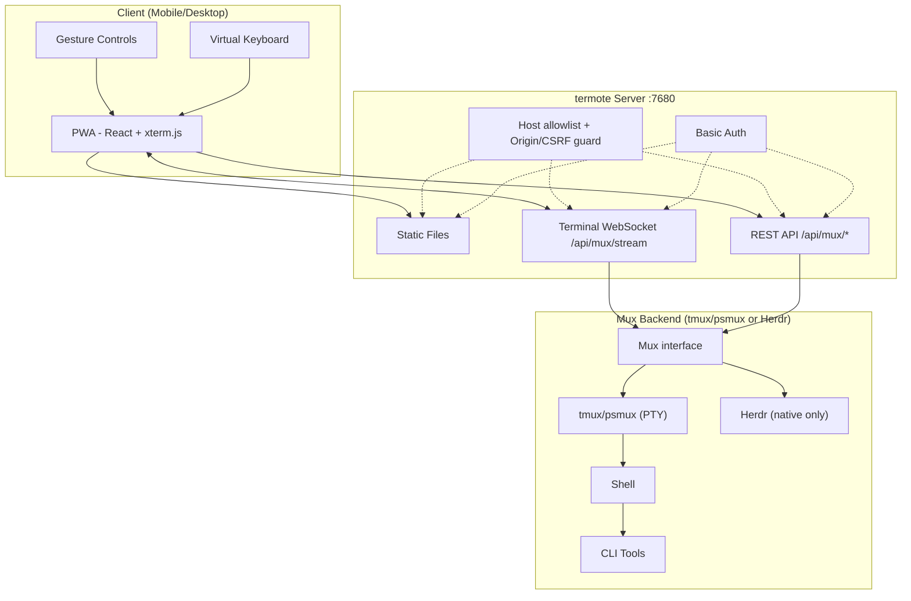
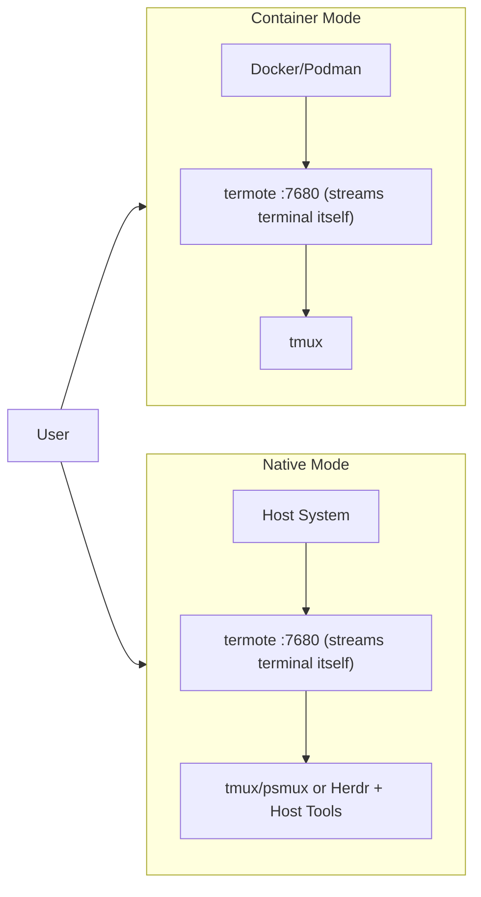

<p align="center">
  
</p>

<p align="center">
  <a href="https://github.com/lamngockhuong/termote/releases"></a>
  <a href="https://github.com/lamngockhuong/termote/actions/workflows/ci.yml"></a>
  <a href="https://github.com/lamngockhuong/termote/blob/main/LICENSE"></a>
  <a href="https://ghcr.io/lamngockhuong/termote"></a>
  <a href="https://hub.docker.com/r/lamngockhuong/termote"></a>
</p>

<p align="center">
  
  
  
  
</p>

<p align="center">
  <a href="https://launch.j2team.dev/products/termote?utm_source=badge-launched&utm_medium=badge&utm_campaign=badge-termote" target="_blank" rel="noopener noreferrer"></a>
  &nbsp;
  <a href="https://unikorn.vn/p/termote?ref=embed-termote" target="_blank"></a>
</p>

Remote control CLI tools (Claude Code, GitHub Copilot, any terminal) from mobile/desktop via PWA.

> [!NOTE]
> Termote 1.0 does not upgrade a 0.x install. Uninstall 0.x as described in the
> [archived 0.x docs](https://termote.ohnice.app/0.x/), then install 1.0 with the
> [Quick Start](#quick-start) commands.

> **Termote** = Terminal + Remote
>
> 🇻🇳 [Tiếng Việt](README.vi.md) | 🇨🇳 [简体中文](README.zh-CN.md) | 🇯🇵 [日本語](README.ja.md) | 🇰🇷 [한국어](README.ko.md) | 🇪🇸 [Español](README.es.md) | 🇧🇷 [Português (BR)](README.pt-BR.md) | 🇫🇷 [Français](README.fr.md) | 🇩🇪 [Deutsch](README.de.md) | 🇷🇺 [Русский](README.ru.md) | 🇮🇩 [Bahasa Indonesia](README.id.md)

## Features

- **Session switching**: Multiple tmux sessions with create/edit/delete
- **Session tabs**: Horizontal tab bar for quick window switching
- **Herdr backend** (native only): drive Herdr workspaces instead of tmux, with per-pane coding-agent status badges — see [Native Installation](https://termote.ohnice.app/installation/native/)
- **Mobile-friendly**: Virtual keyboard toolbar (Tab/Ctrl/Shift/arrows, expandable)
- **Gesture support**: Swipe for Ctrl+C, Tab, scrolling
- **Command history**: Recall previously sent commands with search
- **Quick actions**: Floating menu for common operations (clear, cancel, exit)
- **Connection indicator**: Real-time server status with auto-detect disconnect
- **Update checker**: Automatic new version notification from GitHub releases
- **PWA**: Installable to homescreen, offline-capable
- **Persistent sessions**: tmux keeps sessions alive
- **Collapsible sidebar**: Desktop UI with toggleable session sidebar
- **Fullscreen mode**: Immersive terminal experience
- **Runs as a service**: `termote start` registers a user service (systemd, launchd, Scheduled Task) that starts at login
- **Config persistence**: `termote start` saves its options, with the password stored encrypted

## Screenshots

<p align="center">
  
  &nbsp;&nbsp;
  
</p>

## Architecture


```mermaid
flowchart TB
    subgraph Client["Client (Mobile/Desktop)"]
        PWA["PWA - React + xterm.js"]
        Gestures["Gesture Controls"]
        Keyboard["Virtual Keyboard"]
    end

    subgraph Server["termote Server :7680"]
        Static["Static Files"]
        Stream["Terminal WebSocket /api/mux/stream"]
        API["REST API /api/mux/*"]
        Guard["Host allowlist + Origin/CSRF guard"]
        Auth["Basic Auth"]
    end

    subgraph Backend["Mux Backend (tmux/psmux or Herdr)"]
        Mux["Mux interface"]
        tmux["tmux/psmux (PTY)"]
        herdr["Herdr (native only)"]
        Shell["Shell"]
        Tools["CLI Tools"]
    end

    Gestures --> PWA
    Keyboard --> PWA
    PWA --> Static
    PWA <--> Stream
    PWA --> API
    Guard -.-> Static & Stream & API
    Auth -.-> Static & Stream & API
    Stream --> Mux
    API --> Mux
    Mux --> tmux & herdr
    tmux --> Shell --> Tools
```

termote streams the terminal itself (PTY on Unix, ConPTY on Windows) into xterm.js in the PWA; there is no separate terminal process to proxy to. See [`docs/system-architecture.md`](docs/system-architecture.md) for the full request-guard model.

## Quick Start

> 📖 **New to Termote?** Check out the [Getting Started Guide](docs/getting-started.md) for a complete walkthrough with examples.

**Linux / macOS:**

```bash
curl -fsSL https://termote.ohnice.app/install.sh | sh
termote start
```

**Windows (PowerShell):**

```powershell
irm https://termote.ohnice.app/install.ps1 | iex
termote start
```

The installer needs only `curl`, `tar` and `sha256sum`/`shasum` (PowerShell on Windows), no sudo or admin rights. It verifies the checksum of the archive, installs the `termote` command, and starts nothing. `termote start` saves the options, creates a password the first time (printed once; `termote show-password` shows it again), registers the service and starts it. Open `http://localhost:7680` (Windows: `http://localhost:7690`).

A terminal backend must be installed first: tmux (`sudo apt install tmux`, `brew install tmux`), psmux on Windows (`winget install psmux`), or [Herdr](https://termote.ohnice.app/installation/native/). The first `start` detects which one to use.

### Common options

```bash
termote start --lan                  # Listen on the LAN, not only this machine
termote start --tailscale myhost.ts.net  # Publish over Tailscale HTTPS
termote start --mux herdr            # Drive Herdr workspaces instead of tmux
termote start --no-auth              # Disable basic auth (local use only)
```

Options are saved: a flag not given keeps its saved value, and a boolean is turned off with `=false` (`termote start --lan=false`). The flags are the same on every OS, PowerShell included.

### Everyday commands

```bash
termote status                       # What the running server reports
termote stop                         # Stop (it starts again at the next login)
termote restart                      # Restart with the saved options
termote logs follow                  # Tail the logs
termote show-password                # Print the saved admin password
termote update                       # Update to the latest release
termote uninstall                    # Remove the service, the command and the install
```

`update` switches to the new version, restarts the service and switches back if the new version does not come up. `uninstall` keeps the configuration (`~/.config/termote`) and the logs (`~/.local/state/termote`) and prints both paths.

## Installation

### Pin a version

```bash
curl -fsSL https://termote.ohnice.app/install.sh | TERMOTE_VERSION=1.0.0 sh
termote update --version 1.0.0
```

```powershell
$env:TERMOTE_VERSION='1.0.0'; irm https://termote.ohnice.app/install.ps1 | iex
```

Without `TERMOTE_VERSION` the installer takes the newest stable 1.x release and leaves an existing install alone. With it, that version is installed beside the current one and becomes the active version, which also repairs a broken install.

### Container mode

```bash
termote container up                          # Run the published image (podman or docker)
termote container up --workspace ~/projects   # Mount a directory at /workspace
termote container status
termote container logs -f
termote container down
```

`container up` runs `ghcr.io/lamngockhuong/termote` at the version of the installed `termote`, with podman (preferred) or docker, on port 7680 with `~/termote-workspace` mounted at `/workspace`. It accepts `--port`, `--lan`, `--tailscale`, `--no-auth`, `--allow-host` and `--fresh`, saved apart from the options of `start`; the password is shared with the native server. Docker restarts the container after a reboot; rootless Podman has no daemon to do that, so run it as a Quadlet unit.

> **Security note**: Avoid mounting `$HOME` directly — sensitive directories like `.ssh`, `.gnupg` will be accessible in container. Mount specific project directories instead.

### Docker without the CLI

```bash
# Generates a password, printed in: docker logs termote
docker run -d --name termote -p 7680:7680 \
  -v ~/projects:/workspace \
  ghcr.io/lamngockhuong/termote:latest

# With your own credentials
docker run -d --name termote -p 7680:7680 \
  -e TERMOTE_USER=admin -e TERMOTE_PASS=secret \
  ghcr.io/lamngockhuong/termote:latest
```

| Environment Variable | Description                                   |
| -------------------- | --------------------------------------------- |
| `TERMOTE_USER`       | Basic auth username (default: `admin`)        |
| `TERMOTE_PASS`       | Basic auth password (default: auto-generated) |
| `NO_AUTH`            | Set to `true` to disable authentication       |

### Build from source

```bash
git clone https://github.com/lamngockhuong/termote.git
cd termote
make build
./scripts/termote.sh start
```

`make build` builds the PWA and embeds it in `server/termote`; it needs Go, Node.js and pnpm. `scripts/termote.sh` (Windows: `scripts\termote.ps1`) only runs a checkout: it rebuilds the development binary when a source is newer, then runs it with the same arguments. `termote update` refuses to run in a checkout; use `git pull && make build`.

### Upgrading from 0.x

There is no upgrade from 0.x: 1.0 installs in a new place and does not read the 0.x configuration. Uninstall 0.x as described in the [archived 0.x docs](https://termote.ohnice.app/0.x/), then install 1.0 with the commands above.

## Deployment Modes


```mermaid
flowchart LR
    subgraph Container["Container Mode"]
        direction TB
        C1["Docker/Podman"] --> C2["termote :7680 (streams terminal itself)"] --> C3["tmux"]
    end

    subgraph Native["Native Mode"]
        direction TB
        N1["Host System"] --> N2["termote :7680 (streams terminal itself)"] --> N3["tmux/psmux or Herdr + Host Tools"]
    end

    User["User"] --> Container & Native
```

| Mode      | Command                | Use Case                                                      | Platform              |
| --------- | ---------------------- | ------------------------------------------------------------- | --------------------- |
| Native    | `termote start`        | Host tool access (claude, gh); required for the Herdr backend | macOS, Linux, Windows |
| Container | `termote container up` | Isolated environment                                          | macOS, Linux, Windows |

The native server runs as a user service: a systemd user unit on Linux (a detached process where there is no user systemd, such as WSL2 without systemd), a launchd agent on macOS, a Scheduled Task at logon on Windows.

### Options of `start`

| Flag                        | Description                                                                    |
| --------------------------- | ------------------------------------------------------------------------------ |
| `--port <port>`             | Port (default: 7680, Windows: 7690)                                            |
| `--lan[=false]`             | Listen on every interface (default: localhost only)                            |
| `--tailscale <host[:port]>` | Publish over Tailscale HTTPS (default port 443)                                |
| `--no-tailscale`            | Stop publishing over Tailscale                                                 |
| `--no-auth[=false]`         | Disable basic authentication                                                   |
| `--mux <tmux\|herdr>`       | Terminal backend (default: herdr when it runs, else tmux)                      |
| `--allow-host <name>`       | Allow an extra Host header value (repeatable; no wildcard, see security notes) |
| `--remove-host <name>`      | Remove an allowed Host name (repeatable)                                       |
| `--allow-herdr-no-auth`     | Required together with `--mux herdr --no-auth`                                 |
| `--fresh`                   | Set a new password                                                             |

### With Tailscale HTTPS

Uses `tailscale serve` for automatic HTTPS (no manual cert management):

```bash
termote start --tailscale myhost.ts.net                # Default port 443
termote start --tailscale myhost.ts.net:8765           # Custom port
termote container up --tailscale myhost.ts.net         # Container mode
sudo tailscale set --operator=$USER                    # Linux, once: let termote run tailscale serve
```

The mapping is applied each time the server starts. `stop`, `start --no-tailscale` and `uninstall` remove only Termote's own mapping.

## Platform Support

| Platform | Container | Native | Installer     |
| -------- | --------- | ------ | ------------- |
| Linux    | ✓         | ✓      | `install.sh`  |
| macOS    | ✓         | ✓      | `install.sh`  |
| Windows  | ✓         | ✓      | `install.ps1` |

> **Windows Support**: Container mode requires Docker Desktop or Podman Desktop; native mode requires [psmux](https://github.com/psmux/psmux) (tmux-compatible terminal multiplexer for Windows), installed with `winget install psmux`. The Windows service has not yet been verified on a real machine; report any issues on GitHub.

## Mobile Usage

| Action           | Gesture             |
| ---------------- | ------------------- |
| Cancel/interrupt | Swipe left (Ctrl+C) |
| Tab completion   | Swipe right         |
| Scroll down      | Swipe up            |
| Scroll up        | Swipe down          |
| Paste            | Long press          |
| Font size        | Pinch in/out        |

Virtual toolbar provides: Tab, Esc, Ctrl, Shift, Arrow keys, and common key combos. Supports Ctrl+Shift combinations (paste, copy). Toggle between minimal and expanded mode for additional keys (Home, End, Delete, etc.).

## Project Structure

```
termote/
├── Makefile                # Build/test/run commands
├── Dockerfile              # Container image (termote + tmux)
├── docker-compose.yml      # Development from a checkout only
├── entrypoint.sh           # Container entrypoint
├── docs/                   # Documentation
│   └── images/screenshots/ # App screenshots
├── pwa/                    # React PWA
│   └── src/
│       ├── components/
│       ├── contexts/
│       ├── hooks/
│       ├── types/
│       └── utils/
├── server/                 # Go server + CLI (single binary)
│   ├── main.go             # Entry point (no args = menu, `serve` = server, else CLI)
│   ├── serve.go            # Server (PWA, auth, guards)
│   ├── mux.go              # Mux interface + /api/mux/* routes
│   ├── mux_tmux.go         # tmux/psmux backend
│   ├── mux_herdr.go        # Herdr backend (native only)
│   ├── stream.go           # Terminal WebSocket (xterm.js stream)
│   ├── cli*.go             # start/stop/update/container/logs/menu subcommands
│   └── webui/              # PWA embedded in the binary (filled by make build)
├── scripts/
│   ├── install.sh          # Unix online installer (curl | sh)
│   ├── install.ps1         # Windows online installer (irm | iex)
│   ├── termote.sh          # Unix shim: builds and runs a checkout
│   └── termote.ps1         # Windows PowerShell shim: builds and runs a checkout
├── tests/                  # Test suite
│   ├── test-termote.sh     # Unix shim tests
│   ├── test-termote.ps1    # Windows shim tests
│   ├── test-install.sh     # Unix installer tests
│   ├── test-install.ps1    # Windows installer tests
│   └── test-entrypoints.sh # Container entrypoint tests
└── website/                # Astro Starlight docs site
    └── src/content/docs/   # MDX documentation
```

## Development

```bash
make build          # Build the PWA and embed it in server/termote
make test           # Run all tests
make health         # Check service health
make clean          # Stop containers

# E2E tests (requires running server)
./scripts/termote.sh start           # Start server first
pnpm --filter termote test:e2e       # Run Playwright tests
pnpm --filter termote test:e2e:ui    # Run with UI debugger
```

**Manual Testing:** See [Self-Test Checklist](docs/self-test-checklist.md)

## Troubleshooting

### Session not persisting

- Check tmux: `tmux ls`
- termote attaches with `tmux new-session -A` (attach-or-create)

### WebSocket errors

- Check termote logs: `termote container logs` (container) or `termote logs server` (native)
- The terminal WebSocket is `/api/mux/stream`, served by termote itself — there is no separate terminal process to check

### Mobile keyboard issues

- Ensure viewport meta tag is present
- Test on real device, not emulator

### Native mode: server not starting

```bash
termote status             # What the running server reports
termote logs server        # Or: termote logs follow
lsof -i :7680              # Check what holds the port
termote start --fresh      # If the saved password can no longer be read
```

## Security Notes

- **Default: localhost only** - not exposed to LAN unless `--lan` flag used
- **Basic auth enabled by default** - use `--no-auth` to disable for local dev; the password is created by the first `termote start` and saved encrypted
- **Host allowlist**: requests with an unrecognised `Host` header are rejected (DNS-rebinding protection); add trusted names with `--allow-host`, there is no wildcard to turn the check off
- **Origin/CSRF guards**: state-changing `/api/mux/*` requests and the `/api/mux/stream` WebSocket reject cross-site `Sec-Fetch-Site`/`Origin` and require a same-origin, single-use stream token
- **Built-in brute-force protection** - rate limiting (5 attempts/min per IP)
- **Herdr backend**: exposes every Herdr workspace on the host, so `--mux herdr --no-auth` is refused unless `--allow-herdr-no-auth` is also given
- **Service files hold no secrets**: the systemd unit, launchd agent and Scheduled Task never contain the password
- Use HTTPS (Tailscale) for production
- Restrict to trusted networks/VPN

## Other Projects

| Project                                                     | Description                                                                                                        |
| ----------------------------------------------------------- | ------------------------------------------------------------------------------------------------------------------ |
| [GitHub Flex](https://github.com/lamngockhuong/github-flex) | A cross-browser extension (Chrome & Firefox) that enhances GitHub's interface with productivity features           |
| [TabRest](https://github.com/lamngockhuong/tabrest)         | Chrome extension that automatically unloads inactive tabs to free memory                                           |
| [Specpin](https://github.com/lamngockhuong/specpin)         | Pin living, Git-versioned business specs onto the elements of your running web UI (browser extension + Go sidecar) |

## License

MIT
