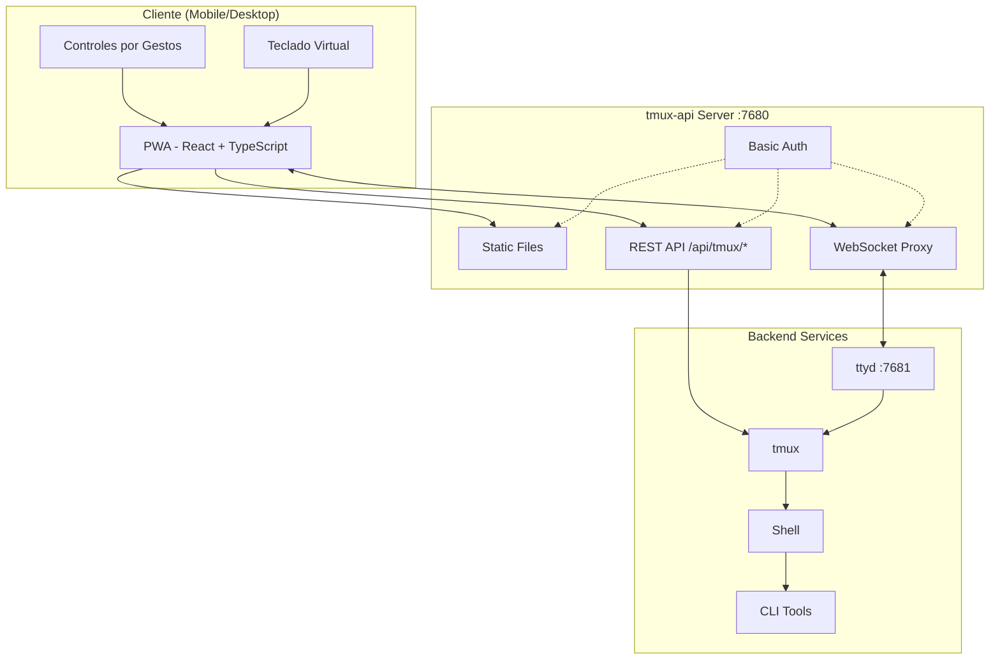
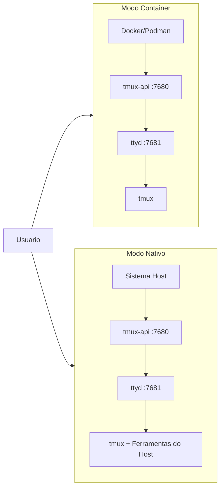

<p align="center">
  
</p>

<p align="center">
  <a href="https://github.com/lamngockhuong/termote/releases"></a>
  <a href="https://github.com/lamngockhuong/termote/actions/workflows/ci.yml"></a>
  <a href="https://github.com/lamngockhuong/termote/blob/main/LICENSE"></a>
  <a href="https://ghcr.io/lamngockhuong/termote"></a>
  <a href="https://hub.docker.com/r/lamngockhuong/termote"></a>
</p>

<p align="center">
  
  
  
  
</p>

<p align="center">
  <a href="https://launch.j2team.dev/products/termote?utm_source=badge-launched&utm_medium=badge&utm_campaign=badge-termote" target="_blank" rel="noopener noreferrer"></a>
  &nbsp;
  <a href="https://unikorn.vn/p/termote?ref=embed-termote" target="_blank"></a>
</p>

Controle remotamente ferramentas CLI (Claude Code, GitHub Copilot, qualquer terminal) de dispositivos moveis/desktop via PWA.

> **Termote** = Terminal + Remote
>
> 🇬🇧 [English](README.md) | 🇻🇳 [Tiếng Việt](README.vi.md) | 🇨🇳 [简体中文](README.zh-CN.md) | 🇯🇵 [日本語](README.ja.md) | 🇰🇷 [한국어](README.ko.md) | 🇪🇸 [Español](README.es.md) | 🇫🇷 [Français](README.fr.md) | 🇩🇪 [Deutsch](README.de.md) | 🇷🇺 [Русский](README.ru.md) | 🇮🇩 [Bahasa Indonesia](README.id.md)

## Funcionalidades

- **Alternancia de sessions**: Multiplas tmux sessions com criar/editar/excluir
- **Abas de sessions**: Barra de abas horizontal para troca rapida entre janelas
- **Otimizado para mobile**: Barra de teclado virtual (Tab/Ctrl/Shift/setas, expansivel)
- **Suporte a gestos**: Deslizar para Ctrl+C, Tab, navegacao no historico
- **Historico de comandos**: Recuperar comandos enviados anteriormente com busca
- **Acoes rapidas**: Menu flutuante para operacoes comuns (clear, cancel, exit)
- **Indicador de conexao**: Status do servidor em tempo real com deteccao automatica de desconexao
- **Verificador de atualizacao**: Notificacao automatica de nova versao do GitHub releases
- **PWA**: Instalavel na tela inicial, funciona offline
- **Sessions persistentes**: tmux mantem as sessions ativas
- **Barra lateral recolhivel**: Interface desktop com barra lateral de sessions alternavel
- **Modo tela cheia**: Experiencia imersiva de terminal
- **Persistencia de configuracao**: Salvamento automatico das configuracoes com senha criptografada AES-256

## Capturas de Tela

<p align="center">
  
  &nbsp;&nbsp;
  
</p>

## Arquitetura



## Inicio Rapido

> 📖 **Novo no Termote?** Confira o [Guia de Inicio](docs/getting-started.md) para um passo a passo completo com exemplos.

```bash
./scripts/termote.sh                   # Menu interativo
./scripts/termote.sh install container # Modo container (docker/podman)
./scripts/termote.sh install native    # Modo nativo (ferramentas do host)
./scripts/termote.sh link              # Criar comando global 'termote'
make test                              # Executar testes
```

> Apos o `link`, use `termote` de qualquer lugar: `termote health`, `termote install native --lan`

> **Dica**: Instale o [gum](https://github.com/charmbracelet/gum) para menus interativos aprimorados (opcional, fallback bash disponivel)

## Instalacao

### Uma linha (recomendado)

**macOS/Linux:**

```bash
# Baixar e perguntar antes de instalar (padrao: modo nativo)
curl -fsSL https://raw.githubusercontent.com/lamngockhuong/termote/main/scripts/get.sh | bash

# Instalar automaticamente sem perguntar
curl -fsSL .../get.sh | bash -s -- --yes

# Apenas baixar (sem instalar)
curl -fsSL .../get.sh | bash -s -- --download-only

# Atualizar automaticamente com config salva
curl -fsSL .../get.sh | bash -s -- --update

# Instalar versao especifica
curl -fsSL .../get.sh | bash -s -- --version 0.0.4

# Com modo e opcoes explicitas
curl -fsSL .../get.sh | bash -s -- --yes --container --lan
curl -fsSL .../get.sh | bash -s -- --yes --native --tailscale myhost

# Forcar nova senha (ignorar config salva)
curl -fsSL .../get.sh | bash -s -- --yes --container --fresh
```

**Windows (PowerShell):**

> **Nota:** Se a execucao de scripts estiver desabilitada no seu sistema, execute isto primeiro:
>
> ```powershell
> Set-ExecutionPolicy -Scope CurrentUser -ExecutionPolicy RemoteSigned
> ```

```powershell
# Baixar e perguntar antes de instalar (padrao: modo nativo)
irm https://raw.githubusercontent.com/lamngockhuong/termote/main/scripts/get.ps1 | iex

# Instalar automaticamente sem perguntar
$env:TERMOTE_AUTO_YES = "true"; irm .../get.ps1 | iex

# Com modo explicito
$env:TERMOTE_MODE = "container"; irm .../get.ps1 | iex

# Atualizar automaticamente com config salva
$env:TERMOTE_UPDATE = "true"; irm .../get.ps1 | iex
```

### Docker

```bash
# Tudo em um (gera credenciais automaticamente, veja logs: docker logs termote)
docker run -d --name termote -p 7680:7680 ghcr.io/lamngockhuong/termote:latest

# Com credenciais personalizadas
docker run -d --name termote -p 7680:7680 \
  -e TERMOTE_USER=admin -e TERMOTE_PASS=secret \
  ghcr.io/lamngockhuong/termote:latest

# Sem autenticacao (apenas dev local)
docker run -d --name termote -p 7680:7680 \
  -e NO_AUTH=true \
  ghcr.io/lamngockhuong/termote:latest

# Com volume para persistencia
docker run -d --name termote -p 7680:7680 \
  -v termote-data:/home/termote \
  ghcr.io/lamngockhuong/termote:latest

# Montar diretorio de workspace personalizado
docker run -d --name termote -p 7680:7680 \
  -v ~/projects:/workspace \
  ghcr.io/lamngockhuong/termote:latest

# Com Tailscale HTTPS (requer Tailscale no host)
docker run -d --name termote -p 7680:7680 \
  -e TERMOTE_USER=admin -e TERMOTE_PASS=secret \
  ghcr.io/lamngockhuong/termote:latest
sudo tailscale serve --bg --https=443 http://127.0.0.1:7680
# Acesse em: https://your-hostname.tailnet-name.ts.net
```

### A Partir de Release

```bash
# Baixar release mais recente
VERSION=$(curl -s https://api.github.com/repos/lamngockhuong/termote/releases/latest | grep tag_name | cut -d '"' -f4)
wget https://github.com/lamngockhuong/termote/releases/download/${VERSION}/termote-${VERSION}.tar.gz
tar xzf termote-${VERSION}.tar.gz
cd termote-${VERSION#v}

# Instalar (menu interativo ou com modo)
./scripts/termote.sh install
./scripts/termote.sh install container
```

### A Partir do Codigo Fonte

```bash
git clone https://github.com/lamngockhuong/termote.git
cd termote
./scripts/termote.sh install container
```

> **Nota**: `termote.sh` e a CLI unificada que suporta `install` (compila do fonte, usa artefatos pre-compilados quando disponiveis), `uninstall` e `health`.

## Modos de Implantacao



| Modo          | Descricao        | Caso de Uso                               | Plataforma   |
| ------------- | ---------------- | ----------------------------------------- | ------------ |
| `--container` | Modo container   | Implantacao simples, ambiente isolado      | macOS, Linux |
| `--native`    | Totalmente nativo | Acesso a ferramentas do host (claude, gh) | macOS, Linux |

### Opcoes

| Flag                        | Descricao                                            |
| --------------------------- | ---------------------------------------------------- |
| `--lan`                     | Expor na LAN (padrao: apenas localhost)              |
| `--tailscale <host[:port]>` | Habilitar Tailscale HTTPS                            |
| `--no-auth`                 | Desabilitar autenticacao basica                      |
| `--port <port>`             | Porta do host (padrao: 7680, Windows: 7690)          |
| `--fresh`                   | Forcar nova senha (ignorar config salva)             |
| `--update`                  | Atualizar automaticamente com config salva           |
| `--version <ver>`           | Instalar versao especifica (com ou sem `v`)          |

| Variavel de Ambiente | Descricao                                            |
| -------------------- | ---------------------------------------------------- |
| `WORKSPACE`          | Diretorio do host para montar (padrao: `./workspace`) |
| `TERMOTE_USER`       | Usuario de autenticacao (padrao: gerado automaticamente) |
| `TERMOTE_PASS`       | Senha de autenticacao (padrao: gerada automaticamente)   |
| `NO_AUTH`            | Defina como `true` para desabilitar autenticacao     |

### Modo Container (recomendado pela simplicidade)

Os scripts detectam automaticamente `podman` ou `docker` — ambos funcionam de forma identica.

```bash
./scripts/termote.sh install container             # localhost com basic auth
./scripts/termote.sh install container --no-auth   # localhost sem auth
./scripts/termote.sh install container --lan       # Acessivel pela LAN
# Acesse: http://localhost:7680

# Diretorio de workspace personalizado (montado em /workspace no container)
WORKSPACE=~/projects ./scripts/termote.sh install container
WORKSPACE=/path/to/code make install-container
```

> **Nota de seguranca**: Evite montar `$HOME` diretamente — diretorios sensiveis como `.ssh`, `.gnupg` ficarao acessiveis no container. Monte diretorios de projeto especificos.

### Nativo (recomendado para acesso a binarios do host)

Use quando precisar acessar binarios do host (claude, git, etc.):

```bash
# Linux
sudo apt install ttyd tmux
# Ou: sudo snap install ttyd
./scripts/termote.sh install native

# macOS
brew install ttyd tmux go
./scripts/termote.sh install native
# Acesse: http://localhost:7680
```

### Com Tailscale HTTPS (todos os modos)

Usa `tailscale serve` para HTTPS automatico (sem gerenciamento manual de certificados):

```bash
# Apenas Tailscale (porta padrao 443)
./scripts/termote.sh install container --tailscale myhost.ts.net

# Porta personalizada
./scripts/termote.sh install native --tailscale myhost.ts.net:8765

# Tailscale + acessivel pela LAN
./scripts/termote.sh install container --tailscale myhost.ts.net --lan

# Acesse: https://myhost.ts.net (ou :8765 para porta personalizada)
```

### Desinstalar

```bash
./scripts/termote.sh uninstall container   # Modo container
./scripts/termote.sh uninstall native      # Modo nativo
./scripts/termote.sh uninstall all         # Tudo
```

### Atualizacao

```bash
# Opcao 1: Atualizar automaticamente com config salva
curl -fsSL .../get.sh | bash -s -- --update

# Opcao 2: Executar novamente o one-liner (compara versoes, pergunta antes de instalar)
curl -fsSL .../get.sh | bash

# Opcao 3: Atualizacao manual
./scripts/termote.sh uninstall [container|native]
git pull origin main                    # Se instalado do codigo fonte
./scripts/termote.sh install [container|native] [--lan] [--tailscale ...]
```

## Suporte a Plataformas

| Plataforma | Container        | Nativo           | CLI Script  |
| ---------- | ---------------- | ---------------- | ----------- |
| Linux      | ✓                | ✓                | termote.sh  |
| macOS      | ✓                | ✓                | termote.sh  |
| Windows    | ⚠️ (experimental) | ⚠️ (experimental) | termote.ps1 |

> **⚠️ Suporte ao Windows (Experimental)**: O suporte ao Windows esta em estagio inicial e precisa de mais testes. O modo container requer Docker Desktop, o modo nativo requer psmux. Por favor, reporte problemas no GitHub.

### Modo Nativo Windows

O modo nativo Windows usa [psmux](https://github.com/psmux/psmux) (multiplexador de terminal compativel com tmux para Windows):

```powershell
# Instalar psmux
winget install psmux

# Executar Termote
.\scripts\termote.ps1 install native
.\scripts\termote.ps1 install container  # Ou modo container com Docker Desktop
```

## Uso no Mobile

| Acao               | Gesto               |
| ------------------ | -------------------- |
| Cancelar/interromper | Deslizar para esquerda (Ctrl+C) |
| Tab completion     | Deslizar para direita |
| Historico acima    | Deslizar para cima    |
| Historico abaixo   | Deslizar para baixo   |
| Colar              | Pressionar longo      |
| Tamanho da fonte   | Pincar para dentro/fora |

A barra de ferramentas virtual oferece: Tab, Esc, Ctrl, Shift, teclas de seta e combinacoes de teclas comuns. Suporta combinacoes Ctrl+Shift (colar, copiar). Alterne entre modo minimo e expandido para teclas adicionais (Home, End, Delete, etc.).

## Estrutura do Projeto

```
termote/
├── Makefile                # Comandos de build/test/deploy
├── Dockerfile              # Modo Docker (tmux-api + ttyd)
├── docker-compose.yml
├── entrypoint.sh           # Entrypoint do Docker
├── docs/                   # Documentacao
│   └── images/screenshots/ # Capturas de tela do app
├── pwa/                    # React PWA
│   └── src/
│       ├── components/
│       ├── contexts/
│       ├── hooks/
│       ├── types/
│       └── utils/
├── tmux-api/               # Servidor Go
│   ├── main.go             # Ponto de entrada
│   ├── serve.go            # Servidor (PWA, proxy, auth)
│   └── tmux.go             # Handlers da API tmux
├── scripts/
│   ├── termote.sh          # CLI Unix (install/uninstall/health)
│   ├── termote.ps1         # CLI Windows PowerShell
│   ├── get.sh              # Instalador online Unix (curl | bash)
│   └── get.ps1             # Instalador online Windows (irm | iex)
├── tests/                  # Suite de testes
│   ├── test-termote.sh
│   ├── test-termote.ps1    # Testes Windows
│   ├── test-get.sh
│   └── test-entrypoints.sh
└── website/                # Site de docs Astro Starlight
    └── src/content/docs/   # Documentacao MDX
```

## Desenvolvimento

```bash
make build          # Compilar PWA e tmux-api
make test           # Executar todos os testes
make health         # Verificar saude do servico
make clean          # Parar containers

# Testes E2E (requer servidor em execucao)
./scripts/termote.sh install container  # Iniciar servidor primeiro
cd pwa && pnpm test:e2e       # Executar testes Playwright
cd pwa && pnpm test:e2e:ui    # Executar com UI debugger
```

**Teste Manual:** Veja a [Lista de Verificacao](docs/self-test-checklist.md)

## Solucao de Problemas

### Session nao persiste

- Verifique o tmux: `tmux ls`
- Confirme que o ttyd usa a flag `-A` (attach-or-create)

### Erros de WebSocket

- Verifique os logs do tmux-api: `docker logs termote`
- Confirme que o ttyd esta rodando na porta 7681

### Problemas com teclado no mobile

- Certifique-se de que a meta tag viewport esta presente
- Teste em um dispositivo real, nao em emulador

### Modo nativo: processos nao iniciam

```bash
ps aux | grep ttyd         # Verificar se o ttyd esta rodando
ps aux | grep tmux-api     # Verificar se o tmux-api esta rodando
lsof -i :7680              # Confirmar que a porta esta em uso
```

## Notas de Seguranca

- **Padrao: apenas localhost** - nao exposto na LAN a menos que a flag `--lan` seja usada
- **Basic auth habilitado por padrao** - use `--no-auth` para desabilitar no dev local
- **Protecao contra brute-force integrada** - rate limiting (5 tentativas/min por IP)
- Use HTTPS (Tailscale) para producao
- Restrinja a redes confiaveis/VPN

## Outros Projetos

| Projeto | Descricao |
|---------|-----------|
| [GitHub Flex](https://github.com/lamngockhuong/github-flex) | Extensao multi-navegador (Chrome e Firefox) que aprimora a interface do GitHub com recursos de produtividade |
| [TabRest](https://github.com/lamngockhuong/tabrest) | Extensao do Chrome que descarrega automaticamente abas inativas para liberar memoria |

## Licenca

MIT
