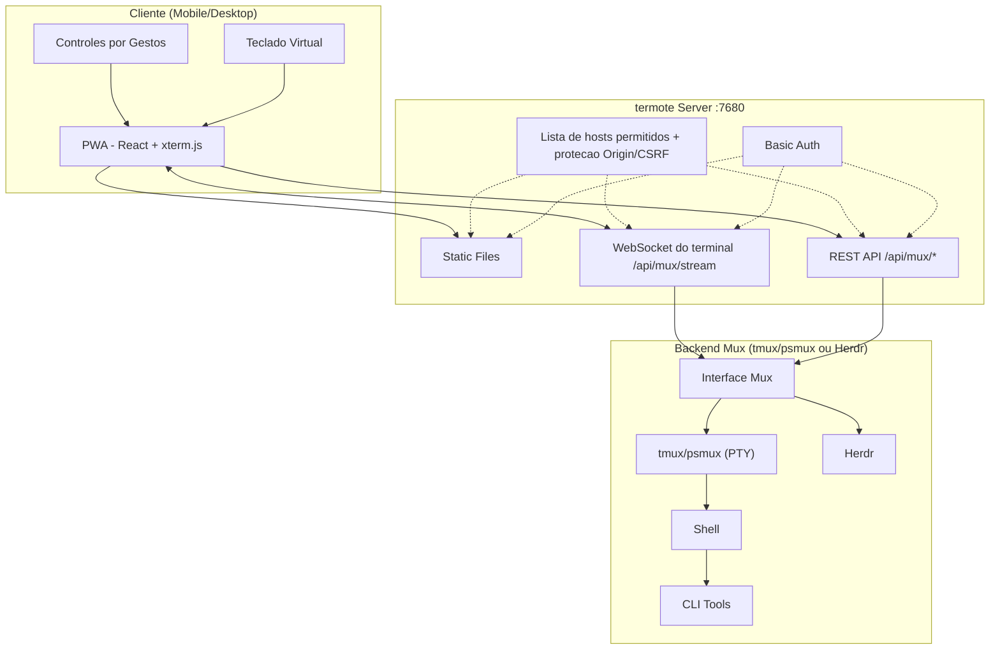
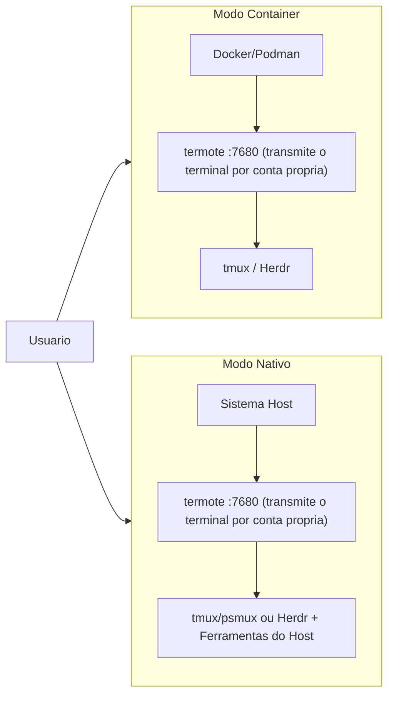

<p align="center">
  <picture>
    <source media="(prefers-color-scheme: dark)" srcset="assets/branding/termote/social/banner-readme-dark.svg" />
    
  </picture>
</p>

<p align="center">
  <a href="https://github.com/lamngockhuong/termote/releases"></a>
  <a href="https://github.com/lamngockhuong/termote/actions/workflows/ci.yml"></a>
  <a href="https://github.com/lamngockhuong/termote/blob/main/LICENSE"></a>
  <a href="https://ghcr.io/lamngockhuong/termote"></a>
  <a href="https://hub.docker.com/r/lamngockhuong/termote"></a>
</p>

<p align="center">
  
  
  
  
</p>

<p align="center">
  <a href="https://launch.j2team.dev/products/termote?utm_source=badge-launched&utm_medium=badge&utm_campaign=badge-termote" target="_blank" rel="noopener noreferrer"></a>
  &nbsp;
  <a href="https://unikorn.vn/p/termote?ref=embed-termote" target="_blank"></a>
</p>

Controle remotamente ferramentas CLI (Claude Code, GitHub Copilot, qualquer terminal) de dispositivos moveis/desktop via PWA.

> [!NOTE]
> O Termote 1.0 nao atualiza uma instalacao 0.x. Desinstale o 0.x conforme a
> [documentacao arquivada do 0.x](https://termote.ohnice.app/0.x/) e depois instale o 1.0 com
> os comandos do [Inicio Rapido](#inicio-rapido).

> **Termote** = Terminal + Remote
>
> 🇬🇧 [English](README.md) | 🇻🇳 [Tiếng Việt](README.vi.md) | 🇨🇳 [简体中文](README.zh-CN.md) | 🇯🇵 [日本語](README.ja.md) | 🇰🇷 [한국어](README.ko.md) | 🇪🇸 [Español](README.es.md) | 🇫🇷 [Français](README.fr.md) | 🇩🇪 [Deutsch](README.de.md) | 🇷🇺 [Русский](README.ru.md) | 🇮🇩 [Bahasa Indonesia](README.id.md)

## Funcionalidades

- **Alternancia de sessions**: Multiplas tmux sessions com criar/editar/excluir
- **Abas de sessions**: Barra de abas horizontal para troca rapida entre janelas
- **Backend Herdr** (nativo ou no contêiner): controle workspaces do Herdr em vez do tmux, com selos de status do agente de codigo em cada painel — veja [Instalacao nativa](https://termote.ohnice.app/installation/native/)
- **Visualizacao Chat**: leia e responda como um chat a um painel que executa Claude Code (ou Codex iniciado com `--no-daemon`), com sugestoes de comandos slash e respostas a dialogos — veja [Agent Chat](https://termote.ohnice.app/usage/agent-chat/)
- **Visualizacoes Files e Changes**: navegue pelo diretorio de um painel e suas alteracoes no git, com pre-visualizacao de Markdown — veja [Files and Changes](https://termote.ohnice.app/usage/files-changes/)
- **Anexos de imagem**: envie uma imagem do celular para o terminal ou para uma mensagem da visualizacao Chat, para que o agente a leia pelo caminho
- **Plugin do Herdr**: abra no Termote o painel do Herdr em foco, mostre o link dele como QR code para o celular e inicie ou pare o servidor, sem sair do Herdr — veja [Herdr Plugin](https://termote.ohnice.app/usage/herdr-plugin/)
- **Otimizado para mobile**: Barra de teclado virtual (Tab/Ctrl/Shift/setas, expansivel)
- **Suporte a gestos**: Deslizar para Ctrl+C, Tab, rolagem
- **Historico de comandos**: Recuperar comandos enviados anteriormente com busca
- **Acoes rapidas**: A tecla ⋯ fixada no fim da barra mobile mostra uma linha Actions com operacoes comuns (clear, cancel, exit)
- **Estilos de interface**: Neutral, Terminal ou Native, escolhidos nas Configuracoes, independentes do tema claro/escuro
- **Indicador de conexao**: Status do servidor em tempo real com deteccao automatica de desconexao
- **Verificador de atualizacao**: Notificacao automatica de nova versao do GitHub releases
- **PWA**: Instalavel na tela inicial, funciona offline
- **Sessions persistentes**: tmux mantem as sessions ativas
- **Barra lateral recolhivel**: Interface desktop com barra lateral de sessions alternavel
- **Modo tela cheia**: Experiencia imersiva de terminal
- **Roda como servico**: `termote start` registra um servico do usuario (systemd, launchd, Tarefa Agendada) que inicia no login
- **Persistencia de configuracao**: `termote start` salva suas opcoes, com a senha armazenada criptografada

## Capturas de Tela

<p align="center">
  
  &nbsp;&nbsp;
  
</p>

<p align="center">
  
</p>

<p align="center">
  
</p>

## Arquitetura


```mermaid
flowchart TB
    subgraph Client["Cliente (Mobile/Desktop)"]
        PWA["PWA - React + xterm.js"]
        Gestures["Controles por Gestos"]
        Keyboard["Teclado Virtual"]
    end

    subgraph Server["termote Server :7680"]
        Static["Static Files"]
        Stream["WebSocket do terminal /api/mux/stream"]
        API["REST API /api/mux/*"]
        Guard["Lista de hosts permitidos + protecao Origin/CSRF"]
        Auth["Basic Auth"]
    end

    subgraph Backend["Backend Mux (tmux/psmux ou Herdr)"]
        Mux["Interface Mux"]
        tmux["tmux/psmux (PTY)"]
        herdr["Herdr"]
        Shell["Shell"]
        Tools["CLI Tools"]
    end

    Gestures --> PWA
    Keyboard --> PWA
    PWA --> Static
    PWA <--> Stream
    PWA --> API
    Guard -.-> Static & Stream & API
    Auth -.-> Static & Stream & API
    Stream --> Mux
    API --> Mux
    Mux --> tmux & herdr
    tmux --> Shell --> Tools
```

O termote transmite o proprio terminal (PTY no Unix, ConPTY no Windows) para o xterm.js na PWA; nao existe mais um processo de terminal separado para fazer proxy. O modelo completo de protecao de requisicoes esta em [`docs/system-architecture.md`](docs/system-architecture.md).

## Inicio Rapido

> 📖 **Novo no Termote?** Confira o [Guia de Inicio](docs/getting-started.md) para um passo a passo completo com exemplos.

**Linux / macOS:**

```bash
curl -fsSL https://termote.ohnice.app/install.sh | sh
termote start
```

**Windows (PowerShell):**

```powershell
irm https://termote.ohnice.app/install.ps1 | iex
termote start
```

O instalador precisa apenas de `curl`, `tar` e `sha256sum`/`shasum` (PowerShell no Windows), sem sudo nem permissao de administrador. Ele verifica o checksum do arquivo, instala o comando `termote` e nao inicia nada. `termote start` salva as opcoes, cria uma senha na primeira vez (exibida uma unica vez; `termote show-password` mostra de novo), registra o servico e o inicia. Abra `http://localhost:7680` (Windows: `http://localhost:7690`).

Um backend de terminal precisa estar instalado antes: tmux (`sudo apt install tmux`, `brew install tmux`), psmux no Windows (`winget install psmux`) ou [Herdr](https://termote.ohnice.app/installation/native/). O primeiro `start` detecta qual usar.

### Opcoes comuns

```bash
termote start --lan                  # Listen on the LAN, not only this machine
termote start --tailscale myhost.ts.net  # Publish over Tailscale HTTPS
termote start --mux herdr            # Drive Herdr workspaces instead of tmux
termote start --no-auth              # Disable basic auth (local use only)
```

As opcoes ficam salvas: uma flag nao informada mantem o valor salvo, e uma opcao booleana e desligada com `=false` (`termote start --lan=false`). As flags sao as mesmas em todos os sistemas, inclusive no PowerShell.

### Comandos do dia a dia

```bash
termote status                       # What the running server reports
termote stop                         # Stop (it starts again at the next login)
termote restart                      # Restart with the saved options
termote logs follow                  # Tail the logs
termote show-password                # Print the saved admin password
termote update                       # Update to the latest release
termote uninstall                    # Remove the service, the command and the install
```

`update` troca para a nova versao, reinicia o servico e volta para a anterior se a nova versao nao subir. `uninstall` mantem a configuracao (`~/.config/termote`) e os logs (`~/.local/state/termote`) e exibe os dois caminhos.

## Instalacao

### Fixar uma versao

```bash
curl -fsSL https://termote.ohnice.app/install.sh | TERMOTE_VERSION=1.0.0 sh
termote update --version 1.0.0
```

```powershell
$env:TERMOTE_VERSION='1.0.0'; irm https://termote.ohnice.app/install.ps1 | iex
```

Sem `TERMOTE_VERSION`, o instalador usa a release estavel 1.x mais recente e nao mexe em uma instalacao existente. Com ela, essa versao e instalada ao lado da atual e passa a ser a versao ativa, o que tambem repara uma instalacao quebrada.

### Modo Container

```bash
termote container up                          # Run the published image (podman or docker)
termote container up --workspace ~/projects   # Mount a directory at /workspace
termote container status
termote container logs -f
termote container down
```

`container up` executa `ghcr.io/lamngockhuong/termote` na versao do `termote` instalado, com podman (preferido) ou docker, na porta 7680, com `~/termote-workspace` montado em `/workspace`. Ele aceita `--port`, `--lan`, `--tailscale`, `--no-auth`, `--allow-host`, `--user` e `--fresh`, salvos separadamente das opcoes de `start`; o usuario e a senha sao compartilhados com o servidor nativo. O Docker reinicia o container apos um reboot; o Podman rootless nao tem daemon para isso, entao execute-o como uma unidade Quadlet.

> **Nota de seguranca**: Evite montar `$HOME` diretamente — diretorios sensiveis como `.ssh`, `.gnupg` ficarao acessiveis no container. Monte apenas diretorios de projeto especificos.

### Docker sem a CLI

```bash
# Generates a password, printed in: docker logs termote
docker run -d --name termote -p 7680:7680 \
  -v ~/projects:/workspace \
  ghcr.io/lamngockhuong/termote:latest

# With your own credentials
docker run -d --name termote -p 7680:7680 \
  -e TERMOTE_USER=admin -e TERMOTE_PASS=secret \
  ghcr.io/lamngockhuong/termote:latest
```

| Variavel de Ambiente | Descricao                                                     |
| -------------------- | ------------------------------------------------------------- |
| `TERMOTE_USER`       | Usuario da autenticacao basica (padrao: `admin`)              |
| `TERMOTE_PASS`       | Senha da autenticacao basica (padrao: gerada automaticamente) |
| `NO_AUTH`            | Defina como `true` para desativar a autenticacao              |

### Compilar a partir do codigo fonte

```bash
git clone https://github.com/lamngockhuong/termote.git
cd termote
make build
./scripts/termote.sh start
```

`make build` compila o PWA e o embute em `server/termote`; requer Go, Node.js e pnpm. `scripts/termote.sh` (Windows: `scripts\termote.ps1`) so executa um checkout: recompila o binario de desenvolvimento quando algum fonte e mais novo e o executa com os mesmos argumentos. `termote update` se recusa a rodar em um checkout; use `git pull && make build`.

### Atualizando a partir do 0.x

Nao ha atualizacao a partir do 0.x: o 1.0 e instalado em outro local e nao le a configuracao do 0.x. Desinstale o 0.x conforme a [documentacao arquivada do 0.x](https://termote.ohnice.app/0.x/) e depois instale o 1.0 com os comandos acima.

## Modos de Implantacao


```mermaid
flowchart LR
    subgraph Container["Modo Container"]
        direction TB
        C1["Docker/Podman"] --> C2["termote :7680 (transmite o terminal por conta propria)"] --> C3["tmux / Herdr"]
    end

    subgraph Native["Modo Nativo"]
        direction TB
        N1["Sistema Host"] --> N2["termote :7680 (transmite o terminal por conta propria)"] --> N3["tmux/psmux ou Herdr + Ferramentas do Host"]
    end

    User["Usuario"] --> Container & Native
```

| Modo      | Comando                | Caso de Uso                               | Plataforma            |
| --------- | ---------------------- | ----------------------------------------- | --------------------- |
| Nativo    | `termote start`        | Acesso a ferramentas do host (claude, gh) | macOS, Linux, Windows |
| Container | `termote container up` | Ambiente isolado                          | macOS, Linux, Windows |

O servidor nativo roda como servico do usuario: uma unidade systemd de usuario no Linux (um processo desanexado quando nao ha systemd de usuario, como no WSL2 sem systemd), um agente launchd no macOS e uma Tarefa Agendada no logon no Windows.

### Opcoes de `start`

| Flag                        | Descricao                                                                                      |
| --------------------------- | ---------------------------------------------------------------------------------------------- |
| `--port <port>`             | Porta (padrao: 7680, Windows: 7690)                                                            |
| `--lan[=false]`             | Escutar em todas as interfaces (padrao: apenas localhost)                                      |
| `--tailscale <host[:port]>` | Publicar via Tailscale HTTPS (porta padrao 443)                                                |
| `--no-tailscale`            | Parar de publicar via Tailscale                                                                |
| `--no-auth[=false]`         | Desativar a autenticacao basica                                                                |
| `--mux <tmux\|herdr>`       | Backend do terminal (padrao: herdr quando estiver rodando, senao tmux)                         |
| `--allow-host <name>`       | Permitir um valor extra no cabecalho Host (repetivel; sem curinga, veja as notas de seguranca) |
| `--remove-host <name>`      | Remover um nome de Host permitido (repetivel)                                                  |
| `--allow-herdr-no-auth`     | Obrigatorio junto com `--mux herdr --no-auth`                                                  |
| `--user <name>`             | Nome de usuario de login (padrao: `admin`; compartilhado com o container)                      |
| `--fresh`                   | Definir uma nova senha                                                                         |

### Com Tailscale HTTPS

Usa `tailscale serve` para HTTPS automatico (sem gerenciar certificados manualmente):

```bash
termote start --tailscale myhost.ts.net                # Default port 443
termote start --tailscale myhost.ts.net:8765           # Custom port
termote container up --tailscale myhost.ts.net         # Container mode
sudo tailscale set --operator=$USER                    # Linux, once: let termote run tailscale serve
```

O mapeamento e aplicado toda vez que o servidor inicia. `stop`, `start --no-tailscale` e `uninstall` removem apenas o mapeamento do proprio Termote.

## Suporte a Plataformas

| Plataforma | Container | Nativo | Instalador    |
| ---------- | --------- | ------ | ------------- |
| Linux      | ✓         | ✓      | `install.sh`  |
| macOS      | ✓         | ✓      | `install.sh`  |
| Windows    | ✓         | ✓      | `install.ps1` |

> **Suporte ao Windows**: O modo container requer Docker Desktop ou Podman Desktop; o modo nativo requer o [psmux](https://github.com/psmux/psmux) (multiplexador de terminal compativel com tmux para Windows), instalado com `winget install psmux`, ou um servidor [Herdr](https://herdr.dev/#install) em execucao. O servico no Windows ainda nao foi verificado em uma maquina real; reporte qualquer problema no GitHub.

## Uso no Mobile

| Acao                 | Gesto                           |
| -------------------- | ------------------------------- |
| Cancelar/interromper | Deslizar para esquerda (Ctrl+C) |
| Tab completion       | Deslizar para direita           |
| Rolar para baixo     | Deslizar para cima              |
| Rolar para cima      | Deslizar para baixo             |
| Colar                | Pressionar longo                |
| Tamanho da fonte     | Pincar para dentro/fora         |

A barra de ferramentas virtual oferece: Tab, Esc, Ctrl, Shift, teclas de seta e combinacoes de teclas comuns. Suporta combinacoes Ctrl+Shift (colar, copiar). Alterne entre modo minimo e expandido para teclas adicionais (Home, End, Delete, etc.).

## Estrutura do Projeto

```
termote/
├── Makefile                # Build/test/run commands
├── Dockerfile              # Container image (termote + tmux + herdr)
├── docker-compose.yml      # Development from a checkout only
├── entrypoint.sh           # Container entrypoint
├── docs/                   # Documentation
│   └── images/screenshots/ # App screenshots
├── pwa/                    # React PWA
│   └── src/
│       ├── components/
│       ├── contexts/
│       ├── hooks/
│       ├── types/
│       └── utils/
├── server/                 # Go server + CLI (single binary)
│   ├── main.go             # Entry point (no args = menu, `serve` = server, else CLI)
│   ├── serve.go            # Server (PWA, auth, guards)
│   ├── mux.go              # Mux interface + /api/mux/* routes
│   ├── mux_tmux.go         # tmux/psmux backend
│   ├── mux_herdr.go        # Herdr backend
│   ├── stream.go           # Terminal WebSocket (xterm.js stream)
│   ├── cli*.go             # start/stop/update/container/logs/menu subcommands
│   └── webui/              # PWA embedded in the binary (filled by make build)
├── scripts/
│   ├── install.sh          # Unix online installer (curl | sh)
│   ├── install.ps1         # Windows online installer (irm | iex)
│   ├── termote.sh          # Unix shim: builds and runs a checkout
│   └── termote.ps1         # Windows PowerShell shim: builds and runs a checkout
├── tests/                  # Test suite
│   ├── test-termote.sh     # Unix shim tests
│   ├── test-termote.ps1    # Windows shim tests
│   ├── test-install.sh     # Unix installer tests
│   ├── test-install.ps1    # Windows installer tests
│   └── test-entrypoints.sh # Container entrypoint tests
└── website/                # Astro Starlight docs site
    └── src/content/docs/   # MDX documentation
```

## Desenvolvimento

```bash
make build          # Build the PWA and embed it in server/termote
make test           # Run all tests
make health         # Check service health
make clean          # Stop containers

# E2E tests (requires running server)
./scripts/termote.sh start           # Start server first
pnpm --filter termote test:e2e       # Run Playwright tests
pnpm --filter termote test:e2e:ui    # Run with UI debugger
```

**Testes Manuais:** Veja o [Self-Test Checklist](docs/self-test-checklist.md)

## Solucao de Problemas

### Session nao persiste

- Verifique o tmux: `tmux ls`
- O termote se conecta com `tmux new-session -A` (attach-or-create)

### Erros de WebSocket

- Verifique os logs do termote: `termote container logs` (container) ou `termote logs server` (nativo)
- O WebSocket do terminal e `/api/mux/stream`, servido pelo proprio termote — nao ha processo de terminal separado para verificar

### Problemas com teclado no mobile

- Certifique-se de que a meta tag viewport esta presente
- Teste em um dispositivo real, nao em emulador

### Modo nativo: servidor nao inicia

```bash
termote status             # What the running server reports
termote logs server        # Or: termote logs follow
lsof -i :7680              # Check what holds the port
termote start --fresh      # If the saved password can no longer be read
```

## Notas de Seguranca

- **Padrao: apenas localhost** - nao exposto a LAN a menos que a flag `--lan` seja usada
- **Autenticacao basica ativada por padrao** - use `--no-auth` para desativar em desenvolvimento local; a senha e criada pelo primeiro `termote start` e salva criptografada
- **Allowlist de Host**: requisicoes com cabecalho `Host` desconhecido sao rejeitadas (protecao contra DNS rebinding); adicione nomes confiaveis com `--allow-host`, nao ha curinga para desligar a verificacao
- **Protecoes Origin/CSRF**: requisicoes `/api/mux/*` que alteram estado e o WebSocket `/api/mux/stream` rejeitam `Sec-Fetch-Site`/`Origin` de outros sites e exigem um token de stream de uso unico, da mesma origem
- **Protecao integrada contra forca bruta** - limitacao de taxa (5 tentativas falhas/min por IP, 20/min por IPv6 /64)
- **Backend Herdr**: expoe todos os workspaces do Herdr no host, por isso `--mux herdr --no-auth` e recusado a menos que `--allow-herdr-no-auth` tambem seja informado
- **Arquivos de servico sem segredos**: a unidade systemd, o agente launchd e a Tarefa Agendada nunca contem a senha
- Use HTTPS (Tailscale) em producao
- Restrinja a redes confiaveis/VPN

## Outros Projetos

| Projeto                                                     | Descricao                                                                                                                                      |
| ----------------------------------------------------------- | ---------------------------------------------------------------------------------------------------------------------------------------------- |
| [GitHub Flex](https://github.com/lamngockhuong/github-flex) | Extensao multi-navegador (Chrome e Firefox) que aprimora a interface do GitHub com recursos de produtividade                                   |
| [TabRest](https://github.com/lamngockhuong/tabrest)         | Extensao do Chrome que descarrega automaticamente abas inativas para liberar memoria                                                           |
| [Specpin](https://github.com/lamngockhuong/specpin)         | Fixa especificacoes de negocio vivas e versionadas com Git nos elementos da sua interface web em execucao (extensao de navegador + sidecar Go) |

## Licenca

MIT
