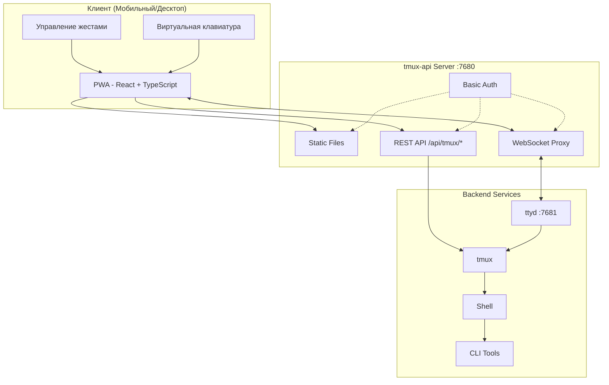
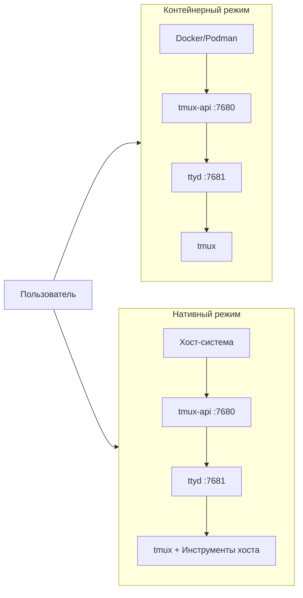

<p align="center">
  
</p>

<p align="center">
  <a href="https://github.com/lamngockhuong/termote/releases"></a>
  <a href="https://github.com/lamngockhuong/termote/actions/workflows/ci.yml"></a>
  <a href="https://github.com/lamngockhuong/termote/blob/main/LICENSE"></a>
  <a href="https://ghcr.io/lamngockhuong/termote"></a>
  <a href="https://hub.docker.com/r/lamngockhuong/termote"></a>
</p>

<p align="center">
  
  
  
  
</p>

<p align="center">
  <a href="https://launch.j2team.dev/products/termote?utm_source=badge-launched&utm_medium=badge&utm_campaign=badge-termote" target="_blank" rel="noopener noreferrer"></a>
  &nbsp;
  <a href="https://unikorn.vn/p/termote?ref=embed-termote" target="_blank"></a>
</p>

Удалённое управление CLI-инструментами (Claude Code, GitHub Copilot, любой терминал) с мобильных устройств и десктопа через PWA.

> **Termote** = Terminal + Remote
>
> 🇬🇧 [English](README.md) | 🇻🇳 [Tiếng Việt](README.vi.md) | 🇨🇳 [简体中文](README.zh-CN.md) | 🇯🇵 [日本語](README.ja.md) | 🇰🇷 [한국어](README.ko.md) | 🇪🇸 [Español](README.es.md) | 🇧🇷 [Português (BR)](README.pt-BR.md) | 🇫🇷 [Français](README.fr.md) | 🇩🇪 [Deutsch](README.de.md) | 🇮🇩 [Bahasa Indonesia](README.id.md)

## Возможности

- **Переключение сессий**: Множество tmux-сессий с созданием/редактированием/удалением
- **Вкладки сессий**: Горизонтальная панель вкладок для быстрого переключения окон
- **Мобильная адаптация**: Виртуальная клавиатура (Tab/Ctrl/Shift/стрелки, расширяемая)
- **Поддержка жестов**: Свайп для Ctrl+C, Tab, навигации по истории
- **История команд**: Вызов ранее отправленных команд с поиском
- **Быстрые действия**: Плавающее меню для частых операций (clear, cancel, exit)
- **Индикатор соединения**: Статус сервера в реальном времени с автоопределением разрыва
- **Проверка обновлений**: Автоматическое уведомление о новой версии из GitHub releases
- **PWA**: Устанавливается на домашний экран, работает офлайн
- **Постоянные сессии**: tmux сохраняет сессии активными
- **Сворачиваемая боковая панель**: Десктопный интерфейс с переключаемой боковой панелью сессий
- **Полноэкранный режим**: Погружение в терминал на весь экран
- **Сохранение конфигурации**: Автосохранение настроек установки с шифрованием пароля AES-256

## Скриншоты

<p align="center">
  
  &nbsp;&nbsp;
  
</p>

## Архитектура



## Быстрый старт

> 📖 **Впервые используете Termote?** Ознакомьтесь с [Руководством по началу работы](docs/getting-started.md) для полного прохождения с примерами.

```bash
./scripts/termote.sh                   # Интерактивное меню
./scripts/termote.sh install container # Контейнерный режим (docker/podman)
./scripts/termote.sh install native    # Нативный режим (инструменты хоста)
./scripts/termote.sh link              # Создать глобальную команду 'termote'
make test                              # Запустить тесты
```

> После `link` используйте `termote` из любого места: `termote health`, `termote install native --lan`
>
> **Совет**: Установите [gum](https://github.com/charmbracelet/gum) для улучшенных интерактивных меню (опционально, есть fallback на bash)

## Установка

### Одной командой (рекомендуется)

**macOS/Linux:**

```bash
# Скачать и спросить перед установкой (по умолчанию native mode)
curl -fsSL https://raw.githubusercontent.com/lamngockhuong/termote/main/scripts/get.sh | bash

# Автоустановка без запроса
curl -fsSL .../get.sh | bash -s -- --yes

# Только скачать (без установки)
curl -fsSL .../get.sh | bash -s -- --download-only

# Автообновление с сохранённой конфигурацией
curl -fsSL .../get.sh | bash -s -- --update

# Установить конкретную версию
curl -fsSL .../get.sh | bash -s -- --version 0.0.4

# С явным режимом и параметрами
curl -fsSL .../get.sh | bash -s -- --yes --container --lan
curl -fsSL .../get.sh | bash -s -- --yes --native --tailscale myhost

# Принудительный ввод нового пароля (игнорировать сохранённую конфигурацию)
curl -fsSL .../get.sh | bash -s -- --yes --container --fresh
```

**Windows (PowerShell):**

> **Примечание:** Если выполнение скриптов отключено в вашей системе, сначала выполните:
>
> ```powershell
> Set-ExecutionPolicy -Scope CurrentUser -ExecutionPolicy RemoteSigned
> ```

```powershell
# Скачать и спросить перед установкой (по умолчанию native mode)
irm https://raw.githubusercontent.com/lamngockhuong/termote/main/scripts/get.ps1 | iex

# Автоустановка без запроса
$env:TERMOTE_AUTO_YES = "true"; irm .../get.ps1 | iex

# С явным режимом
$env:TERMOTE_MODE = "container"; irm .../get.ps1 | iex

# Автообновление с сохранённой конфигурацией
$env:TERMOTE_UPDATE = "true"; irm .../get.ps1 | iex
```

### Docker

```bash
# Всё-в-одном (автогенерация учётных данных, смотрите логи: docker logs termote)
docker run -d --name termote -p 7680:7680 ghcr.io/lamngockhuong/termote:latest

# С пользовательскими учётными данными
docker run -d --name termote -p 7680:7680 \
  -e TERMOTE_USER=admin -e TERMOTE_PASS=secret \
  ghcr.io/lamngockhuong/termote:latest

# Без аутентификации (только для локальной разработки)
docker run -d --name termote -p 7680:7680 \
  -e NO_AUTH=true \
  ghcr.io/lamngockhuong/termote:latest

# С volume для сохранения данных
docker run -d --name termote -p 7680:7680 \
  -v termote-data:/home/termote \
  ghcr.io/lamngockhuong/termote:latest

# Монтирование пользовательской рабочей директории
docker run -d --name termote -p 7680:7680 \
  -v ~/projects:/workspace \
  ghcr.io/lamngockhuong/termote:latest

# С Tailscale HTTPS (требуется Tailscale на хосте)
docker run -d --name termote -p 7680:7680 \
  -e TERMOTE_USER=admin -e TERMOTE_PASS=secret \
  ghcr.io/lamngockhuong/termote:latest
sudo tailscale serve --bg --https=443 http://127.0.0.1:7680
# Доступ по адресу: https://your-hostname.tailnet-name.ts.net
```

### Из релиза

```bash
# Скачать последний релиз
VERSION=$(curl -s https://api.github.com/repos/lamngockhuong/termote/releases/latest | grep tag_name | cut -d '"' -f4)
wget https://github.com/lamngockhuong/termote/releases/download/${VERSION}/termote-${VERSION}.tar.gz
tar xzf termote-${VERSION}.tar.gz
cd termote-${VERSION#v}

# Установка (интерактивное меню или с указанием режима)
./scripts/termote.sh install
./scripts/termote.sh install container
```

### Из исходного кода

```bash
git clone https://github.com/lamngockhuong/termote.git
cd termote
./scripts/termote.sh install container
```

> **Примечание**: `termote.sh` — это единый CLI, поддерживающий `install` (сборка из исходников, использование готовых артефактов при наличии), `uninstall` и `health`.

## Режимы развёртывания



| Режим         | Описание            | Сценарий использования                      | Платформа    |
| ------------- | ------------------- | ------------------------------------------- | ------------ |
| `--container` | Контейнерный режим  | Простое развёртывание, изолированная среда   | macOS, Linux |
| `--native`    | Полностью нативный  | Доступ к инструментам хоста (claude, gh)     | macOS, Linux |

### Параметры

| Флаг                        | Описание                                              |
| --------------------------- | ----------------------------------------------------- |
| `--lan`                     | Открыть доступ по LAN (по умолчанию: только localhost) |
| `--tailscale <host[:port]>` | Включить Tailscale HTTPS                              |
| `--no-auth`                 | Отключить базовую аутентификацию                       |
| `--port <port>`             | Порт хоста (по умолчанию: 7680, Windows: 7690)        |
| `--fresh`                   | Принудительный ввод нового пароля (игнорировать сохранённую конфигурацию) |
| `--update`                  | Автообновление с сохранённой конфигурацией             |
| `--version <ver>`           | Установить конкретную версию (с `v` или без)           |

| Переменная окружения | Описание                                              |
| -------------------- | ----------------------------------------------------- |
| `WORKSPACE`          | Директория хоста для монтирования (по умолчанию: `./workspace`) |
| `TERMOTE_USER`       | Имя пользователя для аутентификации (по умолчанию: автогенерация) |
| `TERMOTE_PASS`       | Пароль для аутентификации (по умолчанию: автогенерация) |
| `NO_AUTH`            | Установите `true` для отключения аутентификации        |

### Контейнерный режим (рекомендуется для простоты)

Скрипты автоматически определяют `podman` или `docker` — оба работают одинаково.

```bash
./scripts/termote.sh install container             # localhost с basic auth
./scripts/termote.sh install container --no-auth   # localhost без аутентификации
./scripts/termote.sh install container --lan       # Доступ по LAN
# Доступ: http://localhost:7680

# Пользовательская рабочая директория (монтируется в /workspace в контейнере)
WORKSPACE=~/projects ./scripts/termote.sh install container
WORKSPACE=/path/to/code make install-container
```

> **Примечание по безопасности**: Избегайте монтирования `$HOME` напрямую — конфиденциальные директории вроде `.ssh`, `.gnupg` будут доступны в контейнере. Монтируйте конкретные директории проектов.

### Нативный режим (рекомендуется для доступа к бинарникам хоста)

Используйте, когда нужен доступ к бинарникам хоста (claude, git и т.д.):

```bash
# Linux
sudo apt install ttyd tmux
# Или: sudo snap install ttyd
./scripts/termote.sh install native

# macOS
brew install ttyd tmux go
./scripts/termote.sh install native
# Доступ: http://localhost:7680
```

### С Tailscale HTTPS (все режимы)

Использует `tailscale serve` для автоматического HTTPS (без ручного управления сертификатами):

```bash
# Только Tailscale (порт по умолчанию 443)
./scripts/termote.sh install container --tailscale myhost.ts.net

# Пользовательский порт
./scripts/termote.sh install native --tailscale myhost.ts.net:8765

# Tailscale + доступ по LAN
./scripts/termote.sh install container --tailscale myhost.ts.net --lan

# Доступ: https://myhost.ts.net (или :8765 для пользовательского порта)
```

### Удаление

```bash
./scripts/termote.sh uninstall container   # Контейнерный режим
./scripts/termote.sh uninstall native      # Нативный режим
./scripts/termote.sh uninstall all         # Всё
```

### Обновление

```bash
# Способ 1: Автообновление с сохранённой конфигурацией
curl -fsSL .../get.sh | bash -s -- --update

# Способ 2: Повторный запуск one-liner (сравнивает версии, спрашивает перед установкой)
curl -fsSL .../get.sh | bash

# Способ 3: Ручное обновление
./scripts/termote.sh uninstall [container|native]
git pull origin main                    # Если установлено из исходного кода
./scripts/termote.sh install [container|native] [--lan] [--tailscale ...]
```

## Поддержка платформ

| Платформа | Container            | Native               | CLI-скрипт  |
| --------- | -------------------- | -------------------- | ----------- |
| Linux     | ✓                    | ✓                    | termote.sh  |
| macOS     | ✓                    | ✓                    | termote.sh  |
| Windows   | ⚠️ (экспериментально) | ⚠️ (экспериментально) | termote.ps1 |

> **⚠️ Поддержка Windows (экспериментально)**: Поддержка Windows находится на ранней стадии и требует дополнительного тестирования. Контейнерный режим требует Docker Desktop, нативный режим требует psmux. Пожалуйста, сообщайте об ошибках на GitHub.

### Нативный режим Windows

Нативный режим Windows использует [psmux](https://github.com/psmux/psmux) (tmux-совместимый терминальный мультиплексор для Windows):

```powershell
# Установить psmux
winget install psmux

# Запустить Termote
.\scripts\termote.ps1 install native
.\scripts\termote.ps1 install container  # Или контейнерный режим с Docker Desktop
```

## Мобильное использование

| Действие              | Жест                |
| --------------------- | ------------------- |
| Отмена/прерывание     | Свайп влево (Ctrl+C) |
| Автодополнение Tab    | Свайп вправо        |
| История вверх         | Свайп вверх         |
| История вниз          | Свайп вниз          |
| Вставка               | Долгое нажатие      |
| Размер шрифта         | Щипок (увеличение/уменьшение) |

Виртуальная панель инструментов предоставляет: Tab, Esc, Ctrl, Shift, клавиши-стрелки и часто используемые комбинации клавиш. Поддерживает комбинации Ctrl+Shift (вставка, копирование). Переключение между минимальным и расширенным режимом для дополнительных клавиш (Home, End, Delete и т.д.).

## Структура проекта

```
termote/
├── Makefile                # Команды build/test/deploy
├── Dockerfile              # Docker mode (tmux-api + ttyd)
├── docker-compose.yml
├── entrypoint.sh           # Docker entrypoint
├── docs/                   # Документация
│   └── images/screenshots/ # Скриншоты приложения
├── pwa/                    # React PWA
│   └── src/
│       ├── components/
│       ├── contexts/
│       ├── hooks/
│       ├── types/
│       └── utils/
├── tmux-api/               # Go server
│   ├── main.go             # Точка входа
│   ├── serve.go            # Сервер (PWA, proxy, auth)
│   └── tmux.go             # Обработчики tmux API
├── scripts/
│   ├── termote.sh          # Unix CLI (install/uninstall/health)
│   ├── termote.ps1         # Windows PowerShell CLI
│   ├── get.sh              # Unix онлайн-установщик (curl | bash)
│   └── get.ps1             # Windows онлайн-установщик (irm | iex)
├── tests/                  # Набор тестов
│   ├── test-termote.sh
│   ├── test-termote.ps1    # Windows тесты
│   ├── test-get.sh
│   └── test-entrypoints.sh
└── website/                # Сайт документации Astro Starlight
    └── src/content/docs/   # MDX-документация
```

## Разработка

```bash
make build          # Сборка PWA и tmux-api
make test           # Запуск всех тестов
make health         # Проверка состояния сервисов
make clean          # Остановка контейнеров

# E2E тесты (требуется запущенный сервер)
./scripts/termote.sh install container  # Сначала запустите сервер
cd pwa && pnpm test:e2e       # Запуск Playwright тестов
cd pwa && pnpm test:e2e:ui    # Запуск с UI отладчиком
```

**Ручное тестирование:** См. [Чек-лист для самопроверки](docs/self-test-checklist.md)

## Устранение неполадок

### Сессия не сохраняется

- Проверьте tmux: `tmux ls`
- Убедитесь, что ttyd использует флаг `-A` (attach-or-create)

### Ошибки WebSocket

- Проверьте логи tmux-api: `docker logs termote`
- Убедитесь, что ttyd работает на порту 7681

### Проблемы с мобильной клавиатурой

- Убедитесь в наличии viewport meta tag
- Тестируйте на реальном устройстве, а не в эмуляторе

### Нативный режим: процессы не запускаются

```bash
ps aux | grep ttyd         # Проверить, работает ли ttyd
ps aux | grep tmux-api     # Проверить, работает ли tmux-api
lsof -i :7680              # Убедиться, что порт используется
```

## Примечания по безопасности

- **По умолчанию: только localhost** — не открывается в LAN без флага `--lan`
- **Basic auth включён по умолчанию** — используйте `--no-auth` для отключения при локальной разработке
- **Встроенная защита от брутфорса** — ограничение запросов (5 попыток/мин на IP)
- Используйте HTTPS (Tailscale) для production
- Ограничьте доступ доверенными сетями/VPN

## Другие проекты

| Проект | Описание |
|--------|----------|
| [GitHub Flex](https://github.com/lamngockhuong/github-flex) | Кроссбраузерное расширение (Chrome и Firefox), улучшающее интерфейс GitHub функциями для повышения продуктивности |

## Лицензия

MIT
