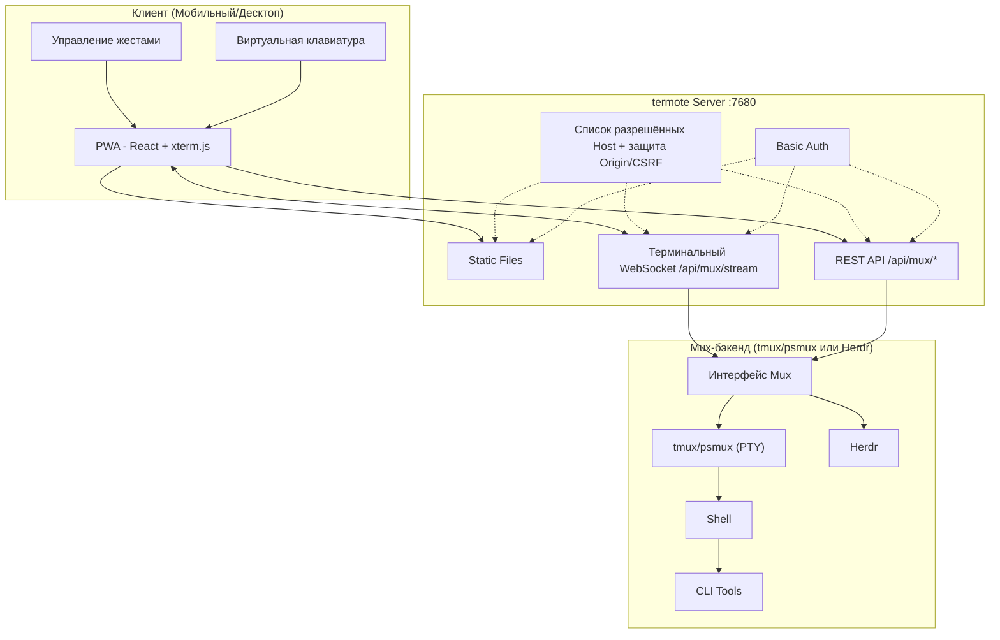
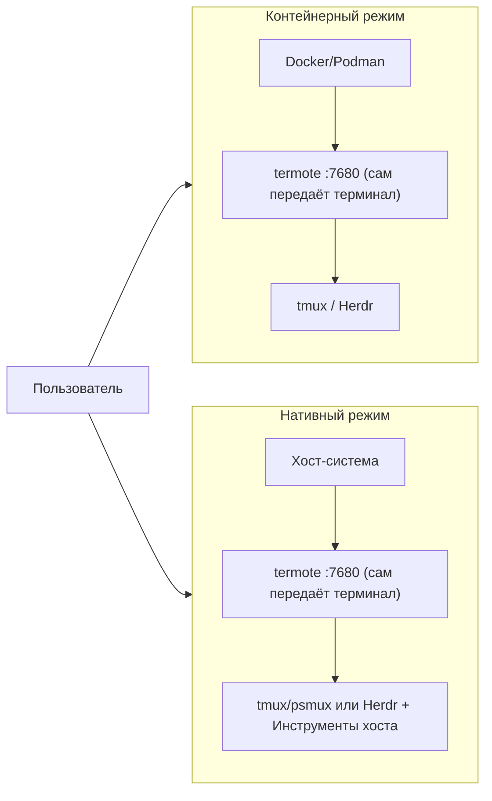

<p align="center">
  
</p>

<p align="center">
  <a href="https://github.com/lamngockhuong/termote/releases"></a>
  <a href="https://github.com/lamngockhuong/termote/actions/workflows/ci.yml"></a>
  <a href="https://github.com/lamngockhuong/termote/blob/main/LICENSE"></a>
  <a href="https://ghcr.io/lamngockhuong/termote"></a>
  <a href="https://hub.docker.com/r/lamngockhuong/termote"></a>
</p>

<p align="center">
  
  
  
  
</p>

<p align="center">
  <a href="https://launch.j2team.dev/products/termote?utm_source=badge-launched&utm_medium=badge&utm_campaign=badge-termote" target="_blank" rel="noopener noreferrer"></a>
  &nbsp;
  <a href="https://unikorn.vn/p/termote?ref=embed-termote" target="_blank"></a>
</p>

Удалённое управление CLI-инструментами (Claude Code, GitHub Copilot, любой терминал) с мобильных устройств и десктопа через PWA.

> [!NOTE]
> Termote 1.0 не обновляет установку 0.x. Удалите 0.x, как описано в
> [архивной документации 0.x](https://termote.ohnice.app/0.x/), затем установите 1.0
> командами из раздела [Быстрый старт](#быстрый-старт).

> **Termote** = Terminal + Remote
>
> 🇬🇧 [English](README.md) | 🇻🇳 [Tiếng Việt](README.vi.md) | 🇨🇳 [简体中文](README.zh-CN.md) | 🇯🇵 [日本語](README.ja.md) | 🇰🇷 [한국어](README.ko.md) | 🇪🇸 [Español](README.es.md) | 🇧🇷 [Português (BR)](README.pt-BR.md) | 🇫🇷 [Français](README.fr.md) | 🇩🇪 [Deutsch](README.de.md) | 🇮🇩 [Bahasa Indonesia](README.id.md)

## Возможности

- **Переключение сессий**: Множество tmux-сессий с созданием/редактированием/удалением
- **Вкладки сессий**: Горизонтальная панель вкладок для быстрого переключения окон
- **Бэкенд Herdr** (нативно или в контейнере): управление рабочими пространствами Herdr вместо tmux, со значками состояния ИИ-агента в каждой панели — см. [Нативная установка](https://termote.ohnice.app/installation/native/)
- **Мобильная адаптация**: Виртуальная клавиатура (Tab/Ctrl/Shift/стрелки, расширяемая)
- **Поддержка жестов**: Свайп для Ctrl+C, Tab, прокрутки
- **История команд**: Вызов ранее отправленных команд с поиском
- **Быстрые действия**: Клавиша ⚡ на мобильной панели открывает лист с частыми операциями (clear, cancel, exit)
- **Стили интерфейса**: Neutral, Terminal или Native, выбираются в настройках независимо от светлой/тёмной темы
- **Индикатор соединения**: Статус сервера в реальном времени с автоопределением разрыва
- **Проверка обновлений**: Автоматическое уведомление о новой версии из GitHub releases
- **PWA**: Устанавливается на домашний экран, работает офлайн
- **Постоянные сессии**: tmux сохраняет сессии активными
- **Сворачиваемая боковая панель**: Десктопный интерфейс с переключаемой боковой панелью сессий
- **Полноэкранный режим**: Погружение в терминал на весь экран
- **Работа как служба**: `termote start` регистрирует пользовательскую службу (systemd, launchd, Scheduled Task), которая запускается при входе в систему
- **Сохранение конфигурации**: `termote start` сохраняет свои параметры, пароль хранится в зашифрованном виде

## Скриншоты

<p align="center">
  
  &nbsp;&nbsp;
  
</p>

<p align="center">
  
</p>

<p align="center">
  
</p>

## Архитектура


```mermaid
flowchart TB
    subgraph Client["Клиент (Мобильный/Десктоп)"]
        PWA["PWA - React + xterm.js"]
        Gestures["Управление жестами"]
        Keyboard["Виртуальная клавиатура"]
    end

    subgraph Server["termote Server :7680"]
        Static["Static Files"]
        Stream["Терминальный WebSocket /api/mux/stream"]
        API["REST API /api/mux/*"]
        Guard["Список разрешённых Host + защита Origin/CSRF"]
        Auth["Basic Auth"]
    end

    subgraph Backend["Mux-бэкенд (tmux/psmux или Herdr)"]
        Mux["Интерфейс Mux"]
        tmux["tmux/psmux (PTY)"]
        herdr["Herdr"]
        Shell["Shell"]
        Tools["CLI Tools"]
    end

    Gestures --> PWA
    Keyboard --> PWA
    PWA --> Static
    PWA <--> Stream
    PWA --> API
    Guard -.-> Static & Stream & API
    Auth -.-> Static & Stream & API
    Stream --> Mux
    API --> Mux
    Mux --> tmux & herdr
    tmux --> Shell --> Tools
```

termote сам передаёт поток терминала (PTY в Unix, ConPTY в Windows) в xterm.js внутри PWA, поэтому отдельного терминального процесса, к которому нужно проксировать, больше нет. Полная модель защиты запросов описана в [`docs/system-architecture.md`](docs/system-architecture.md).

## Быстрый старт

> 📖 **Впервые с Termote?** Посмотрите [Руководство по началу работы](docs/getting-started.md) — полное пошаговое описание с примерами.

**Linux / macOS:**

```bash
curl -fsSL https://termote.ohnice.app/install.sh | sh
termote start
```

**Windows (PowerShell):**

```powershell
irm https://termote.ohnice.app/install.ps1 | iex
termote start
```

Установщику нужны только `curl`, `tar` и `sha256sum`/`shasum` (в Windows — PowerShell), без sudo и прав администратора. Он проверяет контрольную сумму архива, устанавливает команду `termote` и ничего не запускает. `termote start` сохраняет параметры, при первом запуске создаёт пароль (выводится один раз; `termote show-password` покажет его снова), регистрирует службу и запускает её. Откройте `http://localhost:7680` (Windows: `http://localhost:7690`).

Сначала должен быть установлен терминальный бэкенд: tmux (`sudo apt install tmux`, `brew install tmux`), psmux в Windows (`winget install psmux`) или [Herdr](https://termote.ohnice.app/installation/native/). Первый `start` сам определяет, какой из них использовать.

### Основные параметры

```bash
termote start --lan                  # Listen on the LAN, not only this machine
termote start --tailscale myhost.ts.net  # Publish over Tailscale HTTPS
termote start --mux herdr            # Drive Herdr workspaces instead of tmux
termote start --no-auth              # Disable basic auth (local use only)
```

Параметры сохраняются: не указанный флаг сохраняет прежнее значение, а логический параметр выключается через `=false` (`termote start --lan=false`). Флаги одинаковы во всех ОС, включая PowerShell.

### Повседневные команды

```bash
termote status                       # What the running server reports
termote stop                         # Stop (it starts again at the next login)
termote restart                      # Restart with the saved options
termote logs follow                  # Tail the logs
termote show-password                # Print the saved admin password
termote update                       # Update to the latest release
termote uninstall                    # Remove the service, the command and the install
```

`update` переключается на новую версию, перезапускает службу и возвращается к прежней, если новая версия не поднялась. `uninstall` оставляет конфигурацию (`~/.config/termote`) и логи (`~/.local/state/termote`) и выводит оба пути.

## Установка

### Фиксация версии

```bash
curl -fsSL https://termote.ohnice.app/install.sh | TERMOTE_VERSION=1.0.0 sh
termote update --version 1.0.0
```

```powershell
$env:TERMOTE_VERSION='1.0.0'; irm https://termote.ohnice.app/install.ps1 | iex
```

Без `TERMOTE_VERSION` установщик берёт самый новый стабильный релиз 1.x и не трогает существующую установку. С этой переменной указанная версия ставится рядом с текущей и становится активной — так же можно восстановить сломанную установку.

### Контейнерный режим

```bash
termote container up                          # Run the published image (podman or docker)
termote container up --workspace ~/projects   # Mount a directory at /workspace
termote container status
termote container logs -f
termote container down
```

`container up` запускает `ghcr.io/lamngockhuong/termote` той же версии, что и установленный `termote`, через podman (предпочтительно) или docker, на порту 7680 с `~/termote-workspace`, смонтированным в `/workspace`. Команда принимает `--port`, `--lan`, `--tailscale`, `--no-auth`, `--allow-host` и `--fresh`; они сохраняются отдельно от параметров `start`, а пароль общий с нативным сервером. Docker перезапускает контейнер после перезагрузки; у rootless Podman нет демона для этого, поэтому запускайте его как юнит Quadlet.

> **Примечание по безопасности**: Не монтируйте `$HOME` напрямую — чувствительные каталоги, такие как `.ssh`, `.gnupg`, станут доступны в контейнере. Монтируйте только конкретные каталоги проектов.

### Docker без CLI

```bash
# Generates a password, printed in: docker logs termote
docker run -d --name termote -p 7680:7680 \
  -v ~/projects:/workspace \
  ghcr.io/lamngockhuong/termote:latest

# With your own credentials
docker run -d --name termote -p 7680:7680 \
  -e TERMOTE_USER=admin -e TERMOTE_PASS=secret \
  ghcr.io/lamngockhuong/termote:latest
```

| Переменная окружения | Описание                                                                     |
| -------------------- | ---------------------------------------------------------------------------- |
| `TERMOTE_USER`       | Имя пользователя для базовой аутентификации (по умолчанию: `admin`)          |
| `TERMOTE_PASS`       | Пароль для базовой аутентификации (по умолчанию: генерируется автоматически) |
| `NO_AUTH`            | Установите `true`, чтобы отключить аутентификацию                            |

### Сборка из исходного кода

```bash
git clone https://github.com/lamngockhuong/termote.git
cd termote
make build
./scripts/termote.sh start
```

`make build` собирает PWA и встраивает его в `server/termote`; нужны Go, Node.js и pnpm. `scripts/termote.sh` (Windows: `scripts\termote.ps1`) работает только с рабочей копией репозитория: пересобирает бинарник для разработки, если какой-либо исходник новее, и запускает его с теми же аргументами. `termote update` отказывается работать в рабочей копии; используйте `git pull && make build`.

### Обновление с 0.x

Обновления с 0.x нет: 1.0 устанавливается в другое место и не читает конфигурацию 0.x. Удалите 0.x, как описано в [архивной документации 0.x](https://termote.ohnice.app/0.x/), затем установите 1.0 командами выше.

## Режимы развёртывания


```mermaid
flowchart LR
    subgraph Container["Контейнерный режим"]
        direction TB
        C1["Docker/Podman"] --> C2["termote :7680 (сам передаёт терминал)"] --> C3["tmux / Herdr"]
    end

    subgraph Native["Нативный режим"]
        direction TB
        N1["Хост-система"] --> N2["termote :7680 (сам передаёт терминал)"] --> N3["tmux/psmux или Herdr + Инструменты хоста"]
    end

    User["Пользователь"] --> Container & Native
```

| Режим        | Команда                | Сценарий использования                   | Платформа             |
| ------------ | ---------------------- | ---------------------------------------- | --------------------- |
| Нативный     | `termote start`        | Доступ к инструментам хоста (claude, gh) | macOS, Linux, Windows |
| Контейнерный | `termote container up` | Изолированная среда                      | macOS, Linux, Windows |

Нативный сервер работает как пользовательская служба: пользовательский юнит systemd в Linux (отсоединённый процесс, если пользовательского systemd нет, например в WSL2 без systemd), агент launchd в macOS и задача планировщика (Scheduled Task) при входе в систему в Windows.

### Параметры `start`

| Флаг                        | Описание                                                                                                                      |
| --------------------------- | ----------------------------------------------------------------------------------------------------------------------------- |
| `--port <port>`             | Порт (по умолчанию: 7680, Windows: 7690)                                                                                      |
| `--lan[=false]`             | Слушать на всех интерфейсах (по умолчанию: только localhost)                                                                  |
| `--tailscale <host[:port]>` | Публиковать через Tailscale HTTPS (порт по умолчанию 443)                                                                     |
| `--no-tailscale`            | Прекратить публикацию через Tailscale                                                                                         |
| `--no-auth[=false]`         | Отключить базовую аутентификацию                                                                                              |
| `--mux <tmux\|herdr>`       | Терминальный бэкенд (по умолчанию: herdr, если он запущен, иначе tmux)                                                        |
| `--allow-host <name>`       | Разрешить дополнительное значение заголовка Host (можно повторять; без подстановочных знаков, см. примечания по безопасности) |
| `--remove-host <name>`      | Удалить разрешённое имя Host (можно повторять)                                                                                |
| `--allow-herdr-no-auth`     | Обязателен вместе с `--mux herdr --no-auth`                                                                                   |
| `--fresh`                   | Задать новый пароль                                                                                                           |

### С Tailscale HTTPS

Использует `tailscale serve` для автоматического HTTPS (без ручного управления сертификатами):

```bash
termote start --tailscale myhost.ts.net                # Default port 443
termote start --tailscale myhost.ts.net:8765           # Custom port
termote container up --tailscale myhost.ts.net         # Container mode
sudo tailscale set --operator=$USER                    # Linux, once: let termote run tailscale serve
```

Сопоставление применяется при каждом запуске сервера. `stop`, `start --no-tailscale` и `uninstall` удаляют только собственное сопоставление Termote.

## Поддержка платформ

| Платформа | Контейнер | Нативный | Установщик    |
| --------- | --------- | -------- | ------------- |
| Linux     | ✓         | ✓        | `install.sh`  |
| macOS     | ✓         | ✓        | `install.sh`  |
| Windows   | ✓         | ✓        | `install.ps1` |

> **Поддержка Windows**: Контейнерному режиму нужен Docker Desktop или Podman Desktop; нативному режиму — [psmux](https://github.com/psmux/psmux) (tmux-совместимый терминальный мультиплексор для Windows), который устанавливается командой `winget install psmux`, либо запущенный сервер [Herdr](https://herdr.dev/#install). Работа службы в Windows ещё не проверена на реальной машине; сообщайте о любых проблемах на GitHub.

## Мобильное использование

| Действие           | Жест                          |
| ------------------ | ----------------------------- |
| Отмена/прерывание  | Свайп влево (Ctrl+C)          |
| Автодополнение Tab | Свайп вправо                  |
| Прокрутка вниз     | Свайп вверх                   |
| Прокрутка вверх    | Свайп вниз                    |
| Вставка            | Долгое нажатие                |
| Размер шрифта      | Щипок (увеличение/уменьшение) |

Виртуальная панель инструментов предоставляет: Tab, Esc, Ctrl, Shift, клавиши-стрелки и часто используемые комбинации клавиш. Поддерживает комбинации Ctrl+Shift (вставка, копирование). Переключение между минимальным и расширенным режимом для дополнительных клавиш (Home, End, Delete и т.д.).

## Структура проекта

```
termote/
├── Makefile                # Build/test/run commands
├── Dockerfile              # Container image (termote + tmux + herdr)
├── docker-compose.yml      # Development from a checkout only
├── entrypoint.sh           # Container entrypoint
├── docs/                   # Documentation
│   └── images/screenshots/ # App screenshots
├── pwa/                    # React PWA
│   └── src/
│       ├── components/
│       ├── contexts/
│       ├── hooks/
│       ├── types/
│       └── utils/
├── server/                 # Go server + CLI (single binary)
│   ├── main.go             # Entry point (no args = menu, `serve` = server, else CLI)
│   ├── serve.go            # Server (PWA, auth, guards)
│   ├── mux.go              # Mux interface + /api/mux/* routes
│   ├── mux_tmux.go         # tmux/psmux backend
│   ├── mux_herdr.go        # Herdr backend
│   ├── stream.go           # Terminal WebSocket (xterm.js stream)
│   ├── cli*.go             # start/stop/update/container/logs/menu subcommands
│   └── webui/              # PWA embedded in the binary (filled by make build)
├── scripts/
│   ├── install.sh          # Unix online installer (curl | sh)
│   ├── install.ps1         # Windows online installer (irm | iex)
│   ├── termote.sh          # Unix shim: builds and runs a checkout
│   └── termote.ps1         # Windows PowerShell shim: builds and runs a checkout
├── tests/                  # Test suite
│   ├── test-termote.sh     # Unix shim tests
│   ├── test-termote.ps1    # Windows shim tests
│   ├── test-install.sh     # Unix installer tests
│   ├── test-install.ps1    # Windows installer tests
│   └── test-entrypoints.sh # Container entrypoint tests
└── website/                # Astro Starlight docs site
    └── src/content/docs/   # MDX documentation
```

## Разработка

```bash
make build          # Build the PWA and embed it in server/termote
make test           # Run all tests
make health         # Check service health
make clean          # Stop containers

# E2E tests (requires running server)
./scripts/termote.sh start           # Start server first
pnpm --filter termote test:e2e       # Run Playwright tests
pnpm --filter termote test:e2e:ui    # Run with UI debugger
```

**Ручное тестирование:** См. [Self-Test Checklist](docs/self-test-checklist.md)

## Устранение неполадок

### Сессия не сохраняется

- Проверьте tmux: `tmux ls`
- termote подключается через `tmux new-session -A` (attach-or-create)

### Ошибки WebSocket

- Проверьте логи termote: `termote container logs` (контейнер) или `termote logs server` (нативный режим)
- Терминальный WebSocket — это `/api/mux/stream`, его обслуживает сам termote; отдельного терминального процесса, который нужно проверять, нет

### Проблемы с мобильной клавиатурой

- Убедитесь, что мета-тег viewport присутствует
- Тестируйте на реальном устройстве, а не в эмуляторе

### Нативный режим: сервер не запускается

```bash
termote status             # What the running server reports
termote logs server        # Or: termote logs follow
lsof -i :7680              # Check what holds the port
termote start --fresh      # If the saved password can no longer be read
```

## Примечания по безопасности

- **По умолчанию: только localhost** - не доступен из LAN, если не указан флаг `--lan`
- **Базовая аутентификация включена по умолчанию** - используйте `--no-auth`, чтобы отключить её для локальной разработки; пароль создаётся при первом `termote start` и хранится в зашифрованном виде
- **Список разрешённых Host**: запросы с неизвестным заголовком `Host` отклоняются (защита от DNS rebinding); добавляйте доверенные имена через `--allow-host`, подстановочного знака для отключения проверки нет
- **Защита Origin/CSRF**: изменяющие состояние запросы `/api/mux/*` и WebSocket `/api/mux/stream` отклоняют межсайтовые `Sec-Fetch-Site`/`Origin` и требуют одноразовый токен потока с того же источника
- **Встроенная защита от перебора** - ограничение частоты (5 попыток/мин с одного IP)
- **Бэкенд Herdr**: открывает доступ ко всем рабочим пространствам Herdr на хосте, поэтому `--mux herdr --no-auth` отклоняется, если не указан также `--allow-herdr-no-auth`
- **Файлы службы не содержат секретов**: юнит systemd, агент launchd и задача планировщика никогда не содержат пароль
- Используйте HTTPS (Tailscale) в продакшене
- Ограничьте доступ доверенными сетями/VPN

## Другие проекты

| Проект                                                      | Описание                                                                                                                              |
| ----------------------------------------------------------- | ------------------------------------------------------------------------------------------------------------------------------------- |
| [GitHub Flex](https://github.com/lamngockhuong/github-flex) | Кроссбраузерное расширение (Chrome и Firefox), улучшающее интерфейс GitHub функциями для повышения продуктивности                     |
| [TabRest](https://github.com/lamngockhuong/tabrest)         | Расширение Chrome, которое автоматически выгружает неактивные вкладки для освобождения памяти                                         |
| [Specpin](https://github.com/lamngockhuong/specpin)         | Закрепляет живые, версионируемые в Git бизнес-спецификации на элементах работающего веб-интерфейса (расширение браузера + Go sidecar) |

## Лицензия

MIT
