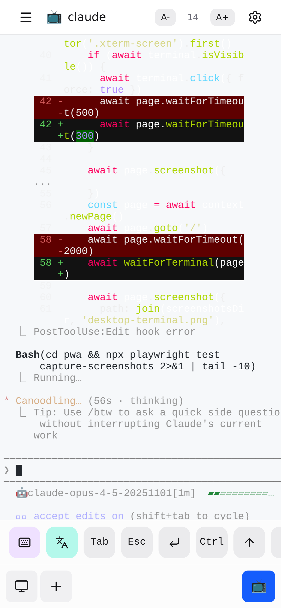
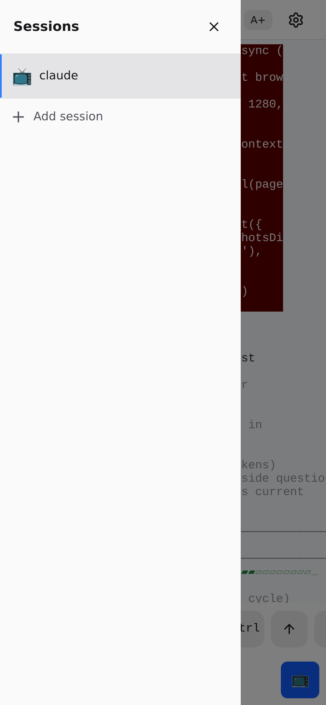
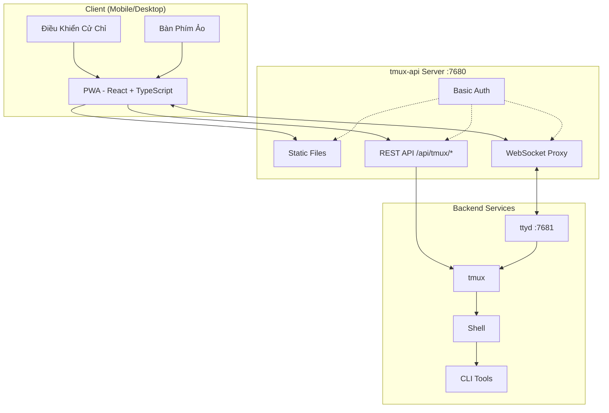
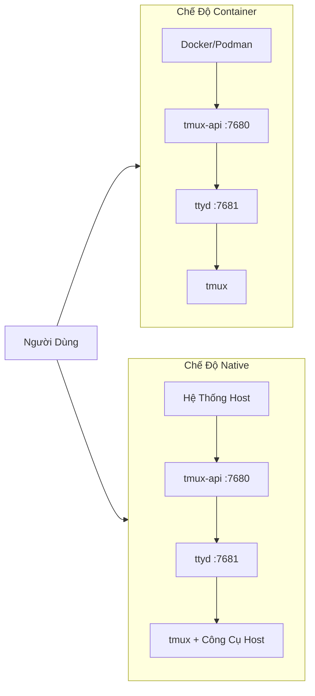

<p align="center">
  
</p>

<p align="center">
  <a href="https://github.com/lamngockhuong/termote/releases"></a>
  <a href="https://github.com/lamngockhuong/termote/actions/workflows/ci.yml"></a>
  <a href="https://github.com/lamngockhuong/termote/blob/main/LICENSE"></a>
  <a href="https://ghcr.io/lamngockhuong/termote"></a>
  <a href="https://hub.docker.com/r/lamngockhuong/termote"></a>
</p>

<p align="center">
  
  
  
  
</p>

Điều khiển từ xa các công cụ CLI (Claude Code, GitHub Copilot, terminal bất kỳ) từ mobile/desktop qua PWA.

> **Termote** = Terminal + Remote
>
> [English](README.md)

## Tính Năng

- **Chuyển đổi session**: Nhiều tmux sessions với tạo/sửa/xóa
- **Thân thiện mobile**: Bàn phím ảo (Tab/Ctrl/Shift/mũi tên, mở rộng được)
- **Hỗ trợ cử chỉ**: Vuốt cho Ctrl+C, Tab, điều hướng lịch sử
- **PWA**: Cài được vào homescreen, hoạt động offline
- **Sessions bền vững**: tmux giữ sessions sống
- **Sidebar thu gọn**: Giao diện desktop với thanh sidebar bật/tắt
- **Chế độ toàn màn hình**: Trải nghiệm terminal toàn màn hình
- **Lưu cấu hình**: Tự động lưu cài đặt với mật khẩu mã hóa AES-256

## Ảnh Chụp Màn Hình

<p align="center">
  
  &nbsp;&nbsp;
  
</p>

## Kiến Trúc



## Bắt Đầu Nhanh

```bash
./scripts/termote.sh                   # Menu tương tác
./scripts/termote.sh install container # Chế độ container (docker/podman)
./scripts/termote.sh install native    # Chế độ native (công cụ host)
./scripts/termote.sh link              # Tạo lệnh 'termote' toàn cục
make test                              # Chạy tests
```

> Sau khi `link`, dùng `termote` từ bất kỳ đâu: `termote health`, `termote install native --lan`

> **Mẹo**: Cài [gum](https://github.com/charmbracelet/gum) để có menu tương tác đẹp hơn (tùy chọn, có fallback bash)

## Cài Đặt

### Một dòng lệnh (khuyến nghị)

```bash
# Tải về và hỏi trước khi cài (mặc định native mode)
curl -fsSL https://raw.githubusercontent.com/lamngockhuong/termote/main/scripts/get.sh | bash

# Tự động cài không hỏi
curl -fsSL .../get.sh | bash -s -- --yes

# Chỉ tải về (không cài)
curl -fsSL .../get.sh | bash -s -- --download-only

# Cập nhật tự động với config đã lưu
curl -fsSL .../get.sh | bash -s -- --update

# Cài đặt phiên bản cụ thể
curl -fsSL .../get.sh | bash -s -- --version 0.0.4

# Với mode và tùy chọn cụ thể
curl -fsSL .../get.sh | bash -s -- --yes --container --lan
curl -fsSL .../get.sh | bash -s -- --yes --native --tailscale myhost

# Buộc nhập mật khẩu mới (bỏ qua config đã lưu)
curl -fsSL .../get.sh | bash -s -- --yes --container --fresh
```

### Docker

```bash
# Tất cả trong một (tự sinh credentials, xem logs: docker logs termote)
docker run -d --name termote -p 7680:7680 ghcr.io/lamngockhuong/termote:latest

# Với credentials tùy chỉnh
docker run -d --name termote -p 7680:7680 \
  -e TERMOTE_USER=admin -e TERMOTE_PASS=secret \
  ghcr.io/lamngockhuong/termote:latest

# Không xác thực (chỉ dev local)
docker run -d --name termote -p 7680:7680 \
  -e NO_AUTH=true \
  ghcr.io/lamngockhuong/termote:latest

# Với volume để lưu trữ
docker run -d --name termote -p 7680:7680 \
  -v termote-data:/home/termote \
  ghcr.io/lamngockhuong/termote:latest

# Mount thư mục workspace tùy chỉnh
docker run -d --name termote -p 7680:7680 \
  -v ~/projects:/workspace \
  ghcr.io/lamngockhuong/termote:latest

# Với Tailscale HTTPS (yêu cầu Tailscale trên host)
docker run -d --name termote -p 7680:7680 \
  -e TERMOTE_USER=admin -e TERMOTE_PASS=secret \
  ghcr.io/lamngockhuong/termote:latest
sudo tailscale serve --bg --https=443 http://127.0.0.1:7680
# Truy cập tại: https://your-hostname.tailnet-name.ts.net
```

### Từ Release

```bash
# Tải release mới nhất
VERSION=$(curl -s https://api.github.com/repos/lamngockhuong/termote/releases/latest | grep tag_name | cut -d '"' -f4)
wget https://github.com/lamngockhuong/termote/releases/download/${VERSION}/termote-${VERSION}.tar.gz
tar xzf termote-${VERSION}.tar.gz
cd termote-${VERSION#v}

# Cài đặt (menu tương tác hoặc với mode)
./scripts/termote.sh install
./scripts/termote.sh install container
```

### Từ Source

```bash
git clone https://github.com/lamngockhuong/termote.git
cd termote
./scripts/termote.sh install container
```

> **Ghi chú**: `termote.sh` là CLI hợp nhất hỗ trợ `install` (build từ source, dùng artifacts có sẵn khi có), `uninstall`, và `health`.

## Chế Độ Triển Khai



| Chế Độ        | Mô Tả            | Trường Hợp Sử Dụng                      | Nền Tảng     |
| ------------- | ---------------- | --------------------------------------- | ------------ |
| `--container` | Chế độ container | Triển khai đơn giản, môi trường cách ly | macOS, Linux |
| `--native`    | Tất cả native    | Truy cập công cụ host (claude, gh)      | macOS, Linux |

### Tùy Chọn

| Flag                        | Mô Tả                                           |
| --------------------------- | ----------------------------------------------- |
| `--lan`                     | Mở truy cập LAN (mặc định: chỉ localhost)       |
| `--tailscale <host[:port]>` | Bật Tailscale HTTPS                             |
| `--no-auth`                 | Tắt xác thực cơ bản                             |
| `--port <port>`             | Port host (mặc định: 7680)                      |
| `--fresh`                   | Buộc nhập mật khẩu mới (bỏ qua config đã lưu)   |
| `--update`                  | Cập nhật tự động với config đã lưu              |
| `--version <ver>`           | Cài đặt phiên bản cụ thể (có hoặc không có `v`) |

| Biến Môi Trường | Mô Tả                                           |
| --------------- | ----------------------------------------------- |
| `WORKSPACE`     | Thư mục host để mount (mặc định: `./workspace`) |
| `TERMOTE_USER`  | Username xác thực (mặc định: tự sinh)           |
| `TERMOTE_PASS`  | Password xác thực (mặc định: tự sinh)           |
| `NO_AUTH`       | Đặt `true` để tắt xác thực                      |

### Chế Độ Container (khuyến nghị cho đơn giản)

Scripts tự động phát hiện `podman` hoặc `docker` — cả hai hoạt động giống nhau.

```bash
./scripts/termote.sh install container             # localhost với basic auth
./scripts/termote.sh install container --no-auth   # localhost không auth
./scripts/termote.sh install container --lan       # Truy cập LAN
# Truy cập: http://localhost:7680

# Thư mục workspace tùy chỉnh (mount vào /workspace trong container)
WORKSPACE=~/projects ./scripts/termote.sh install container
WORKSPACE=/path/to/code make install-container
```

> **Lưu ý bảo mật**: Tránh mount trực tiếp `$HOME` — các thư mục nhạy cảm như `.ssh`, `.gnupg` sẽ truy cập được trong container. Mount các thư mục project cụ thể thay thế.

### Native (khuyến nghị để truy cập binary host)

Dùng khi cần truy cập binary host (claude, git, v.v.):

```bash
# Linux
sudo apt install ttyd tmux
# Hoặc: sudo snap install ttyd
./scripts/termote.sh install native

# macOS
brew install ttyd tmux go
./scripts/termote.sh install native
# Truy cập: http://localhost:7680
```

### Với Tailscale HTTPS (tất cả chế độ)

Dùng `tailscale serve` cho HTTPS tự động (không cần quản lý cert thủ công):

```bash
# Chỉ Tailscale (port mặc định 443)
./scripts/termote.sh install container --tailscale myhost.ts.net

# Port tùy chỉnh
./scripts/termote.sh install native --tailscale myhost.ts.net:8765

# Tailscale + truy cập LAN
./scripts/termote.sh install container --tailscale myhost.ts.net --lan

# Truy cập: https://myhost.ts.net (hoặc :8765 cho port tùy chỉnh)
```

### Gỡ Cài Đặt

```bash
./scripts/termote.sh uninstall container   # Chế độ container
./scripts/termote.sh uninstall native      # Chế độ native
./scripts/termote.sh uninstall all         # Tất cả
```

### Cập Nhật

```bash
# Cách 1: Cập nhật tự động với config đã lưu
curl -fsSL .../get.sh | bash -s -- --update

# Cách 2: Chạy lại one-liner (so sánh version, hỏi trước khi cài)
curl -fsSL .../get.sh | bash

# Cách 3: Cập nhật thủ công
./scripts/termote.sh uninstall [container|native]
git pull origin main                    # Nếu cài từ source
./scripts/termote.sh install [container|native] [--lan] [--tailscale ...]
```

## Hỗ Trợ Nền Tảng

| Nền Tảng | Container | Native |
| -------- | --------- | ------ |
| Linux    | ✓         | ✓      |
| macOS    | ✓         | ✓      |
| Windows  | ✓ (WSL2)  | -      |

## Sử Dụng Mobile

| Hành Động      | Cử Chỉ             |
| -------------- | ------------------ |
| Hủy/ngắt       | Vuốt trái (Ctrl+C) |
| Tab completion | Vuốt phải          |
| Lịch sử lên    | Vuốt lên           |
| Lịch sử xuống  | Vuốt xuống         |
| Dán            | Nhấn giữ           |
| Cỡ chữ         | Chụm vào/ra        |

Thanh công cụ ảo cung cấp: Tab, Esc, Ctrl, Shift, phím mũi tên, và các tổ hợp phím thường dùng. Hỗ trợ tổ hợp Ctrl+Shift (dán, sao chép). Chuyển đổi giữa chế độ minimal và expanded để có thêm phím (Home, End, Delete, v.v.).

## Cấu Trúc Dự Án

```
termote/
├── Makefile                # Lệnh build/test/deploy
├── Dockerfile              # Docker mode (tmux-api + ttyd)
├── docker-compose.yml
├── entrypoint.sh           # Docker entrypoint
├── docs/                   # Tài liệu
│   └── images/screenshots/ # Ảnh chụp app
├── pwa/                    # React PWA
│   └── src/
│       ├── components/
│       ├── contexts/
│       ├── hooks/
│       ├── types/
│       └── utils/
├── tmux-api/               # Go server
│   ├── main.go             # Entry point
│   ├── serve.go            # Server (PWA, proxy, auth)
│   └── tmux.go             # tmux API handlers
├── scripts/
│   ├── termote.sh          # CLI hợp nhất (install/uninstall/health)
│   └── get.sh              # Online installer (curl | bash)
├── tests/                  # Bộ test
│   ├── test-termote.sh
│   ├── test-get.sh
│   └── test-entrypoints.sh
└── website/                # Trang docs Astro Starlight
    └── src/content/docs/   # Tài liệu MDX
```

## Phát Triển

```bash
make build          # Build PWA và tmux-api
make test           # Chạy tất cả tests
make health         # Kiểm tra health service
make clean          # Dừng containers

# E2E tests (yêu cầu server đang chạy)
./scripts/termote.sh install container  # Khởi động server trước
cd pwa && pnpm test:e2e       # Chạy Playwright tests
cd pwa && pnpm test:e2e:ui    # Chạy với UI debugger
```

**Kiểm Tra Thủ Công:** Xem [Danh Sách Kiểm Tra](docs/self-test-checklist.vi.md)

## Xử Lý Sự Cố

### Session không lưu được

- Kiểm tra tmux: `tmux ls`
- Xác minh ttyd dùng flag `-A` (attach-or-create)

### Lỗi WebSocket

- Kiểm tra logs tmux-api: `docker logs termote`
- Xác minh ttyd đang chạy trên port 7681

### Vấn đề bàn phím mobile

- Đảm bảo có viewport meta tag
- Test trên thiết bị thật, không dùng emulator

### Chế độ native: processes không khởi động

```bash
ps aux | grep ttyd         # Kiểm tra ttyd đang chạy
ps aux | grep tmux-api     # Kiểm tra tmux-api đang chạy
lsof -i :7680              # Xác minh port đang dùng
```

## Ghi Chú Bảo Mật

- **Mặc định: chỉ localhost** - không mở LAN trừ khi dùng flag `--lan`
- **Basic auth bật mặc định** - dùng `--no-auth` để tắt cho dev local
- **Chống brute-force tích hợp** - rate limiting (5 lần thử/phút mỗi IP)
- Dùng HTTPS (Tailscale) cho production
- Giới hạn trong mạng tin cậy/VPN

## Giấy Phép

MIT
