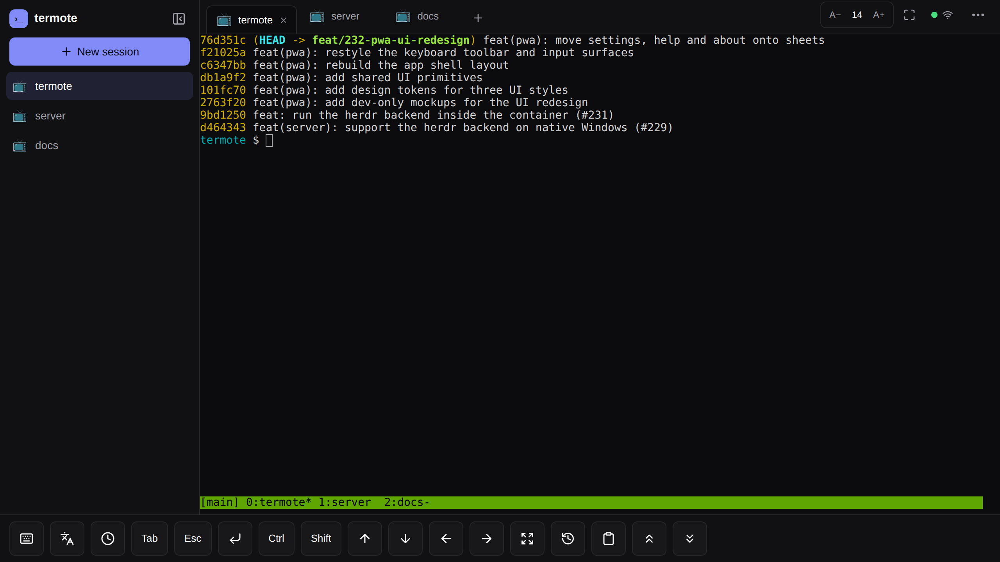
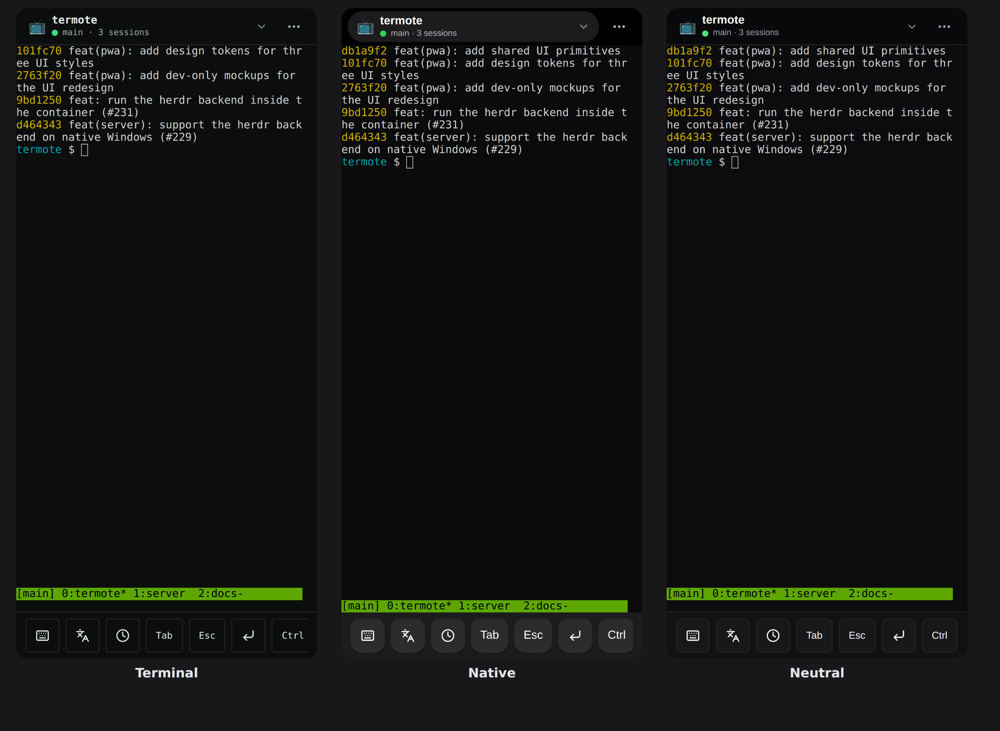
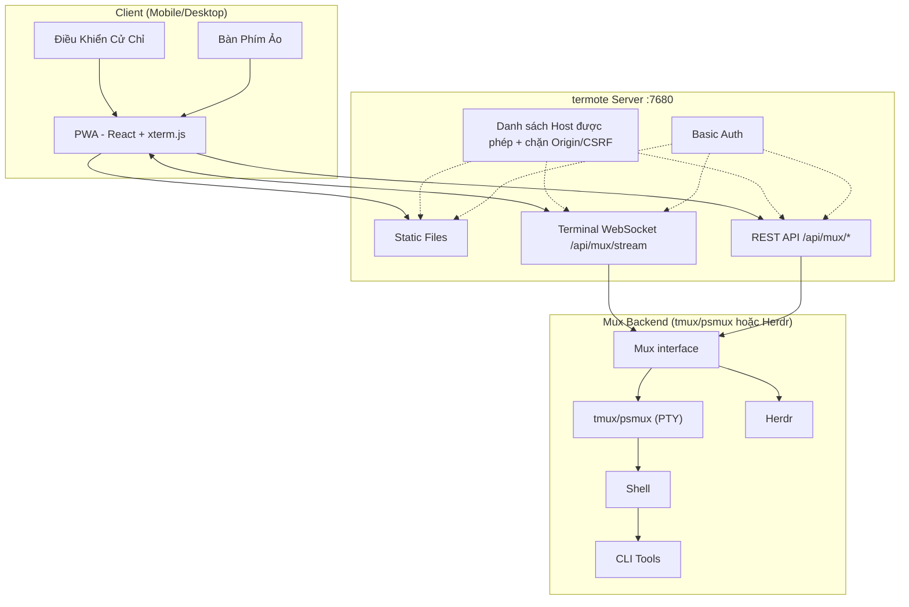
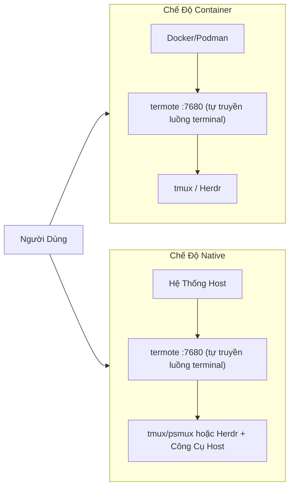

<p align="center">
  
</p>

<p align="center">
  <a href="https://github.com/lamngockhuong/termote/releases"></a>
  <a href="https://github.com/lamngockhuong/termote/actions/workflows/ci.yml"></a>
  <a href="https://github.com/lamngockhuong/termote/blob/main/LICENSE"></a>
  <a href="https://ghcr.io/lamngockhuong/termote"></a>
  <a href="https://hub.docker.com/r/lamngockhuong/termote"></a>
</p>

<p align="center">
  
  
  
  
</p>

<p align="center">
  <a href="https://launch.j2team.dev/products/termote?utm_source=badge-launched&utm_medium=badge&utm_campaign=badge-termote" target="_blank" rel="noopener noreferrer"></a>
  &nbsp;
  <a href="https://unikorn.vn/p/termote?ref=embed-termote" target="_blank"></a>
</p>

Điều khiển từ xa các công cụ CLI (Claude Code, GitHub Copilot, terminal bất kỳ) từ mobile/desktop qua PWA.

> [!NOTE]
> Termote 1.0 không nâng cấp được bản cài 0.x. Hãy gỡ 0.x theo
> [tài liệu 0.x đã lưu trữ](https://termote.ohnice.app/vi/0.x/), rồi cài 1.0 bằng các lệnh ở
> [Bắt Đầu Nhanh](#bắt-đầu-nhanh).

> **Termote** = Terminal + Remote
>
> 🇬🇧 [English](README.md) | 🇨🇳 [简体中文](README.zh-CN.md) | 🇯🇵 [日本語](README.ja.md) | 🇰🇷 [한국어](README.ko.md) | 🇪🇸 [Español](README.es.md) | 🇧🇷 [Português (BR)](README.pt-BR.md) | 🇫🇷 [Français](README.fr.md) | 🇩🇪 [Deutsch](README.de.md) | 🇷🇺 [Русский](README.ru.md) | 🇮🇩 [Bahasa Indonesia](README.id.md)

## Tính Năng

- **Chuyển đổi session**: Nhiều tmux sessions với tạo/sửa/xóa
- **Tab sessions**: Thanh tab ngang để chuyển nhanh giữa các cửa sổ
- **Backend Herdr** (native hoặc trong container): điều khiển workspace của Herdr thay cho tmux, kèm huy hiệu trạng thái của agent lập trình trên từng pane — xem [Cài đặt Native](https://termote.ohnice.app/vi/installation/native/)
- **Thân thiện mobile**: Bàn phím ảo (Tab/Ctrl/Shift/mũi tên, mở rộng được)
- **Hỗ trợ cử chỉ**: Vuốt cho Ctrl+C, Tab, cuộn màn hình
- **Lịch sử lệnh**: Gợi nhớ các lệnh đã gửi trước đó với tìm kiếm
- **Thao tác nhanh**: Phím ⚡ trên thanh công cụ mobile mở một bảng thao tác phổ biến (clear, cancel, exit)
- **Kiểu giao diện**: Neutral, Terminal hoặc Native, chọn trong Settings, độc lập với theme sáng/tối
- **Chỉ báo kết nối**: Trạng thái server real-time, tự phát hiện mất kết nối
- **Kiểm tra cập nhật**: Tự động thông báo phiên bản mới từ GitHub releases
- **PWA**: Cài được vào homescreen, hoạt động offline
- **Sessions bền vững**: tmux giữ sessions sống
- **Sidebar thu gọn**: Giao diện desktop với thanh sidebar bật/tắt
- **Chế độ toàn màn hình**: Trải nghiệm terminal toàn màn hình
- **Chạy như một service**: `termote start` đăng ký một service của người dùng (systemd, launchd, Scheduled Task) tự khởi động khi đăng nhập
- **Lưu cấu hình**: `termote start` lưu các tùy chọn của nó, mật khẩu được lưu ở dạng mã hóa

## Ảnh Chụp Màn Hình

<p align="center">
  
  &nbsp;&nbsp;
  
</p>

<p align="center">
  
</p>

<p align="center">
  
</p>

## Kiến Trúc


```mermaid
flowchart TB
    subgraph Client["Client (Mobile/Desktop)"]
        PWA["PWA - React + xterm.js"]
        Gestures["Điều Khiển Cử Chỉ"]
        Keyboard["Bàn Phím Ảo"]
    end

    subgraph Server["termote Server :7680"]
        Static["Static Files"]
        Stream["Terminal WebSocket /api/mux/stream"]
        API["REST API /api/mux/*"]
        Guard["Danh sách Host được phép + chặn Origin/CSRF"]
        Auth["Basic Auth"]
    end

    subgraph Backend["Mux Backend (tmux/psmux hoặc Herdr)"]
        Mux["Mux interface"]
        tmux["tmux/psmux (PTY)"]
        herdr["Herdr"]
        Shell["Shell"]
        Tools["CLI Tools"]
    end

    Gestures --> PWA
    Keyboard --> PWA
    PWA --> Static
    PWA <--> Stream
    PWA --> API
    Guard -.-> Static & Stream & API
    Auth -.-> Static & Stream & API
    Stream --> Mux
    API --> Mux
    Mux --> tmux & herdr
    tmux --> Shell --> Tools
```

Chính termote truyền luồng terminal (PTY trên Unix, ConPTY trên Windows) tới xterm.js trong PWA; không có tiến trình terminal riêng nào đứng sau để proxy tới. Mô hình chặn request đầy đủ nằm ở [`docs/system-architecture.md`](docs/system-architecture.md).

## Bắt Đầu Nhanh

> 📖 **Mới dùng Termote?** Xem [Hướng dẫn Bắt đầu](docs/vi/getting-started.md) để có hướng dẫn chi tiết kèm ví dụ.

**Linux / macOS:**

```bash
curl -fsSL https://termote.ohnice.app/install.sh | sh
termote start
```

**Windows (PowerShell):**

```powershell
irm https://termote.ohnice.app/install.ps1 | iex
termote start
```

Trình cài đặt chỉ cần `curl`, `tar` và `sha256sum`/`shasum` (trên Windows là PowerShell), không cần sudo hay quyền admin. Nó kiểm tra mã băm SHA-256 của gói tải về, cài lệnh `termote` và không khởi động gì cả. `termote start` lưu các tùy chọn, tạo mật khẩu ở lần chạy đầu (chỉ in ra một lần; xem lại bằng `termote show-password`), đăng ký service rồi khởi động nó. Mở `http://localhost:7680` (Windows: `http://localhost:7690`).

Cần cài sẵn một backend terminal: tmux (`sudo apt install tmux`, `brew install tmux`), psmux trên Windows (`winget install psmux`), hoặc [Herdr](https://termote.ohnice.app/vi/installation/native/). Lần `start` đầu tiên sẽ tự nhận ra nên dùng backend nào.

### Tùy chọn thường dùng

```bash
termote start --lan                  # Listen on the LAN, not only this machine
termote start --tailscale myhost.ts.net  # Publish over Tailscale HTTPS
termote start --mux herdr            # Drive Herdr workspaces instead of tmux
termote start --no-auth              # Disable basic auth (local use only)
```

Các tùy chọn được lưu lại: tham số nào không truyền thì giữ giá trị đã lưu, còn tham số kiểu bật/tắt thì tắt bằng `=false` (`termote start --lan=false`). Các tham số giống nhau trên mọi hệ điều hành, kể cả PowerShell.

### Lệnh hằng ngày

```bash
termote status                       # What the running server reports
termote stop                         # Stop (it starts again at the next login)
termote restart                      # Restart with the saved options
termote logs follow                  # Tail the logs
termote show-password                # Print the saved admin password
termote update                       # Update to the latest release
termote uninstall                    # Remove the service, the command and the install
```

`update` chuyển sang phiên bản mới, khởi động lại service và quay về phiên bản cũ nếu bản mới không chạy lên được. `uninstall` giữ lại cấu hình (`~/.config/termote`) và logs (`~/.local/state/termote`), đồng thời in ra cả hai đường dẫn.

## Cài Đặt

### Cài một phiên bản cố định

```bash
curl -fsSL https://termote.ohnice.app/install.sh | TERMOTE_VERSION=1.0.0 sh
termote update --version 1.0.0
```

```powershell
$env:TERMOTE_VERSION='1.0.0'; irm https://termote.ohnice.app/install.ps1 | iex
```

Không có `TERMOTE_VERSION`, trình cài đặt lấy bản phát hành 1.x ổn định mới nhất và để nguyên bản đã cài. Có biến này, phiên bản đó được cài bên cạnh bản hiện tại và trở thành phiên bản đang dùng; cách này cũng sửa được một bản cài bị hỏng.

### Chế độ container

```bash
termote container up                          # Run the published image (podman or docker)
termote container up --workspace ~/projects   # Mount a directory at /workspace
termote container status
termote container logs -f
termote container down
```

`container up` chạy image `ghcr.io/lamngockhuong/termote` đúng với phiên bản của `termote` đã cài, bằng podman (ưu tiên) hoặc docker, trên port 7680, gắn thư mục `~/termote-workspace` vào `/workspace`. Lệnh nhận `--port`, `--lan`, `--tailscale`, `--no-auth`, `--allow-host` và `--fresh`; các giá trị này được lưu riêng với tùy chọn của `start`, còn mật khẩu thì dùng chung với server native. Docker tự khởi động lại container sau khi máy khởi động lại; Podman chạy không cần quyền root thì không có tiến trình nền nào khởi động lại container, nên hãy chạy nó dưới dạng Quadlet unit.

> **Lưu ý bảo mật**: Tránh mount trực tiếp `$HOME` — các thư mục nhạy cảm như `.ssh`, `.gnupg` sẽ truy cập được từ trong container. Hãy mount các thư mục dự án cụ thể.

### Docker không qua CLI

```bash
# Generates a password, printed in: docker logs termote
docker run -d --name termote -p 7680:7680 \
  -v ~/projects:/workspace \
  ghcr.io/lamngockhuong/termote:latest

# With your own credentials
docker run -d --name termote -p 7680:7680 \
  -e TERMOTE_USER=admin -e TERMOTE_PASS=secret \
  ghcr.io/lamngockhuong/termote:latest
```

| Biến Môi Trường | Mô Tả                                        |
| --------------- | -------------------------------------------- |
| `TERMOTE_USER`  | Tên đăng nhập basic auth (mặc định: `admin`) |
| `TERMOTE_PASS`  | Mật khẩu basic auth (mặc định: tự sinh)      |
| `NO_AUTH`       | Đặt `true` để tắt xác thực                   |

### Biên dịch từ mã nguồn

```bash
git clone https://github.com/lamngockhuong/termote.git
cd termote
make build
./scripts/termote.sh start
```

`make build` tạo bản build của PWA rồi nhúng vào `server/termote`; cần có Go, Node.js và pnpm. `scripts/termote.sh` (Windows: `scripts\termote.ps1`) chỉ dùng để chạy từ bản checkout: nó biên dịch lại binary dành cho phát triển khi mã nguồn mới hơn, rồi chạy binary đó với cùng các tham số. `termote update` từ chối chạy trong bản checkout; hãy dùng `git pull && make build`.

### Nâng cấp từ 0.x

Không có đường nâng cấp từ 0.x: bản 1.0 cài vào chỗ khác và không đọc cấu hình của 0.x. Hãy gỡ 0.x theo [tài liệu 0.x đã lưu trữ](https://termote.ohnice.app/vi/0.x/), sau đó cài 1.0 bằng các lệnh ở trên.

## Chế Độ Triển Khai


```mermaid
flowchart LR
    subgraph Container["Chế Độ Container"]
        direction TB
        C1["Docker/Podman"] --> C2["termote :7680 (tự truyền luồng terminal)"] --> C3["tmux / Herdr"]
    end

    subgraph Native["Chế Độ Native"]
        direction TB
        N1["Hệ Thống Host"] --> N2["termote :7680 (tự truyền luồng terminal)"] --> N3["tmux/psmux hoặc Herdr + Công Cụ Host"]
    end

    User["Người Dùng"] --> Container & Native
```

| Chế Độ    | Lệnh                   | Trường Hợp Sử Dụng                      | Nền Tảng              |
| --------- | ---------------------- | --------------------------------------- | --------------------- |
| Native    | `termote start`        | Truy cập công cụ trên host (claude, gh) | macOS, Linux, Windows |
| Container | `termote container up` | Môi trường tách biệt                    | macOS, Linux, Windows |

Server native chạy dưới dạng service của người dùng: systemd user unit trên Linux (một tiến trình chạy tách riêng ở nơi không có systemd cho người dùng, chẳng hạn WSL2 không bật systemd), launchd agent trên macOS, Scheduled Task chạy khi đăng nhập trên Windows.

### Tùy chọn của `start`

| Flag                        | Mô Tả                                                                                              |
| --------------------------- | -------------------------------------------------------------------------------------------------- |
| `--port <port>`             | Port (mặc định: 7680, Windows: 7690)                                                               |
| `--lan[=false]`             | Lắng nghe trên mọi interface (mặc định: chỉ localhost)                                             |
| `--tailscale <host[:port]>` | Công bố qua Tailscale HTTPS (port mặc định 443)                                                    |
| `--no-tailscale`            | Ngừng công bố qua Tailscale                                                                        |
| `--no-auth[=false]`         | Tắt xác thực (basic auth)                                                                          |
| `--mux <tmux\|herdr>`       | Backend terminal (mặc định: herdr nếu đang chạy, nếu không thì tmux)                               |
| `--allow-host <name>`       | Cho phép thêm một giá trị header Host (lặp lại được; không có ký tự đại diện, xem ghi chú bảo mật) |
| `--remove-host <name>`      | Bỏ một tên Host đã cho phép (lặp lại được)                                                         |
| `--allow-herdr-no-auth`     | Bắt buộc khi dùng cùng `--mux herdr --no-auth`                                                     |
| `--fresh`                   | Đặt mật khẩu mới                                                                                   |

### Với Tailscale HTTPS

Dùng `tailscale serve` để có HTTPS tự động (không cần tự quản lý chứng chỉ):

```bash
termote start --tailscale myhost.ts.net                # Default port 443
termote start --tailscale myhost.ts.net:8765           # Custom port
termote container up --tailscale myhost.ts.net         # Container mode
sudo tailscale set --operator=$USER                    # Linux, once: let termote run tailscale serve
```

Ánh xạ được áp dụng lại mỗi lần server khởi động. `stop`, `start --no-tailscale` và `uninstall` chỉ gỡ ánh xạ của riêng Termote.

## Hỗ Trợ Nền Tảng

| Nền Tảng | Container | Native | Trình Cài Đặt |
| -------- | --------- | ------ | ------------- |
| Linux    | ✓         | ✓      | `install.sh`  |
| macOS    | ✓         | ✓      | `install.sh`  |
| Windows  | ✓         | ✓      | `install.ps1` |

> **Hỗ trợ Windows**: Chế độ container yêu cầu Docker Desktop hoặc Podman Desktop; chế độ native yêu cầu [psmux](https://github.com/psmux/psmux) (bộ ghép kênh terminal tương thích tmux cho Windows), cài bằng `winget install psmux`, hoặc một server [Herdr](https://herdr.dev/#install) đang chạy. Service trên Windows chưa được kiểm chứng trên máy thật; vui lòng báo lỗi trên GitHub nếu gặp sự cố.

## Sử Dụng Mobile

| Hành Động      | Cử Chỉ             |
| -------------- | ------------------ |
| Hủy/ngắt       | Vuốt trái (Ctrl+C) |
| Tab completion | Vuốt phải          |
| Cuộn xuống     | Vuốt lên           |
| Cuộn lên       | Vuốt xuống         |
| Dán            | Nhấn giữ           |
| Cỡ chữ         | Chụm vào/ra        |

Thanh công cụ ảo cung cấp: Tab, Esc, Ctrl, Shift, phím mũi tên, và các tổ hợp phím thường dùng. Hỗ trợ tổ hợp Ctrl+Shift (dán, sao chép). Chuyển đổi giữa chế độ minimal và expanded để có thêm phím (Home, End, Delete, v.v.).

## Cấu Trúc Dự Án

```
termote/
├── Makefile                # Build/test/run commands
├── Dockerfile              # Container image (termote + tmux + herdr)
├── docker-compose.yml      # Development from a checkout only
├── entrypoint.sh           # Container entrypoint
├── docs/                   # Documentation
│   └── images/screenshots/ # App screenshots
├── pwa/                    # React PWA
│   └── src/
│       ├── components/
│       ├── contexts/
│       ├── hooks/
│       ├── types/
│       └── utils/
├── server/                 # Go server + CLI (single binary)
│   ├── main.go             # Entry point (no args = menu, `serve` = server, else CLI)
│   ├── serve.go            # Server (PWA, auth, guards)
│   ├── mux.go              # Mux interface + /api/mux/* routes
│   ├── mux_tmux.go         # tmux/psmux backend
│   ├── mux_herdr.go        # Herdr backend
│   ├── stream.go           # Terminal WebSocket (xterm.js stream)
│   ├── cli*.go             # start/stop/update/container/logs/menu subcommands
│   └── webui/              # PWA embedded in the binary (filled by make build)
├── scripts/
│   ├── install.sh          # Unix online installer (curl | sh)
│   ├── install.ps1         # Windows online installer (irm | iex)
│   ├── termote.sh          # Unix shim: builds and runs a checkout
│   └── termote.ps1         # Windows PowerShell shim: builds and runs a checkout
├── tests/                  # Test suite
│   ├── test-termote.sh     # Unix shim tests
│   ├── test-termote.ps1    # Windows shim tests
│   ├── test-install.sh     # Unix installer tests
│   ├── test-install.ps1    # Windows installer tests
│   └── test-entrypoints.sh # Container entrypoint tests
└── website/                # Astro Starlight docs site
    └── src/content/docs/   # MDX documentation
```

## Phát Triển

```bash
make build          # Build the PWA and embed it in server/termote
make test           # Run all tests
make health         # Check service health
make clean          # Stop containers

# E2E tests (requires running server)
./scripts/termote.sh start           # Start server first
pnpm --filter termote test:e2e       # Run Playwright tests
pnpm --filter termote test:e2e:ui    # Run with UI debugger
```

**Kiểm Tra Thủ Công:** Xem [Danh Sách Kiểm Tra](docs/vi/self-test-checklist.md)

## Xử Lý Sự Cố

### Session không lưu được

- Kiểm tra tmux: `tmux ls`
- termote gắn vào session bằng `tmux new-session -A` (có session thì gắn vào, chưa có thì tạo mới)

### Lỗi WebSocket

- Kiểm tra logs server: `termote container logs` (container) hoặc `termote logs server` (native)
- WebSocket của terminal là `/api/mux/stream`, do chính termote phục vụ — không có tiến trình terminal riêng nào cần kiểm tra

### Vấn đề bàn phím mobile

- Đảm bảo có viewport meta tag
- Test trên thiết bị thật, không dùng emulator

### Chế độ native: server không khởi động

```bash
termote status             # What the running server reports
termote logs server        # Or: termote logs follow
lsof -i :7680              # Check what holds the port
termote start --fresh      # If the saved password can no longer be read
```

## Ghi Chú Bảo Mật

- **Mặc định: chỉ localhost** - không mở LAN trừ khi dùng flag `--lan`
- **Basic auth bật mặc định** - dùng `--no-auth` để tắt khi phát triển trên máy; mật khẩu được tạo ở lần `termote start` đầu tiên và lưu ở dạng mã hóa
- **Danh sách Host được phép**: request có header `Host` lạ bị từ chối (chống tấn công đổi địa chỉ DNS); thêm các tên tin cậy bằng `--allow-host`, không có ký tự đại diện nào tắt được lớp kiểm tra này
- **Chặn Origin/CSRF**: các request thay đổi trạng thái tới `/api/mux/*` và WebSocket `/api/mux/stream` từ chối request có `Sec-Fetch-Site`/`Origin` đến từ site khác, đồng thời yêu cầu stream token cùng origin và chỉ dùng một lần
- **Chống brute-force tích hợp** - rate limiting (5 lần thử/phút mỗi IP)
- **Backend Herdr**: để lộ mọi workspace Herdr trên máy host, nên `--mux herdr --no-auth` bị từ chối nếu không kèm `--allow-herdr-no-auth`
- **File service không chứa bí mật**: systemd unit, launchd agent và Scheduled Task không bao giờ chứa mật khẩu
- Dùng HTTPS (Tailscale) cho production
- Giới hạn trong mạng tin cậy/VPN

## Dự Án Khác

| Dự án                                                       | Mô tả                                                                                                                                   |
| ----------------------------------------------------------- | --------------------------------------------------------------------------------------------------------------------------------------- |
| [GitHub Flex](https://github.com/lamngockhuong/github-flex) | Extension đa trình duyệt (Chrome & Firefox) nâng cao giao diện GitHub với các tính năng tăng năng suất                                  |
| [TabRest](https://github.com/lamngockhuong/tabrest)         | Extension Chrome tự động unload các tab không hoạt động để giải phóng bộ nhớ                                                            |
| [Specpin](https://github.com/lamngockhuong/specpin)         | Ghim các đặc tả nghiệp vụ sống, phiên bản hóa bằng Git lên các phần tử của giao diện web đang chạy (extension trình duyệt + Go sidecar) |

## Giấy Phép

MIT
