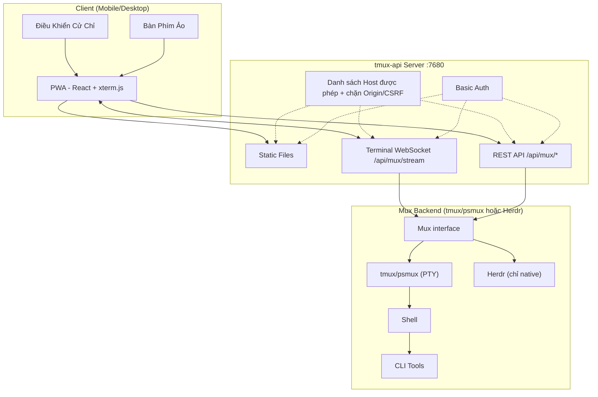
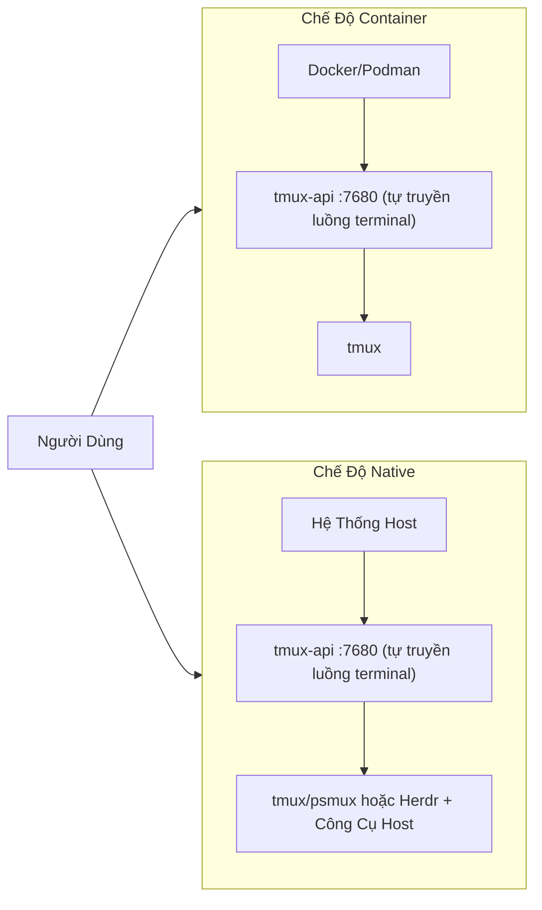

<p align="center">
  
</p>

<p align="center">
  <a href="https://github.com/lamngockhuong/termote/releases"></a>
  <a href="https://github.com/lamngockhuong/termote/actions/workflows/ci.yml"></a>
  <a href="https://github.com/lamngockhuong/termote/blob/main/LICENSE"></a>
  <a href="https://ghcr.io/lamngockhuong/termote"></a>
  <a href="https://hub.docker.com/r/lamngockhuong/termote"></a>
</p>

<p align="center">
  
  
  
  
</p>

<p align="center">
  <a href="https://launch.j2team.dev/products/termote?utm_source=badge-launched&utm_medium=badge&utm_campaign=badge-termote" target="_blank" rel="noopener noreferrer"></a>
  &nbsp;
  <a href="https://unikorn.vn/p/termote?ref=embed-termote" target="_blank"></a>
</p>

Điều khiển từ xa các công cụ CLI (Claude Code, GitHub Copilot, terminal bất kỳ) từ mobile/desktop qua PWA.

> [!NOTE]
> Nhánh `main` đang phát triển bản 1.0 và đi trước bản phát hành mới nhất
> (0.1.x). Hướng dẫn cho phiên bản cài được hiện nay nằm ở
> [README của nhánh `release/0.x`](https://github.com/lamngockhuong/termote/blob/release/0.x/README.vi.md).

> **Termote** = Terminal + Remote
>
> 🇬🇧 [English](README.md) | 🇨🇳 [简体中文](README.zh-CN.md) | 🇯🇵 [日本語](README.ja.md) | 🇰🇷 [한국어](README.ko.md) | 🇪🇸 [Español](README.es.md) | 🇧🇷 [Português (BR)](README.pt-BR.md) | 🇫🇷 [Français](README.fr.md) | 🇩🇪 [Deutsch](README.de.md) | 🇷🇺 [Русский](README.ru.md) | 🇮🇩 [Bahasa Indonesia](README.id.md)

## Tính Năng

- **Chuyển đổi session**: Nhiều tmux sessions với tạo/sửa/xóa
- **Tab sessions**: Thanh tab ngang để chuyển nhanh giữa các cửa sổ
- **Backend Herdr** (chỉ native): điều khiển workspace của Herdr thay cho tmux, kèm huy hiệu trạng thái của agent lập trình trên từng pane — xem [Cài đặt Native](https://termote.ohnice.app/vi/installation/native/)
- **Thân thiện mobile**: Bàn phím ảo (Tab/Ctrl/Shift/mũi tên, mở rộng được)
- **Hỗ trợ cử chỉ**: Vuốt cho Ctrl+C, Tab, điều hướng lịch sử
- **Lịch sử lệnh**: Gợi nhớ các lệnh đã gửi trước đó với tìm kiếm
- **Thao tác nhanh**: Menu nổi cho các thao tác phổ biến (clear, cancel, exit)
- **Chỉ báo kết nối**: Trạng thái server real-time, tự phát hiện mất kết nối
- **Kiểm tra cập nhật**: Tự động thông báo phiên bản mới từ GitHub releases
- **PWA**: Cài được vào homescreen, hoạt động offline
- **Sessions bền vững**: tmux giữ sessions sống
- **Sidebar thu gọn**: Giao diện desktop với thanh sidebar bật/tắt
- **Chế độ toàn màn hình**: Trải nghiệm terminal toàn màn hình
- **Lưu cấu hình**: Tự động lưu cài đặt với mật khẩu mã hóa AES-256

## Ảnh Chụp Màn Hình

<p align="center">
  
  &nbsp;&nbsp;
  
</p>

## Kiến Trúc


```mermaid
flowchart TB
    subgraph Client["Client (Mobile/Desktop)"]
        PWA["PWA - React + xterm.js"]
        Gestures["Điều Khiển Cử Chỉ"]
        Keyboard["Bàn Phím Ảo"]
    end

    subgraph Server["tmux-api Server :7680"]
        Static["Static Files"]
        Stream["Terminal WebSocket /api/mux/stream"]
        API["REST API /api/mux/*"]
        Guard["Danh sách Host được phép + chặn Origin/CSRF"]
        Auth["Basic Auth"]
    end

    subgraph Backend["Mux Backend (tmux/psmux hoặc Herdr)"]
        Mux["Mux interface"]
        tmux["tmux/psmux (PTY)"]
        herdr["Herdr (chỉ native)"]
        Shell["Shell"]
        Tools["CLI Tools"]
    end

    Gestures --> PWA
    Keyboard --> PWA
    PWA --> Static
    PWA <--> Stream
    PWA --> API
    Guard -.-> Static & Stream & API
    Auth -.-> Static & Stream & API
    Stream --> Mux
    API --> Mux
    Mux --> tmux & herdr
    tmux --> Shell --> Tools
```

Chính tmux-api truyền luồng terminal (PTY trên Unix, ConPTY trên Windows) tới xterm.js trong PWA; không có tiến trình terminal riêng nào đứng sau để proxy tới. Mô hình chặn request đầy đủ nằm ở [`docs/system-architecture.md`](docs/system-architecture.md).

## Bắt Đầu Nhanh

> 📖 **Mới dùng Termote?** Xem [Hướng dẫn Bắt đầu](docs/vi/getting-started.md) để có hướng dẫn chi tiết kèm ví dụ.

```bash
./scripts/termote.sh                   # Menu tương tác
./scripts/termote.sh install container # Chế độ container (docker/podman)
./scripts/termote.sh install native    # Chế độ native (công cụ host)
./scripts/termote.sh link              # Tạo lệnh 'termote' toàn cục
make test                              # Chạy tests
```

> Sau khi `link`, dùng `termote` từ bất kỳ đâu: `termote health`, `termote install native --lan`

## Cài Đặt

### Một dòng lệnh (khuyến nghị)

```bash
# Tải về và hỏi trước khi cài (mặc định native mode)
curl -fsSL https://raw.githubusercontent.com/lamngockhuong/termote/main/scripts/get.sh | bash

# Tự động cài không hỏi
curl -fsSL .../get.sh | bash -s -- --yes

# Chỉ tải về (không cài)
curl -fsSL .../get.sh | bash -s -- --download-only

# Cập nhật tự động với config đã lưu
curl -fsSL .../get.sh | bash -s -- --update

# Cài đặt phiên bản cụ thể
curl -fsSL .../get.sh | bash -s -- --version 0.0.4

# Với mode và tùy chọn cụ thể
curl -fsSL .../get.sh | bash -s -- --yes --container --lan
curl -fsSL .../get.sh | bash -s -- --yes --native --tailscale myhost

# Buộc nhập mật khẩu mới (bỏ qua config đã lưu)
curl -fsSL .../get.sh | bash -s -- --yes --container --fresh
```

**Windows (PowerShell):**

> **Lưu ý:** Nếu hệ thống chặn chạy script, hãy chạy lệnh này trước:
>
> ```powershell
> Set-ExecutionPolicy -Scope CurrentUser -ExecutionPolicy RemoteSigned
> ```

```powershell
# Tải về và hỏi trước khi cài (mặc định native mode)
irm https://raw.githubusercontent.com/lamngockhuong/termote/main/scripts/get.ps1 | iex

# Tự động cài không hỏi
$env:TERMOTE_AUTO_YES = "true"; irm .../get.ps1 | iex

# Với mode cụ thể
$env:TERMOTE_MODE = "container"; irm .../get.ps1 | iex

# Cập nhật tự động với config đã lưu
$env:TERMOTE_UPDATE = "true"; irm .../get.ps1 | iex
```

### Docker

```bash
# Tất cả trong một (tự sinh credentials, xem logs: docker logs termote)
docker run -d --name termote -p 7680:7680 ghcr.io/lamngockhuong/termote:latest

# Với credentials tùy chỉnh
docker run -d --name termote -p 7680:7680 \
  -e TERMOTE_USER=admin -e TERMOTE_PASS=secret \
  ghcr.io/lamngockhuong/termote:latest

# Không xác thực (chỉ dev local)
docker run -d --name termote -p 7680:7680 \
  -e NO_AUTH=true \
  ghcr.io/lamngockhuong/termote:latest

# Với volume để lưu trữ
docker run -d --name termote -p 7680:7680 \
  -v termote-data:/home/termote \
  ghcr.io/lamngockhuong/termote:latest

# Mount thư mục workspace tùy chỉnh
docker run -d --name termote -p 7680:7680 \
  -v ~/projects:/workspace \
  ghcr.io/lamngockhuong/termote:latest

# Với Tailscale HTTPS (yêu cầu Tailscale trên host)
docker run -d --name termote -p 7680:7680 \
  -e TERMOTE_USER=admin -e TERMOTE_PASS=secret \
  ghcr.io/lamngockhuong/termote:latest
sudo tailscale serve --bg --https=443 http://127.0.0.1:7680
# Truy cập tại: https://your-hostname.tailnet-name.ts.net
```

### Từ Release

```bash
# Tải release mới nhất
VERSION=$(curl -s https://api.github.com/repos/lamngockhuong/termote/releases/latest | grep tag_name | cut -d '"' -f4)
wget https://github.com/lamngockhuong/termote/releases/download/${VERSION}/termote-${VERSION}.tar.gz
tar xzf termote-${VERSION}.tar.gz
cd termote-${VERSION#v}

# Cài đặt (menu tương tác hoặc với mode)
./scripts/termote.sh install
./scripts/termote.sh install container
```

### Từ Source

```bash
git clone https://github.com/lamngockhuong/termote.git
cd termote
./scripts/termote.sh install container
```

> **Ghi chú**: `termote.sh` là CLI hợp nhất hỗ trợ `install` (build từ source, dùng artifacts có sẵn khi có), `uninstall`, và `health`.

## Chế Độ Triển Khai


```mermaid
flowchart LR
    subgraph Container["Chế Độ Container"]
        direction TB
        C1["Docker/Podman"] --> C2["tmux-api :7680 (tự truyền luồng terminal)"] --> C3["tmux"]
    end

    subgraph Native["Chế Độ Native"]
        direction TB
        N1["Hệ Thống Host"] --> N2["tmux-api :7680 (tự truyền luồng terminal)"] --> N3["tmux/psmux hoặc Herdr + Công Cụ Host"]
    end

    User["Người Dùng"] --> Container & Native
```

| Chế Độ        | Mô Tả            | Trường Hợp Sử Dụng                                                  | Nền Tảng              |
| ------------- | ---------------- | ------------------------------------------------------------------- | --------------------- |
| `--container` | Chế độ container | Triển khai đơn giản, môi trường cách ly                             | macOS, Linux, Windows |
| `--native`    | Tất cả native    | Truy cập công cụ host (claude, gh); bắt buộc khi dùng backend Herdr | macOS, Linux, Windows |

### Tùy Chọn

| Flag                        | Mô Tả                                                                                              |
| --------------------------- | -------------------------------------------------------------------------------------------------- |
| `--lan`                     | Mở truy cập LAN (mặc định: chỉ localhost)                                                          |
| `--tailscale <host[:port]>` | Bật Tailscale HTTPS                                                                                |
| `--no-auth`                 | Tắt xác thực cơ bản                                                                                |
| `--port <port>`             | Port host (mặc định: 7680, Windows: 7690)                                                          |
| `--mux <tmux\|herdr>`       | Backend terminal, chỉ native (mặc định: `tmux`)                                                    |
| `--allow-host <name>`       | Cho phép thêm một giá trị header Host (lặp lại được; không có ký tự đại diện, xem ghi chú bảo mật) |
| `--allow-herdr-no-auth`     | Bắt buộc phải có khi dùng `--mux herdr --no-auth`                                                  |
| `--fresh`                   | Buộc nhập mật khẩu mới (bỏ qua config đã lưu)                                                      |
| `--update`                  | Cập nhật tự động với config đã lưu                                                                 |
| `--version <ver>`           | Cài đặt phiên bản cụ thể (có hoặc không có `v`)                                                    |

`--ttyd`/`-Ttyd` vẫn được chấp nhận (bản 0.x cần cờ này khi chạy lại trình cài đặt trong lúc cập nhật) nhưng bị bỏ qua kèm cảnh báo, vì ttyd đã bị gỡ bỏ từ 1.0.0. Mọi thay đổi không tương thích được liệt kê ở [`docs/upgrade-1.0.md`](docs/upgrade-1.0.md).

| Biến Môi Trường | Mô Tả                                           |
| --------------- | ----------------------------------------------- |
| `WORKSPACE`     | Thư mục host để mount (mặc định: `./workspace`) |
| `TERMOTE_USER`  | Username xác thực (mặc định: tự sinh)           |
| `TERMOTE_PASS`  | Password xác thực (mặc định: tự sinh)           |
| `NO_AUTH`       | Đặt `true` để tắt xác thực                      |

### Chế Độ Container (khuyến nghị cho đơn giản)

Scripts tự động phát hiện `podman` hoặc `docker` — cả hai hoạt động giống nhau.

```bash
./scripts/termote.sh install container             # localhost với basic auth
./scripts/termote.sh install container --no-auth   # localhost không auth
./scripts/termote.sh install container --lan       # Truy cập LAN
# Truy cập: http://localhost:7680

# Thư mục workspace tùy chỉnh (mount vào /workspace trong container)
WORKSPACE=~/projects ./scripts/termote.sh install container
WORKSPACE=/path/to/code make install-container
```

> **Lưu ý bảo mật**: Tránh mount trực tiếp `$HOME` — các thư mục nhạy cảm như `.ssh`, `.gnupg` sẽ truy cập được trong container. Mount các thư mục project cụ thể thay thế.

### Native (khuyến nghị để truy cập binary host)

Dùng khi cần truy cập binary host (claude, git, v.v.):

```bash
# Linux
sudo apt install tmux
./scripts/termote.sh install native

# macOS
brew install tmux go
./scripts/termote.sh install native
# Truy cập: http://localhost:7680
```

Để điều khiển workspace của [Herdr](https://termote.ohnice.app/vi/installation/native/) thay cho tmux, thêm `--mux herdr` (chỉ ở chế độ native; `herdr` phải có sẵn trong `PATH`).

### Với Tailscale HTTPS (tất cả chế độ)

Dùng `tailscale serve` cho HTTPS tự động (không cần quản lý cert thủ công):

```bash
# Chỉ Tailscale (port mặc định 443)
./scripts/termote.sh install container --tailscale myhost.ts.net

# Port tùy chỉnh
./scripts/termote.sh install native --tailscale myhost.ts.net:8765

# Tailscale + truy cập LAN
./scripts/termote.sh install container --tailscale myhost.ts.net --lan

# Truy cập: https://myhost.ts.net (hoặc :8765 cho port tùy chỉnh)
```

### Gỡ Cài Đặt

```bash
./scripts/termote.sh uninstall container   # Chế độ container
./scripts/termote.sh uninstall native      # Chế độ native
./scripts/termote.sh uninstall all         # Tất cả
```

### Cập Nhật

```bash
# Cách 1: Cập nhật tự động với config đã lưu
curl -fsSL .../get.sh | bash -s -- --update

# Cách 2: Chạy lại one-liner (so sánh version, hỏi trước khi cài)
curl -fsSL .../get.sh | bash

# Cách 3: Cập nhật thủ công
./scripts/termote.sh uninstall [container|native]
git pull origin main                    # Nếu cài từ source
./scripts/termote.sh install [container|native] [--lan] [--tailscale ...]
```

## Hỗ Trợ Nền Tảng

| Nền Tảng | Container | Native | CLI Script  |
| -------- | --------- | ------ | ----------- |
| Linux    | ✓         | ✓      | termote.sh  |
| macOS    | ✓         | ✓      | termote.sh  |
| Windows  | ✓         | ✓      | termote.ps1 |

> **Hỗ trợ Windows**: Chế độ container yêu cầu Docker Desktop hoặc Podman Desktop; chế độ native yêu cầu psmux. Vui lòng báo cáo lỗi trên GitHub nếu gặp sự cố.

### Chế Độ Native Windows

Chế độ native Windows sử dụng [psmux](https://github.com/psmux/psmux) (terminal multiplexer tương thích tmux cho Windows):

```powershell
# Cài đặt psmux
winget install psmux

# Chạy Termote
.\scripts\termote.ps1 install native
.\scripts\termote.ps1 install container  # Hoặc container mode với Docker Desktop
```

## Sử Dụng Mobile

| Hành Động      | Cử Chỉ             |
| -------------- | ------------------ |
| Hủy/ngắt       | Vuốt trái (Ctrl+C) |
| Tab completion | Vuốt phải          |
| Lịch sử lên    | Vuốt lên           |
| Lịch sử xuống  | Vuốt xuống         |
| Dán            | Nhấn giữ           |
| Cỡ chữ         | Chụm vào/ra        |

Thanh công cụ ảo cung cấp: Tab, Esc, Ctrl, Shift, phím mũi tên, và các tổ hợp phím thường dùng. Hỗ trợ tổ hợp Ctrl+Shift (dán, sao chép). Chuyển đổi giữa chế độ minimal và expanded để có thêm phím (Home, End, Delete, v.v.).

## Cấu Trúc Dự Án

```
termote/
├── Makefile                # Lệnh build/test/deploy
├── Dockerfile              # Docker mode (tmux-api + tmux, không có ttyd)
├── docker-compose.yml
├── entrypoint.sh           # Docker entrypoint
├── docs/                   # Tài liệu
│   └── images/screenshots/ # Ảnh chụp app
├── pwa/                    # React PWA
│   └── src/
│       ├── components/
│       ├── contexts/
│       ├── hooks/
│       ├── types/
│       └── utils/
├── tmux-api/               # Go server + CLI (một binary duy nhất)
│   ├── main.go             # Entry point (không tham số/`serve` = server, còn lại là CLI)
│   ├── serve.go            # Server (PWA, auth, lớp chặn request)
│   ├── mux.go              # Mux interface + route /api/mux/*
│   ├── mux_tmux.go         # Backend tmux/psmux
│   ├── mux_herdr.go        # Backend Herdr (chỉ native)
│   ├── stream.go           # Terminal WebSocket (luồng cho xterm.js)
│   └── cli*.go             # Các lệnh con install/update/health/logs/link/menu
├── scripts/
│   ├── termote.sh          # Shim Unix mỏng -> tmux-api CLI
│   ├── termote.ps1         # Shim Windows PowerShell mỏng -> tmux-api CLI
│   ├── get.sh              # Unix online installer (curl | bash)
│   └── get.ps1             # Windows online installer (irm | iex)
├── tests/                  # Bộ test
│   ├── test-termote.sh
│   ├── test-termote.ps1    # Windows tests
│   ├── test-get.sh
│   └── test-entrypoints.sh
└── website/                # Trang docs Astro Starlight
    └── src/content/docs/   # Tài liệu MDX
```

## Phát Triển

```bash
make build          # Build PWA và tmux-api
make test           # Chạy tất cả tests
make health         # Kiểm tra health service
make clean          # Dừng containers

# E2E tests (yêu cầu server đang chạy)
./scripts/termote.sh install container  # Khởi động server trước
pnpm --filter termote test:e2e       # Chạy Playwright tests
pnpm --filter termote test:e2e:ui    # Chạy với UI debugger
```

**Kiểm Tra Thủ Công:** Xem [Danh Sách Kiểm Tra](docs/vi/self-test-checklist.md)

## Xử Lý Sự Cố

### Session không lưu được

- Kiểm tra tmux: `tmux ls`
- tmux-api gắn vào session bằng `tmux new-session -A` (có session thì gắn vào, chưa có thì tạo mới)

### Lỗi WebSocket

- Kiểm tra logs tmux-api: `docker logs termote` (container) hoặc `termote logs tmux-api` (native)
- WebSocket của terminal là `/api/mux/stream`, do chính tmux-api phục vụ — không có tiến trình terminal riêng nào cần kiểm tra

### Vấn đề bàn phím mobile

- Đảm bảo có viewport meta tag
- Test trên thiết bị thật, không dùng emulator

### Chế độ native: tiến trình không khởi động

```bash
ps aux | grep tmux-api     # Kiểm tra tmux-api đang chạy
lsof -i :7680              # Xác minh port đang dùng
termote logs tmux-api      # Hoặc: termote logs follow
```

## Ghi Chú Bảo Mật

- **Mặc định: chỉ localhost** - không mở LAN trừ khi dùng flag `--lan`
- **Basic auth bật mặc định** - dùng `--no-auth` để tắt cho dev local; mật khẩu đã lưu nếu rỗng không còn làm tắt auth nữa (bản 1.0.0 sẽ sinh mật khẩu mới thay vào)
- **Danh sách Host được phép**: request có header `Host` lạ bị từ chối (chống tấn công đổi địa chỉ DNS); thêm các tên tin cậy bằng `--allow-host`/`-AllowHost`, không có ký tự đại diện nào tắt được lớp kiểm tra này
- **Chặn Origin/CSRF**: các request thay đổi trạng thái tới `/api/mux/*` và WebSocket `/api/mux/stream` từ chối request có `Sec-Fetch-Site`/`Origin` đến từ site khác, đồng thời yêu cầu stream token cùng origin và chỉ dùng một lần
- **Chống brute-force tích hợp** - rate limiting (5 lần thử/phút mỗi IP)
- **Backend Herdr**: để lộ mọi workspace Herdr trên máy host, nên `--mux herdr --no-auth` bị từ chối nếu không kèm `--allow-herdr-no-auth`
- Dùng HTTPS (Tailscale) cho production
- Giới hạn trong mạng tin cậy/VPN

Nếu bạn nâng cấp từ một bản cài 0.x, hãy xem [`docs/upgrade-1.0.md`](docs/upgrade-1.0.md).

## Dự Án Khác

| Dự án                                                       | Mô tả                                                                                                                                   |
| ----------------------------------------------------------- | --------------------------------------------------------------------------------------------------------------------------------------- |
| [GitHub Flex](https://github.com/lamngockhuong/github-flex) | Extension đa trình duyệt (Chrome & Firefox) nâng cao giao diện GitHub với các tính năng tăng năng suất                                  |
| [TabRest](https://github.com/lamngockhuong/tabrest)         | Extension Chrome tự động unload các tab không hoạt động để giải phóng bộ nhớ                                                            |
| [Specpin](https://github.com/lamngockhuong/specpin)         | Ghim các đặc tả nghiệp vụ sống, phiên bản hóa bằng Git lên các phần tử của giao diện web đang chạy (extension trình duyệt + Go sidecar) |

## Giấy Phép

MIT
