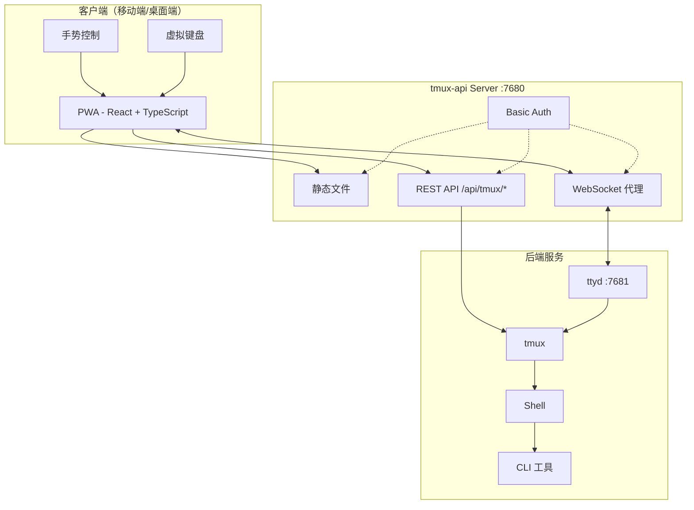
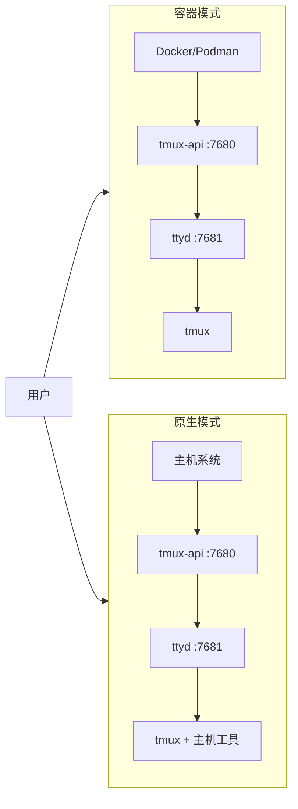

<p align="center">
  
</p>

<p align="center">
  <a href="https://github.com/lamngockhuong/termote/releases"></a>
  <a href="https://github.com/lamngockhuong/termote/actions/workflows/ci.yml"></a>
  <a href="https://github.com/lamngockhuong/termote/blob/main/LICENSE"></a>
  <a href="https://ghcr.io/lamngockhuong/termote"></a>
  <a href="https://hub.docker.com/r/lamngockhuong/termote"></a>
</p>

<p align="center">
  
  
  
  
</p>

<p align="center">
  <a href="https://launch.j2team.dev/products/termote?utm_source=badge-launched&utm_medium=badge&utm_campaign=badge-termote" target="_blank" rel="noopener noreferrer"></a>
  &nbsp;
  <a href="https://unikorn.vn/p/termote?ref=embed-termote" target="_blank"></a>
</p>

通过 PWA 从移动端/桌面端远程控制 CLI 工具（Claude Code、GitHub Copilot 及任何终端）。

> **Termote** = Terminal + Remote
>
> 🇬🇧 [English](README.md) | 🇻🇳 [Tiếng Việt](README.vi.md) | 🇯🇵 [日本語](README.ja.md) | 🇰🇷 [한국어](README.ko.md) | 🇪🇸 [Español](README.es.md) | 🇧🇷 [Português (BR)](README.pt-BR.md) | 🇫🇷 [Français](README.fr.md) | 🇩🇪 [Deutsch](README.de.md) | 🇷🇺 [Русский](README.ru.md) | 🇮🇩 [Bahasa Indonesia](README.id.md)

## 功能特性

- **会话切换**：多个 tmux 会话，支持创建/编辑/删除
- **会话标签**：水平标签栏，快速切换窗口
- **移动端友好**：虚拟键盘工具栏（Tab/Ctrl/Shift/方向键，可展开）
- **手势支持**：滑动执行 Ctrl+C、Tab、历史导航
- **命令历史**：搜索并调用之前发送的命令
- **快捷操作**：浮动菜单执行常用操作（clear、cancel、exit）
- **连接指示器**：实时服务器状态，自动检测断开连接
- **更新检查**：自动从 GitHub releases 通知新版本
- **PWA**：可安装到主屏幕，支持离线使用
- **持久会话**：tmux 保持会话存活
- **可折叠侧边栏**：桌面端 UI 带可切换的会话侧边栏
- **全屏模式**：沉浸式终端体验
- **配置持久化**：自动保存安装设置，密码使用 AES-256 加密

## 截图

<p align="center">
  
  &nbsp;&nbsp;
  
</p>

## 架构



## 快速开始

> 📖 **初次使用 Termote？** 请查看[入门指南](docs/getting-started.md)获取完整的操作步骤和示例。

```bash
./scripts/termote.sh                   # 交互式菜单
./scripts/termote.sh install container # 容器模式（docker/podman）
./scripts/termote.sh install native    # 原生模式（主机工具）
./scripts/termote.sh link              # 创建 'termote' 全局命令
make test                              # 运行测试
```

> `link` 之后，可在任何位置使用 `termote`：`termote health`、`termote install native --lan`

> **提示**：安装 [gum](https://github.com/charmbracelet/gum) 可获得更美观的交互式菜单（可选，有 bash 回退方案）

## 安装

### 一行命令安装（推荐）

**macOS/Linux：**

```bash
# 下载并在安装前询问确认（默认 native 模式）
curl -fsSL https://raw.githubusercontent.com/lamngockhuong/termote/main/scripts/get.sh | bash

# 自动安装，无需确认
curl -fsSL .../get.sh | bash -s -- --yes

# 仅下载（不安装）
curl -fsSL .../get.sh | bash -s -- --download-only

# 使用已保存的配置自动更新
curl -fsSL .../get.sh | bash -s -- --update

# 安装指定版本
curl -fsSL .../get.sh | bash -s -- --version 0.0.4

# 指定模式和选项
curl -fsSL .../get.sh | bash -s -- --yes --container --lan
curl -fsSL .../get.sh | bash -s -- --yes --native --tailscale myhost

# 强制输入新密码（忽略已保存的配置）
curl -fsSL .../get.sh | bash -s -- --yes --container --fresh
```

**Windows（PowerShell）：**

> **注意：** 如果系统禁止运行脚本，请先执行以下命令：
>
> ```powershell
> Set-ExecutionPolicy -Scope CurrentUser -ExecutionPolicy RemoteSigned
> ```

```powershell
# 下载并在安装前询问确认（默认 native 模式）
irm https://raw.githubusercontent.com/lamngockhuong/termote/main/scripts/get.ps1 | iex

# 自动安装，无需确认
$env:TERMOTE_AUTO_YES = "true"; irm .../get.ps1 | iex

# 指定模式
$env:TERMOTE_MODE = "container"; irm .../get.ps1 | iex

# 使用已保存的配置自动更新
$env:TERMOTE_UPDATE = "true"; irm .../get.ps1 | iex
```

### Docker

```bash
# 一体化部署（自动生成凭据，查看日志：docker logs termote）
docker run -d --name termote -p 7680:7680 ghcr.io/lamngockhuong/termote:latest

# 使用自定义凭据
docker run -d --name termote -p 7680:7680 \
  -e TERMOTE_USER=admin -e TERMOTE_PASS=secret \
  ghcr.io/lamngockhuong/termote:latest

# 无认证（仅限本地开发）
docker run -d --name termote -p 7680:7680 \
  -e NO_AUTH=true \
  ghcr.io/lamngockhuong/termote:latest

# 使用 volume 持久化数据
docker run -d --name termote -p 7680:7680 \
  -v termote-data:/home/termote \
  ghcr.io/lamngockhuong/termote:latest

# 挂载自定义 workspace 目录
docker run -d --name termote -p 7680:7680 \
  -v ~/projects:/workspace \
  ghcr.io/lamngockhuong/termote:latest

# 使用 Tailscale HTTPS（需要主机上安装 Tailscale）
docker run -d --name termote -p 7680:7680 \
  -e TERMOTE_USER=admin -e TERMOTE_PASS=secret \
  ghcr.io/lamngockhuong/termote:latest
sudo tailscale serve --bg --https=443 http://127.0.0.1:7680
# 访问地址：https://your-hostname.tailnet-name.ts.net
```

### 从 Release 安装

```bash
# 下载最新 release
VERSION=$(curl -s https://api.github.com/repos/lamngockhuong/termote/releases/latest | grep tag_name | cut -d '"' -f4)
wget https://github.com/lamngockhuong/termote/releases/download/${VERSION}/termote-${VERSION}.tar.gz
tar xzf termote-${VERSION}.tar.gz
cd termote-${VERSION#v}

# 安装（交互式菜单或指定模式）
./scripts/termote.sh install
./scripts/termote.sh install container
```

### 从源码安装

```bash
git clone https://github.com/lamngockhuong/termote.git
cd termote
./scripts/termote.sh install container
```

> **说明**：`termote.sh` 是统一的 CLI，支持 `install`（从源码构建，有预构建产物时使用预构建产物）、`uninstall` 和 `health` 命令。

## 部署模式



| 模式          | 描述       | 使用场景                        | 平台         |
| ------------- | ---------- | ------------------------------- | ------------ |
| `--container` | 容器模式   | 简单部署，隔离环境              | macOS, Linux |
| `--native`    | 全部原生   | 访问主机工具（claude、gh）      | macOS, Linux |

### 选项

| Flag                        | 描述                                           |
| --------------------------- | ---------------------------------------------- |
| `--lan`                     | 开放 LAN 访问（默认：仅 localhost）            |
| `--tailscale <host[:port]>` | 启用 Tailscale HTTPS                           |
| `--no-auth`                 | 禁用基本认证                                   |
| `--port <port>`             | 主机端口（默认：7680，Windows：7690）          |
| `--fresh`                   | 强制输入新密码（忽略已保存的配置）             |
| `--update`                  | 使用已保存的配置自动更新                       |
| `--version <ver>`           | 安装指定版本（带或不带 `v`）                   |

| 环境变量       | 描述                                           |
| -------------- | ---------------------------------------------- |
| `WORKSPACE`    | 要挂载的主机目录（默认：`./workspace`）        |
| `TERMOTE_USER` | 基本认证用户名（默认：自动生成）               |
| `TERMOTE_PASS` | 基本认证密码（默认：自动生成）                 |
| `NO_AUTH`      | 设为 `true` 以禁用认证                         |

### 容器模式（推荐用于简单部署）

脚本自动检测 `podman` 或 `docker` -- 两者使用方式完全相同。

```bash
./scripts/termote.sh install container             # localhost 带基本认证
./scripts/termote.sh install container --no-auth   # localhost 无认证
./scripts/termote.sh install container --lan       # LAN 可访问
# 访问地址：http://localhost:7680

# 自定义 workspace 目录（挂载到容器内的 /workspace）
WORKSPACE=~/projects ./scripts/termote.sh install container
WORKSPACE=/path/to/code make install-container
```

> **安全提示**：避免直接挂载 `$HOME` -- `.ssh`、`.gnupg` 等敏感目录将在容器中可访问。请挂载具体的项目目录。

### 原生模式（推荐用于访问主机二进制文件）

当需要访问主机二进制文件（claude、git 等）时使用：

```bash
# Linux
sudo apt install ttyd tmux
# 或：sudo snap install ttyd
./scripts/termote.sh install native

# macOS
brew install ttyd tmux go
./scripts/termote.sh install native
# 访问地址：http://localhost:7680
```

### 使用 Tailscale HTTPS（所有模式）

使用 `tailscale serve` 自动获取 HTTPS（无需手动管理证书）：

```bash
# 仅 Tailscale（默认端口 443）
./scripts/termote.sh install container --tailscale myhost.ts.net

# 自定义端口
./scripts/termote.sh install native --tailscale myhost.ts.net:8765

# Tailscale + LAN 可访问
./scripts/termote.sh install container --tailscale myhost.ts.net --lan

# 访问地址：https://myhost.ts.net（自定义端口则为 :8765）
```

### 卸载

```bash
./scripts/termote.sh uninstall container   # 容器模式
./scripts/termote.sh uninstall native      # 原生模式
./scripts/termote.sh uninstall all         # 全部
```

### 更新

```bash
# 方式一：使用已保存的配置自动更新
curl -fsSL .../get.sh | bash -s -- --update

# 方式二：重新运行一行命令（比较版本，安装前询问确认）
curl -fsSL .../get.sh | bash

# 方式三：手动更新
./scripts/termote.sh uninstall [container|native]
git pull origin main                    # 如果从源码安装
./scripts/termote.sh install [container|native] [--lan] [--tailscale ...]
```

## 平台支持

| 平台    | 容器模式           | 原生模式           | CLI 脚本    |
| ------- | ------------------ | ------------------ | ----------- |
| Linux   | ✓                  | ✓                  | termote.sh  |
| macOS   | ✓                  | ✓                  | termote.sh  |
| Windows | ⚠️ (实验性)        | ⚠️ (实验性)        | termote.ps1 |

> **⚠️ Windows 支持（实验性）**：Windows 支持目前处于早期阶段，需要更多测试。容器模式需要 Docker Desktop，原生模式需要 psmux。如遇问题请在 GitHub 上反馈。

### Windows 原生模式

Windows 原生模式使用 [psmux](https://github.com/psmux/psmux)（兼容 tmux 的 Windows 终端复用器）：

```powershell
# 安装 psmux
winget install psmux

# 运行 Termote
.\scripts\termote.ps1 install native
.\scripts\termote.ps1 install container  # 或使用 Docker Desktop 的容器模式
```

## 移动端使用

| 操作         | 手势                |
| ------------ | ------------------- |
| 取消/中断    | 左滑（Ctrl+C）      |
| Tab 补全     | 右滑                |
| 历史上翻     | 上滑                |
| 历史下翻     | 下滑                |
| 粘贴         | 长按                |
| 字体大小     | 捏合缩放            |

虚拟工具栏提供：Tab、Esc、Ctrl、Shift、方向键及常用组合键。支持 Ctrl+Shift 组合（粘贴、复制）。可在精简模式和展开模式之间切换以显示更多按键（Home、End、Delete 等）。

## 项目结构

```
termote/
├── Makefile                # 构建/测试/部署命令
├── Dockerfile              # Docker 模式（tmux-api + ttyd）
├── docker-compose.yml
├── entrypoint.sh           # Docker 入口点
├── docs/                   # 文档
│   └── images/screenshots/ # 应用截图
├── pwa/                    # React PWA
│   └── src/
│       ├── components/
│       ├── contexts/
│       ├── hooks/
│       ├── types/
│       └── utils/
├── tmux-api/               # Go 服务端
│   ├── main.go             # 入口点
│   ├── serve.go            # 服务器（PWA、代理、认证）
│   └── tmux.go             # tmux API 处理器
├── scripts/
│   ├── termote.sh          # Unix CLI（安装/卸载/健康检查）
│   ├── termote.ps1         # Windows PowerShell CLI
│   ├── get.sh              # Unix 在线安装器（curl | bash）
│   └── get.ps1             # Windows 在线安装器（irm | iex）
├── tests/                  # 测试套件
│   ├── test-termote.sh
│   ├── test-termote.ps1    # Windows 测试
│   ├── test-get.sh
│   └── test-entrypoints.sh
└── website/                # Astro Starlight 文档站
    └── src/content/docs/   # MDX 文档
```

## 开发

```bash
make build          # 构建 PWA 和 tmux-api
make test           # 运行所有测试
make health         # 检查服务健康状态
make clean          # 停止容器

# E2E 测试（需要运行中的服务器）
./scripts/termote.sh install container  # 先启动服务器
cd pwa && pnpm test:e2e       # 运行 Playwright 测试
cd pwa && pnpm test:e2e:ui    # 使用 UI 调试器运行
```

**手动测试：** 参见[自测清单](docs/self-test-checklist.md)

## 故障排除

### 会话未持久化

- 检查 tmux：`tmux ls`
- 确认 ttyd 使用了 `-A` 参数（attach-or-create）

### WebSocket 错误

- 检查 tmux-api 日志：`docker logs termote`
- 确认 ttyd 在端口 7681 上运行

### 移动端键盘问题

- 确保存在 viewport meta 标签
- 在真机上测试，不要使用模拟器

### 原生模式：进程未启动

```bash
ps aux | grep ttyd         # 检查 ttyd 是否在运行
ps aux | grep tmux-api     # 检查 tmux-api 是否在运行
lsof -i :7680              # 确认端口是否在使用
```

## 安全说明

- **默认：仅 localhost** -- 除非使用 `--lan` 参数，否则不暴露到局域网
- **默认启用基本认证** -- 使用 `--no-auth` 可为本地开发禁用
- **内置暴力破解防护** -- 速率限制（每 IP 每分钟 5 次尝试）
- 生产环境请使用 HTTPS（Tailscale）
- 限制在受信任的网络/VPN 中使用

## 其他项目

| 项目 | 描述 |
|------|------|
| [GitHub Flex](https://github.com/lamngockhuong/github-flex) | 跨浏览器扩展（Chrome 和 Firefox），为 GitHub 界面增加生产力功能 |
| [TabRest](https://github.com/lamngockhuong/tabrest) | Chrome 扩展，自动卸载不活动的标签页以释放内存 |

## 许可证

MIT
