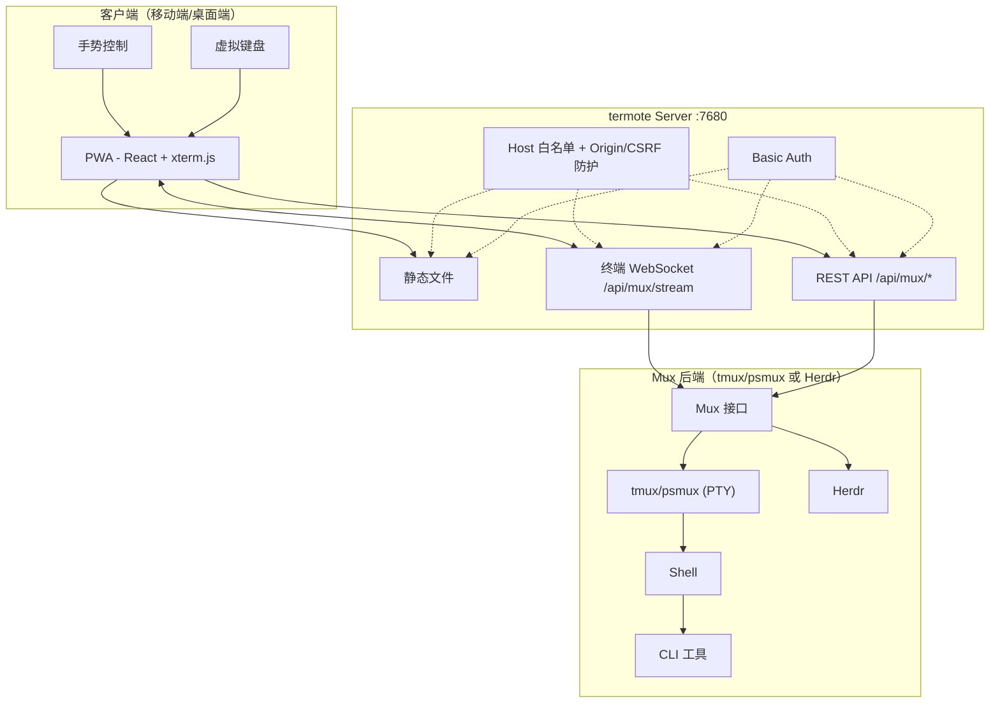
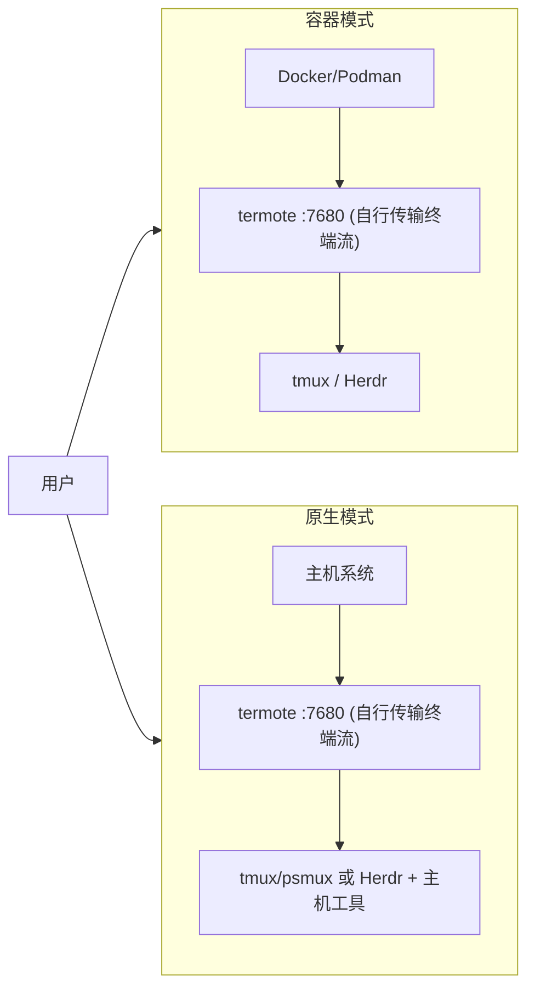

<p align="center">
  <picture>
    <source media="(prefers-color-scheme: dark)" srcset="assets/branding/termote/social/banner-readme-dark.svg" />
    
  </picture>
</p>

<p align="center">
  <a href="https://github.com/lamngockhuong/termote/releases"></a>
  <a href="https://github.com/lamngockhuong/termote/actions/workflows/ci.yml"></a>
  <a href="https://github.com/lamngockhuong/termote/blob/main/LICENSE"></a>
  <a href="https://ghcr.io/lamngockhuong/termote"></a>
  <a href="https://hub.docker.com/r/lamngockhuong/termote"></a>
</p>

<p align="center">
  
  
  
  
</p>

<p align="center">
  <a href="https://launch.j2team.dev/products/termote?utm_source=badge-launched&utm_medium=badge&utm_campaign=badge-termote" target="_blank" rel="noopener noreferrer"></a>
  &nbsp;
  <a href="https://unikorn.vn/p/termote?ref=embed-termote" target="_blank"></a>
</p>

通过 PWA 从移动端/桌面端远程控制 CLI 工具（Claude Code、GitHub Copilot 及任何终端）。

> [!NOTE]
> Termote 1.0 不会升级 0.x 的安装。请按照[归档的 0.x 文档](https://termote.ohnice.app/0.x/)卸载 0.x，然后使用[快速开始](#快速开始)中的命令安装 1.0。

> **Termote** = Terminal + Remote
>
> 🇬🇧 [English](README.md) | 🇻🇳 [Tiếng Việt](README.vi.md) | 🇯🇵 [日本語](README.ja.md) | 🇰🇷 [한국어](README.ko.md) | 🇪🇸 [Español](README.es.md) | 🇧🇷 [Português (BR)](README.pt-BR.md) | 🇫🇷 [Français](README.fr.md) | 🇩🇪 [Deutsch](README.de.md) | 🇷🇺 [Русский](README.ru.md) | 🇮🇩 [Bahasa Indonesia](README.id.md)

## 功能特性

- **会话切换**：多个 tmux 会话，支持创建/编辑/删除
- **会话标签**：水平标签栏，快速切换窗口
- **Herdr 后端**（原生或容器内）：用 Herdr 工作区代替 tmux，每个窗格都显示编码代理的状态徽标——参见[原生安装](https://termote.ohnice.app/installation/native/)
- **Chat 视图**：以对话形式阅读并回复运行 Claude Code（或以 `--no-daemon` 启动的 Codex）的窗格，支持斜杠命令提示和对话框应答——参见[Agent Chat](https://termote.ohnice.app/usage/agent-chat/)
- **Files 和 Changes 视图**：浏览窗格所在目录及其 git 变更，支持 Markdown 预览——参见[Files and Changes](https://termote.ohnice.app/usage/files-changes/)
- **图片附件**：从手机向终端或 Chat 视图消息发送图片，代理可通过路径读取
- **Herdr 插件**：无需离开 Herdr，即可在 Termote 中打开当前聚焦的 Herdr 窗格、将其链接显示为二维码供手机扫描、启动或停止服务器——参见[Herdr Plugin](https://termote.ohnice.app/usage/herdr-plugin/)
- **移动端友好**：虚拟键盘工具栏（Tab/Ctrl/Shift/方向键，可展开）
- **手势支持**：滑动执行 Ctrl+C、Tab、滚动
- **命令历史**：搜索并调用之前发送的命令
- **快捷操作**：固定在移动端工具栏末端的 ⋯ 键展开常用操作的 Actions 行（clear、cancel、exit）
- **界面风格**：Neutral、Terminal 或 Native，在设置中选择，与浅色/深色主题无关
- **连接指示器**：实时服务器状态，自动检测断开连接
- **更新检查**：自动从 GitHub releases 通知新版本
- **PWA**：可安装到主屏幕，支持离线使用
- **持久会话**：tmux 保持会话存活
- **可折叠侧边栏**：桌面端 UI 带可切换的会话侧边栏
- **全屏模式**：沉浸式终端体验
- **作为服务运行**：`termote start` 会注册一个在登录时启动的用户服务（systemd、launchd、计划任务）
- **配置持久化**：`termote start` 会保存其选项，密码加密存储

## 截图

<p align="center">
  
  &nbsp;&nbsp;
  
</p>

<p align="center">
  
</p>

<p align="center">
  
</p>

## 架构


```mermaid
flowchart TB
    subgraph Client["客户端（移动端/桌面端）"]
        PWA["PWA - React + xterm.js"]
        Gestures["手势控制"]
        Keyboard["虚拟键盘"]
    end

    subgraph Server["termote Server :7680"]
        Static["静态文件"]
        Stream["终端 WebSocket /api/mux/stream"]
        API["REST API /api/mux/*"]
        Guard["Host 白名单 + Origin/CSRF 防护"]
        Auth["Basic Auth"]
    end

    subgraph Backend["Mux 后端（tmux/psmux 或 Herdr）"]
        Mux["Mux 接口"]
        tmux["tmux/psmux (PTY)"]
        herdr["Herdr"]
        Shell["Shell"]
        Tools["CLI 工具"]
    end

    Gestures --> PWA
    Keyboard --> PWA
    PWA --> Static
    PWA <--> Stream
    PWA --> API
    Guard -.-> Static & Stream & API
    Auth -.-> Static & Stream & API
    Stream --> Mux
    API --> Mux
    Mux --> tmux & herdr
    tmux --> Shell --> Tools
```

termote 自己负责终端流（Unix 上用 PTY，Windows 上用 ConPTY），直接传给 PWA 中的 xterm.js，不再有需要代理的独立终端进程。完整的请求防护模型见 [`docs/system-architecture.md`](docs/system-architecture.md)。

## 快速开始

> 📖 **初次使用 Termote？** 请查看[入门指南](docs/getting-started.md)获取完整的操作步骤和示例。

**Linux / macOS：**

```bash
curl -fsSL https://termote.ohnice.app/install.sh | sh
termote start
```

**Windows（PowerShell）：**

```powershell
irm https://termote.ohnice.app/install.ps1 | iex
termote start
```

安装程序只需要 `curl`、`tar` 和 `sha256sum`/`shasum`（Windows 上为 PowerShell），不需要 sudo 或管理员权限。它会校验压缩包的校验和，安装 `termote` 命令，但不会启动任何东西。`termote start` 会保存选项，首次运行时创建密码（只显示一次，之后可用 `termote show-password` 再次查看），然后注册服务并启动。打开 `http://localhost:7680`（Windows：`http://localhost:7690`）。

需要先安装终端后端：tmux（`sudo apt install tmux`、`brew install tmux`），Windows 上为 psmux（`winget install psmux`），或者 [Herdr](https://termote.ohnice.app/installation/native/)。首次 `start` 会检测使用哪一个。

### 常用选项

```bash
termote start --lan                  # Listen on the LAN, not only this machine
termote start --tailscale myhost.ts.net  # Publish over Tailscale HTTPS
termote start --mux herdr            # Drive Herdr workspaces instead of tmux
termote start --no-auth              # Disable basic auth (local use only)
```

选项会被保存：未指定的参数保留已保存的值，布尔选项用 `=false` 关闭（`termote start --lan=false`）。所有操作系统（包括 PowerShell）上的参数都相同。

### 日常命令

```bash
termote status                       # What the running server reports
termote stop                         # Stop (it starts again at the next login)
termote restart                      # Restart with the saved options
termote logs follow                  # Tail the logs
termote show-password                # Print the saved admin password
termote update                       # Update to the latest release
termote uninstall                    # Remove the service, the command and the install
```

`update` 会切换到新版本并重启服务，如果新版本没有正常运行，则切换回原版本。`uninstall` 会保留配置（`~/.config/termote`）和日志（`~/.local/state/termote`），并打印这两个路径。

## 安装

### 固定版本

```bash
curl -fsSL https://termote.ohnice.app/install.sh | TERMOTE_VERSION=1.0.0 sh
termote update --version 1.0.0
```

```powershell
$env:TERMOTE_VERSION='1.0.0'; irm https://termote.ohnice.app/install.ps1 | iex
```

不设置 `TERMOTE_VERSION` 时，安装程序会获取最新的 1.x 稳定版，且不会改动已有的安装。设置后，会将该版本安装在当前版本旁边并设为当前使用的版本，这也可以用来修复损坏的安装。

### 容器模式

```bash
termote container up                          # Run the published image (podman or docker)
termote container up --workspace ~/projects   # Mount a directory at /workspace
termote container status
termote container logs -f
termote container down
```

`container up` 使用 podman（优先）或 docker 运行与已安装 `termote` 同版本的 `ghcr.io/lamngockhuong/termote`，端口为 7680，并将 `~/termote-workspace` 挂载到 `/workspace`。它接受 `--port`、`--lan`、`--tailscale`、`--no-auth`、`--allow-host`、`--user` 和 `--fresh`，这些设置与 `start` 的选项分开保存；用户名和密码与原生服务器共用。Docker 会在重启后重新启动容器；rootless Podman 没有守护进程来做这件事，因此请将其作为 Quadlet 单元运行。

> **安全提示**：避免直接挂载 `$HOME` —— 容器将能访问 `.ssh`、`.gnupg` 等敏感目录。请改为挂载特定的项目目录。

### 不使用 CLI 直接运行 Docker

```bash
# Generates a password, printed in: docker logs termote
docker run -d --name termote -p 7680:7680 \
  -v ~/projects:/workspace \
  ghcr.io/lamngockhuong/termote:latest

# With your own credentials
docker run -d --name termote -p 7680:7680 \
  -e TERMOTE_USER=admin -e TERMOTE_PASS=secret \
  ghcr.io/lamngockhuong/termote:latest
```

| 环境变量       | 说明                            |
| -------------- | ------------------------------- |
| `TERMOTE_USER` | 基本认证用户名（默认：`admin`） |
| `TERMOTE_PASS` | 基本认证密码（默认：自动生成）  |
| `NO_AUTH`      | 设为 `true` 以禁用认证          |

### 从源码构建

```bash
git clone https://github.com/lamngockhuong/termote.git
cd termote
make build
./scripts/termote.sh start
```

`make build` 会构建 PWA 并将其嵌入 `server/termote`，需要 Go、Node.js 和 pnpm。`scripts/termote.sh`（Windows：`scripts\termote.ps1`）只用于运行源码检出：源码较新时会重新构建开发用二进制文件，然后以相同参数运行。`termote update` 在源码检出中会拒绝运行，请使用 `git pull && make build`。

### 从 0.x 升级

无法从 0.x 升级：1.0 安装在新的位置，也不会读取 0.x 的配置。请按照[归档的 0.x 文档](https://termote.ohnice.app/0.x/)卸载 0.x，然后用上面的命令安装 1.0。

## 部署模式


```mermaid
flowchart LR
    subgraph Container["容器模式"]
        direction TB
        C1["Docker/Podman"] --> C2["termote :7680 (自行传输终端流)"] --> C3["tmux / Herdr"]
    end

    subgraph Native["原生模式"]
        direction TB
        N1["主机系统"] --> N2["termote :7680 (自行传输终端流)"] --> N3["tmux/psmux 或 Herdr + 主机工具"]
    end

    User["用户"] --> Container & Native
```

| 模式 | 命令                   | 使用场景                   | 平台                  |
| ---- | ---------------------- | -------------------------- | --------------------- |
| 原生 | `termote start`        | 访问主机工具（claude、gh） | macOS, Linux, Windows |
| 容器 | `termote container up` | 隔离的环境                 | macOS, Linux, Windows |

原生服务器以用户服务的形式运行：Linux 上为 systemd 用户单元（没有用户级 systemd 时，例如未启用 systemd 的 WSL2，则为分离的进程），macOS 上为 launchd 代理，Windows 上为登录时运行的计划任务。

### `start` 的选项

| 参数                        | 说明                                                    |
| --------------------------- | ------------------------------------------------------- |
| `--port <port>`             | 端口（默认：7680，Windows：7690）                       |
| `--lan[=false]`             | 在所有网络接口上监听（默认：仅 localhost）              |
| `--tailscale <host[:port]>` | 通过 Tailscale HTTPS 发布（默认端口 443）               |
| `--no-tailscale`            | 停止通过 Tailscale 发布                                 |
| `--no-auth[=false]`         | 禁用基本认证                                            |
| `--mux <tmux\|herdr>`       | 终端后端（默认：herdr 正在运行时用 herdr，否则用 tmux） |
| `--allow-host <name>`       | 允许额外的 Host 头值（可重复；无通配符，参见安全说明）  |
| `--remove-host <name>`      | 移除已允许的 Host 名称（可重复）                        |
| `--allow-herdr-no-auth`     | 与 `--mux herdr --no-auth` 一起使用时必需               |
| `--user <name>`             | 登录用户名（默认：`admin`；与容器共用）                 |
| `--fresh`                   | 设置新密码                                              |

### 使用 Tailscale HTTPS

使用 `tailscale serve` 实现自动 HTTPS（无需手动管理证书）：

```bash
termote start --tailscale myhost.ts.net                # Default port 443
termote start --tailscale myhost.ts.net:8765           # Custom port
termote container up --tailscale myhost.ts.net         # Container mode
sudo tailscale set --operator=$USER                    # Linux, once: let termote run tailscale serve
```

每次服务器启动时都会应用该映射。`stop`、`start --no-tailscale` 和 `uninstall` 只移除 Termote 自己的映射。

## 平台支持

| 平台    | 容器模式 | 原生模式 | 安装程序      |
| ------- | -------- | -------- | ------------- |
| Linux   | ✓        | ✓        | `install.sh`  |
| macOS   | ✓        | ✓        | `install.sh`  |
| Windows | ✓        | ✓        | `install.ps1` |

> **Windows 支持**：容器模式需要 Docker Desktop 或 Podman Desktop；原生模式需要 [psmux](https://github.com/psmux/psmux)（Windows 上兼容 tmux 的终端复用器），可通过 `winget install psmux` 安装，也可以改用正在运行的 [Herdr](https://herdr.dev/#install) 服务器。Windows 服务尚未在真机上验证，如遇问题请在 GitHub 上反馈。

## 移动端使用

| 操作      | 手势           |
| --------- | -------------- |
| 取消/中断 | 左滑（Ctrl+C） |
| Tab 补全  | 右滑           |
| 向下滚动  | 上滑           |
| 向上滚动  | 下滑           |
| 粘贴      | 长按           |
| 字体大小  | 捏合缩放       |

虚拟工具栏提供：Tab、Esc、Ctrl、Shift、方向键及常用组合键。支持 Ctrl+Shift 组合（粘贴、复制）。可在精简模式和展开模式之间切换以显示更多按键（Home、End、Delete 等）。

## 项目结构

```
termote/
├── Makefile                # Build/test/run commands
├── Dockerfile              # Container image (termote + tmux + herdr)
├── docker-compose.yml      # Development from a checkout only
├── entrypoint.sh           # Container entrypoint
├── docs/                   # Documentation
│   └── images/screenshots/ # App screenshots
├── pwa/                    # React PWA
│   └── src/
│       ├── components/
│       ├── contexts/
│       ├── hooks/
│       ├── types/
│       └── utils/
├── server/                 # Go server + CLI (single binary)
│   ├── main.go             # Entry point (no args = menu, `serve` = server, else CLI)
│   ├── serve.go            # Server (PWA, auth, guards)
│   ├── mux.go              # Mux interface + /api/mux/* routes
│   ├── mux_tmux.go         # tmux/psmux backend
│   ├── mux_herdr.go        # Herdr backend
│   ├── stream.go           # Terminal WebSocket (xterm.js stream)
│   ├── cli*.go             # start/stop/update/container/logs/menu subcommands
│   └── webui/              # PWA embedded in the binary (filled by make build)
├── scripts/
│   ├── install.sh          # Unix online installer (curl | sh)
│   ├── install.ps1         # Windows online installer (irm | iex)
│   ├── termote.sh          # Unix shim: builds and runs a checkout
│   └── termote.ps1         # Windows PowerShell shim: builds and runs a checkout
├── tests/                  # Test suite
│   ├── test-termote.sh     # Unix shim tests
│   ├── test-termote.ps1    # Windows shim tests
│   ├── test-install.sh     # Unix installer tests
│   ├── test-install.ps1    # Windows installer tests
│   └── test-entrypoints.sh # Container entrypoint tests
└── website/                # Astro Starlight docs site
    └── src/content/docs/   # MDX documentation
```

## 开发

```bash
make build          # Build the PWA and embed it in server/termote
make test           # Run all tests
make health         # Check service health
make clean          # Stop containers

# E2E tests (requires running server)
./scripts/termote.sh start           # Start server first
pnpm --filter termote test:e2e       # Run Playwright tests
pnpm --filter termote test:e2e:ui    # Run with UI debugger
```

**手动测试：** 参见[自测清单](docs/self-test-checklist.md)

## 故障排除

### 会话未持久化

- 检查 tmux：`tmux ls`
- termote 通过 `tmux new-session -A` 连接会话（attach-or-create）

### WebSocket 错误

- 检查 termote 日志：`termote container logs`（容器模式）或 `termote logs server`（原生模式）
- 终端 WebSocket 是 `/api/mux/stream`，由 termote 自己提供，没有需要另外检查的终端进程

### 移动端键盘问题

- 确保存在 viewport meta 标签
- 在真机上测试，不要使用模拟器

### 原生模式：服务器未启动

```bash
termote status             # What the running server reports
termote logs server        # Or: termote logs follow
lsof -i :7680              # Check what holds the port
termote start --fresh      # If the saved password can no longer be read
```

## 安全说明

- **默认：仅 localhost** -- 除非使用 `--lan` 参数，否则不暴露到局域网
- **默认启用基本认证** -- 使用 `--no-auth` 可为本地开发禁用；密码由首次 `termote start` 创建并加密保存
- **Host 白名单** -- 拒绝 `Host` 头无法识别的请求（防御 DNS 重绑定）；可用 `--allow-host` 添加受信任的名称，没有能关闭此检查的通配符
- **Origin/CSRF 防护** -- 会改变状态的 `/api/mux/*` 请求和 `/api/mux/stream` WebSocket 会拒绝跨站的 `Sec-Fetch-Site`/`Origin`，并要求同源的一次性流令牌
- **内置暴力破解防护** -- 速率限制（每 IP 每分钟 5 次失败尝试，每个 IPv6 /64 每分钟 20 次）
- **Herdr 后端** -- 会暴露主机上的所有 Herdr 工作区，因此除非同时指定 `--allow-herdr-no-auth`，否则拒绝 `--mux herdr --no-auth`
- **服务文件不含机密** -- systemd 单元、launchd 代理和计划任务中都不包含密码
- 生产环境请使用 HTTPS（Tailscale）
- 限制在受信任的网络/VPN 中使用

## 其他项目

| 项目                                                        | 描述                                                                                  |
| ----------------------------------------------------------- | ------------------------------------------------------------------------------------- |
| [GitHub Flex](https://github.com/lamngockhuong/github-flex) | 跨浏览器扩展（Chrome 和 Firefox），为 GitHub 界面增加生产力功能                       |
| [TabRest](https://github.com/lamngockhuong/tabrest)         | Chrome 扩展，自动卸载不活动的标签页以释放内存                                         |
| [Specpin](https://github.com/lamngockhuong/specpin)         | 将实时的、Git 版本化的业务规格固定到运行中的 Web UI 元素上（浏览器扩展 + Go sidecar） |

## 许可证

MIT
